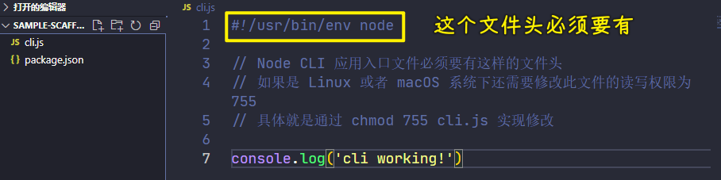

### ✍️ Tangxt ⏳ 2021-10-25 🏷️ 工程化

# 05-Plop 简介、Plop 的基本使用、脚手架的工作原理

## ★Plop 简介


除了像 Yeoman 这样大型的脚手架工具，还有一些小型的脚手架工具也非常出色。

这里跟大家安利一款我个人经常使用的一个小型的脚手架工具——Plop

Plop 它其实是一款主要用于去创建项目中特定类型的文件的一个小工具，它有点儿类似于 Yeoman 当中的 Sub Generator，不过它一般不会独立去使用，一般我们都会把 Plop 集成到项目当中，用来自动化的去创建同类型的项目文件。

接下来我们来通过两个案例的对比去体会一下 Plop 的具体作用以及它的优势。


屏幕上给出的是两个相同的 React 项目。有所不同的是，右侧项目当中我们集成了 Plop 工具，那它们之间具体的差异 -> 我们需要从日常开发中经常面临的一个问题说起 -> 那就是我们在开发过程当中经常需要去重复创建相同类型的文件。

例如在我们今天的这个案例当中，每一个页面上的组件都会有三个文件去组成，这分别是一个 JS 文件、一个 CSS 文件，还有一个`test.js`文件。


如果我们需要去创建一个新的 React 组件，那我们就需要去创建三个文件，而且每一个文件当中都还有一些基础的代码。那整个过程非常的繁琐，而且我们很难统一每一个组件文件当中那些基础的代码。

相对于左侧的项目，右侧的项目中使用了 Plop，那面对相同的问题，使用 Plop 就会方便很多。我们只需要在命令行当中去运行 Plop，那命令行就会根据我们之前 Plop 的一些配置，自动的去询问我们一些信息，然后根据我们所输入的结果自动的去帮我们创建对应的这些文件：


那这样就确保了我们每次创建的文件都是统一的，而且整个过程是自动化的，那这样就**大大提高了我们在项目当中每次去创建重复文件时的效率**了。

## ★Plop 的基本使用


接下来，我们一起在一个 React 项目当中去加入 Plop 的集成，去了解一下 Plop 它该如何具体使用。

### <mark>1）准备一个用来测试的 React 项目</mark>

这是一个非常基础的 React 项目：


### <mark>2）安装开发依赖：plop</mark>

我们使用 Plop 的第一件事就是将 Plop 作为一个 npm 的模块安装到我们的开发依赖当中。


### <mark>3）根目录下新建 `plopfile.js` 文件</mark>

安装完成过后，我们需要在项目的根目录下去新建一个`plopfile.js`的一个文件。

#### <mark>1、导出一个函数</mark>

这个文件是 Plop 工作的一个入口文件，它需要去导出一个函数，而且这个函数当中它可以接收一个叫做 `plop` 的对象。那这个对象里面提供了一系列的工具函数，用于去帮我们创建生成器的任务。

具体来做就是通过 `module.export` 导出这样一个函数。


在这个函数当中，我们接收 `plop` 这样一个形式参数。 `plop` 它内部有一个成员叫做 `setGenerator`，`setGenerator` 它需要接收两个参数：

- 第一个参数是我们这个生成器的名字
- 第二个参数是生成器的一些配置选项

#### <mark>2、配置选项</mark>

💡：指定描述

在配置选项当中，我们需要去指定一下我们这个生成器的一个描述`description`。比如我们这儿这个生成器的名字是`component`，那它的作用就是创建一个 `component`


💡：指定命令行问题

除了 description 之外，我们还可以在这个 Generator 当中去指定我们 Generator 工作的时候会发出的命令行问题。

这些问题也会像我们之前看到的那些命令行交互问题一样，即出现在命令行交互环节，我们可以通过：

- `type` 去指定这个问题的输入方式
- `name` 去指定这一个问题的一个返回值的一个键
- `message` 是屏幕上给出的一个提示。
- `default` 是我们这个命令的默认答案。

💡：指定任务动作

有了命令行交互问题过后，我们还可以去指定一个`actions`，`actions`顾名思义，它就是咱们这个生成器在完成命令行交互过后需要执行的一些动作。

它可以是一个数组，在这个数组当中，每一个对象就是一个动作对象 -> 这个动作对象我们可以通过 `type` 去指定我们的这个动作的类型 -> 我们此处用的类型是 `add`，它代表添加一个全新的文件

然后我们可以通过 `path` 属性去指定我们需要添加的这个文件会被添加到哪一个具体的路径 -> 那我们这儿就添加到 `src` 下面的 `components` 下面对应的文件中 -> 需要注意的是，我们在这个路径当中可以使用双花括号这种插值表达式的方式去插入我们刚刚在命令行交互当中得到的数据 -> 此处我们用的双花括号 `name`，它代表的就是我们刚刚在命令行交互当中的 `name` 取值：


除了`path` 之外，我们还需要去指定一下本次去添加的这个文件，它的模板文件是什么？ -> 我们可以通过 `templateFile` 属性去指定，那这个时候我们就需要去添加一个对应的模板

### <mark>4）添加模板文件</mark>

一般我们会把 Plop 的模板放在项目根目录下的一个叫做`plop-templates`一个文件夹下面。

在这个目录下，我们可以通过`handlebars`模板引擎的方式去创建一些模板文件 -> 这些模板都是遵循 handlebars 模板语法的 -> 在这个文件`component.hbs`当中，我们可以通过双花括号这种小胡子语法去插入对应的数据

有了这样一个模板过后：


💡：指定模板路径

我们就可以回到 `templateFile` 当中去填写这样一个路径 -> 此时我们的 `templateFile` 就是 `plop-templates`下的`component.hbs`


一切准备就绪后，我们这个 Plop 就基本上完成了。

### <mark>5）用 `yarn` 启动这个 `plop` CLI，让它去执行生成器 `Component`</mark>

在完成了这个 Plop 的任务定义过后，我们可以回到命令行，因为我们在安装这个 Plop 模块的时候，Plop 它提供了一个 CLI 程序：


我们可以通过 yarn 去启动这个 Plop 程序。

这具体的使用方式就是通过`yarn plop`然后后面跟上我们生成器`component`的名字 -> 这儿需要跟大家补充一下的就是`yarn`会自动找到`node_modules`下面的`bin`目录下的命令行工具。


### <mark>6）根据模板创建新文件成功</mark>

回过头来，我们可以看到它会像我们之前使用 Yeoman 一样去发出一些命令行的问题 -> 不过这个地方的命令行问题，我们是通过刚刚的`plopfile.js` 去定义的

在输入完这个问题过后，我们就可以得到一个新文件的创建，我们可以看到有一个文件就会根据我们的模板去创建成功：


### <mark>7）追加`css`和`test`这两个模板文件</mark>

有了这样一个最基础的体验过后，那接下来我们可以尝试着为这个生成器添加多个模板，因为在 React 当中，组件是由多个文件组成的，所以我们这儿各自为组件的 css 文件和 test 文件去添加相应的模版。


有了这些模板过后，我们就可以回到`plopfile.js`当中去添加多个 `action`，同样，每一个 `action` 我们的 `type` 都是 `add`，因为我们这一次都是要根据模板去创建新的文件。


官网当中它介绍了更多的 `type`，那你可以根据自己的需要去找。


> [plopjs/plop: Consistency Made Simple](https://github.com/plopjs/plop#interface-actionconfig)

### <mark>8）再次启动 `plop` CLI</mark>

完成过后我们回到命令行，此时我们重新运行这样一个 Plop 的生成器。


生成完成过后，它会自动去帮我们创建三个文件 -> 因为这三个文件就是我们刚刚在 `action` 里面指定的三个任务。

以上就是 Plop 的一个基本的使用了。

在这个过程当中，我们基本上就会发现 Plop 它用来去创建我们项目当中同类型的文件，还是非常方便的。

### <mark>9）总结</mark>

总结一下我们在一个项目当中具体去使用 Plop 需要这么几个步骤：


- 首先我们需要将 Plop 模块作为项目的开发依赖去安装。
- 然后我们需要在项目的根目录下去新建一个`plopfile.js`文件。在有了这个`plopfile.js`文件过后，我们需要在这个文件当中去定义一些脚手架的任务。
- 最后我们去编写一些用于生成特定类型文件的模板。

这一切都完成过后，我们需要通过 Plop 所提供的 CLI 去运行我们刚刚制定的脚手架任务，从而去生成我们在项目当中的一些特定类型的文件。

## ★脚手架的工作原理


通过前面我们对一些脚手架工具的介绍，我们不难发现 -> 大部分脚手架工具的工作原理都很简单，这无外乎就是**在你启动它过后，它会自动的去询问你一些预设的问题，然后将你回答的结果结合一些模板文件给你生成一个项目的结构**。

接下来我们就通过 Node.js 去开发一个小型的脚手架工具，再来去深入体会一下脚手架工具的工作过程。

我们都知道脚手架工具实际上就是一个 Node CLI 应用 -> 去创建脚手架工具，就是创建一个 CLI 的应用。

### <mark>1）创建这个脚手架应用的项目目录</mark>

我们具体来看，我们进入到命令行，通过 `mkdir` 去创建一个项目目录`sample-scaffolding`：


### <mark>2）初始化`package.json`文件</mark>

在这个目录下面，我们通过 `yarn init` 的方式去初始化一个 `package.json` 的文件。

有了这个文件过后，我们通过 VS Code 打开这个目录。

### <mark>3）在`package.json`当中，添加`bin`字段，用来指定入口文件</mark>

紧接着，我们需要在`package.json` 当中去添加一个 `bin` 字段，用于去指定一下我们这个 CLI 应用的入口文件，我们把它叫做 `cli.js`：


### <mark>4）完成一个基本的 CLI 应用的创建</mark>

再然后我们就需要去添加这个 JS 文件。跟以往我们在 Node 当中写的一些 JS 文件有所不同的是，CLI 的入口文件必须要有一个特定的文件头，如果说你的操作系统是 Linux 或者是 Mac OS 的话，你还需要去修改这个文件的读写权限，把它修改为`755`，这样的话这个文件才可以作为一个 CLI 的应用入口：



我们这儿先不去做任何的事情，只是简单的`console.log()`一下，然后紧接着我们进入到命令行，通过 `yarn link` 的方式把这样一个模块 `link` 到全局

这个时候我们就可以在我们的命令行当中去使用 `sample-scaffolding`这样一个命令：


通过执行这个命令，我们的`console.log()`正常执行，也就意味着我们这个 CLI 应用的基础就已经 OK 了。

### <mark>5）实现这个脚手架应用的具体业务功能</mark>

接下来我们去实现一下脚手架的具体业务，也就是我们脚手架的工作过程。

#### <mark>1、让使用者可以与命令行交互——inquirer</mark>

首先我们先需要通过命令行交互的方式去询问用户的一些信息。然后紧接着根据用户反馈回来的结果来去生成文件。

在 Node 当中去发起命令行交互询问，我们使用 `inquire` 这样一个模块，然后我们需要通过 `npm` 去安装一下这个模块 -> 在这儿我使用`yarn add inquire`这个模块。


#### <mark>2、使用`inquirer`</mark>

有了这个模块过后，我们就可以在代码当中去载入它，`inquire`模块它提供了一个叫 `prompt` 的方法。


这个方法用于发起一个命令行的询问 -> 它可以接受一个数组参数，数组当中每一个成员就是我们发起的一个命令行问题：

- 我们可以通过 `type` 去指定问题的输入方式
- 然后 `name` 去指定问题返回值的那个键
- `message` 去指定屏幕上给用户的一个提示

在 `prompt` 的 `then` 里面，我们可以拿到这个问题接收到的用户的答案。

我们先不着急，往下继续写。我们先通过 `console.log()`去打印一下`answer`它

#### <mark>3、测试是否可以拿到使用者输入的数据</mark>

回到控制台，我们执行一下`sample-scaffolding`

此时我们需要输入一个项目的名称，这样的话我们就可以看到一个 `name` 打印在界面上，也就证明 `inquirer`确实可以帮我们发起命行交互询问。

#### <mark>4、动态生成项目文件</mark>

有了 `answers` 过后，接下来我们需要考虑的就是动态的去生成我们的项目文件，而生成项目文件我们一般会根据模板去生成。

💡：添加模板？

所以我们在项目的根目录下去新建一个 `templates` 目录，在这个目录下我们去新建一些模板。


由于我们这儿重点关注的是脚手架的工作过程。所以说我们就不需要太去关心模板里面有什么，我们这儿用一个`index.html`文件去代表一下。

在模板当中，我们可以通过`<%=`的方式去输出我们刚刚在询问环节得到的问题答案。

我们还可以再去添加一些其他的模板文件：


💡：确定模板的根目录以及目标路径

有了模板过后，我们回到`cli.js`文件。这个时候我们就可以在得到问题答案过后，根据用户回答的结果去生成文件。不过在生成之前，我们一般会把这个模板的根目录和我们目标路径先给它明确下来：


模板的目录我们应该是项目当前目录下的`templates`, 我们可以通过`path.join`的方式拿到。

而输出的目标目录一般就是我们命令行在哪个目录去执行，那就应该是哪一个路径，也就是我们的 `cwd` 目录。

在 Node 当中我们可以借助于 `process` 里面的 `cwd`方法得到这样一个目录的路径。

💡：读取模板目录下一共有哪些文件？

明确了这样两个目录过后，我们紧接着就可以通过`fs`模块去读取一下模板目录下一共有哪些文件？

把这些文件全部输出到我们的目标目录 -> 这里我们通过`fs.readdir`方法传入我们模板文件所在的目录 -> 这个方法会自动去扫描 `templates` 下面所有的文件

然后我们在回调函数当中可以通过 `files` 拿到所有的文件列表。当然，如果说读取过程发生了问题，你可以把这个 `error` 给它 `throw` 出去。

如果一切正常，我们通过`files.forEach`去遍历拿到每一个文件

我们把文件先打印出来，我们看看打印出来的是什么东西：

``` bash
➜ sample-scaffolding sample-scaffolding
? Project name? xxx
index.html
style.css
```

根据打印的这个结果，我们发现实际上我们每一个 file 就是相对于 `templates` 下的一个相对路径 -> 知道它是相对路径就好办了

💡：借助模板引擎`ejs`渲染`templates`目录下的文件

在`forEach`的回调里边，我们可以通过模板引擎去渲染这个路径所对应的文件，我们需要先去安装一款模板引擎。这样我们通过 `yarn` 去安装一个叫做 `ejs` 的模板引擎。


安装完成过后我们就可以回到代码当中引入模板引擎。


有了模板引擎过后，我们就可以通过模板引擎所提供的`renderFile`方法去渲染这个路径所对应的文件。

它第一个参数传入的就是文件的绝对路径，我们需要通过`path.join`的方式去 `join` 一下 `template` 的 `dir` 以及我们当前这个文件的文件路径。

然后第二个参数是我们模板引擎在工作的时候的数据上下文。

第三个参数是一个回调函数，也就是我们在渲染成功过后的一个回调函数。当然，如果你渲染过程当中出现了意外，那你可以通过`throw error`的方式，把这个错误抛出去 -> 一切正常的话，你可以把 `result` 通过打印的方式先打印到控制台当中，我们去看一下结果。

💡：测试`ejs`是否把`templates`下的文件里边的坑都给填了？

这里我们再去执行一下`sample-scaffolding`

我随便输入一个项目的名称`foo`

此时打印出来的这个结果 -> 其实就是已经经过模板引擎工作过后的结果 -> 我们只需要将这个结果通过文件写入的方式写入到目标目录就可以了

💡：动态地为目标目录生成项目文件


目标目录应该是通过`path.join`把我们的 `destDir`目录以及我们的 `file` 做一个拼接，而内容就是我们这里的 `result`

完成过后，我们回到命令行当中，我们清空一下命令行终端。

### <mark>6）测试这个 CLI 应用是否实现了我们的需求？</mark>

定位到一个全新的目录，我们去尝试使用一下这个脚手架。运行一下`sample-scaffolding`，回车

项目的名称 -> 我们输入一个 `bar` -> 它会自动的去帮我们把模板里面的文件生成到对应的目录里面：


我们可以打开这个文件 -> 这个文件当中就是我们通过模板渲染出来的一个结果

### <mark>7）总结</mark>

至此我们就已经完成了一个非常简单、非常小型的脚手架应用。

在这个完成的过程中，我们也回顾了一下脚手架的一个工作过程。其实**脚手架的工作原理并不复杂，但是它的意义却是很大的，因为它确实在创建项目环节，大大提高了我们的效率**。

### <mark>8）`cli.js`完整代码</mark>

``` js
#!/usr/bin/env node

// Node CLI 应用入口文件必须要有这样的文件头
// 如果是 Linux 或者 macOS 系统下还需要修改此文件的读写权限为 755
// 具体就是通过 chmod 755 cli.js 实现修改

// console.log('cli working!')

// 脚手架的工作过程：
// 1. 通过命令行交互询问用户问题
// 2. 根据用户回答的结果生成文件

const fs = require('fs')
const path = require('path')
const inquirer = require('inquirer')
const ejs = require('ejs')
inquirer.prompt([
  {
    type: 'input',
    name: 'name',
    message: 'Project name?'
  }
])
  .then(answers => {
    // console.log(answers)
    // 根据用户回答的结果生成文件
    // 模板目录
    const tmplDir = path.join(__dirname, 'templates')
    // 目标目录
    const destDir = process.cwd()
    // 将模板下的文件全部转换到目标目录
    fs.readdir(tmplDir, (err, files) => {
      if (err) throw err
      files.forEach(file => {
        // console.log(file)
        // 通过模板引擎渲染文件
        ejs.renderFile(path.join(tmplDir, file), answers, (err, result) => {
          if (err) throw err
          // console.log(result)
          // 将结果写入目标文件路径
          fs.writeFileSync(path.join(destDir, file), result)
        })
      })
    })
  })
```

## ★了解更多

➹：[plopjs/plop: Consistency Made Simple](https://github.com/plopjs/plop)

➹：[Handlebars](https://handlebarsjs.com/)
