### ✍️ Tangxt ⏳ 2021-10-26 🏷️ 工程化

# 06-自动化构建简介、自动化构建初体验、常用的自动化构建工具

## ★自动化构建简介


自动化构建是前端工程化当中一个非常重要的组成部分。

1）「自动化」与「构建」

在具体学习之前，我们先来解读一下这一个开发行业当中经常提及的名词。

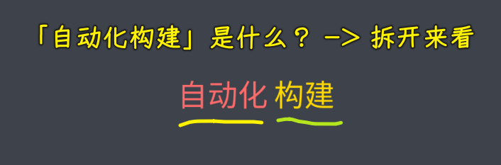

自动化实际上指的就是我们通过机器去代替手工完成一些工作。

构建 -> 你可以把它理解成转换，就是把一个东西转换成另外的一些东西。

2）「自动化构建工作流」是什么？

总的来说，开发行业当中的自动化构建，就是把我们开发阶段写出来的源代码，自动化的去转换成生产环境当中可以运行的代码或者程序。

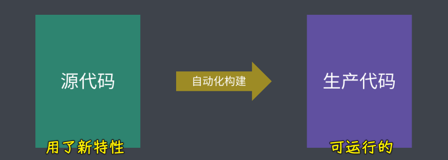

一般我们会把这样一个转换的过程称之为「**自动化构建工作流**」。

3）「自动化构建工作流」的作用？


它的作用就是让我们尽可能去脱离（离开；断绝）运行环境的种种问题，去在开发阶段去**使用一些提高效率的语法规范和标准**。


这最典型的应用场景就是我们在去开发网页应用时，我们就可以：

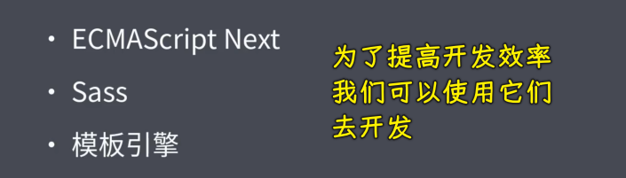

- 使用 ECMAScript 的最新标准去提高编码效率和质量
- 利用 Sass 去增强 CSS 的可编程性
- 然后再去借助模板引擎去抽象页面当中重复的 HTML

4）为什么需要「自动化构建工具」？


然而这一些用法在浏览器当中是没有办法直接被支持的。

那在这种情况下，自动化构建工具就可以派上用场了。


我们通过自动化构建的方式将这些不被支持的代码「**特性**」转换成能够直接运行的代码 -> 这样我们就可以在进行我们的开发过程当中，通过这些方式去提高我们编码效率了。

## ★自动化构建初体验


接下来我们通过一个小案例来体会一下自动化构建的便捷之处。

1）不想用写 CSS 的方式去完成网页的样式

在这个案例中，我们一开始使用的是直接编写 CSS 的方式去完成网页的样式：

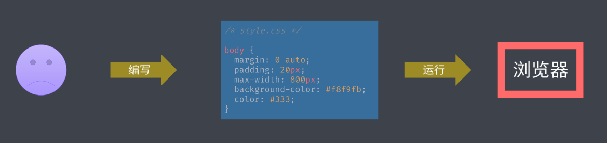

但是我们希望通过 Sass 去增强 CSS 的编程性 -> 这具体的实现方式就是在开发时我们添加一个构建的环节，这样让我们在开发环节就可以通过 CSS 编写样式，再通过工具将 Sass 去构建为 CSS

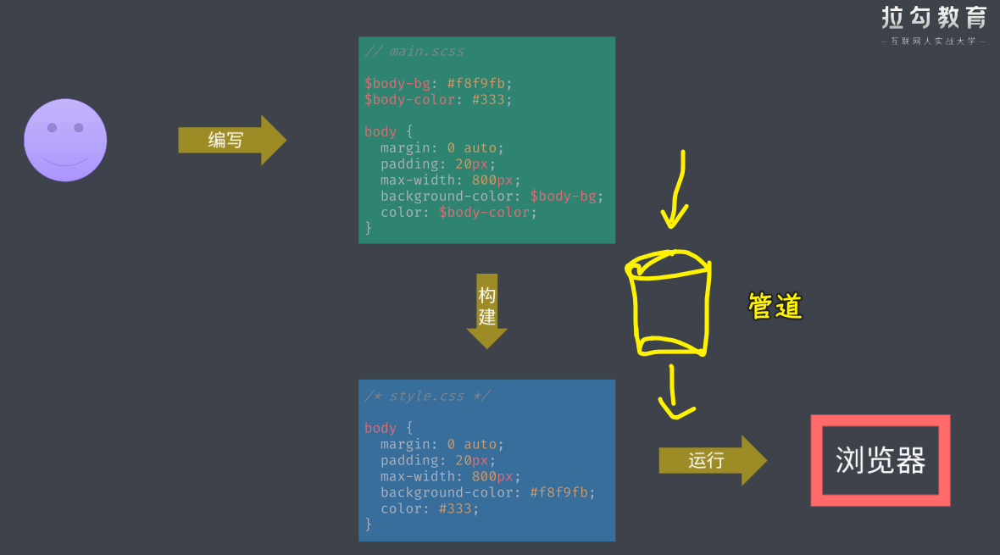

> 一般来说有 Less、Sass 这两种预处理器，Sass 后来受 Less 影响也发布了接近 CSS 块语法的 Scss -> `.scss`文件是接近 CSS 语法，即在`{}`写样式属性，而`.sass`文件则是用缩进来表示样式属性属于某个选择器 -> 总之，Sass 有两种语法格式！ -> 一般我们选择用 SCSS（Sassy CSS）这样语法格式，因为它是在 CSS3 语法的基础上进行拓展的，所有 CSS3 语法在 SCSS 中都是通用的，同时加入 Sass 的特色功能

接下来我们具体来看如何操作。

2）我想用 Sass 来写网页的样式

💡：删掉原先的`.css`文件

我们回到 VS Code 当中。我已经准备好了一个使用 CSS 完成网页样式的一个小案例：

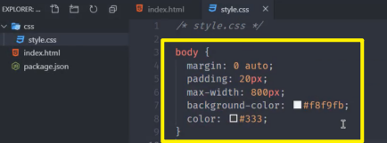

此时我们就不需要 CSS 文件了，我们把该 CSS 文件删除

💡：添加`.scss`文件

取而代之的就是新建一个 Sass 文件：

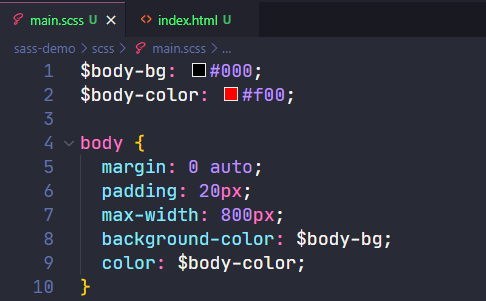

在这个 Sass 文件当中，我们就可以按照 Sass 的语法去编写我们的网页样式，相对于 CSS， **Sass 的编程能力肯定是要更强一些**。但是 Sass 它并不能在我们的浏览器环境当中直接去使用。所以说我们需要在开发阶段通过一个工具去把它转换成 CSS -> 这里我们要使用的就是 Sass 官方提供的一个 Sass 模块，我们可以进入命令行，通过`yarn add sass`这个模块。但是需要注意 -> 我们把它作为一个开发依赖来安装`--dev`。

💡：安装 `sass`，用它来把`.scss`文件编译成`.css`文件

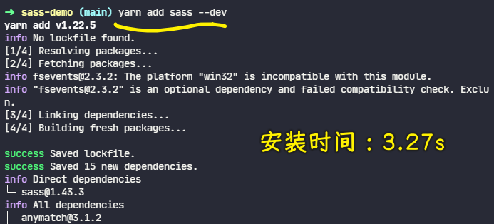

💡：查看`sass`命令在哪儿？

安装完成过后，我们在`node_modules`下面就会出现一个`.bin` 的目录 -> 这个目录下就会有一个 Sass 的命令文件：

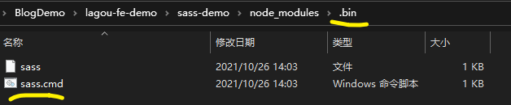

💡：查看`sass`命令需要什么参数？

我们在命令行当中就可以通过路径找到这个命令。执行完这个命令，它会打印出来一些帮助信息：

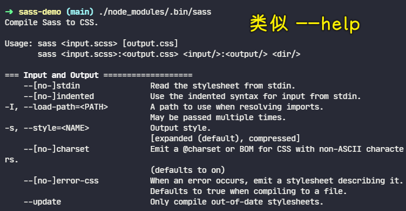

在这个帮助信息的一开始，它就给出来了这个命令的具体用法 -> 这具体就是我们需要指定一个 Sass 的输入路径以及一个 CSS 的输出路径。那我们这儿就是`scss/main.scss`，而输出路径是 `css/style.css`

💡：再次执行`sass`命令

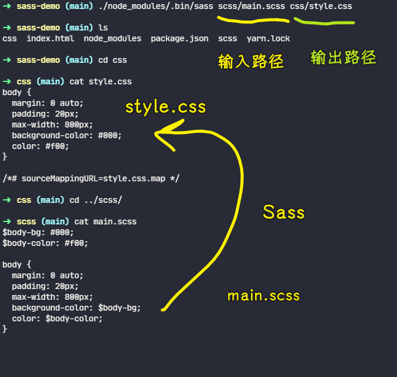

再次执行，它就可以自动的去帮我们把我们的 Sass 文件转换成 CSS 了，不仅如此，它还帮我们添加了对应的 `sourceMap` 文件 -> 这样的话，我们在调试阶段就可以定位到我们的源代码当中的位置了。

但是这样也有一个比较麻烦的地方，那就是我们每次都需要重复的去输入这些复杂的命令。而且在别人接手你的项目过后，他也不知道该如何去运行这些构建的任务 -> 所以说我们**需要做一些额外的事情去解决这些在项目开发阶段重复去执行的命令**。

3）NPM Scripts

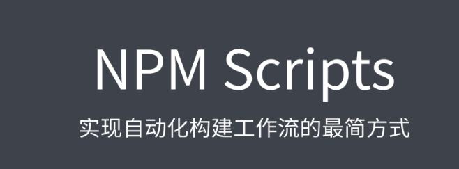

NPM Scripts 主要就是用来解决这个问题的，你可以在 npm 的 `scripts` 当中去定义一些与这个项目开发过程有关的一些脚本命令 -> 这样一来，你就可以让这些命令跟着项目一起去维护 -> 这便于我们在后期开发过程当中的使用。

所以说我们这儿最好的方式就是通过 NPM Scripts 方式去包装你的构建命令。

1、添加`scripts`字段

具体的实现方式就是在我们的`package.json`当中去添加一个 `scripts` 字段 -> 这个字段是一个对象，键就是 `script` 的名称，值是我们需要去执行的命令 -> 这里需要注意的是 script 它可以自动去发现`node_modules`里面的命令，所以说我们就不需要写完整的路径，直接使用命令的名称就可以了。

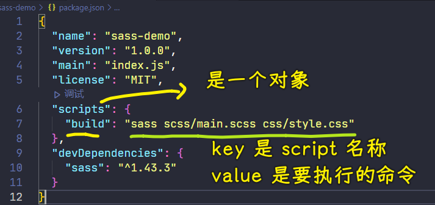

2、用`yarn`启动`build`脚本

完成过后，我们就可以通过 `npm` 或者 `yarn` 去启动这个 script -> `npm` 当中需要去运行 `npm run script-名称`，而`yarn`当中可以去省略这个 `run`：

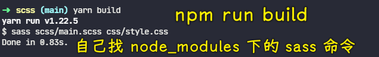

4）用 NPM Scripts 实现自动化构建

另外，NPM Scripts 也是**实现自动化构建最简单的方式**。

接下来我们就一起再来看一下如何通过它去实现自动化构建。

1、安装 `browser-sync`

我们这里为项目再去安装一个叫做`browser-sync`的模块（没有热更新，修改文件得自己手动刷新页面），用于去启动一个测试服务器去运行我们的项目：

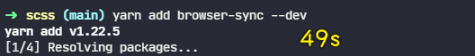

2、添加 `serve` 命令

这个时候我们在 scripts 当中去添加一个叫做 `serve` 的命令。在这个命令当中，通过 `browser-sync` 把当前这个目录给它运行起来 -> 回到命令行，我们运行一下 `serve` 命令

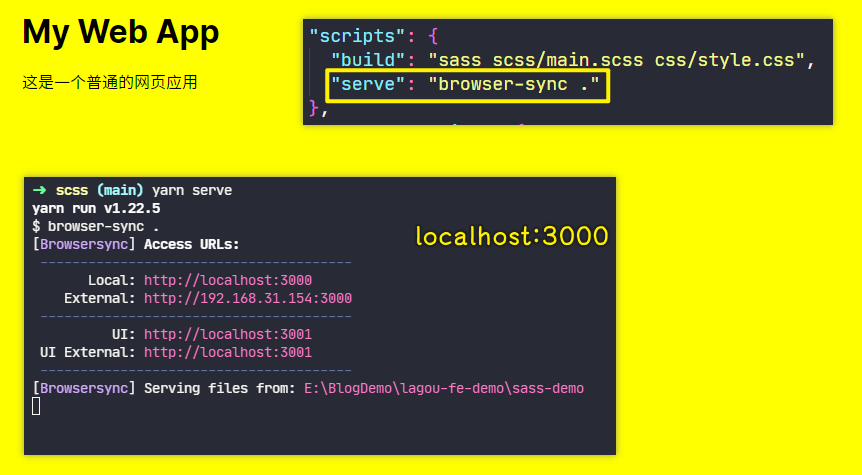

此时 `browser-sync`会自动启动一个 web 服务器，并且帮我们唤起浏览器，运行我们当前这个网页。

3、为什么需要添加 `preserve` 命令？

但是，如果说在 `browser-sync` 工作之前，我们并没有去生成我们的样式：

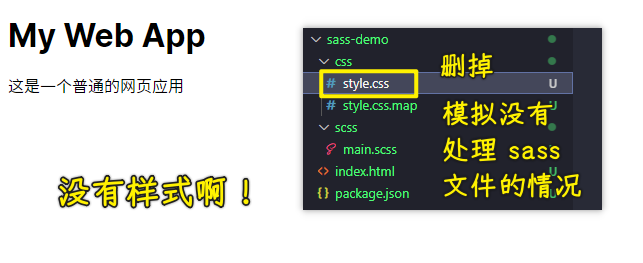

那此时 `browser-sync` 工作的时候，我们页面就没有样式文件了，**所以我们需要在启动 `serve` 命令之前去让 `build` 任务去工作**。

4、添加 `preserve` 命令

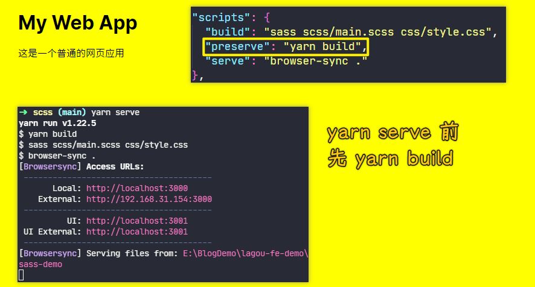

所以我们这儿可以借助于 NPM Scripts 的钩子机制去定义一个 `preserve` -> 它会自动在 `serve` 命令执行之前去执行 -> 这个时候你再去执行 `serve` 它就会自动化的先去执行 `build` 命令 -> `build` 完成过后再去执行对应的 `serve`

此时我们就可以完成在启动 web 服务之前，自动去构建我们的 Sass 文件。

5、为`sass`命令添加`--watch` & 为什么要安装 `npm-run-all`？

当然，光有这些还不够，我们还可以为`sass`命令去添加一个`--watch` 的参数 -> 有了这个参数过后，Sass 在工作时就会监听文件的变化。一旦当我们代码当中的 Sass 文件发生改变，它就会自动被编译。

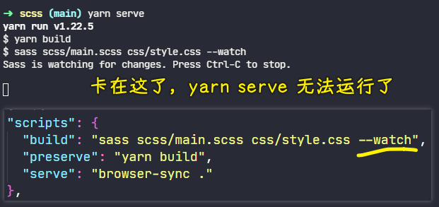

这时候我们回到命令行重新运行之前的命令。

你会发现 Sass 命令在工作时，命令行会阻塞在这个地方去等待文件的变化

那这样就导致了我们后面的 `browser-sync` 它并没有办法直接去工作 -> 这种情况下我们就需要**同时去执行多个任务**。

6、安装 `npm-run-all` 模块

我们这里可以借助于`npm-run-all`这个模块去实现，我们需要先安装一下这个模块：

``` bash
yarn add npm-run-all --dev
```

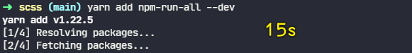

7、添加 `start` 命令

有了这个模块过后，我们就可以在 `scripts` 当中，再去添加一个新的命令，这个命令我们把它叫做 `start` 

在这个命令当中，我们通过 `npm-run-all` 里面的`run-p`这个命令同时去执行 `build` 和 `serve` 命令。

8、运行 `start` 命令

此时我们回到命令行当中，我们再去运行一下这个 `start` 命令。

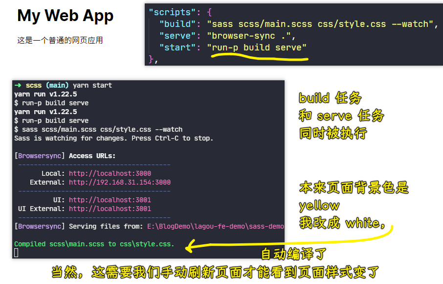

那这个时候你就会发现 `build` 任务和 `browser-sync`任务同时被执行了。

我们可以尝试的去打开 Sass 文件去修改 Sass 文件里面的内容 -> 这个时候你会发现 CSS 文件也会跟着一起去变化，这也就证明我们的 watch 已经生效了。

9、为 `browser-sync` 添加 `--files` 参数（热更新）

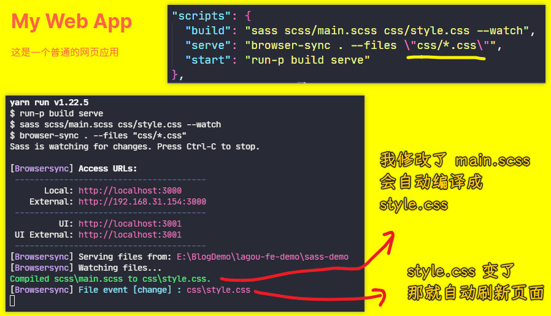

最后我们还可以给`browser-sync`这个命令去添加一个`--files`参数 -> 这个参数可以让`browser-sync`在启动过后去**监听项目下的一些文件的变化** -> 一旦当文件发生变化过后，`browser-sync` 会将这些文件的内容**自动同步到浏览器，从而更新浏览器当中的界面，让我们可以即时（立即，当下；立刻）查看到最新的界面效果**。

那这样就避免了我们修改完代码过后再去手动刷新浏览器这样一个重复的工作

10、总结

这样一来，我们就借助于 NPM Scripts 完成了一个简单的自动化构建的工作流。

而它具体的工作流程就是在启动任务（`yarn start`）过后，同时去运行了 `build` 和 `serve` 这两个命令。

其中：

- `build` 去自动监听 Sass 文件的变化去编译 Sass
- `browser-sync`它启动一个 web 服务，当文件发生变化过后，去刷新浏览器

## ★常用的自动化构建工具


