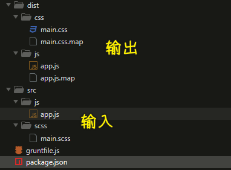

### ✍️ Tangxt ⏳ 2021-10-26 🏷️ 工程化

# 07-Grunt 的基本使用、Grunt 标记任务失败、Grunt 的配置方法、Grunt 多目标任务、Grunt 插件的使用、Grunt 常用插件及总结

> Grunt 基本是已经凉凉了，在这里我就简单了解下 Grunt，能看懂`gruntfile.js`就好了！ -> 这其中提到一个`done`的用法，让我想到单元测试关于异步的测试也是这样做的！ -> 还有对`preset-env`的解释

## ★Grunt 的基本使用


接下来我们在一个空项目当中去看一下 Grunt 的具体用法。

我们这儿是一个全新的空项目，我们在这个项目当中想要去使用 Grunt 的话，首先先需要去 `init` 一个 `package.json`。

有了这个文件过后，我们需要通过 `add` 方式去添加一下 Grunt 这个模块：

``` bash
yarn add grunt --dev
```

> 视频里没有加`--dev`

安装完这个模块过后，我们还需要在这个项目的根目录下去添加一个`gruntfile.js`文件 -> 这个文件是 Grunt 的入口文件，用于去定义一些需要 Grunt 自动去执行的任务。

我们在这个文件当中需要去导出一个函数，这个函数去接收一个叫做 `grunt` 的形式参数 -> 这个 `grunt` 它是一个对象，对象当中就是 grunt 提供的一些 API，我们可以借助于这些 API 去快速创建一些构建任务。

具体来做就是我们通过`module.exports`去导出这样一个函数。

在这个函数中，我们借助于 `grunt` 的`registerTask`方法去注册一个任务。

这个方法第一个参数去指定一下我们这个任务的名字。第二个参数可以去指定一个任务函数，也就是当这个任务发生时自动去执行的这个函数。

那我们在这个函数里面打印一个 `hello Grunt` 

我们回到命令行当中。

为了可以更清楚的看到我们的代码，我们把这个面板移到屏幕的右侧，然后运行 `yarn grunt`

`yarn`它会自动的去帮我们找到 `node_modules`当中提供的一些命令 -> 我们紧接着跟上 `foo` -> `foo`就是我们刚刚注册的这个任务的名字。

那这样的话，Grunt 就会自动的去帮我们去执行 `foo` 这个任务。当然，你不仅仅可以添加一个任务，你还可以去添加更多的任务。

如果你在添加任务的时候，你的第二个参数指定的是一个字符串的话，那这个字符串将会成为这个任务的描述，它会出现在 Grunt 的帮助信息当中。
我们可以在命令行当中，通过 `grunt --help` 去得到 Grunt 的帮助信息。

在这个帮助信息当中，有一个 `Available tasks`，在这个 `task` 当中，你的任务描述就是我们自定义的一个任务描述了。

当然，你同样可以通过 `grunt` 去运行 `bar` 这个任务 -> 具体的运行方式就是通过 `grunt bar`

除此之外，如果说你在注册任务的时候，你任务的名称叫做 `default` 的话，那这个任务将会成为 Grunt 的默认任务 -> 你在运行这个任务的时候，就不需要再去指定任务的名称，Grunt 将自动调用 `default` -> 一般我们会用 `default` 去映射一些其他的任务。

那具体的做法就是在`registerTask`这样一个方法当中，第二个参数传入一个数组 -> 这个数组当中我们可以去指定一些任务的名字，那这个时候我们去执行 `default` 的时候，Grunt 就会依次执行我们数组当中这些任务。

我们回到命令行当中，通过 Grunt 去执行默认任务。那此时你会发现 Grunt 先执行了 `foo` 这个任务，然后去执行了 `bar` 这个任务。那这样的话，`default` 就相当于是把 `foo` 和 `bar` 串联到了一起。

最后我们再来尝试了一下 Grunt 当中对异步任务的支持。

我们在这个`async-task`任务当中去通过`setTimeout`去模拟一下异步操作。

在异步任务完成过后，我们打印一个消息到控制台当中。

完成过后我们回到命令行 -> 通过 Grunt 去执行一下这个任务。

通过执行，我们发现`console.log()`并没有直接执行 -> 这个是 Grunt 当中一个特点 -> Grunt 的代码，它默认支持同步模式。

如果说你需要异步操作的话，你必须要使用`this.async`方法得到一个回调函数，在你的异步操作完成过后，去调用这个回调函数，标识一下这个任务已经被完成。

如果说我们要在函数当中使用 `this` 的话，那我们的函数就不能是箭头函数了，我们需要使用普通的函数。在这函数当中，我们使用`this.async`得到一个回调函数 -> 这一次我们在 `setTimeout` 完成过后，除了打印消息以外，我们还需要去调用一下这个 `done` 回调函数 -> 标识一下我们这个任务已经完成了 -> 此时 Grunt 就知道这是一个异步任务，它会等待 `done` 的执行，直到 `done` 被执行，Grunt 才会结束这个任务的执行。

💡：代码？

只安装一个开发依赖：`grunt`

``` js
// Grunt 的入口文件
// 用于定义一些需要 Grunt 自动执行的任务
// 需要导出一个函数
// 此函数接收一个 grunt 的对象类型的形参
// grunt 对象中提供一些创建任务时会用到的 API

module.exports = grunt => {
  grunt.registerTask('foo', 'a sample task', () => {
    console.log('hello grunt')
  })

  grunt.registerTask('bar', () => {
    console.log('other task')
  })

  // // default 是默认任务名称
  // // 通过 grunt 执行时可以省略
  // grunt.registerTask('default', () => {
  //   console.log('default task')
  // })

  // 第二个参数可以指定此任务的映射任务，
  // 这样执行 default 就相当于执行对应的任务
  // 这里映射的任务会按顺序依次执行，不会同步执行
  grunt.registerTask('default', ['foo', 'bar'])

  // 也可以在任务函数中执行其他任务
  grunt.registerTask('run-other', () => {
    // foo 和 bar 会在当前任务执行完成过后自动依次执行
    grunt.task.run('foo', 'bar')
    console.log('current task runing~')
  })

  // 默认 grunt 采用同步模式编码
  // 如果需要异步可以使用 this.async() 方法创建回调函数
  // grunt.registerTask('async-task', () => {
  //   setTimeout(() => {
  //     console.log('async task working~')
  //   }, 1000)
  // })

  // 由于函数体中需要使用 this，所以这里不能使用箭头函数
  grunt.registerTask('async-task', function () {
    const done = this.async()
    setTimeout(() => {
      console.log('async task working~')
      done()
    }, 1000)
  })
}
```

## ★Grunt 标记任务失败

如果你在构建任务的逻辑代码当中发生错误，例如我们需要的文件找不到了，那此时我们就可以将这个任务标记为一个失败的任务。

具体的实践方式 -> 我们可以通过在函数体当中去 `return false` 来实现。

例如在我们这个`bad`任务当中，我们在最下面 `return`了`false`

那此时我们回到终端，我们尝试着运行一下这个任务。

那你会发现终端当中提示我们 `bad` 这个任务它执行失败了 -> 如果说你这个任务是在一个任务列表当中的话，那这个任务的失败会导致后续所有的任务不再被执行。

例如我们这儿有多个任务。

然后我们通过一个 `default` 任务把他们连接到一起。那么在正常情况下，我们去运行 `default` -> 它会依次去执行 `foo`、`bad`以及`bar`，但是我们这里的 `bad` 它执行失败了 -> 那这样的话，`bar` 任务就不会被执行了。

我们回到终端当中，我们尝试着去运行一下这个 `default`：

那此时你会发现 `foo` 任务和 `bad` 任务都执行了，然而`bad` 任务执行失败了，而最后这个 `bar` 也就不会被执行了 -> 而且此时命令行当中也给了我们一个提示，如果说你要去指定了一个`--force`的参数话，那此时会采用一种强制方式去执行所有的任务，我们尝试一下：

有了`--force`过后，我们 `bad` 任务即使运行失败了，后续的 `bar` 任务也是会正常去执行的。

那这就是我们如何去标记一个任务失败以及标记任务失败过后的一些影响。

但是如果说你的任务是一个异步任务的话，那异步任务当中我们就没有办法直接通过`return false` 去标记这个任务失败。

那此时我们需要给异步的回调函数指定一个`false`的实参就可以标记为这个任务失败了。

我们尝试一下：

可以看到，此时我们这一个异步任务就会被标记为一个失败的任务。

我们回到终端当中尝试着去运行一下这个任务：

``` bash
yarn grunt bad-async
```

这时候你会发现这个`bad-async`任务也是执行失败的 -> 这就是我们在 Grunt 的任务当中如何去标记此任务为一个失败的任务，以及标记为失败任务过后的一个影响。

💡：代码？

``` js
module.exports = grunt => {
  // 任务函数执行过程中如果返回 false
  // 则意味着此任务执行失败
  grunt.registerTask('bad', () => {
    console.log('bad working~')
    return false
  })

  grunt.registerTask('foo', () => {
    console.log('foo working~')
  })

  grunt.registerTask('bar', () => {
    console.log('bar working~')
  })

  // 如果一个任务列表中的某个任务执行失败
  // 则后续任务默认不会运行
  // 除非 grunt 运行时指定 --force 参数强制执行
  grunt.registerTask('default', ['foo', 'bad', 'bar'])

  // 异步函数中标记当前任务执行失败的方式是为回调函数指定一个 false 的实参
  grunt.registerTask('bad-async', function () {
    const done = this.async()
    setTimeout(() => {
      console.log('async task working~')
      done(false)
    }, 1000)
  })
}
```

## ★Grunt 的配置方法

除了`registerTask`方法之外，Grunt 还提供了一个用于去添加一些配置选项的 API -> `initConfig`

例如我们在使用 Grunt 去为我们压缩文件时，我们就可以通过这种方式去配置我们需要压缩的文件路径。

我们回到项目当中尝试使用一下这个方法。

这个方法它接收一个对象形式的参数，对象的属性名，也就是我们说的键，它一般与我们的任务名称保持一致 -> 我这叫做 `foo` -> 属性的值它可以是任意类型的数据，我们这儿给一个字符串。

有了这个配置属性过后，我们就可以在一个任务当中去使用这个配置属性。

我们去注册一个叫做 `foo` 任务。在这个 `foo` 的任务当中，我们可以通过 `grunt` 提供的 `config` 方法去获取这个配置 -> 这个 `config` 方法它接收一个字符串参数，这个字符串参数就是我们在 `config` 当中所指定的那个属性的名字（`foo`）

我们可以将这个值尝试着打印到控制台当中，然后回到命令行运行一下这个命令：

这个时候我们控制台当中可以去打印出来`bar`，这也就意味着我们刚刚这个配置是成功的。
 
除此之外，如果说你的`initConfig`当中属性的值是一个对象的话，那我们的 `config` 方法还支持一种高级的用法。

我们尝试一下，在`foo`属性这个地方，我们把这个 `foo` 的属性值改成一个对象。

这个对象当中有一个 `bar` 属性，值是 `123`，保存一下。

这个时候我们在 `config` 当中就可以通过`foo.bar`的这个形式去拿到对应的属性值。

这个时候控制台当中可以打印出来 `123`，也就意味着`.`点的这种方式是被 `config` 所支持的。

当然，其实你一般使用的时候是不需要去使用「点」的这种方式，因为我们可以直接通过 `config` 把整个 `foo` 对象拿到，然后在这个对象上面通过点的方式去拿对应的 `bar` 属性 -> 这也是可以的。

💡：代码？

``` js
module.exports = grunt => {
  // grunt.initConfig() 用于为任务添加一些配置选项
  grunt.initConfig({
    // 键一般对应任务的名称
    // 值可以是任意类型的数据
    foo: {
      bar: 'baz'
    }
  })

  grunt.registerTask('foo', () => {
    // 任务中可以使用 grunt.config() 获取配置
    console.log(grunt.config('foo'))
    // 如果属性值是对象的话，config 中可以使用点的方式定位对象中属性的值
    console.log(grunt.config('foo.bar'))
  })
}
```

## ★Grunt 多目标任务

除了普通的任务形式以外，Grunt 当中还支持一种叫做多目标模式的任务 -> 你可以把它理解成子任务的概念。

这种形式的任务，在我们后续具体去通过 Grunt 实现各种构建任务时非常有用。

我们具体来看一下。

多目标模式的任务，它需要通过 `grunt` 当中的`registerMultiTask`方法去定义。

这个方法同样接收两个参数：

- 第一个参数就是我们任务的名字，我们这儿叫 `build`
- 第二个参数同样接收的是一个函数 -> 在这个函数当中仍然是我们任务执行过程当中所需要做的一些事情。

我们可以在这个函数里边，先通过 `console.log()` 打印一下。

回到命令行当中，我们再去运行一下这个任务

运行的过程，你会发现它爆出来了一个警告，说的是我们没有为 `build` 任务去设置一些 `targets` 

这是因为我们在设置这种多目标任务时，我们需要为这种多目标的任务去配置不同的目标。那配置的方式就是通过 `grunt` 的 `initConfig`方法去配置。

这具体来看就是`grunt.initConfig({})`

在这个 `Config` 对象当中，我们需要去指定一个与我们任务名称同名的一个属性，也就是 `build` 

那这个时候我们的属性值必须得是一个对象，对象当中每一个属性的名字就是我们的目标名称。

比如说我们这儿：

``` js
grunt.initConfig({
  build: {
    css: '1',
    js: '2'
  }
})
```

当然，这只是示例一下。

这个时候就相当于是我们为我们的这个 `build` 任务添加了两个目标，一个叫做 `css`，一个叫做`js`

保存一下，我们回到我们的命令行终端当中，再次去运行一下这个任务。

此时运行这个任务的时候，你会发现它会运行两个子任务。实际上这个不叫「子任务」。在 Grunt 当中，这个叫做「多目标」 -> 这也就是说我们 `build` 任务有两个目标，一个是 `css` 目标，一个是 `js` 目标。

你运行 `build` 任务的时候，它会同时去执行这两个目标，也就相当于以两个子任务的形式去运行。

如果你要去运行指定的这个目标话，我们可以通过：

``` js
// 冒号跟上目标名称
yarn grunt build:css
```

那这时候它只会去运行对应的这个目标。

在我们的这个`registerMultiTask`任务函数当中，我们可以通过 `this` 去拿到当前执行的这个目标的名称，还可以通过 `this` 当中的 `data` 去拿到这个`target`所对应的配置数据，我们可以尝试着做一个打印：

``` js
grunt.registerMultiTask('build', function () {
  console.log(`task: build, target: ${this.target}, data: ${this.data}`)
})
```

这个时候我们再回到终端当中，尝试重新执行一下这个任务。

我们执行`yarn grunt build:css`的时候，我们拿到的 `target` 就是 `css`， 而`data` 就是`1` -> 这个 `data` 里面的值，也就是我们刚刚在 `initConfig` 当中所指定的那个 `1`

需要注意的是，我们在 `build` 当中指定的每一个属性的键都会成为一个目标。

除了我们指定的 `options` 以外，在 `options` 当中指定的信息，它会作为这个任务的配置选项出现：

- 我们加一个 `option` 叫做 `foo` -> 值是`bar`

此时我们再去尝试着去执行一下 `build` 这个任务，你会发现它并没有一个 `target` 叫做 `options`，因为这个 `options` 它会作为任务的配置选项出现。

那我们在任务的执行过程当中，就可以通过`this.options`拿到它对应的配置选项 -> `options` 是一个方法，它可以去拿我们当前这个任务所有的配置选项的那个对象

我们回到终端当中再次去执行一下这个 `build` 

此时它就会把我们这个任务的配置选项打印出来

除了我们在任务当中可以去加这个配置选项之外，我们在这个目标当中 -> 如果说目标的配置它也是一个对象的话，那在它的这个属性当中也可以去添加一个 `options` -> 在添加 `option` 的时候，它会覆盖掉对象当中的 `option`

保存一下回到终端，我们再来尝试一下。

此时我们去执行 `css` 这个 target 的时候，它的`foo`值就是 `baz`，而执行`js`这个 target 的时候，它的`foo`值是`bar` 

因为这个时候`js`当中并没有覆盖任务当中的选项，而`css`的目标当中覆盖了任务的选项。

这个就是我们在 Grunt 当中的多目标任务。

💡：代码？

``` js
module.exports = grunt => {
  // 多目标模式，可以让任务根据配置形成多个子任务

  // grunt.initConfig({
  //   build: {
  //     foo: 100,
  //     bar: '456'
  //   }
  // })

  // grunt.registerMultiTask('build', function () {
  //   console.log(`task: build, target: ${this.target}, data: ${this.data}`)
  // })

  grunt.initConfig({
    build: {
      options: {
        msg: 'task options'
      },
      foo: {
        options: {
          msg: 'foo target options'
        }
      },
      bar: '456'
    }
  })

  grunt.registerMultiTask('build', function () {
    console.log(this.options())
  })
}
```

## ★Grunt 插件的使用

在了解了 Grunt 的基本特性之后，我们再来了解一下 Grunt 当中插件的使用。

插件机制是 Grunt 的核心，它存在的原因也非常简单，因为很多构建任务它都是通用的。

例如你在你的项目当中需要去压缩代码，别人的项目当中同样也会需要 -> 所以说社区当中就出现了很多预设的插件。而这些插件的内部都封装了一些通用的构建任务。

一般情况下，我们的构建过程都是由这些通用的构建任务组成的。

那接下来我们就一起学习一下如何具体去使用插件当中提供的这些构建任务。

使用插件的过程非常简单：

- 大体上就是先通过 `npm` 去安装这个插件
- 再到`gruntfile.js`当中去载入这个插件提供的一些任务
- 最后我们根据这些插件的文档去完成相关的配置选项

我们回到项目当中。

这里我们通过一个非常常见的插件来去尝试一下，这个插件叫做 `grunt-contrib-clean` -> 它用来自动去清除我们在项目开发过程当中产生的一些临时文件。

首先我们进入到命令行终端去安装这个插件：

``` bash
yarn add grunt-contrib-clean
```

然后我们回到 `gruntfile.js` 当中，通过 Grunt 的`loadNpmTasks`方法去加载这个插件当中提供的一些任务。

绝大多数情况下，Grunt 的插件命名规范都是`grunt-contrib-<task name>` -> 所以说我们这里的 `clean` 插件，它提供的任务名称应该就叫做 `clean`

我们回到命令行终端，我们尝试通过 `grunt` 运行一下这个任务

运行的过程当中，控制台会打印一个错误信息，告诉我们`clean`任务并没有配置对应的目标。

从这个错误信息当中我们不难发现，`clean` ，它实际上就是我们之前介绍的一种多目标任务 -> 我们需要通过`initConfig`的方式去配置不同的目标。

我们再次回到 `gruntfile.js` 当中

在这里，我们通过`grunt.initConfig`去为我们这个 `clean` 任务添加一个目标 -> 这个目标的名字我们叫做 `temp` -> 目标的值，也就是我们这个 `temp` 目标对应的配置选项，我们可以设置为一个字符串 -> 在这个字符串当中就是我们这个 `temp` 目标所需要去清除的文件路径（我们这里是`temp`下的`app.js`）

再次回到命令行重新去运行一下这个命令。

此时你会发现 `temp` 下的`app.js`就会被删除掉。

除了这种指定具体文件路径之外，我们还可以在这个路径当中使用通配符的方式去通配一些文件类型。

例如我们这儿去删除一下 `temp` 下面所有的`txt`文件

我们重新运行`yarn grunt clean`。

这个时候 `temp` 下所有的文本文件就会被删除掉。

除了`*.txt`这种方式以外，我们还可以使用`**`这种两个星号的通配符方式 -> 这种通配符也是比较常见的，它代表的就是我们找到 `temp` 下所有的子目录以及子目录下的文件 -> 这样一来，我们 `temp` 下所有的文件就会被清空掉。

我们总结一下使用 Grunt 的插件：

- 第一步就是我们找到这个插件，然后把它安装到我们的 npm 模块当中。
- 然后第二件事，我们就是在 `gruntfile.js` 当中，通过 `grunt` 的`loadNpmTasks`方法去把这个插件当中提供的一些任务加载进来。
- 然后第三件事就是在`grunt.initConfig`当中去为这个任务添加一些配置选项

这样一来，我们的一个插件就可以正常工作了。

💡：代码？

需要安装开发依赖：`"grunt-contrib-clean": "^2.0.0"`

``` js
module.exports = grunt => {
  grunt.initConfig({
    clean: {
      temp: 'temp/**'
    }
  })
  
  grunt.loadNpmTasks('grunt-contrib-clean')
}
```

## ★Grunt 常用插件及总结

接下来我们再来看几个在 Grunt 当中非常常用的插件。

首先第一个就是 `grunt-sass`

这儿需要注意的是 Grunt 的官方，它也提供了一个 sass 的模块，但是那个模块它需要你本机安装 sass 环境，使用起来很不方便。

我们这儿使用的 `grunt-sass`，它是一个 npm 的模块儿，它在内部会通过 npm 的形式去依赖 sass -> 那这样的话它使用起来就不需要对我们的机器有任何的环境要求

我们直接使用 `grunt-sass`，那使用的方式呢？ -> 我们就先去安装一下它

``` bash
yarn add grunt-sass
```

`grunt-sass`它需要有一个 sass 的模块支持。我们这儿使用的就是 sass 官方提供的一个 npm 的模块儿 -> 就叫做 `sass`

同时把这两个模块儿安装到我们的开发依赖当中。

``` bash
yarn add grunt-sass sass --dev
```

有了这个模块的安装过后，我们到 `gruntfile` 当中，可以通过`grunt.loadNpmTasks`去载入我们的`grunt-sass`当中提供的任务。

回到我们的`grunt.initConfig`当中。因为 `grunt-sass` 它是一个多目标任务，我们这儿肯定是需要通过`grunt.initConfig`的方式去为 `sass` 这个任务去配置一些目标。

我们这儿有一个目标叫做`main` -> `main` 当中它需要去指定我们 sass 的输入文件以及最终输出的 CSS 文件的路径。

具体的指定方式，我们就是通过 `files` 属性去指定 -> `files`是一个对象，对象的键是我们需要输出的 CSS 路径，我们放到 `dist` 下面的 `css` 下面的`main.css` -> 值就是我们输入的源路径，也就是 sass 文件的路径`src/scss/main.scss`

保存一下

有了这样一个配置过后，我们就可以回到命令行当中，尝试运行一下 sass 这个任务 -> 运行的过程它会报一个错误，说我们没有去传入一个 `implementation`的一个选项 -> `implementation` 它是用来去指令我们在`grunt-sass`当中使用哪一个模块去处理 sass 的编译

那这儿我们就需要回到我们的代码当中，为 sass 这个任务添加一个 option -> 在这个 `option` 当中，我们需要去添加 `implementation` -> 它的实现就是我们刚刚所安装的那个 sass 模块

所以我们先把 sass 模块给它`require`载入进来 -> 把这个 sass 模块传入到这个`implementation`属性当中

有了这个配置过后，我们可以回到终端当中再次去运行一下 sass 这个任务。

此时你就会发现，在我们的项目根目录下多了一个 `dist` 目录 -> 这个目录下有一个 `css` 文件夹 -> 里面就会有一个编译完成的 CSS 文件。

这个就是我们 `sass` 这一个插件在 Grunt 当中的一个基本使用。当然，它还有更多的选项，比如我们可以通过添加一个 `sourceMap` 为 `true` -> 这个时候我们在编译过程当中，它就会自动去生成对应的 `sourceMap` 文件

除此之外，它还有一些更多的选项。那这个时候，你可以去通过`grunt-sass` 的官方仓库里面的文档找到一些信息 -> 我们这儿只针对于`grunt-sass`做一个简单的介绍。

除此之外，我们还有一个在编译过程当中经常遇到的需求，那就是我们需要去编译 ES6 的语法。

ES6 的语法编译器，我们使用最多的就是 babel， 那在 Grunt 当中我们要去使用 babel 的话，也可以去使用一个`grunt-babel`的插件，我们到终端当中再来去安装一下这个插件。

``` bash
yarn add grunt-babel --dev
```

`grunt-babel` 它也需要我们的 babel 的核心模块 -> 我们核心模块的名字是一个私有名称`@babel`下面的`core`（即`@babel/core`）以及 babel 的一个预设`@babel/preset-env` -> 都是开发依赖

有了这三个模块过后，我们就可以在我们的 `gruntfile` 当中去使用 babel 里面提供的一些任务了。

这个时候我们又需要通过`loadNpmTasks`去加载 `grunt-babel`当中提供的一些任务。

随着你的这个 `gruntfile` 越来越复杂，你这个`loadNpmTasks`里面的操作也会越来越多。 -> 那这个时候，社区当中有一个模块，它可以减少我们`loadNpmTasks` 的使用 -> 这具体怎么样去用呢？我们可以先安装一个叫做`load-grunt-tasks` 的一个模块

``` bash
yarn add load-grunt-tasks --dev
```

该模块同样也是开发依赖。

安装完这个模块过后，我们就可以先导入一下这个模块：

``` js
const loadGruntTasks = require('load-grunt-tasks')
```

有了这个模块的导入过后，我们就不需要每次重复的去导入这个不同的插件了。我们可以直接通过 `loadGruntTasks` （把 `grunt` 传进去）来搞

这个时候 `loadGruntTasks` 它会自动加载所有的 grunt 插件任务 -> 这个就是 `loadGruntTasks`的一个作用。

这个`loadGruntTasks`当中，它肯定是加载了 `grunt-babel`里面提供的一些任务 -> 所以，同样我们也需要为`grunt-babel`任务提供一些目标 配置

这个目标我们同样也是用`main` -> 在这个`main`里面也是通过 `files` 去指定一下我们的这个编译文件的输入和输出 -> 输出我们放在`dist/js/app.js` -> 输入就是`src/js/app.js` 

对了，对于 `babel` 这个任务，它也需要配置一个选项，它这个选项需要设置什么呢？ -> 就是设置我们 babel 在转换的时候那个 `preset` -> 因为我们知道 babel 它作为 ES6 的转换，实际上它不是 ES6 的转换，它应该是 ECMAScript 最新特性的一个转换，它里面支持转换部分特性 ->  `preset` 实际上就是说你需要去转换哪些特性，它把一系列的特性打了一个包，形成了一个叫做 `preset`

我们这儿使用的 `preset`，它叫做`env` -> 它会默认根据最新的 ES 特性去做对应的转换。

所以我们这儿需要加对应的配置 -> 这也是通过 `options` 来加 -> 在`options`当中去指定一下，我们这儿把这个选项叫做 `presets` -> 它是一个数组，数组当中我们传入一个`'@babel/preset-env'`

这样一来，它就会帮我们把最新的 ECMAScript 当中的特性全部加载进来

所以，我们代码当中这一些 ES6 的特性肯定会被转换掉。

我们回到咱们的这个命令行当中，我们去执行一下`babel`任务。

此时我们在 `dist` 目录下就会多出来一个 `js` 文件夹，文件夹里面会有一个`js`文件，那这个文件当中就帮我们自动的把原来我们写的一些 ES6 代码自动的去转换成了 ES5 的方式。

在`options`里边，babel 它也支持 `sourceMap` 选项，这也就是说我们也可以在 `options` 里面去添加一个 `sourceMap`

有了它过后，我们再回到命令行终端当中去运行一下 babel 这个命令。

此时我们的这个`js`文件也会生成对应的 `sourceMap`文件

这个是`grunt-babel`这样一个插件的基本使用。

还有一个我们在使用像这种构建系统经常遇到的一个需求就是：

> 当文件修改了完了过后，我们需要自动的去编译。那这个时候在 grunt 当中我们需要另外一个插件——`grunt-contrib-watch`

我们安装一下这个模块：

``` bash
yarn add grunt-contrib-watch --dev
```

安装完这个模块过后，我们的`loadGruntTasks`会自动的去把 `watch` 这个任务也给它加载进来。

所以说我们不需要再去`loadNpmTasks`了，然后我们直接去为 `watch` 这个任务去添加配置选项就好了。

对于，`watch` 这个任务，我们需要去添加不同的目标。那我们这可以有一个 JS 的目标，去专门用来去监视 JS 文件的变化 -> 那这个里面我们通过 `files` 去指定我们需要监视的文件，对于这个 `files` 它就直接设置为一个数组就好了，因为它不需要输出任何的文件，它只是需要监视特定的源文件就好了 -> 我们的源文件应该是`src/js/app.js`

当然，你实际去用的时候，一般我们会用通配符去通配`js`下面所有的 JS 文件

这样做完了过后，我们还需要去添加一个选项，这个选项叫做 `tasks`，也就是当你这些文件发生改变过后，你需要去执行什么任务？

那我们这儿需要执行的任务叫做`'babel'` -> 这样一来，我们在 `watch` 里面有一个对 JS 的 `watch`

以此类推，我们可以再添加一个对样式文件的 `watch` -> 这个样式文件我们监视的是`src/scss/*.scss` -> 我们需要执行的任务叫做 `sass`

关于这个`scss`和`sass`说明一下， sass 最早的这个扩展名就是 `sass`，但是它的那个语法规范不太容易被人接受，所以说它后来出了一个新的语法规范 -> 那个新的语法规范就用`scss`作为扩展名，所以`src/scss/*.scss`这里，我们说的`scss`实际上就是 sass 的新扩展名而已。

我们回到任务当中。

这个时候我们再去运行任务的时候，我们就可以运行一下 `watch` 这个任务。

`watch` 这个任务启动过后，它并不会直接去执行 `babel` 和 `sass` 对应的一些任务，它只是会去监视文件。一旦当文件发生变化过后，它才会去修改，才会去执行对应的任务。

例如我们在`app.js`里边随便去做一些调整，保存一下

那你会发现这个 `babel` 任务会自动自动被执行 -> 那也就是说我们在这个 `watch` 一开始的时候，它并不执行我们的 `sass` 和 `babel`

所以说我们一般会给 `watch` 做一个映射

那这个映射该怎么做呢？

``` js
grunt.registerTask('default', ['sass', 'babel', 'watch'])
```

`grunt.registerTask`然后给一个比如 `default` 任务。

在这个 `default` 当中，我们先去执行一下 `sass` 和 `babel`，最后我们再去执行一下 `watch`

那这样的话，就确保我们在启动的那一瞬间就会先执行一次编译操作，然后再去启动监听 -> 这样做可能会更合理一些。

回到命令行终端，我们运行一下 `default`：

``` bash
yarn grunt
```

`default` 这个任务是不需要去指定任务的名称的，我们直接运行 `grunt` 就好了。

此时它会先做一次编译操作，然后紧接着启动这个监听 -> 再有文件的变化话，它会自动去编译。

以上就是我们介绍的三个小插件，这三个小插件，实际上算我们在使用 Grunt 这样的工具最常用的几个插件。当然，除此之外，它还有很多其他的插件，但是我们在这儿就不过多的去介绍了，原因很简单，因为 Grunt 基本上已经退出历史舞台了。

我们这儿介绍 Grunt 的一个最主要原因是因为它算是最早的鼻祖了，所以说我们先介绍一下它。

另外一个，我们介绍它还有一个最主要的点，就是为后面一个东西做一个铺垫，有了它的使用上诸多不便，后面我们在使用 Glup 的时候就会有更好的体验。

至于它其他的一些插件，大家可以顺藤摸瓜从官网上找到一些说明，我们就不再过多的去介绍了。

反正以大家现在了解的这个程度来讲的话，对于拿到别人项目当中的 `gruntfile.js` 然后去分析它，是不会受任何影响的。

这就是我们针对于 Grunt 介绍的所有的内容。

💡：代码？

目录结构：



开发依赖：

``` json
{
  "devDependencies": {
    "@babel/core": "^7.5.5",
    "@babel/preset-env": "^7.5.5",
    "grunt": "^1.0.4",
    "grunt-babel": "^8.0.0",
    "grunt-contrib-watch": "^1.1.0",
    "grunt-sass": "^3.1.0",
    "load-grunt-tasks": "^5.1.0",
    "sass": "^1.22.10"
  }
}
```

`gruntfile.js`：

``` js
const sass = require('sass')
const loadGruntTasks = require('load-grunt-tasks')

module.exports = grunt => {
  grunt.initConfig({
    sass: {
      options: {
        sourceMap: true,
        implementation: sass
      },
      main: {
        files: {
          'dist/css/main.css': 'src/scss/main.scss'
        }
      }
    },
    babel: {
      options: {
        sourceMap: true,
        presets: ['@babel/preset-env']
      },
      main: {
        files: {
          'dist/js/app.js': 'src/js/app.js'
        }
      }
    },
    watch: {
      js: {
        files: ['src/js/*.js'],
        tasks: ['babel']
      },
      css: {
        files: ['src/scss/*.scss'],
        tasks: ['sass']
      }
    }
  })

  // grunt.loadNpmTasks('grunt-sass')
  loadGruntTasks(grunt) // 自动加载所有的 grunt 插件中的任务

  grunt.registerTask('default', ['sass', 'babel', 'watch'])
}
```

