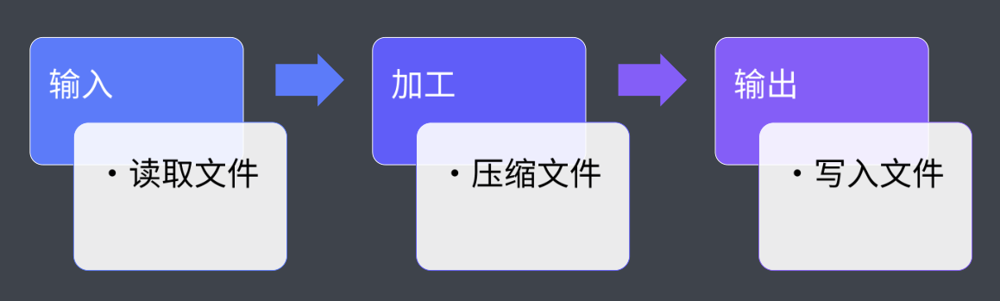
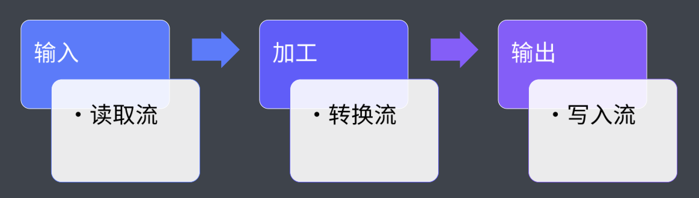
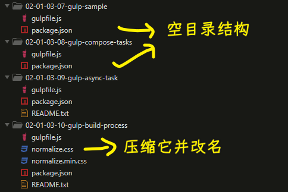
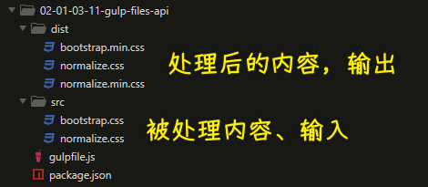

### ✍️ Tangxt ⏳ 2021-10-27 🏷️ 工程化

# 08-Gulp 的基本使用、Gulp 的组合任务、Gulp 的异步任务、Gulp 构建过程核心工作原理、Gulp 文件操作 API

## ★Gulp 的基本使用

gulp 作为当下最流行的前端构建系统，其核心特点就是高效、易用。

因为使用 gulp 的过程非常简单，大体的过程就是先在项目中安装一个叫做 `gulp` 的开发依赖。然后在我们的项目的根目录，也就是`package.json` 所在的目录当中去添加一个 `gulpfile.js`文件 -> 用于去编写我们需要 gulp 自动执行的一些构建任务。

完成过后，我们就可以在命令行终端当中使用 gulp 这个模块提供的 CLI 去运行这些构建任务。

我们回到一个空项目当中具体来看：

首先我们先通过`yarn init`去初始化一下我们项目的 `package.json`

有了这个文件过后，我们再通过`yarn`安装这个 `gulp` 模块，把它作为一个开发依赖安装。

``` bash
yarn add gulp --dev
```

安装 gulp 的同时它会同时安装一个叫做`gulp-cli`的模块 -> 也就是说我们此时在`node_modules`当中会出现一个 gulp 的命令。

有了这个命令过后，我们就可以在后续通过这个命令去运行我们的一些构建任务。

此时我们再回到项目的根目录当中去创建一个 `gulpfile.js`文件。

在这个文件当中，我们去定义一些需要 gulp 执行的一些构建任务。那也就是说这个文件会是 gulp 的入口文件，因为这个文件是运行在 Node.js 的环境当中，所以说我们可以在这个文件当中使用 CommonJS  的规范。

在这个文件当中去定义构建任务的方式，就是通过导出函数成员的方式去定义。

那具体的方式就是通过 `export` 导出一个成员

我们这儿导出一个叫做 `foo` 的成员 -> 这个成员的值它是一个函数 -> 在这个函数体当中，我们通过`console.log()`去表示一下函数的执行。

那这个时候我们的 `gulpfile.js` 当中就相当于定义了一个叫做 `foo` 的任务。

我们可以回到命令行终端，通过 gulp 提供的 CLI 去运行这个任务。我们这儿通过`yarn`运行 gulp 这个命令，然后给它传入一个 `foo` 参数，用于代表我们指定执行 `foo` 这个任务：

``` bash
yarn gulp foo
```

回车。

此时命令行终端当中确实帮我们执行了 `foo` 这个任务，而且 `foo` 的 `console.log()`也正常打印出来了，但是这个地方会报出一个错误，错误信息大体的含义就是说：

> 我们的 `foo` 任务执行没有完成，问我们是否忘记去标识这个任务的结束

为啥会有这个错误呢？ -> 这是因为在最新的 gulp 当中，它取消了同步代码模式，约定我们每一个任务都必须是一个异步的任务。

当我们的任务执行完成过后，我们需要通过调用回调函数或者其他的方式去标记这个任务已经完成。

所以说我们在解决这个问题这块需要做的事情就是手动的去调用一个回调函数 -> 这个回调函数我们可以在代码当中通过 `foo` 这个函数的形式参数得到。

我们这儿接收一个叫做 `done` 的参数 -> 这个 `done` 它就是一个函数，我们可以在任务执行完成过后，去调用一下这个函数 -> 标识一下任务完成。

此时我们再次回到命令行终端，重新去运行这个命令：

``` bash
yarn gulp foo
```

此时你会发现 `foo` 这个任务正常启动，正常结束，并且这个过程也是打印了我们对应的任务消息。

以上就是我们在 gulp 当中去定义一个任务的操作方式。

如果说你的任务名称是 `default` 的话，那它会作为 gulp 的默认任务出现。

例如我们这儿通过 `export` 导出一个叫做 `default` 的成员 -> 这个成员它也是一个函数，在这个函数当中我们也同样打印一个消息。那这个时候任务完成过后，我们同样需要调用这个 `done` 的回调函数。

有了这个 `default` 任务过后，我们再到命令行当中去运行一下这个 `default`。

``` bash
yarn gulp
```

此时因为这个 `default` 它会作为 gulp 的默认任务出现，我们再去运行它的时候就不需要去指定任务名的那个参数了，我们直接运行 `gulp` -> 此时它会自动去运行 `default` 这个任务 -> 这是我们任务名如果说是 `default` 的话，它的这么一个小特点。

除此之外，还有一个需要大家注意的就是，在 gulp 4.0 以前，我们去注册 gulp 的任务是需要通过 gulp 模块里面的一个方法去实现。

这具体来看就是我们通过 `require` 的方式先载入 gulp 这个模块。有了这个模块儿过后，我们就可以借助于这个模块儿里面提供的 `task` 方法去注册一个任务。

例如我们这儿注册一个叫做 `bar` 的任务。

同样，这个任务也需要去接收一个任务的函数。在这个任务函数当中，我们通过形参去接收任务完成过后的回调函数`done`。

在这个任务中，我们同样打印一个任务消息，完成过后，我们同样去调用一下回调函数`done`。

此时我们再回到命令行终端，我们尝试着去运行一下这个 `bar` 任务：

``` bash
yarn gulp bar
```

此时你会发现 `bar` 任务也可以正常工作 -> 这是因为在 gulp 4.0 以后的版本当中保留了这个 API，虽然说我们现在还可以直接使用这个 API，但是这种方式已经不被推荐了。

我们更推荐大家使用的方式就是通过导出函数成员的方式去定义我们的 gulp 任务。

💡：代码？

`gulpfile.js`：

``` js
// // 导出的函数都会作为 gulp 任务
// exports.foo = () => {
//   console.log('foo task working~')
// }

// gulp 的任务函数都是异步的
// 可以通过调用回调函数标识任务完成
exports.foo = done => {
  console.log('foo task working~')
  done() // 标识任务执行完成
}

// default 是默认任务
// 在运行是可以省略任务名参数
exports.default = done => {
  console.log('default task working~')
  done()
}

// v4.0 之前需要通过 gulp.task() 方法注册任务
const gulp = require('gulp')

gulp.task('bar', done => {
  console.log('bar task working~')
  done()
})
```

## ★Gulp 的组合任务

除了创建普通的任务以外，gulp 的最新版本还提供了 `series` 和 `parallel` 这两个用来创建组合任务的 API

有了这两个 API 过后，我们就可以很轻松地去创建并行任务和串行任务。

具体来看，我们这儿有三个函数：

``` js
const task1 = done => {
  setTimeout(() => {
    console.log('task1 working~')
    done()
  }, 1000)
}

const task2 = done => {
  setTimeout(() => {
    console.log('task2 working~')
    done()
  }, 1000)  
}

const task3 = done => {
  setTimeout(() => {
    console.log('task3 working~')
    done()
  }, 1000)  
}
```

我们可以把这种未被导出的成员函数理解成私有的任务。那他们各自模拟了一个需要执行一秒的任务。

这里我们并不能通过 gulp 直接去运行它们。我们可以通过 gulp 模块提供的 series 和 parallel 这两个 API 把它们组合成一个组合任务。

我们这儿先通过 `require` 的方式载入这两个 API，完了过后，我们创建一个叫做 `foo` 的任务 -> 这个任务我们通过 series 去创建。

`series` 是一个函数，它可以接受任意个数的参数 -> 每个参数都可以是一个任务 -> `series` 会自动的去按照顺序依次执行这些任务。

我们回到命令行当中去尝试使用一下它们：

``` bash
yarn gulp foo
```

这时候你会发现 `foo` 这个任务启动过后，它会依次执行 task1、 task2 和 task3。

除了创建这种串行的任务结构，我们还可以去创建一种并行的任务结构 -> 这种方式我们需要通过 gulp 模块里面提供的 `parallel` 这个 API 去实现。

我们这儿导出一个 `bar` 成员 -> 这个成员我们通过 `parallel` 去包装一下 task1、task2、task3

有了这个 `parallel`的一个任务过后，我们通过命令行当中去运行一下 `bar` 这个任务：

``` bash
yarn gulp bar
```

此时你会发现，在 `bar` 一开始的时候，我们三个任务会被同时启动 -> 这种方式就是同步去执行这三个任务。

总的来说，创建并行任务，或者说创建串行任务，它在我们实际创建构建工作流时非常有用。

例如我们去编译 CSS 和编译 JS 的任务，它们是互不干扰的。那这两个任务我们就可以通过并行的方式去执行 -> 这样会提高一些构建效率。

再比如我们去部署，那部署的任务需要先执行编译任务。那这个时候我们就需要通过 `series` 这种串行的模式去执行这两个任务。

💡：代码？

``` js
const { series, parallel } = require('gulp')

const task1 = done => {
  setTimeout(() => {
    console.log('task1 working~')
    done()
  }, 1000)
}

const task2 = done => {
  setTimeout(() => {
    console.log('task2 working~')
    done()
  }, 1000)  
}

const task3 = done => {
  setTimeout(() => {
    console.log('task3 working~')
    done()
  }, 1000)  
}

// 让多个任务按照顺序依次执行
exports.foo = series(task1, task2, task3)

// 让多个任务同时执行
exports.bar = parallel(task1, task2, task3)
```

## ★Gulp 的异步任务

正如我们一开始所说的， gulp 当中的任务都是异步任务，也就是我们在 JS 当中经常提到的异步函数。

那我们应该知道，我们去调用一个异步函数时，是没有办法直接去明确这个调用是否完成的，都是在函数内部通过回调或者事件的方式去通知外部「这个函数执行完成了」。

所以，我们在异步任务当中同样面临这个「如何去通知 gulp 我们的完成情况」这样一个问题。

针对于这个问题，gulp 当中有很多解决方法。接下来我们就一起了解一下几个最常用的方式。

首先第一种自然是通过回调的方式去解决。

那我们在这个任务的函数当中去接收一个回调函数形参，然后在任务完成过后，我们去调用一下这个回调函数，从而去通知 gulp：「我们这个任务执行完成了」

我们回到命令行当中尝试使用一下这个任务：

``` bash
yarn gulp callback
```

OK，这没有问题。

这个回调函数，它与 node 当中的回调函数是同样的标准 -> 都是一种叫做**错误优先**的回调函数，也就是说当我们想在执行过程当中去报出一个错误，去阻止剩下的任务执行的时候，那这个时候我们可以通过给回调函数的第一个参数去指定一个错误对象就可以了。

我们这儿去指定一个错误信息叫做`task failed`, 然后我们再回到命令行当中，尝试去执行一下这个任务：

``` bash
yarn gulp callback_error
```

此时，命令行在执行的过程当中会爆出这样一个错误`Error: task failed!`，而且如果说你是多个任务同时执行话，那后续的任务也就不会再去工作了。

那这个是我们在错误优先回调函数当中需要去注意的一个小点。

有了回调函数，我们自然会联想到 ES6 当中提供的一个叫做 promise 的方案。

相对于回调来说，promise 是一个相对比较好的替代方案，因为它避免了我们代码当中回调嵌套过深的问题。

那在 gulp 当中同样支持 promise 的方式。

那具体的使用话，我们就需要在任务的执行函数当中去 `return` 一个 promise 对象 -> 在`promise`任务里边，我们通过`return Promise.resolve()`直接去返回一个成功的 promise

一旦当我们返回的 promise 对象 `resolve` 了，那也就意味着我们这个任务结束了。

这需要注意的是， `resolve` 的时候我们不需要去返回任何的值，因为 gulp 当中它会忽略掉这个值。

这时候我们在命令行当中重新去执行一下这个任务：

``` bash
yarn gulp promise
```

此时这个任务仍然是可以开始、正常结束的。

当然，使用 promise 自然也会涉及到 promise 的 `reject`，也就是 promise 失败。

一旦当你 `return` 的是一个失败的 promise 的话`Promise.reject(new Error('task failed'))`：

``` bash
yarn gulp promise_error
```

那我们的 gulp 会认为这是一个失败的任务，它同样会结束后续所有的任务的执行。

用到了 promise 过后，我们自然又会想到 ES7 当中提供的 `async` 和 `await`

`async/await` 它实际上是 promise 的一种语法糖，它可以让我们使用 promise 的代码更加容易理解 -> 如果说你的 node 环境是 8 以上的版本的话，那你可以使用这种方式。

这具体的就是将我们的任务函数定义为一个异步的函数。

在这个函数当中，我们去 `await` 一个异步的任务。其实我们 `await` 的就是一个 promise 对象。在`timeout`这函数里边我们通过定义一个单独的 promise 函数，我们去做一个尝试 -> 这个 promise 函数当中只是把 `setTimeout` 包装成了一个 promise 的方式。

有了这个函数过后，我们就可以在 `async` 当中去 await 这个函数。那这样的话，我们在执行这个 `async` 函数的时候，它就会在`await timeout(1000)`这个位置去等待这个 promise 的 `resolve`，然后一旦 `resolve` 完成过后，才会去执行后续的代码 -> 这个实际上就是一种语法糖，它的内部实际上还是 promise 

这种方式它只受限制于你的 node 环境，只要你 node 环境支持 `async/await`，那你就可以使用这种方式。

以上这几种都是我们在 JavaScript 当中去处理异步的常见方式 -> 这些方式在 gulp 当中都被支持。

除了这些方式以外，gulp 当中还支持另外几种方式。

其中通过 `stream` 的方式是最为常见的，因为我们的构建系统大都是在处理文件，所以这种方式也是最常用到的一种。

这具体来看就是我们在我们的这个任务函数当中需要去返回一个 `stream` 对象。

例如我们这儿通过 `fs` 模块儿当中提供的 `createReadStream` 方法去创建一个读取文件的文件流 -> 我们尝试着读取一下`package.json`

``` js
const readStream = fs.createReadStream('yarn.lock')
```

那这个时候，这个`readStream`，它就是一个文件流对象。

我们还需要去创建一个写入文件的文件流 -> 这个我们写入到一个`temp.txt`文件。

``` js
const writeStream = fs.createWriteStream('a.txt')
```

这个时候我们可以把 `readstream` 通过 `pipe` 的方式导到 `writeStream` 当中：

``` js
readstream.pipe(writeStream)
```

那这样的话，你就可以把它理解成从一个水池子往另外一个水泥池子里面去倒水 -> 这就会起到一个文件复制的作用。

最后我们把这个 `readStream` 给它 `return` 出去。

这个时候我们再到命令行当中去运行一下 `stream` 这个任务：

``` bash
yarn gulp stream
```

你会发现这个任务也是可以开始、正常结束的。

那它结束的时机实际上就是我们这个 `readStream` end 的时候，因为我们 stream 当中都有一个事件，就是`end`事件 -> 一旦当这个读取的文件流读取完成过后，那就会触发`end`事件，从而 gulp 就知道了你这个任务已经完成了。

那我们也可以通过以下这个代码去模拟一下 gulp 当中做的事情。

``` js
exports.stream = done => {
  const read = fs.createReadStream('yarn.lock')
  const write = fs.createWriteStream('a.txt')
  read.pipe(write)
  read.on('end', () => {
    done()
  })
}
```

在 gulp 当中，接收到你这个 stream 过后，只是为它注册了一个`end`事件。在这个`end`事件当中去结束了我们这个任务的执行。

我们这通过 `end`事件去调用一下 `done` 这个函数，去模拟一下 gulp 当中去结束这个任务的操作。

我们回到命令行当中重新去执行这个任务。

``` bash
yarn gulp stream
```

那这个时候你会发现这个任务也可以正常结束 -> 这也就意味着，其实 gulp 当中只是去注册了这么一个事件，去监听这个任务的结束罢了。

以上这一些就是我们在 gulp 当中经常会用到的一些处理异步流程的操作。

💡：代码？

``` js
const fs = require('fs')

exports.callback = done => {
  console.log('callback task')
  done()
}

exports.callback_error = done => {
  console.log('callback task')
  done(new Error('task failed'))
}

exports.promise = () => {
  console.log('promise task')
  return Promise.resolve()
}

exports.promise_error = () => {
  console.log('promise task')
  return Promise.reject(new Error('task failed'))
}

const timeout = time => {
  return new Promise(resolve => {
    setTimeout(resolve, time)
  })
}

exports.async = async () => {
  await timeout(1000)
  console.log('async task')
}

exports.stream = () => {
  const read = fs.createReadStream('yarn.lock')
  const write = fs.createWriteStream('a.txt')
  read.pipe(write)
  return read
}

// exports.stream = done => {
//   const read = fs.createReadStream('yarn.lock')
//   const write = fs.createWriteStream('a.txt')
//   read.pipe(write)
//   read.on('end', () => {
//     done()
//   })
// }
```

## ★Gulp 构建过程核心工作原理

在了解了 gulp 当中定义任务的方式过后，那接下来我们一起重点学习一下这些任务中我们需要去做的一些具体的工作，这也就是所谓的构建过程。

构建过程大多数情况下都是将文件读出来，然后进行一些转换，最后去写入到另外一个位置 -> 你可以想象一下，在没有构建系统的情况下，我们也都是人工按照这样一个过程去做的。

例如我们去压缩一个 CSS 文件，我们需要把代码复制出来，然后到一个压缩工具当中去压缩一下，最后将压缩过后的结果粘贴到一个新的文件当中，那这是一个手动的过程 -> 其实通过代码的方式去解决也是类似的。



接下来我们就一起回到代码当中，通过最原始的底层 node 的文件流 API 去模拟实现一下这样一个过程。

我们回到项目当中的 `gulpfile.js`文件 -> 在这个文件当中，我们需要通过`export.default`的方式去导出一个默认的任务。

在这个任务当中，我们通过原始的 API 去模拟一下我们刚刚手动完成的那样一个构建过程。

我们先导入 `fs` 模块，然后我们去创建一个文件的读取流，我们通过 `fs` 的`createReadStream`的方式去创建：

``` js
const readStream = fs.createReadStream('normalize.css')
```

我们为`createReadStream`指定的这个参数，就是我们需要读取的这个文件的路径，也就是 `normalize.css`

然后我们再去创建一个文件的写入流，这个写入流的创建方式就是通过`fs.createWriteStream`的方式 -> 我们指定一下其参数`'normalize.min.css'`

``` js
const writeStream = fs.createWriteStream('normalize.min.css')
```

有了文件的读取流和文件写入流过后，我们就需要把读取出来的文件流导入到写入流当中。那这样我们可以通过 `readStream` 的 `pipe` 方法去导入到 `writeStream` 当中 -> 最后我们需要通过 `return` 的方式把这个 `readStream` 给它 `return` 出去 -> 因为这样的话， gulp 就可以根据这个流的状态去判定这个任务是否执行完成。

我们回到命令行当中去执行一下这个任务。

``` bash
yarn gulp
```

完成这个任务过后，我们就可以在`normalize.min.css`当中去看到一个与`normalize.css`相同的内容 -> 这个也就意味着文件已经被复制了。

但是，我们这儿要做的是把文件的内容读出来，然后经过转换过后再去写入文件，并不是直接写入。

所以说我们这儿需要去导入一下 `stream` 这个模块儿当中的 `Transform` 这个类型 -> 有了这个类型过后，我们就可以通过这个类型去创建一个文件转换流对象。

``` js
const transform = new Transform({})
```

在这儿我们通过一个 `Transform`，我们去 `new` 一个 `transformer`，这个 `transform` 当中我们需要去指定一个 `transform` 属性 -> 这个属性就是我们转换流的核心转换过程。

我们可以通过这个函数当中的 `chunk` 拿到我们文件读取流当中读取到的文件内容 -> 我们通过 `toString`的方式把它转换成字符串，因为它读出来是一个字节数组 -> 我们定义一个 `input` 让它等于 `chunk` 的 `toString`

完成过后我们就可以通过 `input` 拿到这个文件的文本内容。

然后我们再通过 `replace` 的方式，先去把空白字符全部替换掉，然后我们再去替换掉这个代码当中的 CSS 注释 -> 我们将这个转换完的结果放到一个 `output` 变量当中 -> 最后我们在 `callback` 的时候将这个 `output` 给它返回出去 -> 这样的话我们就完成了一个转换的过程。

注意这个 `callback` 函数它是一个错误优先的回调函数 -> 那第一个参数我们应该传入错误对象。如果说你没有发生错误的话，我们可以传入 `null` -> 这个 `output` 就会作为我们转换完的一个结果，接着往后去导出。

这个时候我们再将这个 `read.pipe(write)` 操作的中间去添加一步 `pipe`：

``` js
read.pipe(transform).pipe(write)
```

我们让 `read` 先去 `pipe` 到这个 `transform` 转换流当中去完成这个转换 -> 将转换完的这个结果，在 `pipe` 到写入流当中，从而起到文件的这样一个转换构建过程。

我们回到命令行当中重新去运行一下这个命令。

``` bash
yarn gulp
```

此时我们再来看到 `normalize.min.css` 当中就是一个被转换压缩过后的一个结果了。

这就是 gulp 当中一个常规的构建任务的核心工作过程。

这个过程当中有三个核心的概念：



分别是读取流、转换流和写入流。

- 我们通过读取流把我们需要转换的文件给它读出来
- 然后经过转换流的转换逻辑转换成我们想要的结果
- 再通过写入流去写入到指定的文件位置。

那这样一个过程就完成了我们日常在构建过程当中所需要的工作。

gulp 官方它的定义就是：

> The streaming building system


也就是说它是基于流的构建系统。

至于在 gulp 当中，构建过程为什么选择使用文件流的方式 -> 那这是因为 gulp 它希望实现一个构建管道的概念，这样的话我们在后续去做一些扩展插件的时候，就可以有一个很统一的方式 -> 对于这些东西，我们会在后续去接触到插件的使用过后就会有明确的体会了。


💡：代码？

目录：



`gulpfile.js`：

``` js
const fs = require('fs')
const { Transform } = require('stream')

exports.default = () => {
  // 文件读取流
  const readStream = fs.createReadStream('normalize.css')

  // 文件写入流
  const writeStream = fs.createWriteStream('normalize.min.css')

  // 文件转换流
  const transformStream = new Transform({
    // 核心转换过程
    transform: (chunk, encoding, callback) => {
      const input = chunk.toString()
      const output = input.replace(/\s+/g, '').replace(/\/\*.+?\*\//g, '')
      callback(null, output)
    }
  })

  return readStream
    .pipe(transformStream) // 转换
    .pipe(writeStream) // 写入
}
```

## ★Gulp 文件操作 API


gulp 中为我们提供了专门用于去创建读取流和写入流的 API -> 相比于底层 node 的 API，gulp 的 API 它更强大，也更容易使用。

至于负责文件加工的转换流，绝大多数情况下我们都是通过独立的插件来提供。那这样的话，我们在实际去通过 gulp 创建构建任务时的流程，就是先通过 `src` 方法去创建一个读取流，然后再借助于插件提供的转换流来实现文件加工，最后我们再通过 gulp 提供的 `dest` 方法去创建一个写入流，从而写入到目标文件。

那我们具体来看。

我们这里先通过 `require` 的方式去载入 gulp 模块当中提供的 `src` 方法和 `dest` 方法。然后我们在默认的这个任务当中，通过 `src` 方法去创建一个文件的读取流。

我们这儿读取的文件路径是 `src` 下面的 `normalize.css` -> 我们同样通过 `pipe` 的方式把它导出到 `dest` 所创建的一个写入流当中 -> 这个`dest`方法我们只需要去指定一个写入目标目录就可以了，我们这儿是`dist`这个目录。

``` js
exports.default = () => {
  return src('src/normalize.css').pipe(dest('dist'))
}
```

最后我们需要通过 `return` 的方式将这个创建的读取流 `return` 出去。这样的话， gulp 就可以控制我们的这个任务完成，我们回到命令行去尝试运行一下这样一个任务。

``` bash
yarn gulp
```

那此时你会发现 `dist` 目录下会多出来一个 `normalize.css`文件，那也就意味着我们这个文件的读取流和写入流是可以正常工作的。

正如我们之前所说的，相比于原始的 API，gulp 模块儿所提供的 API 它要更为强大一些，因为我们可以在这里使用通配符的方式去匹配批量的文件。

例如我们将`normalize`改成`*`星号 -> 这样也就意味着我们要去通配 `src` 目录下所有的 CSS 文件

我们重新运行一下这个任务

``` bash
yarn gulp
```

此时你会发现除了`normalize.css`文件，`src`下的其他 CSS 文件（`bootstrap.css`）也会被复制到 `dist` 目录。

当然，构建的过程最重要的就是文件的转换。那我们这里如果需要去完成文件的压缩转换，我们可以去安装一个叫做`gulp-clean-css`这样一个插件。

这个插件提供了压缩 CSS 代码的转换流，我们通过`yarn`去安装一下这个插件：

``` bash
yarn add gulp-clean-css --dev
```

安装完成过后，我们就可以回到代码当中，通过 `require` 的方式去载入这个插件。

``` js
const cleanCSS = require('gulp-clean-css')
```

有了这个插件过后，我们就可以在 `dest` 之前先去 `pipe` 到我们`cleanCss`所提供的转换流当中 -> 那这样的话，它就会先经过转换，最后再被写入到写入流当中

我们重新运行一下这个任务。

``` bash
yarn gulp
```

此时我们的 `normalize.css` 和 `bootstrap.css`就是压缩过后的样式代码了。

当然，如果你还需要在这个过程当中执行多个转换的话，那你可以继续在`src`和`dest`中间去添加额外的 `pipe` 操作。

例如我们再去添加一个叫做`gulp-rename`的插件。

安装完这个插件过后，我们再通过 `require` 的方式去载入这个插件：

``` js
const rename = require('gulp-rename')
```

然后我们在`cleanCSS` 完成过后，我们接着去 `pipe` 到这个 `rename` 的转化流当中 -> 这个 `rename` 我们可以指定一个叫`extname`参数 -> 这个参数用于去指定我们重命名的这个扩展名为`.min.css`

我们重新运行一下这个任务：

``` bash
yarn gulp
```

此时你会发现 `dist` 目录下会出现`bootstrap.min.css` 和 `normalize.min.css` -> 这也就意味着我们第二个转换流的这个插件它也正常工作了。

以上这种通过 `src` 去 `pipe` 到一些插件转换流，再去 `pipe` 到一个写入流的这样一个过程，就是我们使用 gulp 的常规过程。

💡：代码？

目录结构：



安装的开发依赖：

``` json
{
  "devDependencies": {
    "gulp": "^4.0.2",
    "gulp-clean-css": "^4.2.0",
    "gulp-rename": "^1.4.0"
  }
}
```

`gulpfile.js`：

``` js
const { src, dest } = require('gulp')
const cleanCSS = require('gulp-clean-css')
const rename = require('gulp-rename')

exports.default = () => {
  return src('src/*.css')
    .pipe(cleanCSS())
    .pipe(rename({ extname: '.min.css' }))
    .pipe(dest('dist'))
}
```