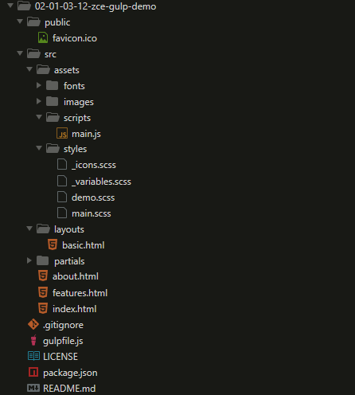
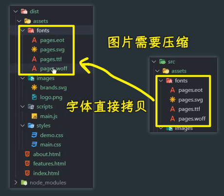
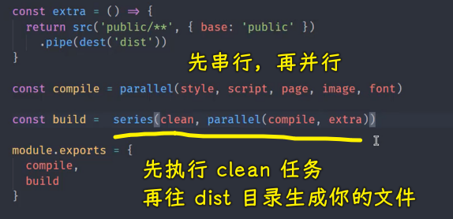

### ✍️ Tangxt ⏳ 2021-10-28 🏷️ 工程化

# 09-Gulp 案例 - 样式编译、Gulp 案例 - 脚本编译、Gulp 案例 - 页面模板编译、Gulp 案例 - 图片和字体文件转换、Gulp 案例 - 其他文件及文件清除、Gulp 案例 - 自动加载插件

## ★Gulp 案例 - 样式编译


接下来，我们就通过一个实际的案例一起去学习一下如何使用 gulp 去完成一个网页应用的自动化构建工作流。

我已经提前在 [github](https://github.com/zce/zce-gulp-demo) 上准备好了一个需要我们完成构建工作的一个网页应用。

先把这样一个基本的结构给它克隆下来，我们通过点击`Clone or download`获取一下咱们当前这个仓库的链接，然后回到命令行当中，我们通过 `git clone` 这个地址

完成过后，我们通过 VS Code 打开这个目录。



这里我们先跟大家介绍一下我之前准备的这个结构的一个大概的设想。

首先在这个里面有一个 `public` 目录 -> `public` 目录里面，就是我们在开发这个网页应用程序当中，那些不需要被加工、直接被拷贝到最终我们生成的那个文件夹的一些文件 -> 这个里面我们默认放了一个`favicon.ico`，也就是我们站点的图标。

然后，除此之外还有一个 `src` 的目录 -> 这个目录顾名思义就是放我们开发阶段所编写的一些代码的 -> 这个目录下所有的文件都会被构建，说白了，它们都会被经过转换再放到我们最终生成的那个目录下面

例如我们的 HTML 文件，我们里面是通过模板的方式去编写的：


它可以去使用一些布局页（`layouts`目录）或者是部分页（`partials`目录）的这种概念。这就是对 HTML 的处理。

除此之外，我们还需要在这个编写样式的时候，通过 sass 的方式去完成网页的样式。

还有就是我们需要在完成网页脚本的时候，通过 ES6 方式去编写网页的脚本 -> 这个也需要在构建的过程当中去自动转换成 ES5 的实现方式。

然后，还有我们网站开发过程当中会用到的一些图片和字体文件 -> 这些文件我们需要它自动的去被压缩 -> 因为我们知道图片当中实际上是有一些二进制的元数据信息，那些信息在我们实际生产环境是没有必要的 -> 这些信息我们都可以通过自动化构建的过程把它删除掉，从而压缩图片的体积。

以上这一些就是我们这样一个网页结构下面 -> 我们对自动化的一些诉求。

有了这些诉求过后，接下来。我们就具体来去做。

首先第一件事，我们先需要在项目当中去安装这个 gulp。

我们打开命令行终端。

在终端当中，我们通过`yarn add gulp`这个模块作为开发依赖安装进来。

有了这样一个模块过后，我们就可以在项目的根目录下去新建一个 `gulpfile.js` 文件，作为我们 gulp 的入口文件 -> 我们需要在这个里面去定义一些构建任务。

刚刚我们所说的所有的构建需求我们都需要在这个文件当中去完成 -> 那我们依次来看这些构建任务如何去实现？

首先我们先在这个`gulpfile.js`里边去定义一个 `style` 任务 -> 这个任务我们先给它定义成一个私有的任务，也就是我们之前说的私有函数 -> 后续我们再通过`module.exports`去选择性的导出哪些函数。

我们让这个 `style` 等于一个普通的函数：

``` js
const style = () => {}
```

在这个函数的过程当中，我们肯定会用到 gulp 所提供的一些 API 所以我们这儿先把它们导入进来：

``` js
const { src, dest } = require('gulp')
```

`dest` 全称应该是 `destination`，也就是目标位置的意思，我们 `require` 一下 gulp 这个模块就能把这两个 API 给导入进来

有了这样两个 API 过后，我们在 `style` 这个方法里面肯定需要去 `return` 一下。 

`src` 它指定的这个文件的路径是`'src/assets/styles/*.scss'` -> 通配符叫`globs`（VS Code 有提示`src`需要什么参数）

``` js
const style = () => {
  return src('src/assets/styles/*.scss')
}
```

接着，我们需要通过这个 `src` 创建的这个读取流去 `pipe` 到我们 `dest` 去帮我们创建一个写入流 -> 这个写入，我们一般会把生成的文件放在一个叫做 `dist` 目录的地方：

``` js
const style = () => {
  return src('src/assets/styles/*.scss').pipe(dest('dist'))
}
```

注意这个`dest`和`dist`，它们俩发音很接近，但是，它们不是一个概念，我们的这个`destination`，它指的是我们目标位置的意思。而 `dist` 它指的是分发、发布，也就是说这个`dist`目录一般是用来发布的 -> 这个`dist`文件夹会在我们网页开发过程当中经常被用到，一般编译过后的结果我们放到 `dist` 当中。

这时候我们保存一下。

需要注意的是，我们的这个 `style` 它是一个私有的任务，并不能直接通过 gulp 去执行。

我们想要去测试它的话，我们需要把它导出出去。

``` js
module.exports = { style }
```

我这儿通过 `module.exports` 的方式去导出一个对象 -> 这个对象当中所有的成员都可以在外界被使用，跟我们用 `exports.xxx` 导出实际上是一样的，它们俩本身就是一个别名。

保存一下

完了过后，我们回到终端当中，我们运行一下 `style` 这个任务：

``` bash
yarn gulp style
```

此时这个 style 任务执行完成过后，我们的项目根目下会多出来一个 `dist` 目录 -> 这个`dist`目录，它里面的这些文件就是我们刚刚在 `src` 下面的关于样式`styles`这个目录下的一些文件。

这需要注意的一个问题是，我们实际上是希望它可以按照 `src` 下面的这样一个目录结构输出，而此时这个`style`任务只是按照我们匹配出来的这些文件的名字，然后直接去放到了`dist`下面 -> 那这个就丢失掉了我们原本的目录结构。

这个问题我们可以通过给`src`函数去指定一个选项参数——`base` -> 也就是在转换的时候这个基准路径是什么 -> 那基准路径是 `src`

``` js
src('src/assets/scripts/*.js', { base: 'src' })
```

这个时候，它就会把 `src/assets/styles/*.scss`的`src`后面这一系列的目录结构`assets/styles/*.scss`给它保留下来

我们再去保存一下，我们重新来去尝试一下这个任务。

``` bash
yarn gulp style
```

此时，我们在 `dist` 下面就会有`assets`下面的 `styles` 然后下面会有对应的样式文件。

那这样的话，我们这个 sass 任务的文件拷贝过程就是正常的了。

但是此时我们还没有加上这个文件的转换。

按照我们之前的了解来讲的话，转换的过程我们需要通过插件提供的一些转换流来实现。

所以说我们还需要再去安装一个插件 -> 这个插件的名字叫做`gulp-sass`，这同样也是开发依赖：

``` bash
yarn add gulp-sass --dev
```

在安装这个`gulp-sass`的时候，它内部会去安装 `node-sass`，而 `node-sass` 是一个 c++ 的模块，所以它内部会有一些对 c++ 它的那个程序集的一个依赖 -> 那这个时候，这些二次进制的包需要去通过国外的一些站点去下载，所以说这有的时候会下载不下来 -> 那你可以通过淘宝的镜像源去单独为这个 `node-sass` 配置一个镜像。

这一块安装完成过后，我们就可以去使用这样一个插件了。

我们把这个插件导入进来：

``` js
const sass = require('gulp-sass')
```

有了这个插件过后，我们在 `src` 和 `dest` 之间需要去 `pipe` 到我们的这个 `sass` 

``` js
const style = () => {
  return src('src/assets/styles/*.scss').pipe(sass()).pipe(dest('dist'))
}
```

基本上，每一个插件它提供的都是一个函数，这个函数的调用结果会返回一个文件的转换流。

那这样的话，我们就可以去实现这个文件的转换过程，我们再回到命令行重新去运行一下这个任务。

``` bash
yarn gulp style
```

此时我们再回到 `dist` 这个目录下面，我们会看到`assets/styles`下面就会有一个`main.css`

但是，之前测试，在`dist`目录下遗留的其他的这些文件`scss`文件，它们默认不会被清空掉，因为目前`style`这个任务在处理的这个过程当中，实际上是以覆盖的方式覆盖进去，而你之前那些文件它不会帮你清空掉 -> 所以，我们后续会加一些清空的任务，自动的去删除这些文件 -> 我们现在先手动去删除一下它们

删除完了过后我们重新去运行一下，这样的话就不会干扰我们的测试效果了

``` bash
yarn gulp style
```

这时候我们会发现在`dist/assets/styles`下面就会有一个`main.css`出现。

可能细心的同学会发现一个问题，我们在通过 `src` 匹配这个文件的读取的时候，它实际上读取到的是三个文件，也就是`main.scss`、`_variables.scss`、`_icons.scss`（`demo.scss`，视频里没有）这三个文件，但是输出过后只有一个文件。

这个原因是因为我们在 sass 这个模块儿工作的时候，它会认为这种**下划线开头**的这些样式文件都是我们在主文件当中依赖的一些文件，那它就不会被转换，会被忽略掉。

所以说，最终只有这种没有下划线开头的 sass 文件会被转换过去

我们也可以在这儿尝试着再给大家添加一个样式文件，如`demo.scss`

这个样式文件里面我们什么都不用做，我们就直接保存一下，然后回到终端这边我们再重新去走。

``` bash
yarn gulp style
```

这时候你就会发现我们在 `style` 当中就会多出来一个`demo.css` -> 这是一个大家可能会产生疑惑的一个小点。

关于这个 sass ，它使用就是这么简单，可能有一个需要大家额外了解一下的一个选项，就是我们在生成的这个样式的代码当中，我们 CSS 的结束的括号，也就是我们这个 CSS 的选择器结束的这个括弧`}`，它默认是出现在了最后一个属性后面。

``` css
.icon-aperture:before {
  content: '\e900'; }
```

对于这种方式，一般我们自己写代码的时候，喜欢把它放在一个空行上面：

``` css
.icon-aperture:before {
  content: '\e900';
}
```

对于这个，我们可以通过单独给这个 sass 指定一个选项`outputStyle`去完成：

``` js
const style = () => {
  return src('src/assets/styles/*.scss').pipe(sass({ outputStyle: 'expanded'})).pipe(dest('dist'))
}
```

`expanded`也就是完全展开的这种形式。

此时，它再去构建的时候，就会按照完全展开的这样一个格式，帮我们生成对应的样式代码 -> 这个是我们样式的编译任务。

除此之外，我们肯定还需要去完成脚本的编译任务和我们 HTML 的编译任务。我们待会来看。

> 老师的讲解是一个渐进式的讲解过程，从一个简单代码，逐步转变成较为复杂的代码！ -> 推动前进的是「这样做有什么问题、有什么不足」

## ★Gulp 案例 - 脚本编译


有了样式的编译任务过后，我们接下来需要去完成一下脚本文件的 ES6 的编译。

在`gulpfile.js`里边，我们再去添加一个新的任务，叫做 `script` -> 让它等于一个函数

同样，在这个函数当中，我们 `return` 一下 `src`，然后去定位我们所有脚本文件的位置 -> 这个脚本文件应该是在 `src` 下面的 `scripts` 当中

同样，我们也需要去指定一下这个 `base` 选项，也就是我们拷贝的时候那个基准路径是 `src` -> 这样就保留了我们的原始的目录结构

然后我们去 `pipe` 到 `dist` 目录。

有了这样一个操作过后，我们这个任务`script`，它默认只是把所有的`js`文件给它拷贝过去

所以，这中间我们肯定还是需要去加一个转换流的插件 -> 这个插件我们需要单独去安装一下。

我们通过 `yarn add gulp-babel --dev `去安装这个插件。

有了这个模块过后，同样我们也需要去载入一下这个模块，这个模块就是一个 gulp 的插件而已。

我们回到`script`任务里边，在`dist`之前，我们先 `pipe` 到 babel 插件当中。

保存一下。

这个时候我们再回到命令行当中，想要去执行这个任务，我们先需要去把这个任务给它导出出去，我们先在`module.exports`这儿临时的去导出一下。


为什么说现在我们是临时的导出呢？ -> 因为这些任务后面我们会通过 `series` 和 `parallel` 这两个方法去变成一些组合的任务，他们不会单独的去执行 -> 所以我们这儿就把他们先定义成私有的任务，我们临时导出，只是为了测试而已。

我们运行一下这个`script`任务：

``` bash
yarn gulp script
```

这时候它会报出一个错误：


这个错误提示的信息叫做 `Cannot find module @babel/core`，也就说是找不到`@babel/core`模块 -> 这个跟我们之前使用 Grunt 的时候遇到的问题是一样的，因为你在`pipe(babel())`这里用的是 babel 去转换，而 babel 这个插件它只是帮你去唤醒`@babel/core`这个模块当中的转换过程，它没有像刚刚这个`gulp-sass`这样，自动去帮你安装 `node-sass` 那个核心转换模块

总之，`pipe(babel())`这个地方的转换模块需要你自己手动的去装

我们单独去安装一下这个模块：

``` bash
yarn add @babel/core @babel/preset-env --dev
```

对了，我们还需要去安装一个`preset-env`模块，`env`这个模块它默认会把你这些 ECMAScript 全部的一些新特性都会给你做一些转换。

这个时候我们就可以回到 babel 的配置当中去添加这样一个 `preset` 的配置。我们可以`babel({})`这添加一个选项，这个选项里面有一个 `presets` 属性 -> 它是一个数组，我们默认给入一个`'@babel/preset-env'`


保存一下，我们再回到代码命令行当中，我们再重新运行一下这个任务。

此时我们在这个`dist/assets/scripts`目录当中就可以看到被转换完过后的一个脚本代码了。


对了，你可能会遇到这样一个问题 -> 如果你忘记去传这个 `preset` 的话，那就会导致一个转换没有效果的这样一个感觉出现，我们再来试一下 -> 这是大家日常经常会遇到的一些问题。

我们再去看导出的文件。


这个文件里面，它其实跟原本的这个文件几乎是一模一样，没有做任何的改动。

原因是因为我们 babel 它默认只是一个 ECMAScript 的一个转换平台。

我们要知道平台实际上是不做任何事情的，它只是提供一个环境 -> 具体去做转换的，实际上是 babel 里面、它内部的一些插件。而 `preset` 就是一些插件的集合。

你比如我们刚刚用到的这个 `preset-env` -> 它实际上就是最新的一些所有特性的一个整体的打包 -> 我们使用它的话，就会把所有的特性全部做转换，你也可以根据你的需要去安装对应的那个 babel 转换插件 -> 然后在`presets`选项这个地方指定 babel 对应的那个插件就好了，这样的话，它只会转换对应的特性

这个是一个小特点，需要大家注意一下。

对了，一般我们对于 babel 的配置，有时候我们会单独添加一个`babelrc`的文件去配置 -> 这个也是可以的。

我们这儿只是把它写在了代码里面，没有什么区别。

以上就是关于脚本的编译任务。

## ★Gulp 案例 - 页面模板编译


接下来我们再来看一下我们项目当中模板文件的编译。

模板文件也就是 `html` 文件。在这些 `html` 文件当中，我们为了可以让页面当中重用的一些地方被抽象出来 -> 我们使用了模板引擎

这里使用的模板引擎叫做「swig」 

我们可以单独去安装一下 `swig` 这个转换插件

``` bash
yarn add gulp-swig --dev
```

这个插件过后，我们就可以在我们的代码当中去载入这个插件。

``` js
const swig = require('gulp-swig')
```

完了过后，我们去创建一个页面，编译的任务叫做 `page`

这个`page`任务里面同样通过`return`的方式去 `return` `src`函数找到的这个文件的读取流`src/*.html`

这里需要注意一个小点，如果说你的 HTML 结构，不是只是在这个 `src` 目录下 -> 有可能有一些子文件夹里面也有 `html` 的话，那你可能需要使用`**`，也就是两个星号 -> `src/**/*.html` -> 这代表我们 `src` 下面任意子目录下的 `html` 文件 -> 这是一种子目录的通配方式

我们这里只是要求必须把所有的 `html` 全部放在 `src` 这个根目录下 -> 因为你在这个`src`目录下的其他目录下的文件有可能是一些部分文件（`partials`）或者是布局页（`layouts`） -> 所以我们为了不干扰，我们就要求所有的 `html` 都放在根目录下面 -> 所以我们还是维持`src/*.html`这样

对了，同样，我们也可以去给它设置一下 `base`  -> 其实这里的 `base` 设置就没有意义了，因为我们这个通配符所在的位置就是我们的 `src` 目录 -> 但是，为了保证统一，我们就都设置一下`base` 

完了过后，我们点 `pipe` -> 这个时候我们就直接 `pipe` 到 `swig` 这一个模板引擎的转换插件当中 -> 最后再去 `pipe` 到 `dest` 所创建的生成流当中。


保存一下。

我们此时同样把这个私有的任务给它导出一下，我们回到命令行当中去使用一下这个任务。

``` bash
yarn gulp page
```

此时这个任务转换完成过后，我们三个 HTML 文件就会分别被转换到我们的目标目录。而且这三个 HTML 文件里面 -> 我们之前的模板页和部分页它都已经正常工作了（把模板都替换成正常的内容了）。


但是有一个小点，那就是我们在这个`src/index.html`里面 -> 原来的这个模板它还用到了一些数据标记。


这些数据标记实际上就是把我们在网页开发过程当中那些有可能会发生变化的地方，比如说网站的名字或者是网站当中的一些数据信息 -> 我们把它提取成了一些数据 -> 这些数据我们需要在模板引擎工作的时候，通过选项去指定。

我提前准备好了一个数据：

``` js
const data = {
  menus: [
    {
      name: 'Home',
      icon: 'aperture',
      link: 'index.html'
    },
    {
      name: 'Features',
      link: 'features.html'
    },
    {
      name: 'About',
      link: 'about.html'
    },
    {
      name: 'Contact',
      link: '#',
      children: [
        {
          name: 'Twitter',
          link: 'https://twitter.com/w_zce'
        },
        {
          name: 'About',
          link: 'https://weibo.com/zceme'
        },
        {
          name: 'divider'
        },
        {
          name: 'About',
          link: 'https://github.com/zce'
        }
      ]
    }
  ],
  pkg: require('./package.json'),
  date: new Date()
}
```

我把它拷贝到`gulpfile.js`里边来，我们粘贴在一开始的位置。


这个里面的结构也非常简单，就三个属性，一个是 `menus`，一个是 `pkg`，一个是 `date` 

你可以放任意的数据在里面 -> 你放的数据都可以在我们的模板当中去使用 -> 这也就是根据你「在开发这个 HTML 页面的时候」的一个需要去决定

有了这个 `data` 过后，我们就可以通过 `swig` 的 `data` 参数去传递进去 -> 由于属性和变量名都叫`data`，所以我们可以简写成`swig({ data })`


我们再去运行一下这个`page`任务：

``` bash
yarn gulp page
```

此时我们再去看我们转化完的这个结果：


你会发现我们的页面的名字还有一些其他的信息就会自动的呈现到我们最终生成的这个 HTML 当中。

那这样的话，它就把我们在网页当中经常写死的一些数据提取出来，然后我们可以在代码当中去配置。

当然，你还可以去单独写一个`json`文件，通过代码把这个`json`文件载入进来 -> 通过这种方式去配置网页当中的一些数据 -> 这样做可能会更合理一些。

我们这里的`data`只是用一个对象去模拟了，当然，这效果是一样的

以上就是我们的页面的转换任务。

有了这三个任务过后，我们 `src` 目录下面主体需要去转换，或者说我们叫编译的这一些事情都已经完成了。

接下来我们就去创建一个组合任务，把他们三者全部组合在一块 -> 因为这三个任务，他们一旦要去运行的话，我们不可能单独去运行某一个，一般都是同时去运行 -> 所以说我们单独去创建一个叫 `compile` 的任务，即叫做编译的任务。

这个任务它是组合任务，我们可以借助于 gulp 提供的 `series` 和 `parallel` 这两个 API 去创建。

问题来了，我们这儿具体使用 `series` 还是 `parallel` 呢？

这很简单，因为你这三个任务他们相互之间没有任何的牵连。所以我们可以让这三个任务同时开始执行，这样的话可以提高我们构建的效率。

所以我们这里应该使用的是 `parallel` 。

有了这个 `parallel` 过后，我们就可以在这个创建 `compile` 的时候，去把我们的三个任务都给它传入进去。

``` js
const compile = parallel(style, script, page)
```


保存一下。

此时我们就不需要去导出这三个任务了，我们只需要去导出一个 `compile` 任务。

这个 `compile` 任务，我们去尝试执行一下。

只不过在执行之前，我们得先把`dist`目录给删除掉。

这个时候我们再去运行一下：

``` bash
yarn gulp compile
```


此时`dist`目录下面，我们的 HTML 文件，我们的样式文件，还有我们的脚本文件都有正常的一个工作。

那这样的话，我们这个编译的任务就算是有一个小结了，然后往后呢？肯定还有一些其他的特性需要拿进来，然后我们再接着去看。

## ★Gulp 案例 - 图片和字体文件转换


除了样式文件、脚本文件，还有我们页面文件的编译以外，我们还需要去处理一下字体文件以及我们的图片文件。

这个时候，我们需要单独再去添加两个任务，分别是我们的：

图片转换`image` -> 在这个图片转换的过程，我们需要把图片全部读取出来，然后借助一个插件去完成压缩：

``` js
const image = () => {
  return src('src/assets/images/**', { })
}
```

用两个星号通配一下`images`下面所有的文件。

通配完了过后，我们还需要去指定一下这个 `base` 目录，也就是基准目录 -> 也是`src`

完成过后，我们通过 `pipe` 的方式去 `pipe` 到一个插件当中 -> 这个插件是 `imagemin`

我们需要去安装一下它：

``` bash
yarn add gulp-imagemin --dev
```

同样需要注意的是`gulp-imagemin`，它内部依赖的这个模块儿，也是一些通过 c++ 完成的模块儿 -> 只要是通过 c++ 完成的模块儿，就会涉及到需要去下载那个二进制的程序集 -> 这个程序集在下载的时候，大部分都是在 github 上去下载的，而国内去下载 github 上的一些资源会相对来讲容易出一些问题 -> 这个是没有办法配置镜像的，你只能通过一些其他的方法去解决

所以这个安装过程会比较久，我们这里需要稍微等待一下它的安装

安装完成过后，我们就可以使用这个 `imagemin` 这个插件了。

回到`gulpfile.js` -> 导入一下 `imagemin` 这个插件：

``` js
const imagemin = require('gulp-imagemin')
```

有了`imagemin`这个插件过后 -> 回到`image`这个任务里边 -> `src`在 `pipe` 的时候就会`pipe` 到 `imagemin` 上面，然后再去 `pipe` 到 `dest` 目录下面


保存一下。

此时这个 `image` 任务就 OK 了

我们同样把它导出出去。然后我们再来去测试一下这个任务。

``` bash
yarn gulp image
```


这个时候你会发现这个图片的 `imagemin` ，它会自动的去压缩这两个图片，而且会告诉你这个压缩压缩的比例是多少，压缩了 `26.7%` -> 设想一下，如果你网页当中图片的总体积是`100M`的话，那就相当于减少了 `26M` -> 这个压缩体积还是非常大的。

我们去看一下压缩出来的这两个图片 -> 图片它是无损的压缩，也就是说你看到的这个图片结果是不会受影响的，只是删除了一些元数据的信息。


然后像 SVG 这种，它就做了一个代码的格式化而已（也就是去掉空格之类的）


以上这个就是图片的压缩。

处理完图片压缩之后，我们还需要去处理一下这个字体文件。

字体文件其实没有什么额外需要处理的东西，就是把它拷贝过去就好了。

但是我们在字体文件当中也会遇到 SVG，所以说我们同样也可以使用 `imagemin` 去处理一下每一个字体文件 -> 对于那些不能被压缩的文件，`imagemin` 它是不会去处理的。


我们这儿直接把 `image` 改成 `font`，然后保存一下，这样的话这个 `font` 任务也就 OK 了。

我们回过来再来去运行一下 `font` 这个任务。

``` bash
yarn gulp font
```


这个时候你会发现它只压缩了一张图片，原因是因为其他的这些格式它是不支持压缩的。



这个时候我们可以看到我们的字体文件同样被拷贝过去了 -> 这样的话我们 `src` 下面所有的文件就都被拷贝进去了

我们可以把这个 `src` 下面所有的操作的都放到 `compile` 这个任务当中，我们回到这个`gulpfile.js`当中，把`image`和`font`任务放到`parallel`里边：


那这样的话，我们这个 `compile` 任务基本上就算是完整了。

## ★Gulp 案例 - 其他文件及文件清除


`src` 这个目录下的文件都已经处理完了过后，接下来我们再去把 `public` 这个目录当中的文件再去做一个拷贝。

在`gulpfile.js`里边，我们再去添加一个额外的任务，这个任务就叫做 `extra`  -> `extra`指的就是额外的一些文件。

对于这些文件，我们就直接通过拷贝的方式拷贝过去就可以了 -> `src`然后我们应该是 `public` 下面所有的文件`public/**` -> 这个时候我们的 `base` 就应该是 `public` 的目录，我们把它 `pipe` 到 `dist` 的目录下面。


这个`extra`任务它是一个额外拷贝的任务，其实你也可以把它放到 `compile` 这个任务当中。

但是我个人觉得，`compile` 这个任务它的定义就是把 `src` 下面的文件做一些转换。如果你要放进去的话，那我们后续去执行 `compile` 的时候，你就会有一些混淆 -> 这可能就不太合适了。

所以说我们在`gulpfile.js`里边，再单独去添加一个新的任务，这个任务叫做 `build` -> 我们通过`parallel`来搞 -> 因为它也可以同时去执行`compile`和`extra` -> 这就相当于在组合的基础之上又组合了一次，以此来同时执行这个 `compile` 和 `extra` 


那这样的话，我们在后续去使用的时候，就可以使用 `build` 去完成所有文件的一个构了 -> `compile` 只是完成 `src` 下面的一些需要编译的文件然后去做一些转换。

那这样的话，我们直接导出一个 `build`就好了，当然，如果你要想在外面使用 `compile` 的话，你也可以把 `compile` 再导出出去。

这个时候我们尝试着使用一下`build`。

``` bash
yarn gulp build
```


那这样的话，我们站点当中一些需要我们构建的文件基本上就已经完成了。

---

除此之外，我们还需要去做一些开发体验上的增强。

例如我们需要去集成一个 web 服务器进来，让我们可以有一个开发测试的服务器。

在做这个测试服务器之前，我们先做一个小操作，那就是自动的去清除这个 `dist` 的目录下的文件。

我们再去安装一个模块 -> 注意，这个模块它不是 gulp 的插件，只不过在 gulp 当中可以使用

``` bash
yarn add del --dev
```

`del`也就是 `delete` 的一个简写

为什么说这个模块儿在 gulp 当中可以去使用呢？

因为我们之前使用 gulp 定义任务的时候，我们会发现 gulp 的任务并不一定说必须要通过 `src` 去找文件流，然后最终 `pipe` 到 `dist` 当中，它不一定是这样的，我们也可以通过自己写代码去实现这个构建过程。

例如我们这个`del`模块，它就可以自动去帮我们删除指定的那些文件，而且它是一个 `promise` 方法 -> gulp 的任务，它是支持 `promise` 这种模式的

所以说我们可以在`gulpfile`文件上面去定一个 `clean` 任务 -> 这个任务就不再是 `return` 一个什么 `src` 什么东西了


我们 `return` 的是 `del` 这个模块。

当然，我们需要先导入一下这个模块。由于这个模块不是 gulp 的插件，所以我们单独在前面去导出（写得工整一点）：


有了这个插件过后，我们就可以通过`del`然后指定一个数组 -> 这个数组就可以去放任意的文件路径 -> 我们这要放的就是 `dist` 目录。

那这个时候这个 `del` 方法（我们叫 `delete` 的方法），它返回的是一个 `promise`，既然它返回的是一个 `promise` 的话，那也就意味着我们在 `clean` 这个任务 `delete` 完成过后，它可以去标记这个`clean`任务执行完成。

所以`clean`任务应该放在什么位置呢？

它肯定应该放在我们 `build`之前。所以我们可以这样 -> 给这个 `build` 任务再去包装一下。

我们在`gulpfile`的开头把 `series` 从`gulp`里边拿进来：

``` js
const { src, dest, parallel, series } = require('gulp')
```

因为这个`clean`任务就不能再去跟我们的其他任务同时执行了 -> 因为它需要先删除这个`dist`目录下的文件，然后你再去生成你的文件 -> 否则的话，你要是同时执行，就会出现你生成的文件被删除的情况。

所以我们是用 `series` 去创建一个组合任务。



第一个任务是 `clean`，后续你可以去通过 `parallel` 执行 `compile` 和 `extra` 这两个任务。

那这样的话我们的 `build` 就是先去 `clean`

``` bash
yarn gulp build
```


在这个控制台当中打印的日志，我们能看到这样一个效果。我们在启动`build` 过后，我们就会去启动这个 `clean`，但是一直到 `clean` 结束过后才会去启动一些其他的任务，而这些任务基本上都是同时启动的

以上这个就是我们额外添加的两个小操作。

## ★Gulp 案例 - 自动加载插件

