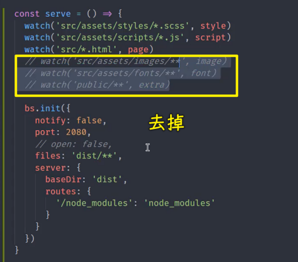

### ✍️ Tangxt ⏳ 2021-10-29 🏷️ 工程化

# 10-Gulp 案例 - 开发服务器、Gulp 案例 - 监视变化以及构建优化、Gulp 案例 - useref 文件引用处理

## ★Gulp 案例 - 开发服务器


除了对文件的构建操作以外，我们这里还需要一个开发服务器，用于在开发阶段去调试我们的应用。

我们可以通过 gulp 去启动并且管理这个开发服务器。那这样的话，我们就可以在后续去配合我们其他的一些构建任务去实现「在代码修改过后自动去编译，并且自动去刷新浏览器页面」 -> 这样就会大大提高我们在开发阶段的效率，因为它会减少我们在开发阶段的重复操作。

我们具体来看怎么样去操作。

首先我们先去安装一个叫做 `browser-sync` 的一个模块：

``` bash
yarn add browser-sync --dev
```

这个`browser-sync`模块它会提供给我们一个开发服务器 -> 相对于我们普通使用 express 创建的 web 服务器来说的话，`browser-sync` 它有更强大的一些功能 -> 它支持我们在代码修改了过后，自动热更新到浏览器当中，让我们可以及时看到最新的页面效果。

有了这个模块过后，我们在 gulp 当中需要去使用一下这个模块儿。

它并不是一个 gulp 的插件，只不过我们是通过 gulp 去管理它而已。所以我们需要单独去引入一下这个模块儿。

``` js
const browserSync = require('browser-sync')
```

这个模块它提供了一个 `create` 方法，用于去创建一个服务器。

我们定义一个 `bs` 变量：

``` js
const bs = browserSync.create()
```

`create`方法它会自动去创建一个开发服务器。我们将这个开发服务器单独定义到一个任务当中去启动。

我们这定义一个 `serve` 任务。

在这个任务当中，我们通过 `bs` 的 `init` 方法去初始化一下我们这个 web 服务器的一些相关配置 -> 这个里面最核心的一个配置就是 `server` -> `server` 当中需要去指定一下我们网站的根目录，也就是我们 web 服务器它需要帮你把哪个目录作为网站的根目录

我们这通过 `baseDir` 去设置 -> 网页的根目录肯定就是 `dist` 这个目录 -> 因为 `src` 下面是未经过加工的代码，我们会把加工过后的结果放在 dist 当中 -> 浏览器当中运行的肯定是加工过后的结果。所以 baseDir 的值是 dist 

那这样的话，我们这个`browser-sync`最基础的操作就完成了。


我们把这个 `serve` 命令给它导出出去然后测试：

``` bash
yarn gulp serve
```

gulp 会自动启动 `serve` 这个任务。

在启动这个任务的时候，这个任务会自动的去唤醒浏览器，打开对应的链接。然后看到最终呈现的效果：


只不过这个呈现的效果有点差强人意。

这原因很简单，我们回到代码当中，因为在我们的这个编译的过程当中，我们并没有去处理这个 `node_modules` 下面的这些模块的一个拷贝，我们只是把我们自己写的源代码做了一些编译以及一些文件的拷贝。


所以，我们的`dist`目录下面是没有 `node_modules` 这些东西的。而 `node_modules` 它是我们项目根目录下的一些文件。

目前我们先不用着急，对于这个`bootstrap.css`文件的处理，我们之后会单独再去考虑。

我们现在要做的是在开发阶段能够让他们正常工作。

当然，我们有一个小办法，就是给这个`browser-sync`再单独加一个特殊的路由，让它对于这种`/node_modules`开头的这种网页请求，我们都给它指到同一个目录下面去。

这具体的指令方式我们就通过 `routes` 去指定。`routes`这个对象里面是会优先于我们 `baseDir` 的一个配置，也就是说一旦当我们的一个请求发生了过后，它会先去看在 `routes` 里面有没有对应的配位置，如果有话会先走`routes`里面的配置，否则的话，就会找 `baseDir` 下面对应的文件。

我们给`routes`这个对象要配置的键就是我们请求的那个前缀`/node_modules`


然后，我们要把它指到一个目录下面，那就是`'node_modules'` -> 这是一个相对路径，相对的是项目根目录下面的`node_modules`

这样一来，我们再去重新启动一下这个`serve`

``` bash
yarn gulp serve
```

此时我们针对于`bootstrap`这些库文件的请求，它就会自动映射到我们项目下面的`node_modules`


至此，我们这个 web 服务器就可以正常工作了

不过，这样还不行，我们还可以再跟大家介绍一些其他的小选项。

对于这个 `bs` 的 `init` ，它还可以去指定一些其他的选项。比如说 `notify`

那这个 `notify` 的作用是什么呢？因为我们刚刚在启动`serve`的一瞬间，你会发现网页这个右上角会有一个提示 -> 提示我们 `browser-sync` 是否已经连接上。

这个连接小提示有可能会影响我们在页面当中去调试一些样式 -> 所以，我们可以把这个 「notify」 给它关掉，我们可以通过 `notify` 设置为 `false`


这样一来，我们再去启动这个 web 服务器，以及后续我们去页面重新刷新的时候，它就不会再弹出这样一个提示了 -> 这个可以单独去了解一下。

除此之外，我们还可以去设置一下 `port` -> 也就是我们这个 `browser-sync` 的一个端口 -> 默认它启动端口是 `3000` -> 我们给它改成 `2080`，那这样话你再去启动的时候，它就会使用`2080` 这个端口

以上这两个是我们在使用 `browser-sync` 的时候比较常见的两个小选项，大家可以去了解一下。

然后，如果说还有一个选项的话，可能就要说到那个 `open` 了，因为我们 `browser-sync` 启动的时候，它会自动去帮你打开浏览器，而这个操作如果你觉得不是特别好的话，你可以把这个 `open` 设置为 `false`，那这样的话它就会取消这样一个小特性 -> 这个可以根据自己的情况去决定。 

现在有了这个`browser-sync`过后，接下来我们重点想考虑的肯定就是希望我们在修改完代码过后，可以去自动在浏览器当中看到最新的呈现效果。

现在我们去修改肯定是没有任何意义的，因为我们的修改，修改的是源代码儿，而源代码还需要经过编译，编译过后的结果才到 `dist` 目录下面 -> `dist` 下面再发生修改的话，`browser-sync`才有可能被监听到

所以我们这儿先不着急考虑源代码修改然后那个浏览器刷新，我们可以先考虑一下我们在 `dist` 下面的文件发生变化过后，我们怎么样让浏览器及时的更新过来。

在`serve`里边，我们可以给 `bs` 的 `init` 方法再去指定一个参数——`files`


这个参数它可以指定一个字符串 -> 这个字符串就是用来被 `browser-sync` 启动过后监听的一个路径通配符 -> 你想要哪些文件发生改变过后，这个 `browser-sync` 自动去更新浏览器，那你就可以在这通过通配符的方式去指定。

我们这儿指定的应该是 `dist` 下面的所有文件

保存一下，我们重新启动一下这个任务。

``` bash
yarn gulp serve
```

启动过后我们可以再回到 VS Code 当中。

注意，这个时候我们不是修改 `src` 下面的文件，因为 `src` 修改过后需要编译 -> 对于这个操作，我们还没有处理 -> 我们这里只是去修改这个 `dist` 下面的文件。

我们打开`dist`目录下的一个 HTML 文件（`index.html`） -> 对它做一个修改的测试 -> 比如我们找到这个页面上的一个标题部分，我们给它随便加上一些内容然后保存一下


此时你会发现页面上的内容已经更新过来了，这也就意味着我们此时 `dist` 下面的文件确实已经被监听了 -> 一旦当`index.html`这个文件发生变化过后，就可以同步到浏览器当中 -> 这对于样式来讲，这也是一样的。


> 似乎咩有刷新页面，页面状态还是存在的！ -> 修改样式不会刷新页面！

比如我们把这个`jumbotron`选择器的颜背景颜色改为`#ff0`，也就是黄色的颜色 -> 可以看到颜色也可以同步过去 -> 这样也就意味着 `browser-sync` 的这个同步没有任何问题。

那没有任何问题过后，下一步我们就要去考虑怎么样在修改 `src` 过后，`dist`目录就可以自动的去更新。

对于这个，其实我们要做的事情很简单，就是监视 `src` 下面文件的变化。一旦当它变化了过后，我们不是直接去刷新到浏览器，而是先去重新执行一下我们的构建任务 -> 这个我们再单独来看。

## ★Gulp 案例 - 监视变化以及构建优化


有了这个开发服务器过后，接下来我们重点要考虑的就是如何在 `src` 下面的源代码修改过后自动的去编译。

这个过程我们需要借助于 gulp 提供的另外一个 API——`watch`

`watch` 这个 API ，它会自动监视一个文件路径的通配符，然后根据这些文件的变化决定是否要重新去执行某一个任务。

``` js
const { src, dest, parallel, series, watch } = require('gulp')
```

我们把这个 `watch` 解构出来过后，我们可以在 `serve` 命令开始的时候，我们去监视一些文件。

这个 `watch` 它的调用方式是指定两个参数：

第一个参数就是 `globs` ，也就是我们的通配符 -> 我们这要监视的实际上就是我们之前所有产生构建任务的这些路径。

这依次来看：


首先第一个是 `sass` 文件的路径 -> `sass` 文件修改过后，我们要执行的是 `style` 这个任务 -> 任务的指定方式就是直接去指定这个任务函数就可以了 -> 这是第一个针对于样式文件的监视

我们再加上对于脚本文件、对于页面文件、对于图片、字体还有一些额外的文件 -> 每一个文件的路径我们都可以从原先的任务函数里边复制过来

第二个就是 `script` 这个任务

同理，其它的`src`下的任务以及`public`下的任务也是这样写

这几个文件修改过后，它就会执行相应的这些任务 -> 这些任务一旦触发了过后，就会把对应`dist`下面的文件给覆盖掉 -> 文件一旦覆盖掉过后，这个 `browser-sync` 它就会监视到 `dist` 里面的文件的变化，它会自动去同步到浏览器 -> 这样就可以实现我们一开始所设想的源代码修改过后自动编译到 `dist` 当中，然后再去同步到浏览器 -> 这个就是我们的一个设想

我们回来再来测试一下。

``` bash
yarn gulp serve
```

把 VS Code 放到屏幕的右侧，然后再把这个浏览器放到屏幕的左侧，这样的话会有一个对比，可以更明显一点。

此时我们尝试着去修改一下源代码。当然了，在修改源代码之前其实已经暴露出来一个小问题了。我们再去运行这个 `serve` 命令之前，其实应该先去执行一下 `build` -> 因为如果`serve`之前还没有先去执行一下那个 `build` 的话，那`dist` 可能还没有生成，那这样的话你启动`serve`可能会出问题。

以说我们在后面肯定也会把 `serve` 任务放到一个组合任务当中 -> 这个我们待会再来看。

我们现在重点来尝试一下这个源代码的修改有没有生效。

比如说我们修改一下这个 HTML 文件 -> 修改一下页头的标题，保存一下。


这时候你会发现确实可以生效。因为我们这个 HTML 文件修改过后，它会自动同步到 `dist` ，然后再同步到浏览器当中。那这样的话，这个 HTML 的修改是没有任何问题的

我们再尝试着修改一下样式。样式的话我们通过在变量里面去修改这个背景颜色 -> `#fff` -> `#f00`（白色 -> 红色）


> 不会刷新页面

可以看到，样式的修改也没有任何的问题 -> 这个也就意味着我们刚刚的那样一个设想已经可以正常工作了 -> 也就是文件修改过后自动编译，然后自动同步到浏览器。

这个`watch`操作基本上 OK 了，然后我们再回到代码当中。

关于`watch`这一块我们再跟大家介绍一个更常见的用法，因为现在对于像上面这些`sass` 文件，还有 `js` 文件，还有`html`文件，他们的这个编译实际上是有意义的 -> 但对于这个图片和字体，还有一些额外文件，它们的编译怎么说呢？不能说没有意义，只是在开发阶段实际上没有太大的意义。

为什么这样说？

因为图片包括字体，我们只是对它做了一个压缩 -> 压缩，我们之前已经介绍到了，它们是一个无损压缩，它并不影响最终在页面当中的一个呈现。

这也就意味着什么呢？意味着你在开发阶段去监视更多的文件去做更多的任务，你的开销也就会更大。而这个开销实际上对你开发阶段是没有意义的。**你只是在发布之前、上线之前希望通过压缩一下能够减小一下上线文件的体积 -> 从而提高你网站运行的一个效率**。

但是你如果现在开发阶段这么搞的话，它会降低你开发阶段的构建的效率。

所以说我们一般不会这么去做。

那具体的做法我们一般会这样去考虑 -> 怎么考虑呢？

我们在启动这个 web 服务器的时候，我们为`baseDir`去指定两个目录，一个是 `dist` 的目录，一个是 `src` 目录 -> 启动 `src` 目录的目的就是对于像图片也好、字体也好、还有像 `public` 这些，我们把它们就直接放在原位置，不让他们参与我们这次的构建，它只是在最终发布上线之前去做一下构建就可以了。

这具体怎么才操作呢？ -> 我们这一边操作，一边跟大家再来解释

我们先把这三个监视任务给他去掉：



然后我们给`baseDir`去指定为一个数组 -> 它支持一个数组 -> 它一旦指定为数组的话，它就是一个什么样的特点呢？ -> 当你一个请求过来过后，它会先到数组当中第一个目录去找，如果找不到这个文件的话，它就会依次往后去找


所以我们这儿再去指定一下 `src`，当然，你还需要去指令一下 `public` 目录。

为什么要这样搞来，我们一步步看就可以了。

这个时候你这样去想，当我们一个请求过来，如果说是 HTML 文件，那 HTML 文件我们肯定是需要编译的，因为你如果请求 `src` 下面的 HTML 它是有问题的，因为它里面是模板，对吧！ -> `dist` 下面才是最终生成的。所以说 HTML 没有问题。然后 `css` 和 `js` 也是一样的，它都必须要请求 `dist`下面。

但是一旦请求图片的话，其实你请求 `dist`下面的这个图片文件跟请求 `src` 下面的文件对于开发阶段来讲的话没有区别，因为他们只是压缩了一下，图片也没有质量上的一个变化。

所以我们这里就让它去请求到原文件。那这样的话，我们在开发阶段就减少了一次构建过程。

所以说我们这样把 `src` 放进来，那同理 `public` 也是相同道理，`public` 里面的文件只是拷贝过去，它没有任何的意义，所以说，这样的话，我们就可以提高一部分的构建效率。

我们回到我们的这个任务当中。

当然了，对于`image、font、extra`这一些文件发生变化过后，你肯定也需要同步到浏览器，但这个的话我们再单独说

现在我们去启动一下这个`serve`任务。

不过，我们在启动之前，我们先去`clean`一下，`clean`这个任务我们单独给它暴露出来一下 -> 把 `dist` 这个目录给它清空掉。（`dist`目录也会被清掉）

``` bash
yarn gulp clean
```

这个时候你再去启动 `serve` 就会遇到我们刚刚说的那个问题：

``` bash
yarn gulp serve
```

因为 `serve` 之前你必须要先去把 `src` 下面的这些`html、css、js`去给它们做一个编译操作。

所以我们`gulpfile`里边可以再单独地去加一个组合任务 -> 我们这个组合任务就叫做 `develop` -> 即开发的一个任务。

这个任务它必须要按顺序去执行 -> 这先去执行什么呢？ 

先去执行 `compile`，`compile`完了过后，我们就去执行一下这个 `serve` -> 因为一旦 `compile` 了过后，我们的这个样式文件、脚本文件、页面文件都已经转换过去了 -> 转换过去了过后，我们再去启动 `serve` 就不会有问题了。

但对于图片和字体这些，我们其实就应该从这个 `compile` 任务里面给它拿掉了，因为我们不需要在开发阶段去构建他们


我们把这几个任务给拿出来 -> 放到哪呢？

放到这个 `build` 任务当中的`parallel`里边。

这个 `build` 任务我们可以理解成就是上线之前执行的任务。而 `compile` 任务它在上线之前也会用到，只不过它是一个子任务 -> 在开发阶段我们主要就用 `compile` 就可以了。因为这样的话，就会帮我们把那些在 `src` 下面没有办法直接在浏览器工作的文件做一个编译。

我们这个 `develop` ，它启动的时候先编译样式、脚本和页面，然后`dist`目录下有了编译完的文件过后，我们就启动 `serve`

启动 `serve`，我们看一下这个效果。

注意这个`develop`，我们要暴露出去 -> 把这`serve`去掉


所以这实际启动的是`develop`

``` bash
yarn gulp develop
```

此时不要着急去看页面的效果，我们回到这个代码当中，我们来看 `dist` 下面的文件，那 `dist` 下面的 `html` 是有的，然后，样式文件也是有的，脚本文件也是有的，唯独就是图片跟字体文件是不存在的，但是这个并不影响我们在页面当中的呈现。


例如我们在这个页面上的一些图标，还有我们的图片。


可以看到，这些图片、图标也都是可以正常工作的。

这原因都很简单，因为当图片这个请求过来，它请求找 `dist` 下面的文件 -> 找不到 -> 找不到的话就会找 `src` 下面的文件 -> 如果还找不到的话，就找 `public` 了。

例如像我们的`favicon.ico`它就会自动找 `public` 下面的

所以这样做并不影响我们在开发阶段的一个工作。

至此，我们这个 `develop` 任务，它其实就以一个最小的代价去把我们的这个应用给它跑起来了。

然后你在上线之前再去执行 `build`，就以最大模型的方式把所有的任务全部执行一下，因为每个任务对于上线之前都是有价值的，我们这里去做`develop`这样一个操作，只是对于它在开发阶段的构建过程做了一个优化。

以上，就是关于这个监视文件以及文件的这个变化过后然后更新浏览器 -> 主要的内容就是这些了。

当然，这还有一个需要补充的地方，那就是我们在 `src` 下的这些图片、字体，还有 `public` 下面的这些文件变化过后，我们也希望能够更新一下浏览器。

所以我们可以怎么搞呢？


> `watch`监视多个路径下的文件 -> 它们都是为了执行`reload`这个任务，而像`js/css`都是单对单的，即一个处理对应一个不同的任务

我们可以通过一个 `watch`，注意，这个时候我们就不是去进行构建，**我们减少的是构建的次数** -> 这个过程我们可以指定一个数组 -> 这个数组就是把这三个路径全部给它监视下去。

由于这三种文件发生变化过后，我们要做的事情是一样的 -> 这三种文件发生变化过后，我们只需要去调用一下这个 `browser-sync` 模块提供的 `reload` 方法就可以了 -> 这个 `reload` 你也可以把它理解成一个任务 -> 因为在 gulp 当中，**一个任务就是一个函数**。所以我们给`watch`传一个函数进去是没有任何问题的

这样一来，这些文件发生变化过后，`bs.reload`会自动更新浏览器，那浏览器会重新发起对这个文件的请求，这样就可以拿到最新的这个文件了。

所以这种情况的话就是我们一个比较理想的状态。

对于文件，对于这个字体还有图片的变化，我们也可以尝试去演示一下

由于图片的变化，你可能还得去编辑图片，我们这儿因为图片当中有一个 SVG 文件，我们可以通过这个 SVG 的文件的变化来跟大家演示一下。

这个 SVG 是一个图标的 SVG，我们可以在 Features 这个里面可以看到：


我们找到`src/assets/images`下的这些图标：


我们随便去修改一个东西，只要你修改的话，它就会在页面上有一个更新 -> 你看到页面浏览器有一个刷新，就意味着这个`watch`工作是正常的 -> 这就可以了。

这是针对于我们这个文件修改过后的一个自动更新，以及我们如何去优化我们这个开发服务 -> 以最小模型的方式去启动这个开发服务就可以了。

当然，可能还有 -> 大家平时在看别人使用 gulp 的时候还会遇到一个情况，就是他们在使用的时候不使用这个 `files` 属性，他们使用的方式都是使用 `reload`  -> 这个其实也很简单，因为你每次文件发生变化过后，你在这个 `watch` 任务里面都能监视到。

那这样的话，我们是不是就可以？比如说如果后面可以传多个任务的话，那我是不是可以在`watch`再去传一个任务？


这样一来，你这个`sass`文件发生变化 -> 先执行这个 `style`，执行完了过后，再执行一下`bs.reload`，那它就会自动去更新。但是，给`watch`的这个参数，`watch`不支持这样传啊！

所以，这可咋办呢？


很简单，我们可以在`style`这个任务执行的后面，我们再去 `pipe` 一下 `bs.reload`， 而且这个 `reload` 它执行完的结果就是一个读写流（其实它不是读也不是写，它只是内部把这个文件流里面的信息给它推到了浏览器）

所以我们可以给`reload`指定一个参数`stream` -> 也就是以流的方式去往浏览器推 -> 这种方式其实会更常见一些。

同理，`script、page`任务我们都给它加上了这个 `reload` 操作

这个时候你这个 `files` 就不需要了：


我们再重新来看

``` bash
yarn gulp develop
```

这依然是 OK 的。

刚刚说的这里几种方式，除了那个优化是必要的，其他的就是防止大家平时在看到一些其他项目当中的 `gulpfile` 的时候会有一些疑惑，所以我们单独来说一下。 

这个时候我们再去尝试着修改一下样式文件，去看一下这个过程有没有问题。

测试得知也没有任何问题。

以上就是关于这个文件修改过后，然后自动去编译，然后再自动去更新的整个一个过程。

这里我们简单总结一下。

首先第一个 -> 我们用到`browser-sync`它提供的一个 web 服务器去启动我们的 web 服务，这样的话，这有利于我们在开发阶段所见即所得。这是第一个。

第二个 -> 我们介绍了一个 API 叫做 `watch`，这个 `watch` 任务它可以去监视一个文件路径的一个通配符，根据这个文件监视到的结果去决定是否要去执行一个任务 -> 这是 gulp 提供的 `watch`

第三个 -> 就是我们在这个`serve`过程当中可以重新思考一下哪些任务是在开发阶段需要去执行的，哪些任务不是必须要执行。

例如我们这儿举两个例子：

一个是 `style` ，`style` 它必须要执行，否则的话，`sass` 文件没有办法在浏览器直接工作，所以它必须要执行。

然后像 `image` 这个任务，它其实可用可不用。

为什么呢？

因为图片只是做了一个压缩，而且是图片画质无损的压缩，所以说它可以不做 -> 不做的话，我们在开发阶段就可以减少一次构建次数，它的效率就会提高。

其他的`font`、`public`下的文件都是同理。

这个就是我们刚刚整个一个过程给大家介绍的主要内容。

## ★Gulp 案例 - useref 文件引用处理

