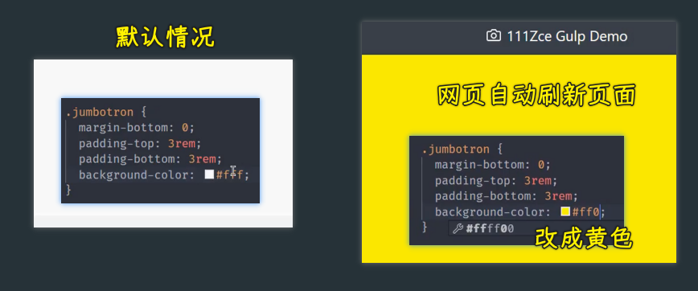

### ✍️ Tangxt ⏳ 2021-10-29 🏷️ 工程化

# 10-Gulp 案例 - 开发服务器、Gulp 案例 - 监视变化以及构建优化、Gulp 案例 - useref 文件引用处理

## ★Gulp 案例 - 开发服务器


除了对文件的构建操作以外，我们这里还需要一个开发服务器，用于在开发阶段去调试我们的应用。

我们可以通过 gulp 去启动并且管理这个开发服务器。那这样的话，我们就可以在后续去配合我们其他的一些构建任务去实现「在代码修改过后自动去编译，并且自动去刷新浏览器页面」 -> 这样就会大大提高我们在开发阶段的效率，因为它会减少我们在开发阶段的重复操作。

我们具体来看怎么样去操作。

首先我们先去安装一个叫做 `browser-sync` 的一个模块：

``` bash
yarn add browser-sync --dev
```

这个`browser-sync`模块它会提供给我们一个开发服务器 -> 相对于我们普通使用 express 创建的 web 服务器来说的话，`browser-sync` 它有更强大的一些功能 -> 它支持我们在代码修改了过后，自动热更新到浏览器当中，让我们可以及时看到最新的页面效果。

有了这个模块过后，我们在 gulp 当中需要去使用一下这个模块儿。

它并不是一个 gulp 的插件，只不过我们是通过 gulp 去管理它而已。所以我们需要单独去引入一下这个模块儿。

``` js
const browserSync = require('browser-sync')
```

这个模块它提供了一个 `create` 方法，用于去创建一个服务器。

我们定义一个 `bs` 变量：

``` js
const bs = browserSync.create()
```

`create`方法它会自动去创建一个开发服务器。我们将这个开发服务器单独定义到一个任务当中去启动。

我们这定义一个 `serve` 任务。

在这个任务当中，我们通过 `bs` 的 `init` 方法去初始化一下我们这个 web 服务器的一些相关配置 -> 这个里面最核心的一个配置就是 `server` -> `server` 当中需要去指定一下我们网站的根目录，也就是我们 web 服务器它需要帮你把哪个目录作为网站的根目录

我们这通过 `baseDir` 去设置 -> 网页的根目录肯定就是 `dist` 这个目录 -> 因为 `src` 下面是未经过加工的代码，我们会把加工过后的结果放在 dist 当中 -> 浏览器当中运行的肯定是加工过后的结果。所以 baseDir 的值是 dist 

那这样的话，我们这个`browser-sync`最基础的操作就完成了。


我们把这个 `serve` 命令给它导出出去然后测试：

``` bash
yarn gulp serve
```

gulp 会自动启动 `serve` 这个任务。

在启动这个任务的时候，这个任务会自动的去唤醒浏览器，打开对应的链接。然后看到最终呈现的效果：


只不过这个呈现的效果有点差强人意。

这原因很简单，我们回到代码当中，因为在我们的这个编译的过程当中，我们并没有去处理这个 `node_modules` 下面的这些模块的一个拷贝，我们只是把我们自己写的源代码做了一些编译以及一些文件的拷贝。


所以，我们的`dist`目录下面是没有 `node_modules` 这些东西的。而 `node_modules` 它是我们项目根目录下的一些文件。

目前我们先不用着急，对于这个`bootstrap.css`文件的处理，我们之后会单独再去考虑。

我们现在要做的是在开发阶段能够让他们正常工作。

当然，我们有一个小办法，就是给这个`browser-sync`再单独加一个特殊的路由，让它对于这种`/node_modules`开头的这种网页请求，我们都给它指到同一个目录下面去。

这具体的指令方式我们就通过 `routes` 去指定。`routes`这个对象里面是会优先于我们 `baseDir` 的一个配置，也就是说一旦当我们的一个请求发生了过后，它会先去看在 `routes` 里面有没有对应的配位置，如果有话会先走`routes`里面的配置，否则的话，就会找 `baseDir` 下面对应的文件。

我们给`routes`这个对象要配置的键就是我们请求的那个前缀`/node_modules`


然后，我们要把它指到一个目录下面，那就是`'node_modules'` -> 这是一个相对路径，相对的是项目根目录下面的`node_modules`

这样一来，我们再去重新启动一下这个`serve`

``` bash
yarn gulp serve
```

此时我们针对于`bootstrap`这些库文件的请求，它就会自动映射到我们项目下面的`node_modules`


至此，我们这个 web 服务器就可以正常工作了

不过，这样还不行，我们还可以再跟大家介绍一些其他的小选项。

对于这个 `bs` 的 `init` ，它还可以去指定一些其他的选项。比如说 `notify`

那这个 `notify` 的作用是什么呢？因为我们刚刚在启动`serve`的一瞬间，你会发现网页这个右上角会有一个提示 -> 提示我们 `browser-sync` 是否已经连接上。

这个连接小提示有可能会影响我们在页面当中去调试一些样式 -> 所以，我们可以把这个 「notify」 给它关掉，我们可以通过 `notify` 设置为 `false`


这样一来，我们再去启动这个 web 服务器，以及后续我们去页面重新刷新的时候，它就不会再弹出这样一个提示了 -> 这个可以单独去了解一下。

除此之外，我们还可以去设置一下 `port` -> 也就是我们这个 `browser-sync` 的一个端口 -> 默认它启动端口是 `3000` -> 我们给它改成 `2080`，那这样话你再去启动的时候，它就会使用`2080` 这个端口

以上这两个是我们在使用 `browser-sync` 的时候比较常见的两个小选项，大家可以去了解一下。

然后，如果说还有一个选项的话，可能就要说到那个 `open` 了，因为我们 `browser-sync` 启动的时候，它会自动去帮你打开浏览器，而这个操作如果你觉得不是特别好的话，你可以把这个 `open` 设置为 `false`，那这样的话它就会取消这样一个小特性 -> 这个可以根据自己的情况去决定。 

现在有了这个`browser-sync`过后，接下来我们重点想考虑的肯定就是希望我们在修改完代码过后，可以去自动在浏览器当中看到最新的呈现效果。

现在我们去修改肯定是没有任何意义的，因为我们的修改，修改的是源代码儿，而源代码还需要经过编译，编译过后的结果才到 `dist` 目录下面 -> `dist` 下面再发生修改的话，`browser-sync`才有可能被监听到

所以我们这儿先不着急考虑源代码修改然后那个浏览器刷新，我们可以先考虑一下我们在 `dist` 下面的文件发生变化过后，我们怎么样让浏览器及时的更新过来。

在`serve`里边，我们可以给 `bs` 的 `init` 方法再去指定一个参数——`files`


这个参数它可以指定一个字符串 -> 这个字符串就是用来被 `browser-sync` 启动过后监听的一个路径通配符 -> 你想要哪些文件发生改变过后，这个 `browser-sync` 自动去更新浏览器，那你就可以在这通过通配符的方式去指定。

我们这儿指定的应该是 `dist` 下面的所有文件

保存一下，我们重新启动一下这个任务。

``` bash
yarn gulp serve
```

启动过后我们可以再回到 VS Code 当中。

注意，这个时候我们不是修改 `src` 下面的文件，因为 `src` 修改过后需要编译 -> 对于这个操作，我们还没有处理 -> 我们这里只是去修改这个 `dist` 下面的文件。

我们打开`dist`目录下的一个 HTML 文件（`index.html`） -> 对它做一个修改的测试 -> 比如我们找到这个页面上的一个标题部分，我们给它随便加上一些内容然后保存一下


此时你会发现页面上的内容已经更新过来了，这也就意味着我们此时 `dist` 下面的文件确实已经被监听了 -> 一旦当`index.html`这个文件发生变化过后，就可以同步到浏览器当中 -> 这对于样式来讲，这也是一样的。



> 似乎咩有刷新页面，页面状态还是存在的！ -> 修改样式不会刷新页面！

比如我们把这个`jumbotron`选择器的颜背景颜色改为`#ff0`，也就是黄色的颜色 -> 可以看到颜色也可以同步过去 -> 这样也就意味着 `browser-sync` 的这个同步没有任何问题。

那没有任何问题过后，下一步我们就要去考虑怎么样在修改 `src` 过后，`dist`目录就可以自动的去更新。

对于这个，其实我们要做的事情很简单，就是监视 `src` 下面文件的变化。一旦当它变化了过后，我们不是直接去刷新到浏览器，而是先去重新执行一下我们的构建任务 -> 这个我们再单独来看。

## ★Gulp 案例 - 监视变化以及构建优化

