### ✍️ Tangxt ⏳ 2021-10-30 🏷️ 工程化

# 11-Gulp 案例 - 文件压缩、Gulp 案例 - 重新规划构建过程、Gulp 案例 - 补充

## ★Gulp 案例 - 文件压缩


有了 `useref` 过后，它就自动的帮我们把对应的那些依赖的文件全部拿过来了

但是我们还是需要再去做一个额外的操作 -> 就是对这些生成的文件做一个压缩的过程。

这个时候我们需要压缩的文件有三种：

- 一个是 HTML
- 一个是 JS 
- 一个是 CSS

HTML 我们直接通过 `src` 这个读取流创建出来的，而 JS 文件和 CSS 文件是 `useref` 在工作的过程当中创建出来的。

所以我们在这个管道接着往下去走的时候，此处会有三种文件类型`html js css`

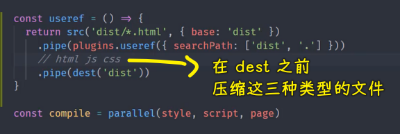

这三种文件类型我们需要分别去做不同的压缩工作。

我们需要去为它们安装不同的压缩插件：

``` bash
yarn add gulp-htmlmin gulp-uglify gulp-clean-css --dev
```

这个三个模块分别压缩 -> `html js css`

有了这三个模块儿过后，我们就可以回到`gulpfile`里边去使用了。

但是，此时就会遇到一个小问题，因为在我们之前的构建任务当中，每一次我们的读取流当中都是同类型的文件，我们对它做相同的操作是合理的。

但是我们这个时候读取流当中有三种类型的文件，那我们就需要分别对它们做不同的操作。

那这个时候我们就需要一个额外的操作 -> 这个操作就是「判断一下这个读取流当中是什么文件，我们就做什么操作」。 -> 这需要一个`gulp-if`插件，我们单独安装一下它

``` bash
yarn add gulp-if --dev
```

有了这个插件过后，我们就可以回到`gulpfile`里边去尝试使用它了。

首先第一个我们先 `pipe` -> `pipe` 到什么呢？ -> `plugins.if()`

这个`if`它会自动创建一个转换流，只不过在这个转化流动内部，它会根据我们给`if` 指定的这个条件去决定是否要去执行具体的转换流。

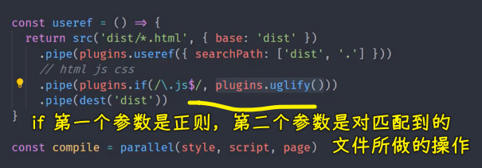

第一个参数我们可以指定一个正则 -> 这个正则会自动去匹配我们这个文件读取流当中的文件路径，我们根据文件的扩展名去判断 -> 判断扩展名的方式，就是判断它是否以`.js`结尾 -> `$`符就是正则当中结尾的一个强制匹配符。

那这样的话，这就意味着我们的这一个路径一旦要是匹配`.js`结尾的话，它就会执行我们后面所指定的转换流。

第二个参数就是指定我们需要去工作的转化流 `plugins.uglily`

至此，这个`uglily`就可以工作了 -> 它会自动的去判断对应的这个文件的路径，然后去决定是否要执行这个转化流。

这个时候我们需要去重新运行一下这个任务，我们尝试着运行一下。 

``` bash
yarn gulp useref
```

执行完了过后，我们回到这个代码当中，我们来看 `dist` 的下面生成的这个 scripts（`vendor.js`）：

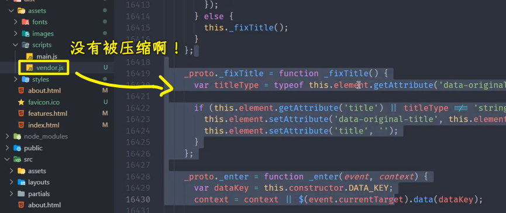

你会发现它并没有被压缩。

所以这个道理是什么呢？这个道理很简单，你把这个`vendor.js`删了，你可能就能明白了

我们再执行一下 `useref`：

``` bash
yarn gulp useref
```

你会发现此次我们工作完了过后，它并不会生成这个文件：

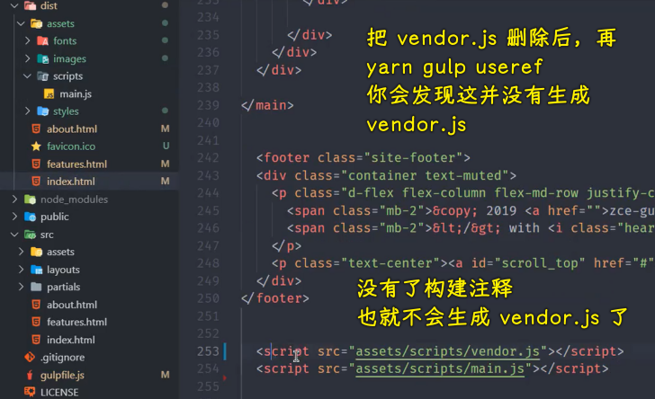

这个道理很简单，因为我们第一次去执行这个 `useref` 的时候，它已经把 HTML 里面的那些构建注释都已经删除掉了，你再去构建的时候，此时，它里面没有那些构建注释 -> 那`useref` 就不会产生 JS 文件，所以你就不会有这种所谓的压缩的一个转换了。

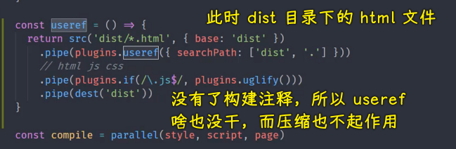

所以我们不能单纯的去执行这个 `useref`，我们需要先去执行一下 `compile`，然后再去执行这个 `useref`

先执行一下 `compile`：

``` bash
yarn gulp compile
```

`compile` 执行完了过后再去执行`useref`：

``` bash
yarn gulp useref
```

我们需要等一会儿，因为这个压缩过程的时间会相对长一些 -> **这个压缩一定是放在上线之前的那个构建任务，它不能在开发阶段用，不然，你在开发阶段用的话，那就会特别慢**。

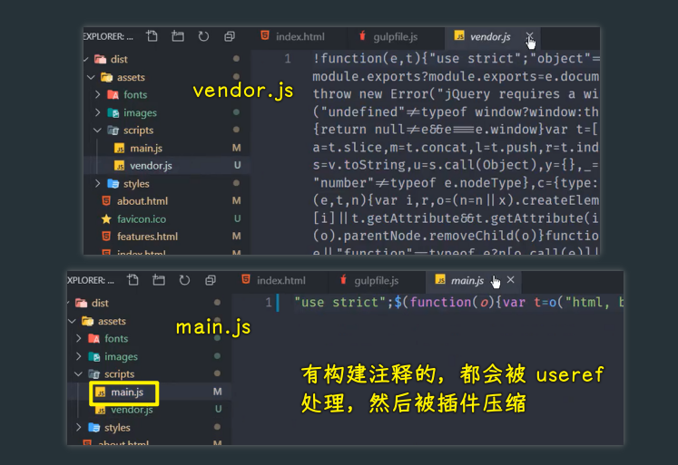

此时我们会发现 `vendor.js` 当中，还有我们的 `main.js`当中都是压缩过后的代码了 -> 这个就是对于 JS 的压缩 -> 对于 CSS 和 HTML 的压缩都是以此类推。

`.css`结尾的 -> 我们执行`cleanCss`

对于`.html`结尾的 -> 我们就执行`htmlmin`


保存一下。

有了这三个过后，我们再来去重新运行一下 `compile`，然后再去运行这个 `useref` 

此时这个时间相对来讲会更长一些 -> 等待一下。

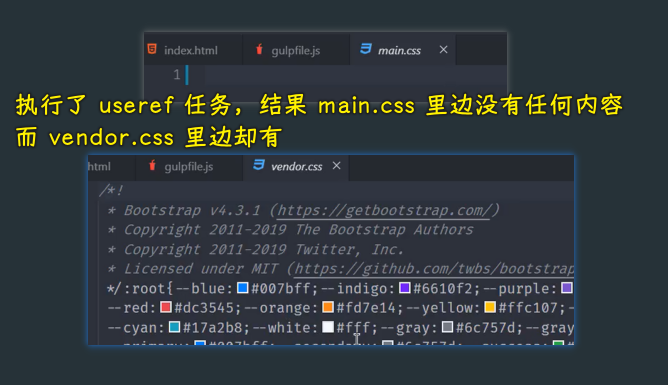

完成过后，我们再去看一下这个 CSS 文件有没有压缩 -> 这个`main.css`当中根本就没有任何的内容，而`vendor.css`当中又好像是正常的。

`useref`这个任务，其实这就暴露出来我们这样去用的一个小问题了 -> `src`是读取流 `dist` 的下面的这些文件，然后我们又把这个文件写入到写入流当中 -> 此时其实就产生了一个**文件读写的冲突** -> 这就好比来说，你一边在读一边在写，这两个读写如果没有分离开的话，它很有可能产生这个读写文件写不进去的这种情况。

这个时候我们就需要再额外做一个小操作了 -> 什么操作呢？

很简单，我们将 `dist` 最终转换过后的结果，不要放到`dist`这个目录下面了，我们放在另外一个目录下面，你叫做 `release`（释放、版本）


我们再来重新去运行一下这个任务，`compile` 一下，然后 `useref`

``` bash
yarn gulp compile
yarn gulp useref
```

稍等一下，完成过后我们可以看到 `release` 这个目录下面 HTML 文件已经有了，但是它还没有被压缩：

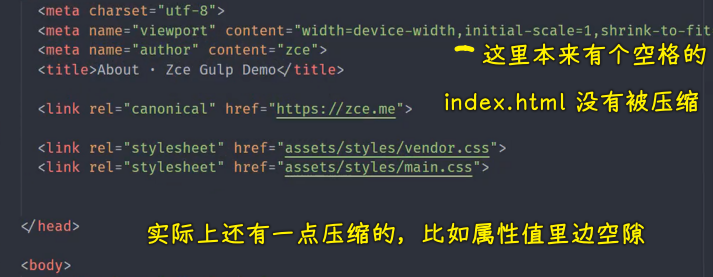

这个没有压缩是我们需要再去指定一些额外的选项 -> 此时，我们重点去看的是这个 `styles`里边的`main.css`有没有压缩。

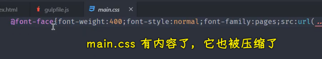

这个时候你会发现 `styles`下的文件已经正常被压缩了，而且我们的 JS 文件也都正常工作了。

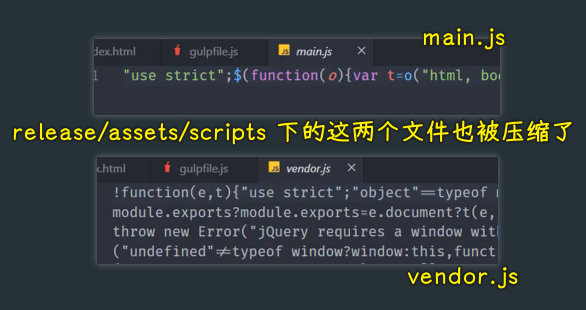

以上这个就是我们针对于不同的文件单独去处理压缩

不过，这个时候 HTML 并没有压缩 -> HTML 需要单独去处理，因为`htmlmin`它默认只是去压缩你属性当中的一些空白字符，例如：

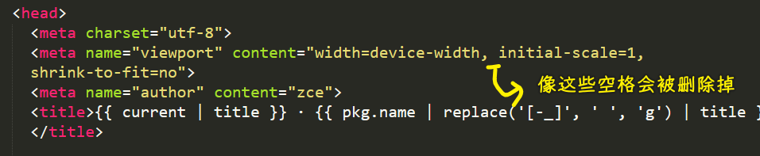

先图中这些空格，`htmlmin`它会自动帮我们删除掉。但是针对于其它的一些，比如说我们换行符这些，它默认不帮你删除 -> 你要想去删除它们的话，你可以去指定一个选项，这个选项的名字叫做`collapseWhitespace`，它可以折叠掉我们所有的空白字符，把它设置为`true`即可！

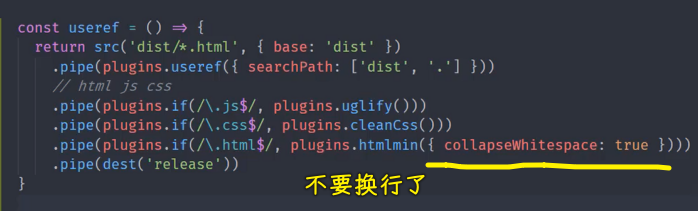

那这样的话，它就会自动的去压缩你的 HTML 里面的那些空白字符和换行符

我们再去执行一下这个 `useref` -> 此时我们重新直接去执行 `useref` 就可以了，因为我们 `useref` 生成过后的结果我们是放到 `release` 当中的，然后`dist`目录下还是原先`compile`的结果，所以我们可以直接执行 `useref`

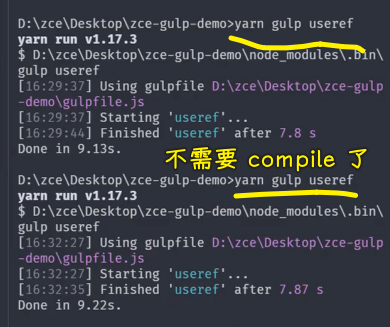

完成过后，我们再来看一下 HTML 文件。

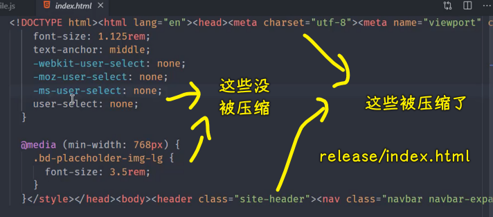

此时 HTML 文件当中那些 HTML 代码就已经被压缩掉了。

但是还有一些行内的或者说叫 `style` 标签内部的这些样式 -> 它们默认没有被压缩

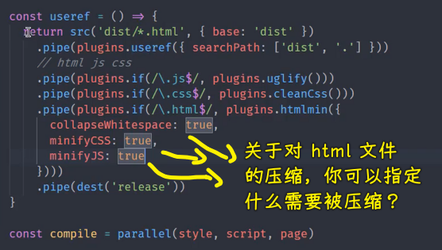

对于这个我们也可以再单独去指定一些其它的选项去把它们压缩一下 -> 这个选项的名字叫做 `minifyCSS`，同样一个道理，这肯定有`minifyJS` -> 把这两个选项都设置为`true` -> 这个时候它会自动帮你把页面当中 `style` 标签和 `script` 标签内部的一些脚本给它压缩掉。

以上这个就完成了我们引用回来的文件的一个压缩，我们回过来再来去试用一下 -> 直接启动`useref`

稍等一下。


这个时候我们再来看 HTML 文件，这整个 HTML 文件就会被压缩到同一行当中了 -> 这个是针对于 `htmlmin` -> 它需要指定单独几个参数的一个小知识点

`htmlmin`它还有一些其它的参数。比如说我们可以去 remove 掉 comments  -> 就会把所有的注释全部删除掉。

还有比如说一些空属性，它也可以自动帮你删除。

对于这些，你可以再单独根据它的文档，然后单独去使用就行了 -> 这一般就根据自己的情况去决定需不需要去做额外的这些操作。

至此，我们这个 `useref` 就已经可以了 -> 此时我们的这个构建结构（无端端多出了一个`release`目录）好像就被打破了，我们待会再具体来看。

## ★Gulp 案例 - 重新规划构建过程

