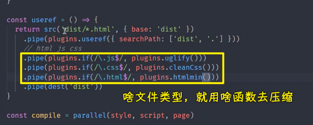
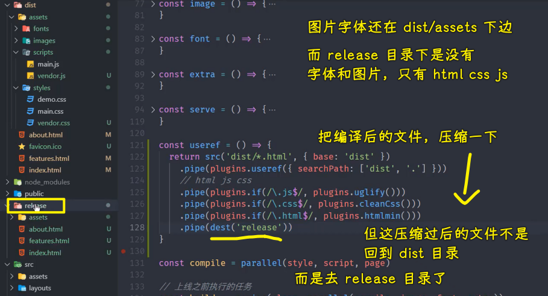
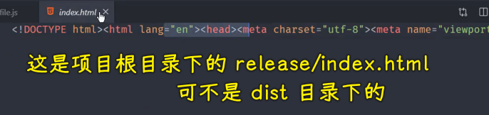

### ✍️ Tangxt ⏳ 2021-10-30 🏷️ 工程化

# 11-Gulp 案例 - 文件压缩、Gulp 案例 - 重新规划构建过程、Gulp 案例 - 补充

## ★Gulp 案例 - 文件压缩


有了 `useref` 过后，它就自动的帮我们把对应的那些依赖的文件全部拿过来了

但是我们还是需要再去做一个额外的操作 -> 就是对这些生成的文件做一个压缩的过程。

这个时候我们需要压缩的文件有三种：

- 一个是 HTML
- 一个是 JS 
- 一个是 CSS

HTML 我们直接通过 `src` 这个读取流创建出来的，而 JS 文件和 CSS 文件是 `useref` 在工作的过程当中创建出来的。

所以我们在这个管道接着往下去走的时候，此处会有三种文件类型`html js css`


这三种文件类型我们需要分别去做不同的压缩工作。

我们需要去为它们安装不同的压缩插件：

``` bash
yarn add gulp-htmlmin gulp-uglify gulp-clean-css --dev
```

这个三个模块分别压缩 -> `html js css`

有了这三个模块儿过后，我们就可以回到`gulpfile`里边去使用了。

但是，此时就会遇到一个小问题，因为在我们之前的构建任务当中，每一次我们的读取流当中都是同类型的文件，我们对它做相同的操作是合理的。

但是我们这个时候读取流当中有三种类型的文件，那我们就需要分别对它们做不同的操作。

那这个时候我们就需要一个额外的操作 -> 这个操作就是「判断一下这个读取流当中是什么文件，我们就做什么操作」。 -> 这需要一个`gulp-if`插件，我们单独安装一下它

``` bash
yarn add gulp-if --dev
```

有了这个插件过后，我们就可以回到`gulpfile`里边去尝试使用它了。

首先第一个我们先 `pipe` -> `pipe` 到什么呢？ -> `plugins.if()`

这个`if`它会自动创建一个转换流，只不过在这个转化流动内部，它会根据我们给`if` 指定的这个条件去决定是否要去执行具体的转换流。


第一个参数我们可以指定一个正则 -> 这个正则会自动去匹配我们这个文件读取流当中的文件路径，我们根据文件的扩展名去判断 -> 判断扩展名的方式，就是判断它是否以`.js`结尾 -> `$`符就是正则当中结尾的一个强制匹配符。

那这样的话，这就意味着我们的这一个路径一旦要是匹配`.js`结尾的话，它就会执行我们后面所指定的转换流。

第二个参数就是指定我们需要去工作的转化流 `plugins.uglily`

至此，这个`uglily`就可以工作了 -> 它会自动的去判断对应的这个文件的路径，然后去决定是否要执行这个转化流。

这个时候我们需要去重新运行一下这个任务，我们尝试着运行一下。 

``` bash
yarn gulp useref
```

执行完了过后，我们回到这个代码当中，我们来看 `dist` 的下面生成的这个 scripts（`vendor.js`）：


你会发现它并没有被压缩。

所以这个道理是什么呢？这个道理很简单，你把这个`vendor.js`删了，你可能就能明白了

我们再执行一下 `useref`：

``` bash
yarn gulp useref
```

你会发现此次我们工作完了过后，它并不会生成这个文件：


这个道理很简单，因为我们第一次去执行这个 `useref` 的时候，它已经把 HTML 里面的那些构建注释都已经删除掉了，你再去构建的时候，此时，它里面没有那些构建注释 -> 那`useref` 就不会产生 JS 文件，所以你就不会有这种所谓的压缩的一个转换了。


所以我们不能单纯的去执行这个 `useref`，我们需要先去执行一下 `compile`，然后再去执行这个 `useref`

先执行一下 `compile`：

``` bash
yarn gulp compile
```

`compile` 执行完了过后再去执行`useref`：

``` bash
yarn gulp useref
```

我们需要等一会儿，因为这个压缩过程的时间会相对长一些 -> **这个压缩一定是放在上线之前的那个构建任务，它不能在开发阶段用，不然，你在开发阶段用的话，那就会特别慢**。


此时我们会发现 `vendor.js` 当中，还有我们的 `main.js`当中都是压缩过后的代码了 -> 这个就是对于 JS 的压缩 -> 对于 CSS 和 HTML 的压缩都是以此类推。

`.css`结尾的 -> 我们执行`cleanCss`

对于`.html`结尾的 -> 我们就执行`htmlmin`



保存一下。

有了这三个过后，我们再来去重新运行一下 `compile`，然后再去运行这个 `useref` 

此时这个时间相对来讲会更长一些 -> 等待一下。


完成过后，我们再去看一下这个 CSS 文件有没有压缩 -> 这个`main.css`当中根本就没有任何的内容，而`vendor.css`当中又好像是正常的。

`useref`这个任务，其实这就暴露出来我们这样去用的一个小问题了 -> `src`是读取流 `dist` 的下面的这些文件，然后我们又把这个文件写入到写入流当中 -> 此时其实就产生了一个**文件读写的冲突** -> 这就好比来说，你一边在读一边在写，这两个读写如果没有分离开的话，它很有可能产生这个读写文件写不进去的这种情况。

这个时候我们就需要再额外做一个小操作了 -> 什么操作呢？

很简单，我们将 `dist` 最终转换过后的结果，不要放到`dist`这个目录下面了，我们放在另外一个目录下面，你叫做 `release`（释放、版本）



我们再来重新去运行一下这个任务，`compile` 一下，然后 `useref`

``` bash
yarn gulp compile
yarn gulp useref
```

稍等一下，完成过后我们可以看到 `release` 这个目录下面 HTML 文件已经有了，但是它还没有被压缩：


这个没有压缩是我们需要再去指定一些额外的选项 -> 此时，我们重点去看的是这个 `styles`里边的`main.css`有没有压缩。


这个时候你会发现 `styles`下的文件已经正常被压缩了，而且我们的 JS 文件也都正常工作了。


以上这个就是我们针对于不同的文件单独去处理压缩

不过，这个时候 HTML 并没有压缩 -> HTML 需要单独去处理，因为`htmlmin`它默认只是去压缩你属性当中的一些空白字符，例如：


先图中这些空格，`htmlmin`它会自动帮我们删除掉。但是针对于其它的一些，比如说我们换行符这些，它默认不帮你删除 -> 你要想去删除它们的话，你可以去指定一个选项，这个选项的名字叫做`collapseWhitespace`，它可以折叠掉我们所有的空白字符，把它设置为`true`即可！


那这样的话，它就会自动的去压缩你的 HTML 里面的那些空白字符和换行符

我们再去执行一下这个 `useref` -> 此时我们重新直接去执行 `useref` 就可以了，因为我们 `useref` 生成过后的结果我们是放到 `release` 当中的，然后`dist`目录下还是原先`compile`的结果，所以我们可以直接执行 `useref`


完成过后，我们再来看一下 HTML 文件。


此时 HTML 文件当中那些 HTML 代码就已经被压缩掉了。

但是还有一些行内的或者说叫 `style` 标签内部的这些样式 -> 它们默认没有被压缩


对于这个我们也可以再单独去指定一些其它的选项去把它们压缩一下 -> 这个选项的名字叫做 `minifyCSS`，同样一个道理，这肯定有`minifyJS` -> 把这两个选项都设置为`true` -> 这个时候它会自动帮你把页面当中 `style` 标签和 `script` 标签内部的一些脚本给它压缩掉。

以上这个就完成了我们引用回来的文件的一个压缩，我们回过来再来去试用一下 -> 直接启动`useref`

稍等一下。



这个时候我们再来看 HTML 文件，这整个 HTML 文件就会被压缩到同一行当中了 -> 这个是针对于 `htmlmin` -> 它需要指定单独几个参数的一个小知识点

`htmlmin`它还有一些其它的参数。比如说我们可以去 remove 掉 comments  -> 就会把所有的注释全部删除掉。

还有比如说一些空属性，它也可以自动帮你删除。

对于这些，你可以再单独根据它的文档，然后单独去使用就行了 -> 这一般就根据自己的情况去决定需不需要去做额外的这些操作。

至此，我们这个 `useref` 就已经可以了 -> 此时我们的这个构建结构（无端端多出了一个`release`目录）好像就被打破了，我们待会再具体来看。

## ★Gulp 案例 - 重新规划构建过程


此时，这个`useref`任务它打破了我们的这个构建的目录结构。

为什么这样说呢？

因为我们之前约定的是我们在开发阶段写的代码是放在 `src` 这个目录下面。然后我们在编译完过后的结果也就是打包上线的那个目录是 `dist` 目录。

但是此时，因为我们刚刚从 `dist` 当中读出来，再往 `dist` 当中去写的时候，产生了一个文件冲突，那我们不得已把它放到了另外一个目录

其实这个时候我们应该真正上线的应该是 `release` 这个目录当中的文件，而 `release` 当中又没有那些图片和字体文件。所以说这个目录结构被它打破了，那我们需要再重新去规整一下它 -> 这具体怎么样去做呢？

很简单。

其实在 `useref` 之前，我们所有的那些生成的文件，它实际上算是一个中间产物。

什么意思？

就是我们通过 `src` 下面的这些文件去编译，编译过后的结果，我们是放到 `dist` 下面了。但是后续我们在上线之前我们还做了一个操作，就是 `build` 任务当中应该还做一个操作，就是 `useref` 这个任务


而`useref` 又做了一个转换的过程。所以说我们直接把 `script`、`style` 还有`page`这些生成直接放到 `dist` 里面是不合理的。

我们应该把它放到一个临时的目录当中。然后我们在 `useref` 的时候，我们通过临时目录把文件拿出来，然后做一些转换的操作，最后再放到 `dist` 里面是会更合适一点。

所以我们得去修改一下我们之前的这些任务。

从上到下一个来看。


首先 `clean` 这个任务 -> 我们可以再去加一个需要清空的目录 -> 这个目录我们叫做 `temp` -> 我们把生成的临时的那个文件就放到 `temp` 这个目录下面

然后 `style` 这个任务 -> 我们从 `src` 下面拿出来过后 -> 经过 sass 编译 -> 编译过后的结果，我们不要放到 `dist` 下面，我们放到 `temp` 当中 -> 也就是把这个文件放到临时目录当中

然后以此类推，下面的这个 `script` 也是放到临时目录，`page`也是放到临时目录。


`image`、`font` 还有这个 `extra` -> 它们并不需要放到临时目录。

这是为什么呢？

因为这三个转换的过程我们只是在 `build` 时候去做 -> 只是在 `build` 也就是意味着上线之前的那个构建的过程去做 -> 这个在开发阶段我们根本不需要去转换它，所以说它们不需要再单独放到`temp`底下 -> 只有那些会被 `useref`处理的那些操作，我们才需要去修改。

所以，这三个任务我们就不改了。

然后再到底下的这个 `serve`，`serve` 命令当中需要去修改的地方就比较多了。

首先第一个，我们这个 `bs.init` 的时候，我们这个 `baseDir` 就不能再从 `dist` 当中去拿文件了 -> 我们要取的是 `temp` 当中的文件 -> 如果 `temp` 找不到，那我们就找 `src`，然后再找 `public` -> `dist`目录，跟这个过程没有任何关系，`dist`只是我们最终构建、需要上线打包的那个目录

所以我们把这个 `dist` 改成 `temp`


最后的这个 `useref` 里面，我们从 `temp` 当中去取文件，然后把最终的结果放到 `dist` 里面，那这样的话，这基本上就 OK 了。


我们在再重新检查一遍，从上到下再看一下：

`style`、`script`、`page`这三个任务都修改 了，没问题。

检查完了过后，我们再来测试一下。在测试之前，我们先手动的把我们刚刚测试`release`这个过程所产生的文件先给它删掉 -> 顺便把`dist`也删了


这个时候我们去执行这个 `useref`

对了，这个`useref` 应该放到我们的组合任务当中 -> 这个组合任务就是在 `build` 这个任务当中，然后我们去使用这个 `useref`

那这个 `useref` 应该在什么时候执行呢？

我们先来看一下这个 `build` -> `build`当中是先去执行 `clean`，完了过后，去执行了一个并行的任务 -> 这个并行任务是 `compile`、`image` `font` 和 `extra` 

如果我把 `useref` 放在这个里面的话：


其实是不合理的 -> 为什么呢？

因为你的 `compile` 和 `useref` 它们之间有依赖关系，就是 `useref` 必须要求你 `compile` 先执行，然后才去执行对应的这个 `useref` 操作 -> 所以说它俩应该做一个串行的结构


我们可以再把它俩提出来放到 `series` 当中。那这个时候这个组合任务就相对比较复杂一点了，我们把它折（换行）出来，让大家可以看得更清楚一点。


首先整个这个任务它是一个串行的任务，然后串行的任务当中有两个任务，第一个任务是`clean`，`clean`完了过后我们再执行一个并行的任务 -> 这个并行任务当中有四个任务，第一个任务是一个串行任务，其余三个任务是同步执行的。只不过第一个串行任务是先执行 `compile` 然后再执行这个 `useref`

这个时候我们直接去运行一下这个`build` 。

> 其实这也能看出来 -> 平时我们做的一些小案例，跟我们实际项目当中的这个复杂程度的一个对比。

``` bash
yarn gulp build
```

我们看一下这个执行顺序是不是我们想要的。


首先它启动了 `build` 任务，这个很正常。

然后紧接着开始这个 `clean` ，接着结束这个`clean`，这个是我们要求的 -> 即最开始先把这个`clean`任务给完成掉

然后完了过后再紧接着去执行了 `image`、`font`、`extra`、`style`、`script`、`page`

这些任务都是我们可以同时去执行的任务。

然后这几个任务都结束了过后，我们才执行这个 `useref` -> 这个过程也是合理的 -> 这个 `font` 跟 `useref` 它没有关系，所以说它单独的在后面结束了，这也很正常。

所以整体的这个执行顺序是满足我们要求的。

接下来我们要去看一下`dist`、`temp`这两个目录里面是不是我们想要的那个情况。

这个时候`temp`目录里面应该只有`html、css、js`这些文件。


只有这三种类型的文件，所以这个处理是没问题的！因为它只是这个语法编译的一个中间的临时目录

我们看看最终的这个生成结果：


HTML、脚本文件、样式文件、图片文件这些都是 OK 的。那这样的话，这个 `dist` 目录就是正常的了。

除此之外，我们还需要去测试一下这个 `develop` 命令。


这个 `develop` 命令，我们看它先启动的是 `style` `script` 和`page`，也就是执行了我们的 `compile` 那个任务 -> 执行这个 `compile` 任务完成过后再去启动这个`serve`这也是可以的。


因为这个时候我们启动的这个 `serve` 它跟 `dist` 没有任何关系，它只是去找了 `temp` 下面的那些临时的文件，然后找不到的文件我们就去源目录`src`里面去找。因为这个时候我们不需要 `dist` -> 所以说`develop`这个任务是可以正常工作的。


至此，我们这样一个完整的构建过程就算是全部结束了。

当然，你在我们这个里面使用到的一些插件，它可能还会有一些额外的选项。那你再去持续去学习这块内容的时候，你可以再去单独针对于不同的插件，再去看一下它官方手册里面一些其他的选项各自是什么样的一些用途。

我们这里只是把一些我们在实际开发当中经常会用到的一些主要的选项拿出来跟大家做了一个分享，其他的这些东西需要大家自己再去做一个补充 -> 当然，这得根据你有需要的情况。

至此，我们这个构建的过程就结束了。我们往后，再来看一个提高层面的小东西。

## ★Gulp 案例 - 补充

