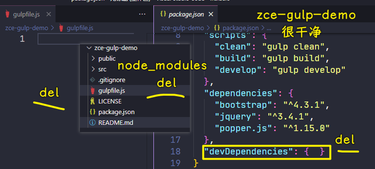
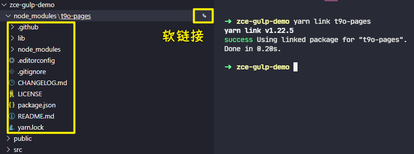
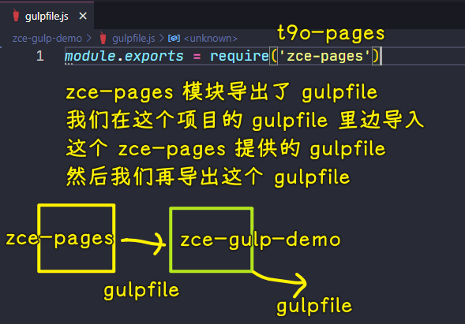

### ✍️ Tangxt ⏳ 2021-10-31 🏷️ 工程化

# 12-封装工作流 - 准备、封装工作流 - 提取 gulpfile

## ★封装工作流 - 准备


接下来我们来重点考虑一下关于我们项目当中这个 `gulpfile` 的一个复用的问题。

因为如果说我们涉及到要去开发多个同类型的项目，那我们的这个自动化的构建工作流它应该是一样的。

那这个时候就涉及到我们需要在多个项目当中重复去使用这些构建任务 -> 这些构建任务绝大多数情况下它们都是相同的。

所以说这就面临一个我们需要去复用相同的 `gulpfile` 的问题。

针对于这个问题，我们可以通过代码段的方式 -> 我们把这个 `gulpfile` 作为一个代码段保存起来，然后在不同的项目当中去使用 -> 但是这种方式它也有一个弊端，就是你的 `gulpfile` 它散落在各个项目当中 -> 一旦当这个 `gulpfile` 它有一些问题需要我们去修复或者去升级的时候，那我们需要去对每一个项目做相同的操作 -> 这个也不利于我们整体的维护。

所以说我们这一块儿要重点来看 -> **怎么样去提取一个可复用的自动化构建工作流**。


那解决的方法其实也很简单，就是通过我们**去创建一个新的模块，去包装一下 gulp ，然后把这个自动化的构建工作流给它包装进去**。

具体来说就是 -> 因为 gulp 它只是一个自动化构建工作流的一个平台，它不负责去帮你提供任何的构建任务，而你的构建任务是需要通过你的 `gulpfile` 去定义的。

现在我们有了 `gulpfile` ，然后也有了 gulp， 我们把这二者通过一个模块儿结合到一起：


结合到一起过后，我们在以后同类型的项目当中，就使用我们这个模块儿去提供自动化构建的工作流就好了，那这个就是我们的一个办法。

接下来我们来做一些准备性的工作。

具体做法就是我们先去创建一个模块，然后把这个模块发布到 npm 的仓库上面。最后在我们的项目当中去使用这个模块就可以了。

我们先来做一些准备工作。首先我们先到 github 上去创建一个仓库，这样的话，我们就可以把我们的这个新创建的模块托管到 github 上面

新建的仓库名字就跟我们的模块名字保持一致就行了 -> 我们这叫`zce-pages` -> 下面你可以给一个描述以及一些初始的文件， -> 我们这都不要了 -> 我们直接 `create` 仓库


有了这个模块儿地址过后，我们把它的地址复制下来，然后回到命令行当中，在这个命令行当中，我们要去到一个空的目录当中，去创建一个新的模块。 -> 比如`BlogDemo`

在这个目录下面，我们要去创建一个新的 `node module` -> 我们可以使用传统的方式自己去初始化 `package.json` 等一系列的文件。

但是我们之前已经接触过了这个脚手架。那大家应该知道，对于像创建相同类型的项目，我们一般都是使用脚手架去做的 -> 我（zce 老师）这使用一个我自己创建的一个个人的脚手架去创建这个项目。

我先去安装一下它：

``` bash
yarn global add zce-cli
```


> 60.7 s

我这个脚手架主要是我个人去用，因为我们在日常的一些开发工作当中会涉及到不同类型的项目，然后我会为这些不同类型的项目写一个我个人觉得比较适用的一个模板，然后，我再去创建一些新项目的时候，我可以借助于它去帮我快速创建。

我们怎么样去使用它呢？

就是通过 `zce` 这个命令去 `init` 一个 `nm` -> `nm` 就是模板的名称 -> 这个模板的名称就是 `node module`  -> 也就是 node 的一个模块，然后我们叫做`zce-pages` 

``` bash
zce init nm zce-pages
```


> 我用了老师的`caz`脚手架 -> `caz nm t9o-pages` -> 体验非常好！ -> 其中有告诉你是否用`pnpm`

同样，它跟大多数的脚手架也是一样的，它会先去下载一个模板，它会下载最新那个在 github 上的最新的模板。


然后下载完了过后，它会问你一些问题 -> 我们这根据情况去填写一下这些问题


比如：

- 版本
- 描述 -> `static web app workflow`
- 仓库名字
- license -> `MIT`
- 关于特性 -> 我门都不勾选 -> 因为后续我们需要什么特性的时候，我们自己再手动去加。因为对于大家来讲的话，大家可能还需要一步一步去建这些东西
- ……

不选特性：


该勾选的都勾选后，此时它会自动地去帮我们创建这样一个项目。

进入到这个项目里边去，我们通过 `git init` 去初始化一下仓库 -> 我这个脚手架没有去初始化仓库，因为有些项目是不需要托管的，所以说我没有初始化这个给它的仓库。

把项目提交到远程仓库：


> 第一次提交可以叫`feat: initial commit`

有时候在`git add`文件时，会有`CRLF`的警告，为什么会有呢？ -> 很简单，因为在 Windows 上默认的换行符是`\r\n` -> 而所有的源代码的那个托管仓库，它都是以`\n`的方式去存储你的代码。所以说这涉及到你在 Windows 上使用 git 的时候，经常会有这个回车换行符的一个自动替换的问题，这个不用管它。

关于这个`git push -u origin main` -> `-u`表示以流的方式往上推远程仓库的`main`分支。

看一下远程仓库是否已经有了这个代码：


可以看到，此时我们这个新的 `node module` 的一个基本的结构就已经有了。

这个基本的结构我们可以回到 VS Code 里面跟大家简单介绍一下。

我们通过 VS Code 打开目录，这个结构就是我们脚手架提供的一个默认的约定。


项目根目录下默认的这些文件，主要就是一些特定工具的配置文件，比如说：

- `editorconfig` 或者说 `gitignore` 
- `CHANGELOG.md`这个是任何一个项目都应该有的一个变更日志 
- `LICENSE`、`package.json`这是包的配置文件，`README` 就不用说了。

除此之外就还有一个 `lib` 目录，`lib`下面有一个 `index` 文件 -> 这个会是我们这个模块的一个入口文件 -> 也就是说我们后续需要在这个模块里面写的实现代码全部放在这个里面：


`index.js`里边的默认代码也是一个约定，也就是我刚刚通过`caz`或者说是`zce-cli`这一个脚手架去帮我们生成的这个 `node module` 它所提供的一个约定 -> 我就按照这样一个约定的方式去创建我们刚刚所说的那样一个模块

我们去把我们刚刚创建的这个自动化的构建工作流的实现以及 gulp -> 把它们二者结合到一起，形成一个新的模块，然后在我们后续去使用同类型项目的时候，我们就可以使用这个模块提高我们的效率。

接下来我们来具体去看。

## ★封装工作流 - 提取 gulpfile


接下来我们具体来看我们这个模块该如何去实现。

现在我们首先先通过 VS Code 去打开这个目录：


`-a`指的是 append 到当前这个窗口实例。那这样的话我们就会在同一个 VS Code 的窗口里面去打开两个项目。

我们这儿要做的事情就是把我们刚刚在`zce-gulp-demo`这个项目当中创建的这个自动化构建的工作流，给它提取到下面这个`zce-pages`项目当中：


在这个`zce-pages`项目当中，我们去封装好这样一个工作流，然后把一系列需要解决的问题都解决掉，最后我们就可以在多个项目当中去使用这个工作流了。

我们具体来看怎么样去操作。

首先第一件要做的事情很简单，因为我们说了，我们需要在这个`zce-pages` 这个模块当中去包装 gulp 和我们的这个 `gulpfile` 里面提供的这个工作流的一个任务的定制。

那这个时候我们最简单的第一件事就是先把 `gulpfile` 我们整体给它挪过去，就作为咱们的`zce-pages`这个项目的入口文件


这个模块儿的入口有了过后，我们来想一个很简单的问题 -> 因为对于这个`zce-pages`项目来讲的话，那它这个时候里面提供了一些构建任务，那这些构建任务它们是依赖一些模块儿的，我们肯定是需要把这些模块儿作为我们 `zce-pages` 这个模块儿的依赖去安装。那这样的话，后续你在别的项目里面去使用到这一个模块儿的时候，它就会自动去安装那些依赖。

所以说我们需要把我们刚刚依赖的这些模块儿全部拿过来。那我们从原项目`zce-gulp-demo`当中把这些开发的依赖：

``` json
{
    "devDependencies": {
    "@babel/core": "^7.5.5",
    "@babel/preset-env": "^7.5.5",
    "browser-sync": "^2.26.7",
    "del": "^5.1.0",
    "gulp": "^4.0.2",
    "gulp-babel": "^8.0.0",
    "gulp-clean-css": "^4.2.0",
    "gulp-htmlmin": "^5.0.1",
    "gulp-if": "^3.0.0",
    "gulp-imagemin": "^6.1.0",
    "gulp-load-plugins": "^2.0.1",
    "gulp-sass": "^4.0.2",
    "gulp-swig": "^0.9.1",
    "gulp-uglify": "^3.0.2",
    "gulp-useref": "^3.1.6"
  }
}
```

全拷贝下来，然后放到我们的`zce-pages`项目当中

注意，对于这个`zce-pages`项目里面，原项目当中，我们的这个 `dependencies` 肯定是不需要的，因为我们不同的项目它的生产依赖是不一样的。但是它们对于这些自动化构建任务的开发依赖应该都是相同的。所以我们拿到我们的新模块当中，我们作为 `dependencies` 出现：


这可能会有人想问一个问题，为什么不是`devDependencies`？

这简单解释一下，因为你去安装一个模块，例如我们去安装这个 `zce-pages` -> 那它就会自动的去帮你安装你 `dependencies` 里面所依赖的这些模块，它并不会去安装你的开发依赖。

开发依赖指的是你去开发我们这一个模块所需要用到的一些东西，最终工作环节它只会有这个 `dependencies` 里面的东西 -> 所以说我们`zce-pages`这个`package.json`里边应该是 `dependencies` 

有了`dependencies`过后，我们通过`yarn` 的方式去安装一下这个`zce-pages`模块里面所有的依赖，稍微等它一下 -> 因为这里面依赖的这些模块我们之前是一个个安装的，所以感觉不到慢，整体去安装的话速度会相对慢一点。


安装完成过后，那这一个`zce-pages`模块的一些基本的工作我们就完成了 -> 对于这个`zce-pages`模块的入口文件，它里面肯定是有一些需要去修改的地方 -> **我们修改的地方都是通过后续我们在去使用的时候发生的一些问题，我们再来找到需要修改的地方，这样的话可以更好的理解**。

这个时候这个`zce-pages`模块 -> 我们第一步的工作那完成了。

完成过后我们就回到我们原始的这个项目当中，我们去把 `gulpfile` 里边定义的这些工作流以及它的一些依赖，我们全部给它删除掉，取而代之的是使用我们刚刚创建的这个新的模块去提供这个自动化构建的工作流。



首先第一个我们先把 `gulpfile` 里面的东西全部给它 `delete` 掉。删完了过后，我们再到依赖的这个文件里面，我们把所有的 `devDependencies` 给它删掉，然后还要去把 `node_modules` 里面这些真正模块的文件全部给它删掉 -> 因为这个 `node_modules` 里面的文件会比较碎，所以说删除起来会相对慢一点，稍微等它一下 -> 等它全部删除完了过后，那这个项目其实就一个干净的项目（很轻）。

那这个时候我们再去使用一下我们新创建的这个`zce-pages`模块，去提供那个自动化的构建工作流。

在删除`node_modules`报了一个错误：


因为这个 `node_modules` 里面的这些文件可能会被占用掉 -> 这处理的方式也很简单，就是把 VS Code 给关掉，然后再去重新删掉这个`node_modules`目录，然后再重新去打开 -> 因为 VS Code 的进程去占用了这个文件夹里面的一些文件。

我们先取消掉。然后 VS Code 会因为这个事卡死：


我们`close`掉 VS Code -> 我们定位到`zce-gulp-demo`这个目录 -> 把它旗下这个 `node_modules` 给它删除掉。


删除完成过后，我们就再重新去打开 VS Code -> 这个时候对于我们原始的这个项目`zce-gulp-demo`当中 -> 这就是一个干净的项目，它里面并没有任何的依赖，它的 `gulpfile` 里面也都是空的。

这个时候我们就来去看一下怎么样去使用一下`zce-pages`。

正常的流程我们肯定是先需要把这个`zce-pages`这个模块给它发布到 npm 的仓库当中，然后我们再回到我们的这个`zce-gulp-demo`项目里面去安装这个`zce-pages`模块。

但是现在是开发阶段，我们这个`zce-pages`模块还没有完成，我们这个时候需要本地调试 -> 那最简单的一种方式，我们就通过这个 `link` 的方式把这个`zce-pages`模块 `link` 到我们当前这个`zce-gulp-demo`项目的 `node_modules` 当中。

那这个时候怎么去操作呢？

首先第一件事，我们先在这个`zce-pages`项目当中去打开命令行终端，也就是在模块这个项目当中去打开命令行终端，我们通过  `yarn link` 的方式去 `link` 一下。

那这个时候，`yarn` 会自动的去把我们刚刚的这个模块 `link` 到全局。


然后完了过后，它这也提示了说：

``` js
'You can now run `yarn link "t9o-pages"` in the projects where you want to use this package and it will be used instead.'
```

你可以在你任何一个项目当中再通过 `yarn link` 模块的名字 -> 这个时候你就可以把这个模块再给它 `link` 到你的这个`zce-gulp-demo`项目当中。

我们可以回到`zce-gulp-demo`的命令行窗口 -> 我们再去通过 `yarn link zce-pages`，回车。 

这个时候你就会发现你的项目里面多了一个 `node_modules` -> 这里面会有一个`zce-pages`, 而且在后面会有一个小图标，表示它是一个软链接。



这个`zce-gulp-demo`有了这个 `link` 过后，我们就可以在我们原本的项目`zce-gulp-demo`里面去使用这个`zce-pages`模块了。

这个模块它导出的是一个 `gulpfile`，而你这个`zce-gulp-demo`项目其实缺的就是一个 `gulpfile`



把 `gulpfile` 里边的代码替换成`module.exports = ?` -> 这导出什么呢？

导出`zce-pages`这个模块里面导入的内容 -> 具体的写法我们一般是先导入再导出 -> `require('zce-pages')`

这个时候`zce-gulp-demo`的这个 `gulpfile` 就 OK 了，但是因为你这个`zce-gulp-demo`项目里面的这些生产依赖其实也被我们刚刚删除了 -> 刚刚把它的`node_modules`给它删除掉了。


所以说我们还需要去执行一下`yarn` -> 这个安装就会非常快了，因为它只有几个生产依赖。


安装完成过后，那这个时候按道理来讲的话，这个项目就可以去跑了，因为它的这个 `gulpfile` 当中实际上已经提供了三个任务了。

那这个时候我们来尝试着通过我们之前定义的`clean`、`build` 和 `develop` 这三个命令去做一个执行。

首先我们先去执行一下 `build` -> 执行的过程它会报一个错误：


它说：

> 'gulp' 不是内部或外部命令，也不是可运行的程序或批处理文件。

在 Mac 上也是会有一个 gulp 这个命令找不到的这样一个错误出现。

那这个错误意味着什么呢？

意味着我们 `yarn` 再去执行这个 `script` 时候，它没有办法找到你这个 `script` 里面使用的 gulp 命令：


因为我们之前使用的时候，它会自动的去找你项目当中 `node_modules` 里面的`bin`目录下的那个`gulp`可执行文件，但是现在你并没有这个`gulp`可执行文件了，所以说你这个 gulp 就使用不了了。

这个地方我们先通过一个比较土的办法，我们先把 gulp 安装进来，待会我们再去考虑怎么样把 gulp 全部给它弄掉。

其实 gulp 的这个 CLI 是一个独立的程序，我们可以把 `gulp-cli` 独立安装进来 -> 其实我们之前安装 `gulp` 的时候，它提供的那个命令行可执行文件也是`gulp-cli`提供的 -> 我们这里只需要去安装一些 `gulp-cli`


`gulp-cli`安装进来过后，那这个时候我们再去刷新一下这个`zce-gulp-demo`项目下面的 `node_modules` -> 这个时候你会发现这个里面就有 gulp 的命令


有了 gulp 的命令，有了 `gulpfile`，而且 `gulpfile` 里面的东西是通过我们刚刚这个`zce-pages`模块提供的。

所以现在按道理来讲应该是可以执行了，我们尝试着再去执行一下 `build`


此时它会报一个错误 -> 说找不到一个本地的 gulp 依赖


所以，这还需要我们本地再去安装一下 `gulp`  -> 这个到时后好解决，但我们现在还是先安装一下 `gulp` -> 对于这个问题，其实在后续你真正把这个模块发布出去了过后就不存在了，因为你发布出去了过后我们再去安装这个 `zce-pages` 的时候，它会自动的去安装 `gulp` 这个模块，那 `gulp` 这个模块就会出现在 `node_modules` 当中，就不会有刚刚我们出现的这个问题 -> 我们这儿还没有完成，所以说会出现这样一个情况，这也很正常，当然，这个无所谓，我们先通过这种方式解决一下

完了过后，我们再去运行一下 `build`


此时它会报一个错，报一个什么错呢？它说：

> Cannot find module './package.json'

如果你有一点印象的话，你应该记得我们在之前定制这个 `gulpfile` 的时候，我们有一个地方用到了 `package.json` -> 这具体在哪个地方呢？ -> 其实你也可以通过这个调用堆栈里面看到


它会告诉你在 `index` 的 `48` 行的第 `8` 列

来到`index`的第 48 行，第 8 列：


当时我们的想法是定义一个 `data` 的数据成员。然后在这个数据成员里面，我们把这个模块的一些信息给它包括进去。然后最后我们在模板编译的时候去使用了一下这个数据信息：


但是我们现在把这个 `gulpfile` 给提取出来了，那这个 `package.json` 所在的位置肯定也就不一样了，所以说这个`data.pkg`代码也就不成立了 -> 这是一个方面

那另外一方面是什么呢？

另外一方面是你这个 `data` 它实际上是我们项目才知道的 -> 对于你封装的这个通用的模块，它是不应该知道的 -> 因为，你要去想，如果有三个项目去依赖我们这个自动化构建工作流`zce-pages`这个模块，那它们每一个项目里面的这个 `data` 可能都是不一样的 -> 所以说你在这个`zce-pages`模块里面把`data`写死，实际上是不合适的。

这个时候我们就可以有一种**约定大于配置**的方式去解决。

那怎么去解决呢？

很简单，我们可以在我们的项目当中去抽象一个配置文件，然后在我们这个 `gulpfile` 当中去读取一下这个配置文件 -> 这种方式实际上是合理的

那具体怎么来做？我们待会再来看。