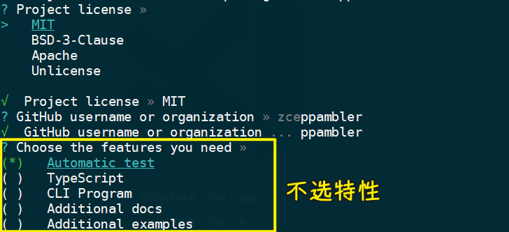

### ✍️ Tangxt ⏳ 2021-10-31 🏷️ 工程化

# 12-封装工作流 - 准备、封装工作流 - 提取 gulpfile、封装工作流 - 解决模块中的问题、封装工作流 - 抽象路径配置

## ★封装工作流 - 准备


接下来我们来重点考虑一下关于我们项目当中这个 `gulpfile` 的一个复用的问题。

因为如果说我们涉及到要去开发多个同类型的项目，那我们的这个自动化的构建工作流它应该是一样的。

那这个时候就涉及到我们需要在多个项目当中重复去使用这些构建任务 -> 这些构建任务绝大多数情况下它们都是相同的。

所以说这就面临一个我们需要去复用相同的 `gulpfile` 的问题。

针对于这个问题，我们可以通过代码段的方式 -> 我们把这个 `gulpfile` 作为一个代码段保存起来，然后在不同的项目当中去使用 -> 但是这种方式它也有一个弊端，就是你的 `gulpfile` 它散落在各个项目当中 -> 一旦当这个 `gulpfile` 它有一些问题需要我们去修复或者去升级的时候，那我们需要去对每一个项目做相同的操作 -> 这个也不利于我们整体维护。

所以说我们这一块儿要重点来看怎么样去提取一个可复用的自动化构建工作流。


那解决的方法其实也很简单，就是通过我们去创建一个新的模块儿，去包装一下 gulp ，然后把这个自动化的构建工作流给它包装进去。

具体来说就是 -> 因为 gulp 它只是一个自动化构建工作流的一个平台，它不负责去帮你提供任何的构建任务，而你的构建任务需要通过你的 `gulpfile` 去定义。

现在我们有了 `gulpfile` ，然后也有了 gulp， 我们把这二者通过一个模块儿结合到一起：


结合到一起过后，我们在以后同类型的项目当中，就使用我们这个模块儿去提供自动化构建的工作流就好了，那这个就是我们的一个办法。

接下来我们来做一些准备性的工作。

具体做法就是我们先去创建一个模块，然后把这个模块发布到 npm 的仓库上面。最后在我们的项目当中去使用这个模块就可以了。

我们先来做一些准备工作。首先我们先到 github 上去创建一个仓库，这样的话，我们就可以把我们的这个新创建的模块托管到 github 上面

新建的仓库名字就跟我们的模块名字保持一致就行了 -> 我们这叫`zce-pages` -> 下面你可以给一个描述以及一些初始的文件， -> 我们这都不要了 -> 我们直接 `create` 仓库


有了这个模块儿地址过后，我们把它的地址复制下来，然后回到命令行当中，在这个命令行当中，我们要去到一个空的目录当中，去创建一个新的模块。 -> 比如`BlogDemo`

在这个目录下面，我们要去创建一个新的 `node module` -> 我们可以使用传统的方式自己去初始化 `package.json` 等一系列的文件。

但是我们之前已经接触过了这个脚手架。那大家应该知道，对于像创建相同类型的项目，我们一般都是使用脚手架去做的 -> 我（zce 老师）这使用一个我自己创建的一个个人的脚手架去创建这个项目。

我先去安装一下它：

``` bash
yarn global add zce-cli
```


> 60.7 s

我这个脚手架主要是我个人去用，因为我们在日常的一些开发工作当中会涉及到不同类型的项目，然后我会为这些不同类型的项目写一个我个人觉得比较适用的一个模板，然后，我再去创建一些新项目的时候，我可以借助于它去帮我快速创建。

我们怎么样去使用它呢？

就是通过 `zce` 这个命令去 `init` 一个 `nm` -> `nm` 就是模板的名称 -> 这个模板的名称就是 `node module`  -> 也就是 node 的一个模块，然后我们叫做`zce-pages` 

``` bash
zce init nm zce-pages
```


> 我用了老师的`caz`脚手架 -> `caz nm t9o-pages` -> 体验非常好！ -> 其中有告诉你是否用`pnpm`

同样，它跟大多数的脚手架也是一样的，它会先去下载一个模板，它会下载最新那个在 github 上的最新的模板。


然后下载完了过后，它会问你一些问题 -> 我们这根据情况去填写一下这些问题


比如：

- 版本
- 描述 -> `static web app workflow`
- 仓库名字
- license -> `MIT`
- 关于特性 -> 我门都不勾选 -> 因为后续我们需要什么特性的时候，我们自己再手动去加。因为对于大家来讲的话，大家可能还需要一步一步去建这些东西
- ……

不选特性：




该勾选的都勾选后，此时它会自动地去帮我们创建这样一个项目。

进入到这个项目里边去，我们通过 `git init` 去初始化一下仓库 -> 我这个脚手架没有去初始化仓库，因为有些项目是不需要托管的，所以说我没有初始化这个给它的仓库。

把项目提交到远程仓库：


> 第一次提交可以叫`feat: initial commit`

有时候在`git add`文件时，会有`CRLF`的警告，为什么会有呢？ -> 很简单，因为在 Windows 上默认的换行符是`\r\n` -> 而所有的源代码的那个托管仓库，它都是以`\n`的方式去存储你的代码。所以说这涉及到你在 Windows 上使用 git 的时候，经常会有这个回车换行符的一个自动替换的问题，这个不用管它。

关于这个`git push -u origin main` -> `-u`表示以流的方式往上推远程仓库的`main`分支。

看一下远程仓库是否已经有了这个代码：


可以看到，此时我们这个新的 `node module` 的一个基本的结构就已经有了。

这个基本的结构我们可以回到 VS Code 里面跟大家简单介绍一下。

我们通过 VS Code 打开目录，这个结构就是我们脚手架提供的一个默认的约定。


项目根目录下默认的这些文件，主要就是一些特定工具的配置文件，比如说：

- `editorconfig` 或者说 `gitignore` 
- `CHANGELOG.md`这个是任何一个项目都应该有的一个变更日志 
- `LICENSE`、`package.json`这是包的配置文件，`README` 就不用说了。

除此之外就还有一个 `lib` 目录，`lib`下面有一个 `index` 文件 -> 这个会是我们这个模块的一个入口文件 -> 也就是说我们后续需要在这个模块里面写的实现代码全部放在这个里面：


`index.js`里边的默认代码也是一个约定，也就是我刚刚通过`caz`或者说是`zce-cli`这一个脚手架去帮我们生成的这个 `node module` 它所提供的一个约定 -> 我就按照这样一个约定的方式去创建我们刚刚所说的那样一个模块

我们去把我们刚刚创建的这个自动化的构建工作流的实现以及 gulp -> 把它们二者结合到一起，形成一个新的模块，然后在我们后续去使用同类型项目的时候，我们就可以使用这个模块提高我们的效率。

接下来我们来具体去看。

## ★封装工作流 - 提取 gulpfile

