### ✍️ Tangxt ⏳ 2021-11-01 🏷️ 工程化

# 13-封装工作流 - 解决模块中的问题

## ★封装工作流 - 解决模块中的问题


这个时候我们要做的事情就是去 -> 把我们提取的这个公共模块儿当中那些不应该被提取的东西全部给它抽出来。

首先第一个发现的就是这个 `data` -> 那这个 `data` 怎么解决呢？

我们刚刚说了，就是通过**约定大于配置**的方式 -> 在我们的项目`zce-gulp-demo`的根目录下去创建一个配置文件，然后在我们这个模块儿`zce-pages`当中去尝试读取项目根目录下的配置文件 -> 这个配置文件我们可以有一个名字的约定，比如我们叫做`pages.config.js`

这个其实也是很多我们常见的那些成熟的这种自动化构建工作流，或者说自动化的一些库的配置文件的实现 -> 大部分都是这种情况。例如像那个 `vue-cli` -> 它在公布的时候就会去读取你项目根本录下的这个 `vue.config.js` -> 这道理实际上是一样的。

所以我们在学习一个东西的过程当中，一定要学会举一反三，那这样的话 -> 你的**收获会加倍**。

这个时候我们回过头来看 -> 项目这边我们约定了有一个 `pages.config.js` -> 我们在这个文件当中去抽象一下那些不应该在公共模块里面出现的东西

首先第一个需要导出的是一个数据成员 -> 我们导出一个 `data` -> 这个 `data` 等于我们原本这个项目当中 `data` 的成员。 

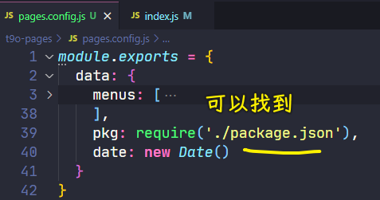

> 图中这个配置放的位置是项目`zce-gulp-demo`里边，可不是`t9o-pages`这个模块里边

`pages.config.js`里边的关于`data`这一段代码它会出现的是我们当前这个项目目录下面，所以`pages.config.js`去找当前目录下的这个 `package.json` 是没有任何问题的

为啥要把`data`这放到`pages.config.js`这里面？

一来是运行能过得去。二来是这些`data`数据它本应该属于我们这个项目`zce-gulp-demo`，而不应该属于这个公共的模块`zce-pages`。

所以基于这两个原因，我们把它提取出来了。

提出来过后，我们回到我们这个模块里面来 -> 这个时候这个模块里面就缺少一个 `data` -> 所以这个 `data` 可以怎么来呢？

这个时候我们就需要动态的去 `require` 一下当前项目下的那个`pages.config.js` 了

做法也很简单，我们先去定一个变量，叫做`cwd` -> 让它等于`process.cwd`方法的一个返回值。

`cwd` 这个方法它会去返回你当前这个命令行它所在的工作目录 -> 例如我们此时去通过我们刚刚那个命令`yarn build`去运行 -> 这个时候对于 node 来讲的话，我们的命令行的当前工作目录，就是`zce-gulp-demo`这个目录


所以我们可以通过这个`process.cwd()`去拿到当前工作目录。

有了这个工作目录过后，这个工作目录下面就应该有一个配置文件，我们可以尝试着去载入一下这个配置文件。

在`index.js`里边我们可以去 `let` 一下 -> 为什么用 `let` 呢？

原因很简单，你待会去读这个配置文件，你可以去尝试读。但是万一这个项目没有配置文件的话，那你这个代码不应该报错，你可以有一些默认的配置出现，那这样话肯定是更健壮一些。

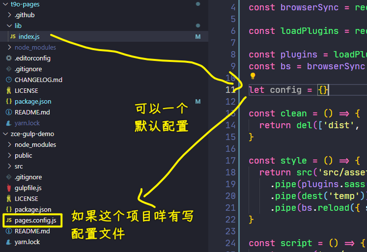

所以说我们 `let` 一个 `config` 然后在下面去 try 一下 -> 那 try 什么呢？

try 的实际上就是 `require` 的那个配置文件的操作

`require` 一个不存在的地址的话，那它会报错。总之我们用 `try catch` 去包装一下：

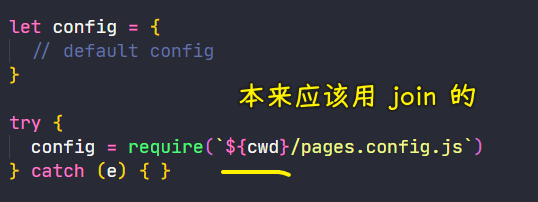

这里`require`一个配置文件的最好的方式 -> 还是应该用 `path.join` 的方式去把这两个路径连接到一起 -> 我们这儿就直接通过这种字符串拼接的方式去走了。 

有了这个操作过后，来到`catch` -> 这错误我们实际上是不需要去处理的。因为你如果走了`try`，`try`失败了的话，那它这个`config`对象实际上就是一个空的对象了 -> 如果说你要有一些默认的选项，你可以放到`config`这个对象里边，然后你再通过这个 `require` 的方式去载入。

当然，如果说你有默认的配置话，那最好的方式还是通过另外一种方式 -> 什么样的样另外一种方式呢？我给大家看一下。

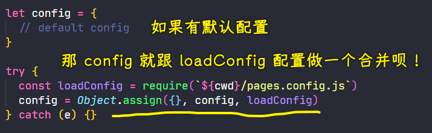

> `Object.assign({}, {age: 18}, null)` -> `{age: 18}`

你如果有默认的配置，那这个`try`里面的配置应该跟我们的默认配置做一个合并，而不是去把它覆盖掉

所以我们最好的方式应该是通过`Object.assign`方法去合并两个对象。我们先传一个空对象，这样的话，这复制出来就是一个新的对象，然后把 `config` 放在前面，然后 `loadConfig` 放在后面 -> 那这样的话，`loadConfig`就会覆盖掉 `config` 里面的成员，然后得到一个新的对象 -> 这样一来，我们这个 `config` 就是一个被合并过后的结果了。

此时这个 `config` 里面就应该有 `data` -> 那我们就可以把后面的这个 `data` 换成 `config` 的 `data`

我们找到 `data` 所在的位置：

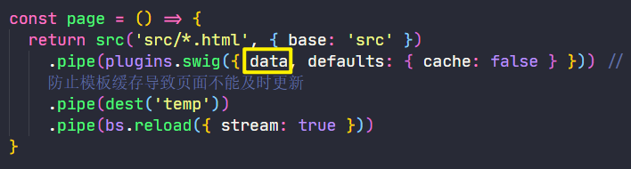

这个地方就不能再用简写的方式去写了，我们必须要用 `data` 等于`config.data`

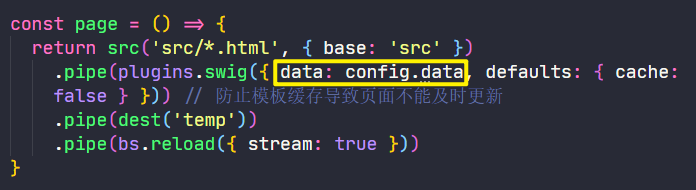

这一步的改正已经完成了，我们回到终端，我们尝试着运行一下这个 `build`

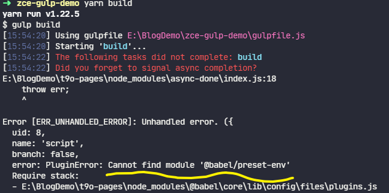

这个时候你会发现 `build` 这个任务其实就不会再去报刚刚那样一个错误了。

但是它又报了另外一个错误，这个错误的信息是：

> PluginError: Cannot find module '@babel/preset-env'

`@babel/preset-env`这个名字其实我们应该很熟悉，因为我们刚刚创建这个工作流的时候，我们用到了这个模块，这个模块其实就是我们在使用 babel 的时候去指定的一个 `presets`


这个问题其实也好解释，大家这样去想：

之前我们去创建那个工作流的时候没有问题 -> 我们在 `gulpfile` 里面去定义的那个 babel 的转换 -> 它会通过 `presets` 去找对应的那个 `preset` 模块，然后通过这个 `preset` 去转换我们的那个 ECMAScript 的代码 -> 这个时候它找的规则是到你项目的根目录下的 `node_modules` 里面去找一个叫做 `@babel` 然后 `preset-env`这个模块，但是此时你这个项目下面并没有一个`@babel/preset-env`模块

这个模块它已经被你刚刚提取的这个公共模块`zce-pages`包装进去，那这个时候你在项目这边去使用的话，它自然而然就出了问题。

解决这个问题的方式很简单，我们把这个 `presets` 配置做一个修改 -> `presets` 它最简单的方式是传一个字符串，那 babel 工作的时候会自动去 `node_modules`里面找。

还有一种方式就是直接去载入一个 `preset` 对象 -> 通过 `require` 的方式去载入它就可以正常工作了。

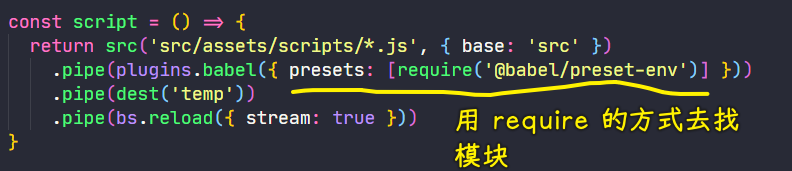

这原因很简单，因为 `require` 的方式去找这个模块，它是先到当前这个`index.js`文件所在的这个目录（`lib`目录）

在 `lib` 目录下去找有没有这个`@babel/preset-env`这个模块 -> 显然，这肯定是没有的 -> 接着它会依次往上找，往上找就是`zce-pages`的根目录了。

`zce-pages`模块的根目录下 -> `node_modules`旗下有一个`@babel`目录，该目录旗下你就可以找到这个`preset-env`模块：

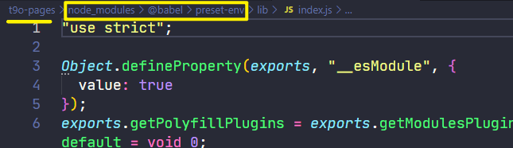

这样一来，我们这个`babel`操作就可以正常去工作了。

回到命令行，我们再来执行一下 `build`：

这个时候我们的这个 `build` 任务它就可以正常启动 -> 稍微等它一下，等它结束

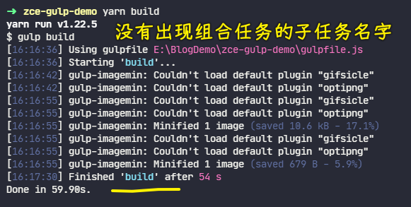

可能会有人疑问 -> 为什么这个地方它启动的时候有 `build` 名字，但是中间那些组合任务的子名字就没有出现呢？

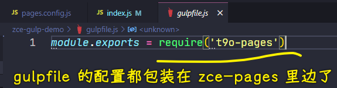

因为 gulp 在工作的时候，它是根据你的 `gulpfile` 推断出你的这些任务的名字 -> 而你刚刚是把这些任务全部包装到了`zce-pages`里面。

这对于这个 `gulpfile` 来讲的话，gulp 它就看不到那个任务的名字，它唯一知道的任务名字就是你启动的这个任务名字，所以说它就没有打印那些日志。

当然，那些任务名字，其实对大家来讲有意义，但也没有意义。

你要想要它话，你可以简单的通过解构的方式去解构那些任务，然后再单独去导出这些任务。

``` js
const { taskName } = require('zce-pages')
```

这样的话 `gulpfile` 就可以推断出这些任务的名字了。但是这对于我们来讲的话，这没有什么太大意义，所以我们这就不用去做这个操作了。

此时我们重点需要去关注一下的就是刚刚提出来这个模块，它能不能去满足我们的要求

我们看一下最终生成的 `dist` 里面。

首先 `index` 被压缩了是正常的：

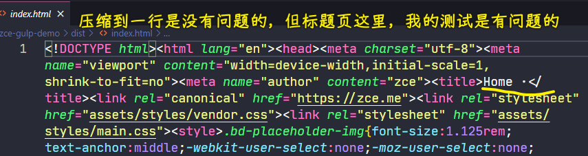

然后完了过后，我们再去看一下那些数据有没有被替换进来。

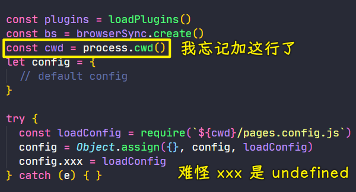

添加`cwd`后的测试：

首先这个`index`的标题页是没有任何问题的：

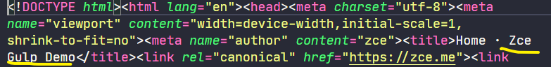

对于标题我们在 `layouts` 里面是这样定义的：

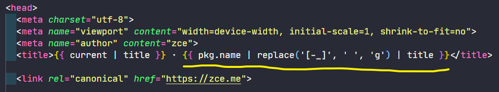

这个标题读取的是`package.json`当中的 `name` ->  然后后面这个是模板引擎的替换语法 -> 把那种中划线和下划线替换成空格 -> 最后把它用 `title` 这种方式就是手写字母大写的这种方式去转换了一下。

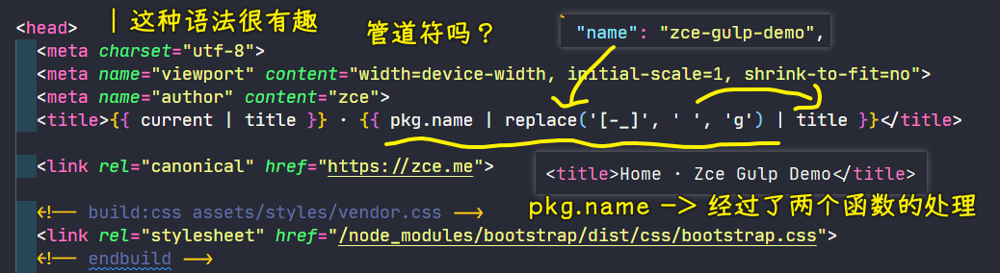

可以看到，这个模板填充也是没有问题的 -> 这也就意味着我们对这个 `gulpfile` 提取是 OK 的。

---

关于那个`imagemin`的问题，我安装了最新的它`^8.0.0`，结果在`yarn build`的时候：


原先的是`"gulp-imagemin": "^6.1.0"`版本

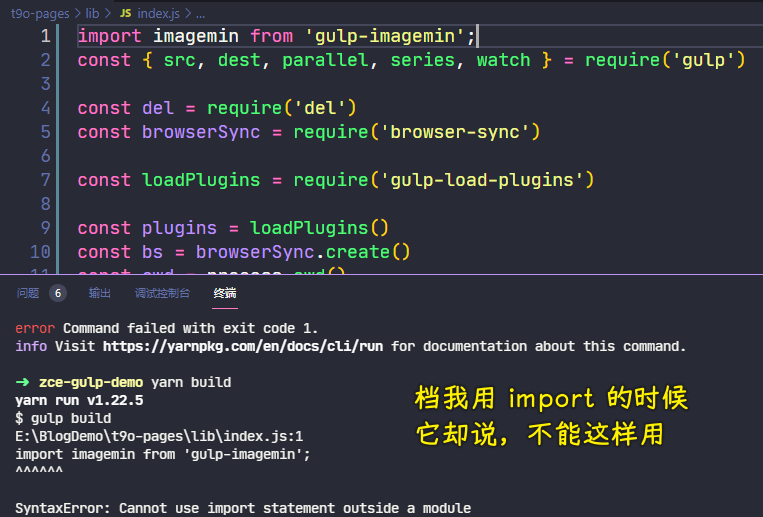

如何用`import`？

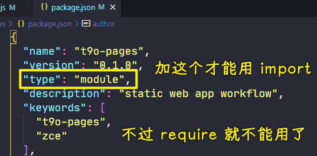

测试：

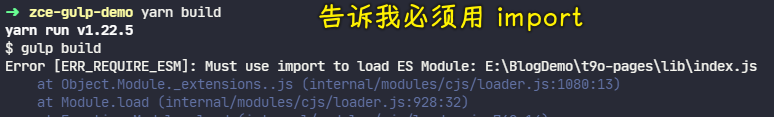

原因：

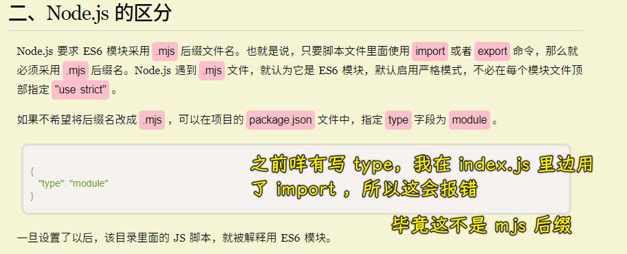

最终，我还是改为`^6.1.0`这个版本

总之，在 node 应用里边，默认的`js`文件，默认用 `require`的，是不能用 `import` 的！

如何才能安装这四个包？

* [gifsicle](https://github.com/imagemin/imagemin-gifsicle) — 压缩 GIF 图像
* [jpegtran](https://github.com/imagemin/imagemin-jpegtran) — 压缩 JPEG 图像
* [optipng](https://github.com/imagemin/imagemin-optipng) — 压缩 PNG 图像
* [svgo](https://github.com/imagemin/imagemin-svgo) — 压缩 SVG 图像

配置代理 -> 直接在命令行终端执行这个（这种做法只作用于当前终端中，不会影响环境，而且命令比较简单）：

``` bash
export http_proxy=http://127.0.0.1:1080;export https_proxy=http://127.0.0.1:1080;
```

> 永久做法是放到`.bashrc`里边


然后安装这四个包：

``` bash
yarn add imagemin-jpegtran imagemin-svgo imagemin-gifsicle imagemin-optipng
```

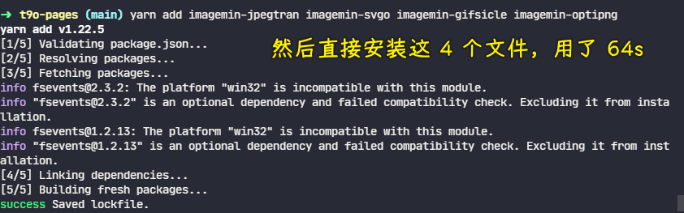

效果：

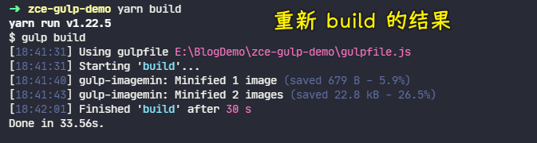

了解更多：

- [按键 require，import 区别？ - 寸志的回答 - 知乎](https://www.zhihu.com/question/56820346/answer/150724784)
- [Node.js 如何处理 ES6 模块 - 阮一峰的网络日志](https://www.ruanyifeng.com/blog/2020/08/how-nodejs-use-es6-module.html)
- [sindresorhus/gulp-imagemin: Minify PNG, JPEG, GIF and SVG images](https://github.com/sindresorhus/gulp-imagemin)
- [记 gulp-imagemin 安装时遇到的问题 · Issue #8 · frmachao/frmachao.github.io](https://github.com/frmachao/frmachao.github.io/issues/8)
- [node-gyp 的作用是什么？- 知乎](https://www.zhihu.com/question/36291768)
- [关于 NPM 安装模块失败的问题_皮蛋很白的博客-CSDN 博客_npm 安装失败](https://blog.csdn.net/u012961419/article/details/117926800)
- [NodeJS Imagemin - 知乎](https://zhuanlan.zhihu.com/p/91035613)
- [gulp 常用插件之 gulp-imagemin 使用](https://www.shuzhiduo.com/A/obzbPaq65E/)
- [gulp 常用插件汇总](https://www.cnblogs.com/jiaoshou/p/12003709.html)
- [Linux 让终端走代理的几种方法 - 知乎](https://zhuanlan.zhihu.com/p/46973701)
