### ✍️ Tangxt ⏳ 2021-11-01 🏷️ 工程化

# 14-封装工作流 - 抽象路径配置

## ★封装工作流 - 抽象路径配置


至此，我们这个自动化构建工作流的模块`zce-pages`，就算是完成了，但是这个里面还有一些地方我觉得可以做一些深度的包装。

这具体来看就是 -> 对于咱们在这个代码里面写死的一些路径 -> 这些路径在我们使用者使用的项目当中，它实际上就可以看作是一个约定 -> 约定固然好，但是**有的时候我觉得提供可以配置的这种能力的话也很重要**。

为什么呢？

因为在我们这个项目当中，如果说我们要求项目的这个 `src` 目录不是叫 `src` -> 必须是一个别的目录话，那这个时候你可以通过配置的方式去覆盖，那这样的话这可能会更灵活一些。

所以我们接下来就来看一下怎么样去把这些灵活的配置给大家抽象出来。

我们回到这个`zce-pages`模块的 `index` 的文件，在这个 `index` 文件里面我们要做的一些事情，其实就是把项目当中写死的一些`src` 、`temp` 这些路径 -> 我们全部给它抽象出来形成配置。

抽取出来了过后，我们就可以在我们刚刚所约定的这个配置文件`pages.config.js`里面去覆盖掉。

我们在配置文件里面先加一些默认的配置 -> 这样完了过后，我们后续就可以通过`pages.config.js`去覆盖了

定位到`index.js`的`config`变量

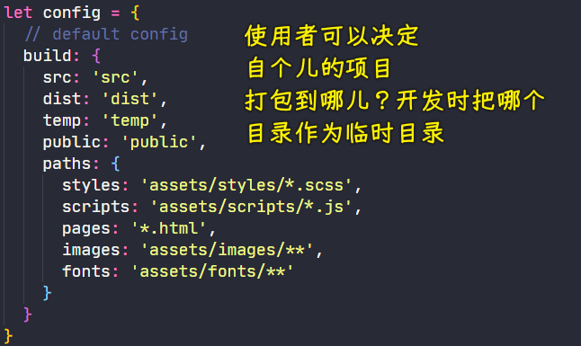

我们定义一个 `build` 属性：

- 在 `build` 里面我们去约定一下 `src` 目录 -> 默认是`'src'`
- 然后`dist` 目录默认是 `'dist'`
- `temp`目录默认是`'temp'`
- `public` -> `'public'`

可能在目前来看的话，你可能觉得这个没有什么太大意义，但是待会它就可以通过我们的那个项目当中的配置文件去覆盖，那这个时候就显得有意义了。

除此之外，这几个基础路径有了过后，我们还需要去把这些文件所在的这个路径也给它提取进去：

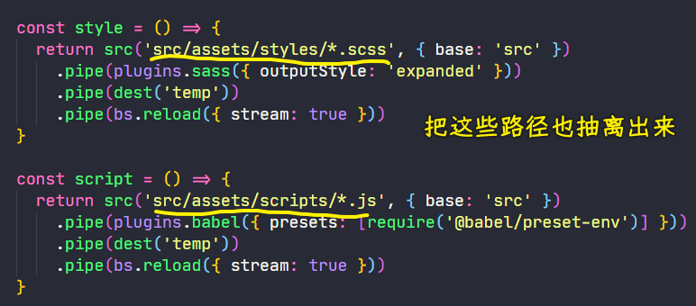

这样的话我们就可以在后面使用的时候灵活去配置，我们再加一个 `paths` 属性 -> 它是一个对象 -> 我们可以在这个`{}`里面去放 `styles`  

同样一个道理，`scripts`、`pages`也是如此

除此之外，还有`image`、`fonts`

我们都是以复数方式去命名的。 

这样一来，我们这个配置就算是有了。

有了这个配置过后，我们就需要回到我们的这个代码当中去把我们刚刚写死的这些地方全部换成我们在这个`config`里边配置的这些数据

我们从上到下依次来去换。

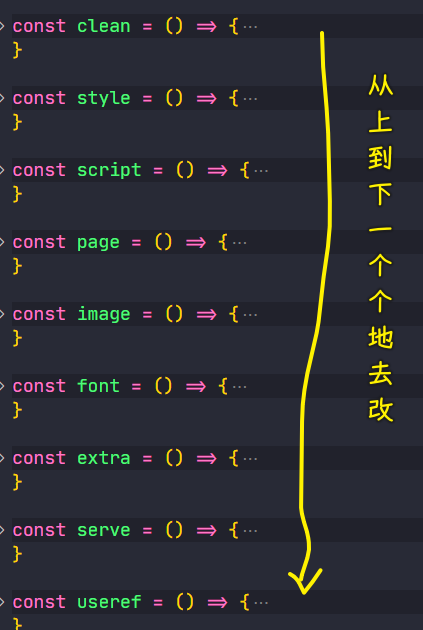

首先第一个，针对于这个`clean`操作里面的这个 `dist` 我们就应该换成`config.build.dist`

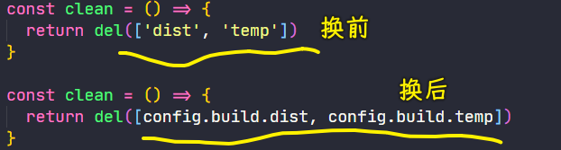

同样一个道理，后边的也是这样去换

来到`style`任务：


针对于前面这个传给`src`的路径的话，我们可以通过字符串拼接的方式去拼接，也可以直接这样去用

我们之前原始的路径是`'src/assets/styles/*.scss'`，如果说你直接`config.build.paths.styles`这样去配的话，这肯定会有问题的。因为我们找到是`src`目录下的，而我们配置的是`'assets/styles/*.scss'`，即`assets`目录下的，显然用配置的，是找不到 sass 文件的

那这个时候我们可以怎么办呢？我们可以回到这个 `src` 方法里面的选项当中去添加一个选项，这个选项叫做`cwd` -> 该选项是说你去找这个`config.build.paths.styles`路径，那你应该从哪一个路径去找呢？ -> `cwd` 默认是当前项目所在的目录，也就是我们运行的时候就是这个`zce-gulp-demo`这个目录 -> `cwd: config.build.src`的`config.build.src`就是指定从当前这个工作目录下的`src`里边去找

那这个时候我们所配置的这个路径它就是正常的了。

这个`style`改完了过后，同样一个道理，我们把这个操作复制一份出来

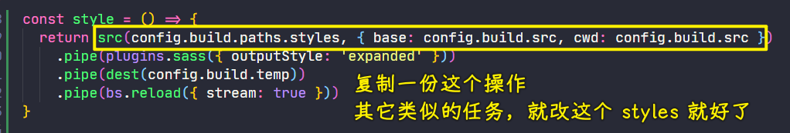

注意，`style`任务里边，还有个 `temp`要改，这些地方修改的时候，请仔细一点，当然，即便你不仔细，后面报了错过后你去解决也是一样的。

同理，其它`script`、`page`、`image`、`font`、`extra`也是如此

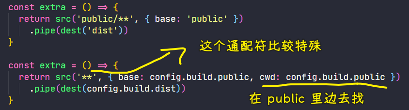

再往下看，下面的这一些配置也是类似的：

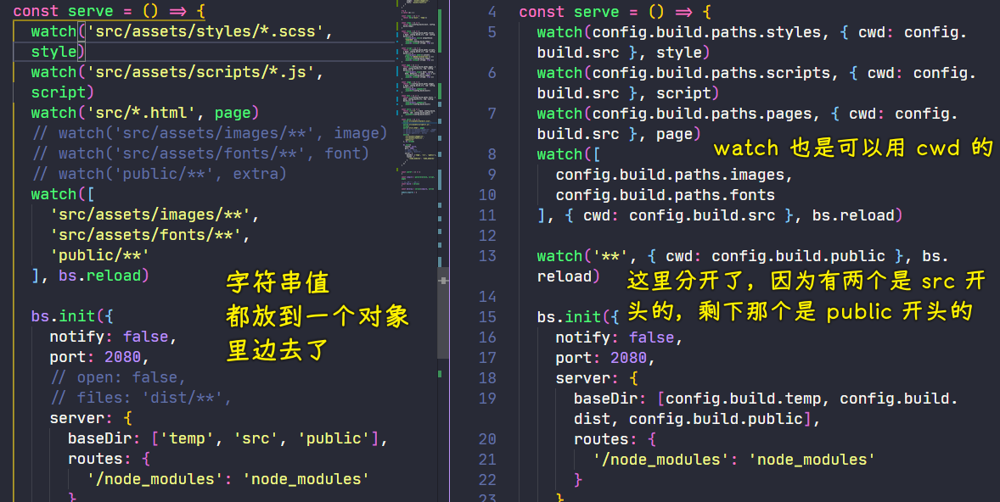

`watch`的`cwd`也可以通过给它传第二个参数的方式传进去。

对于 `public` 目录，它们的`cwd`肯定是不一样的 -> 所以我们就不能再去把它们放在同一个 `watch` 任务当中。如果你要放在同一个`watch`当中，你可以去拼接一下路径，当然，我建议你再单独抽出来一个任务，然后再去指定一下它的`cwd`

`serve`任务里边的路径改完后，接下来就改`useref`

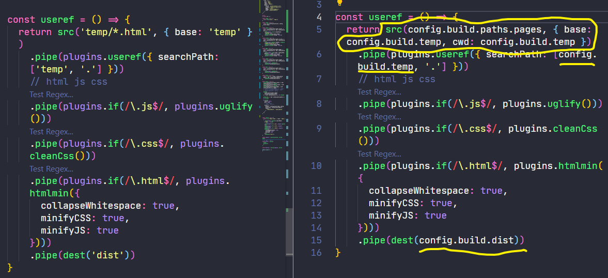

`searchPath`的这个`'.'`是不用修改的，因为都是项目根目录 -> 项目的根目录肯定不可能变的。 

至此，关于所有的这个路径，我们需要修改的地方都已经修改完了 -> 我们再重新检查一遍，从上到下，没有看到写死的路径那就 OK 了

我们保存一下，我们回过来再去试一下。

虽然说这个时候我们在我们项目的配置文件`pages.config.js`当中并没有去加对应的配置，但是我们在我们抽象的这个模块`zce-pages`当中其实已经支持配置了，而且它现在走的应该是默认的配置，我们来看能不能正常工作

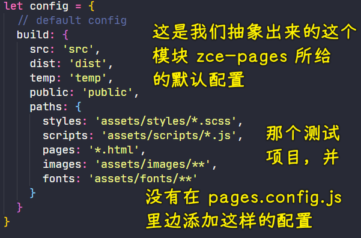

``` bash
yarn build
```

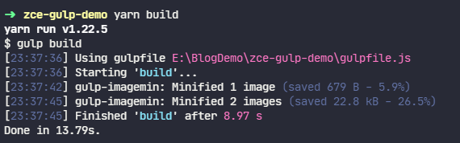

`build`完的结果是正常的，这应该就没有什么太大问题了：


我们再试一下 `develop` 这个任务。

``` bash
yarn develop
```

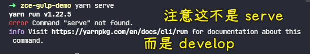

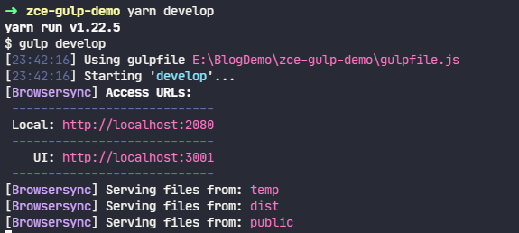

`develop`启动起来后，这仍然可以唤醒浏览器窗口，浏览器也能打开正常的页面：


这个测试应该也是没有任何问题的。 

这个时候对于我们抽象出来的这个配置，应该也就没有任何问题了。

完了过后，我们就可以尝试着在我们的项目当中的这个配置文件里面也添加一个 `build` 选项。

这个时候我们就可以去覆盖掉任何一个路径的结构了。

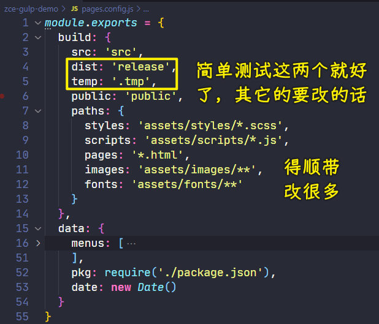

比如说我们把这个`temp` ，因为其它的要改话，我们改的地方还有很多 -> `temp` 我们放在一个`.tmp`里边 -> 一般，我们项目的临时文件都会放在一些以`.`点开头的目录。

为什么要`.`开头的目录呢？因为在 Mac 上面点开头的目录，默认就是隐藏目录，像这些临时文件实际上是不需要开发者去管理的。所以我们一般把它做成隐藏目录。

然后这个 `dist` 目录，我们也给它改一个`release`

保存一下 -> 这个时候我们再来去运行一下 `build`

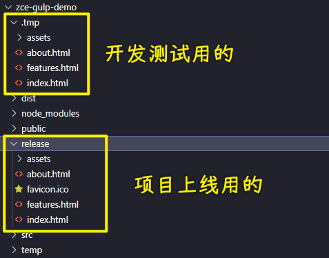

这个时候你会发现临时目录已经变成了`.temp`目录，然后发布完的结果会放在 `release` 这个目录。

那这样的话我们这一个针对于我们抽出来的这个模块里面需要完全抽象出来的东西就已经完成了。

其实核心还是在于 -> 我个人觉得，这几天也一直在想，对于开发者来讲的话，一开始需要的一些技能，然后完了过后其实还是需要你有想法，那想法建立在技能基础之上 -> **就是你的技能能满足你的想法的时候，那这个时候你的想法越多越好，你想法越多，你尝试的可能性也就越多，你获得的东西也就越多**。所以这个是我们额外加出来一个小东西，大家需要去了解一下。

> 技能很重要，想法也很重要！它们俩相辅相成 -> 老师写的`caz`脚手架就是这样！

---

补充

`clean`的测试：

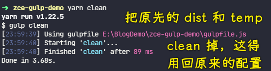

`develop`的测试：


在测试的时候去`release`里边找字体和图片吗？我记得是去`src`里边找的啊！

修改配置：

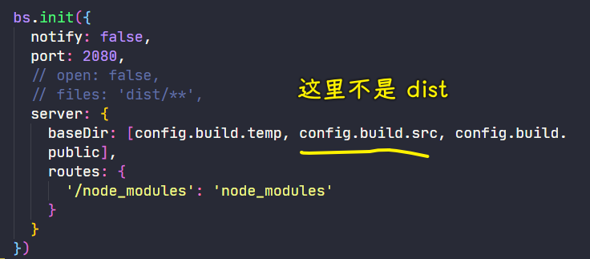

再次测试：

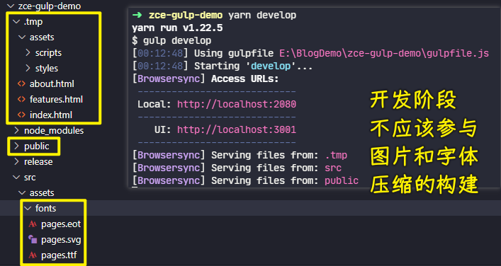