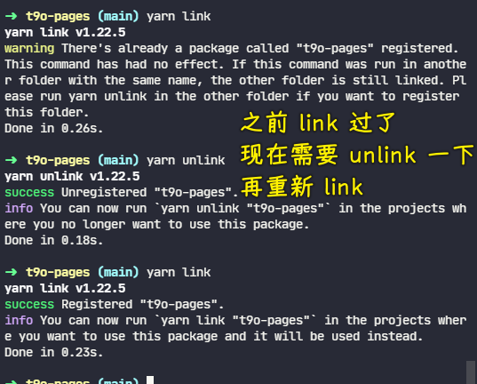

### ✍️ Tangxt ⏳ 2021-11-02 🏷️ 工程化

# 15-封装工作流 - 包装 Gulp CLI、封装工作流

## ★封装工作流 - 包装 Gulp CLI


至此，`zce-pages`这个自动化构建工作流模块就算是完成了，但是我们其实还可以做一些更多的操作，让我们在使用它的时候更加方便一些。

这具体需要做哪些操作呢？ -> 我们具体来看

在使用这个`zce-gulp-demo`项目的时候，我们想要去使用我们`zce-pages`里面提供的这个自动化构建的工作流的话 -> 我们首先需要把它安装到我们的项目当中，然后完了过后，在我们项目当中去添加配置文件，这个配置文件是必要的，对吧？然后再往后，我们需要在项目的根目录下去添加一个 `gulpfile` 去把我们在`zce-pages`里面提供的这些工作流的任务给它导出出去，然后我们才可以通过 gulp 去运行它。

其实这个 `gulpfile` ，对于我们这个项目来讲话，你存在的价值就是把我们提供的这个模块里面的成员给它导出去 -> 这个其实就显得有些冗余了，每次要去做一个重复的操作没有什么太大意义 -> 我们就希望在项目的根目下没有这个 `gulpfile` 它也可以正常工作。


所以这个地方可以怎么去操作呢？

我们删除一下这个 `gulpfile`，删除后我们回到命令行当中，`yarn gulp`一下：


它会告诉我们找不到 `gulpfile` 文件，那这个时候它就没有办法正常工作了。但是 gulp 的 CLI 它提供了一个命令行参数，可以让我们去指定这个 `gulpfile` 所在的路径。

``` bash
yarn gulp --gulpfile ./node_modules/zce-pages/lib/index.js
```


可以看到，它仍然是可以正常工作的，只不过找不到一个叫 `default` 的任务罢了。那我们可以去运行一个 `build` 的任务来做一个尝试。


可以看到，这仍然是没有任何问题的，但是这个时候它会有一个小小的问题 -> 那这是什么呢？

它这个时候的工作目录已经变到了`lib`这个目录下面，因为你的 `gulpfile` 在`lib`目录，它会认为你的工作目录也在`lib`目录 -> 此时它就不会把你项目所在的根目录去作为当前的这个工作目录了。

你要想去指定一下当前项目的根目录，作为工作目录的话，你可以再指定一下`--cwd .`（点就是当前目录）。


此时你的工作目录就是当前目录 -> 你可以仍然正常的去使用这个工作流。只不过这个任务的执行过程我们需要传参数 -> 这就比较复杂了。

对于这个地方我就产生了一个想法，什么想法呢？就是在我们的这个`zce-pages`当中也提供一个 CLI，那这个 CLI 里面我们自动的去传这些参数，然后在内部去调 gulp CLI 提供的这个可执行程序。

那这样的话我们在外界使用的时候就不用再去使用 gulp 了，我们就相当于把 gulp 完全包装到我们这个 `zce-pages` 这个模块当中。

这具体怎么操作呢？ -> 当然，对于这一点你肯定还有还会有一些疑惑，但不用着急，我们一步一步来走，走到后面你就应该明白了。

我们先在我们的这个`zce-pages`下面去添加 CLI 的程序

我们在`zce-pages`旗下新建一个目录。一般来讲的话，你的项目的模块代码放在`lib`下面，然后你对你项目当中 CLI 的代码一般放在`bin`目录


我们创建一个`bin`目录。然后这个`bin`目录下面我们新建一个`zce-pages.js`文件 -> 这个文件会作为 CLI 的一个执行入口 -> 既然它是 CLI 的执行入口，之前我们也说过，它必须要出现在我们这个 `package.json` 当中的`bin`字段里边，我们要在`package.json`里边添加一个`bin`字段


关于`zce-pages.js`这个文件的名字，它叫什么？其实无所谓。一般来讲的话，我会将这个名字起名为跟我们这个最终 CLI 命令的那个名字保持一致。你要是想指定那个 CLI 命令的名字的话，你可以把 `ban` 字段配置成一个对象，那对象的话，那你这个键就可以随便写了。

比如说我们叫 `zp` 这个简写，然后路径的话还是刚刚这个路径。


那这个时候它最终生成的那个 CLI 命令的名字就是 `zp` ，只不过这个容易产生冲突，所以说我们还是使用模块的名字会保险一点

保存一下过后，那这个时候，`bin/zce-pages.js`它就会作为我们的这个 CLI 的一个入口。

那 CLI 入口它就需要有一个声明的注释


这是必要的一个条件。当然，之前也说过，在 Mac 下的话，你需要将这个文件的那个读写权限修改为 `775`，这样它才会做一个 CLI

我们测试一个打印 -> 保存一下。这个时候`bin`下的`zce-pages.js`就会作为一个 CLI 的一个入口出现。

有了这个 CLI 入口过后，我们就可以回到我们这个`zce-pages-demo`项目当中去使用这个`zce-cli`了。

在使用之前，我们定位到`zce-pages`这个目录，我们需要重新`link`一下`zce-pages` -> 因为你只有重新去 `link` 了，那它才可以把那个 CLI 注册到全局，我们才可以去使用它



`link` 完了过后，我们其实就可以在命令行里面去运行一下这个`zce-pages` -> 回车这时候，它就会执行`zce-pages.js`里面对应的一些代码：


我只需要把对 Gulp CLI 的调用以及我们刚刚传的那些复杂的参数放在当前这个`zce-pages.js`文件当中就可以了。

那我们这个地方应该怎么样去用呢？

我们可以先看一下那个 Gulp CLI 它是怎么工作的，我们在项目的目录下面去找到`node_modules/.bin/gulp.cmd`

`gulp`它在 Windows 上执行的应该是一个 `cmd` 文件 -> 它执行的是一个 `cmd` 文件。

在这个 `cmd` 文件当中，实际上按照命令行的那个语法去写的一段代码：


这个代码，其实你可以说你不会写，但是你看懂它应该没有什么太大问题。

它很很简单。首先 `if` 指令就是用来判断 `exit` 是否存在。

这个`%~dp0`指的是当前这个 cmd 所在的这个目录，也就是我们这个`.bin`目录，它判断你这个`.bin`目录下面有没有一个`node.exe` -> 如果有，那就走这个，否则就走下面这个。

首先我们这个`.bin`目录下肯定是没有`node.exe`。我们的 `node.exe` 是安装在全局环境的，所以说这肯定是走下面的。


而下面一块儿，对于上面这两个操作，其实就是配置了一下环境变量，让我们的那个可执行文件名字加了一个就是`.js`这种扩展名，这个其实不用管它，重点要管的是下面这个 -> 下面这个实际上是通过`node`去执行了一下当前这个目录下，也就是`.bin`目录，然后`..`就是上一层目录也就是`node_modules`，然后就是`gulp`模块下的`bin/gulp.js`文件 -> 这个 JS 文件里面实际上是 `require` 了一下这个`gulp-cli`，它返回了一方法，然后调用了一下这个方法。

其实我们要想在这个`zce-pages.js`里面去运行 gulp 的话 -> 这很简单，我只需要去执行一下这个`gulp.js`文件就好了 -> 载入了这个`gulp.js` -> 那它就会自动去载入`gulp-cli`


针对于命令行的参数，那该怎么去传递呢？待会我们再来看

我们现在看一下它能不能去运行 gulp ：


可以看到，它这时候报了 `gulpfile not found` -> 这也就意味着这确实是让 gulp CLI 工作了

那剩下的就是我们怎么样去指定那个 `gulpfile` 的路径以及 `cwd` 路径。

你要知道我们在命令行当中传递的参数，我们可以通过 `process.argv` 去拿到。`argv`它是一个数组，我们可以尝试着再来走一下。


比如说在执行`zce-pages`时随便传一些东西在里面。可以看到，这个 `argv` 前两个：

- 第一个是 `node.exe` 这是固定的
- 第二个是这个当前文件的路径，这也是固定的
- 然后后面就是我们所有的参数

那也就是说在 gulp-cli 当中，它实际上是通过 `process.argv` 去拿到所有的参数的。

所以，我可以在`zce-pages.js`代码运行之前，我先往这个 `argv` 当中去 `push` ->  `push` 是什么呢？ `push` 我们刚刚需要传递进去的参数。


首先第一个`cwd` -> 对这个`cwd`我们指定的一个路径是 -> 因为`argv`是数组，每个参数应该是数组当中独立的成员，我们应该单独去 `push` -> 所以，这个工作目录应该是当前命令行所在的目录

除此之外，我们还要去`push`一下那个 `gulpfile` 所在路径。

`require`载入这个模块，`resolve`是找到这个模块所对应的路径，它里面传递的这个字符串参数是相同的，都是通过相对路径的方式去传 -> 我们这儿要找的就是`..`上一层目录下的 `lib` 下面的 `index`

实际上对于我们这个`zce-pages`项目来讲的话，其实直接传`..`就行了，因为你找到上一层目录，找的就是我们这个`zce-pages`所在的一个目录，那它会自动去找`package.json`当中 `main` 字段里面对应的那个文件，所以这同样也是相对于那个`bin/index.js`文件的路径，所以说我们`resolve('..')`就可以了。

这个时候我们不着急去 `require` `gulp-cli`，我们打印一下`argv`

可以看到，它就会跟你传递进去的那种参数方式是一样的了。你看我们传进去的参数 -> 相当于是键`--xxx`是一个数组当中的成员，值`yyy`也是数组当中成员。

你自己通过 `push` 的方式 `push` 进去的也是一样的。所以说这种方式就可以工作了，我们来试一下来。

我们要工作的目录不是在当前这个`zce-pages`项目目录

我们应该是进入到我们真正的静态页的项目里面。

在这个`zce-gulp-demo`目录下面的话，我们就可以直接通过`zce-pages build`去构建


可以看到，`zce-pages`会自动找到`lib`目录下的`index.js`那个配置

而工作目录就是当前这个`zce-gulp-demo`目录，所以这仍是可以正常的去 `build` 的

我们再去执行一下 `clean` -> 这同样也是没有任何问题的。


至此，就不再要求你项目`zce-pages-demo`的根目录下必须要有`gulpfile.js`了

而且，如果你把这个`zce-pages`模块作为全局的模块安装话，那你甚至都不需要为这个`zce-pages-demo`项目去安装这个`zce-pages`依赖，那这样的话，我们在后续使用的时候就会更加方便一点。

所以针对于这个操作，其实是一个 Y 操作，但是这会让使用的时候更加方便 -> 这个相当于我们彻底把 gulp 给它完全集成到我们这个`zce-pages`模块当中，那我们就不需要再去安装 `gulp`、`gulp-cli`那些东西了，我们把这些全部都包装到我们`zce-pages`这个模块当中了。

接下来我们会把这个模块发布一下，发布过后我们再到我们的项目当中去看一下怎么样去具体使用它。

然后我再梳理一下刚刚我们这个 CLI 的一个工作的原理。

---

运行`t9o-pages build` -> `node.exe` 执行 `t9o-pages` 这个模块下的`bin`目录下的`t9o-pages.js` -> 会得到几个参数


`require('gulp/bin/gulp')`会去执行`gulp.js`：


而`gulp-cli`的返回值：


所以，`t9o-pages build`就是`yarn gulp build --cwd . --gulpfile 模块的lib目录下的index.js` -> 执行该模块下`bin`目录下的`t9o-pages.js` -> 找到`gulp`模块下`bin`目录下的`gulp.js`，执行这个`gulp.js` -> `gulp.js`里边会调用`gulp-cli`导出的`run`方法 -> `run`方法会拿到参数配置（比如此时运行`t9o-pagse`的项目目录、`t9o-pages`的`gulpfile`配置，这个在它的`lib/index.js`里、要执行的任务`build`） -> 得到了你想要的结果


---

➹：[node 的路径解析 require.resolve - 掘金](https://juejin.cn/post/6844904055806885895)