### ✍️ Tangxt ⏳ 2021-11-02 🏷️ 工程化

# 16-封装工作流 - 发布并使用模块


接下来我们就来把这个模块儿去发布到 npm 的仓库当中，我们再到一个新的项目当中去使用一下这个模块儿提供的 CLI 以及它提供的自动化构建工作流。

不过我们在去发布之前，先需要去做一个小小的改动，我们在这个 `zce-pages` 这个模块儿当中，它有一个小小的问题，就是我们在通过 npm 去 `publish` 的时候儿，它默认会把项目根目录下的一些文件和我们在 `package.json` 当中的 `files` 这个节点当中配置的对应的目录发布到 npm 的仓库当中。

我们默认创建这个项目的时候，`files`它只有一个`lib`目录：

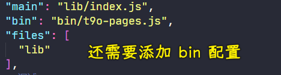

在这个 `files` 当中只有一个 `lib`，但是我们现在又加了一个 `bin` 目录 -> 所以说我们还需要去给它添加一个 `bin` 的配置。

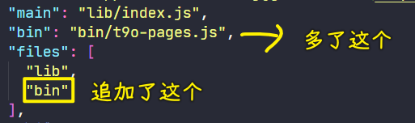

那这样的话， npm 再去发布的时候会把 `bin` 目录、`lib`目录，还有下面根目录的一些文件全部发布出去。

保存完了过后，我们就可以进到命令行当中去 `publish` 一下它。

``` bash
yarn publish
```

不过，在`public`之前，我们先通过 git 的方式先做一个提交 -> `push` 完了过后你再去`publish`。

`yarn publish`后回车。

此时，它会问你是否需要去迭代一下版本号，我们这给版本号做一个增加，因为之前我已经尝试发布过一次，所以说我这通过修改版本号的方式再做一个提交 -> `0.1.0` -> `0.2.0`

如果你用淘宝镜像源，那你`publish`是上不去的

所以你得需要再去修改一下你配置文件 -> 你如果不想修改配置文件的话，你可以去指定一个 `registry` 参数 -> 你用的多了，这些地址自然而然就能记得住。

``` bash
yarn publish --registry https://registry.yarnpkg.com
```

我`publish` 到`yarn`的那个镜像源 -> `yanr` 跟 npm 的镜像源是保持同步的。所以我们可以直接 `publish`到`yarn`那里去。

在`publish`过程中，执行了`npm run lint`，此时文件有更改，于是第一次`publish`完了过后，提交完代码到远程仓库后，我再`publish`了一次 -> 这次的版本是`0.2.1`

`public` 完成了过后，我们就可以在一个新项目当中去使用它了。

> [t9o-pages  -  npm](https://www.npmjs.com/package/t9o-pages)

新建一个项目目录：


这个项目当中它应该跟我们 `zce-gulp-demo`当中应该有相同的一个结构，就是 `public` 目录和 `src` 目录，以及这个 `pages.config.js`文件 -> 它们是一样的，我们可以把它们复制出来，然后到我们的这个新项目当中粘贴进去。

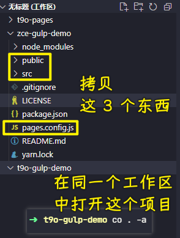

除此之外，我们还需要去初始化一下 `package.json` -> 我们打开命令行`yarn init --yes`

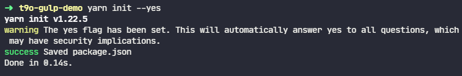

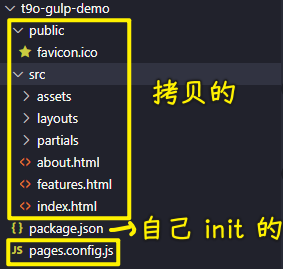

然后再通过`yarn`去`add`一下`zce-pages`这个模块 -> 安装到开发依赖。

``` bash
yarn add zce-pages --dev
```

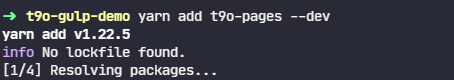

当然，如果说你在你的项目当中不想要去安装这个模块，你也可以全局去安装它，但是我们建议大家去安装到开发依赖当中，因为你想你这个项目拿到别人的机器上，别人的机器不一定全局会安装这个 `zce-pages`

所以说**把它作为开发依赖去安装实际上是最合适的**

这个安装的过程，因为会下载很多的包，所以速度会慢一些。

> 关于图片处理的模块又遇到了安装问题 -> 配置代理

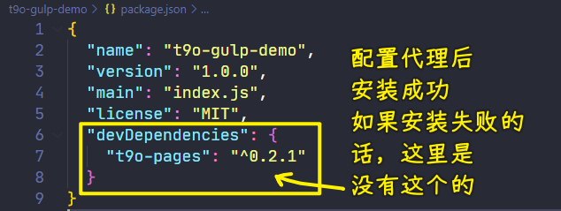

在这个过程当中，跟大家介绍一个我们刚刚这样一个操作可能会产生的一个问题，我们去 `add` 这个`zce-pages`，这个`zce-pages`模块是我们刚刚 `publish` 上去的 -> 对于国内的开发者来讲话，这经常会面临一个问题就是 -> 因为 `publish` -> 是 `publish` 到官方的那个镜像，而你安装的是从淘宝镜像里面往本地去安装。

那这个时候就会存在一个官方镜像往淘宝镜像同步的这样一个时间差的问题（每 10 分钟同步一次）。

如果此时你去安装的时候，中间时间间隔特别短的话，很有可能你安装的到的是老版本或者说根本找不到这个模块 -> 这个时候你要想解决它话，简单的方式就是到淘宝的那个 npm 镜像的 [地址](https://npmmirror.com/)，我们去找一下这个。


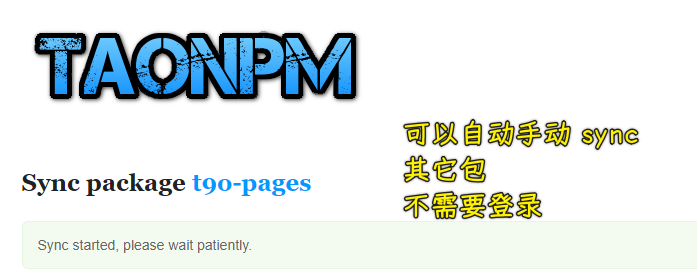

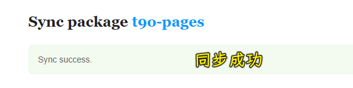

你看到这个：

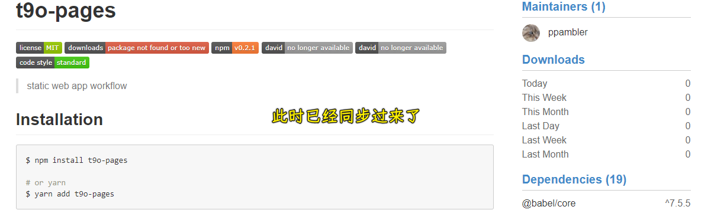

意味着它已经同步过来了。

总之，如果你的安装操作过程遇见这个问题的话，那你可以按照这种方式去操作

回过头来，这时候我们新项目安装的这个`zce-pages`已经完成了

安装完成了过后，按道理，我们在这个项目的`node_modules`当中就会有个`bin`目录，`bin`目录的最下面就应该有一个`zce-pages`的一个 `cmd` 文件。

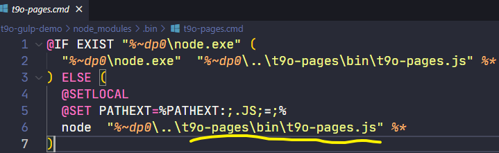

那它这个时候会执行我们`zce-pages`这个目录下面的`zce-pages.js`文件 -> 这个 JS 文件就是我们刚刚写的那个把`gulp-cli`给它包装到`lib`的一个工具。

回到我们的这个项目当中，我们就可以通过`yarn` 去运行这个`zce-pages` -> 然后去运行一下 `build` 任务。

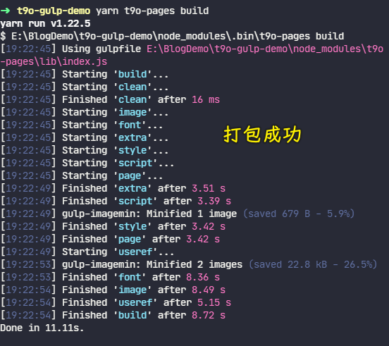

那这样的话，这相对于我们之前那种方式肯定是方便了很多，我们也不需要去考虑什么 `gulp` 安装， `gulp-cli` 的安装，对吧？

对了，我们在项目的这个 `scripts` 当中还得去配置几个脚本

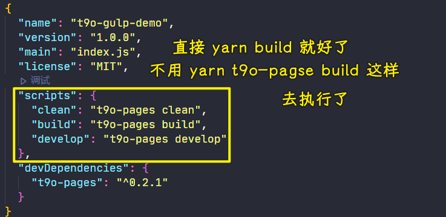

我们先定一个 `clean` 任务。直接通过`zce-pages`然后去运行 `clean` 

同样一个道理：

- `build` -> `zce-pages build`
- `develop` -> `zce-pages develop`

这三个任务都 OK 了过后，那你在你的项目开发过程当中直接去使用这个 `zce-pages` 就行了。

这样一来，我们在后续去使用这个模块的一个操作过程也非常的简单。

---

对了，在测试的时候，别忘了安装那 3 个生产依赖：

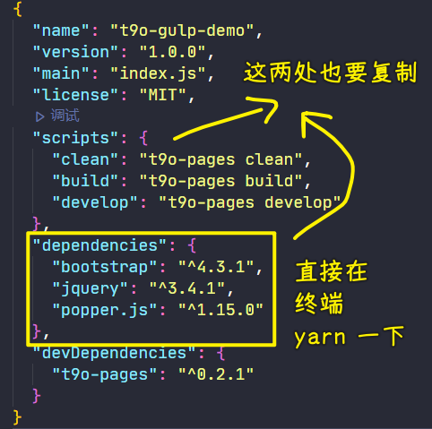

其它`yarn clean`、`yarn develop`的测试也是 ok 的！

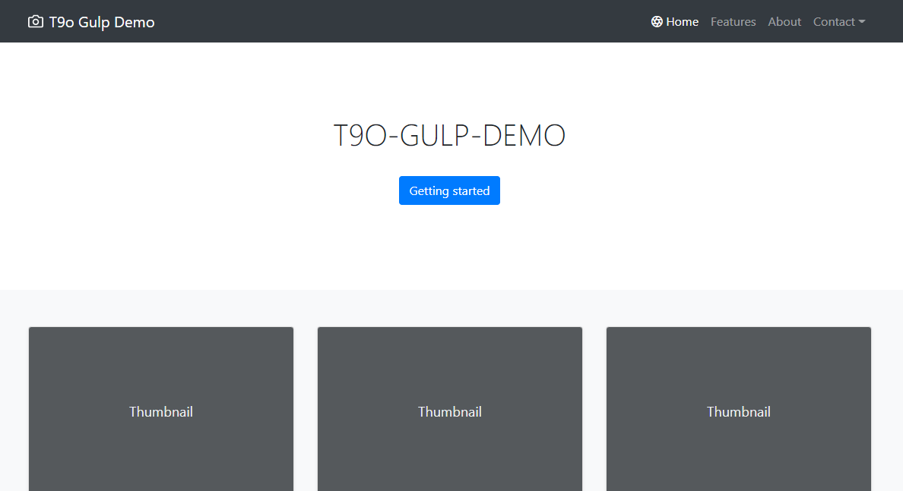
