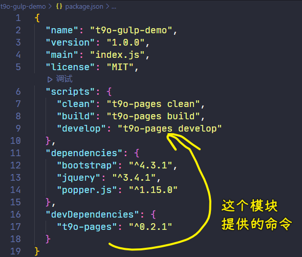
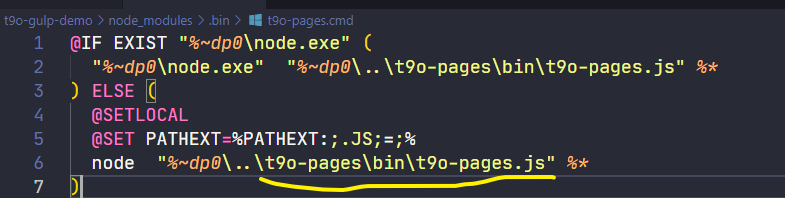
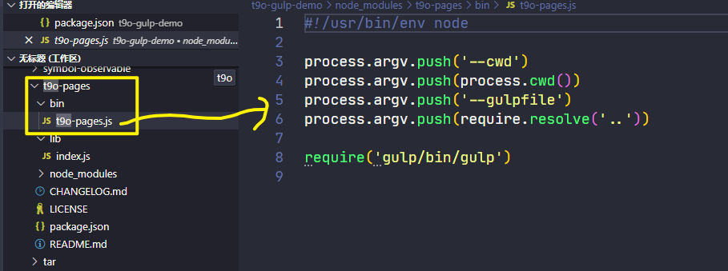
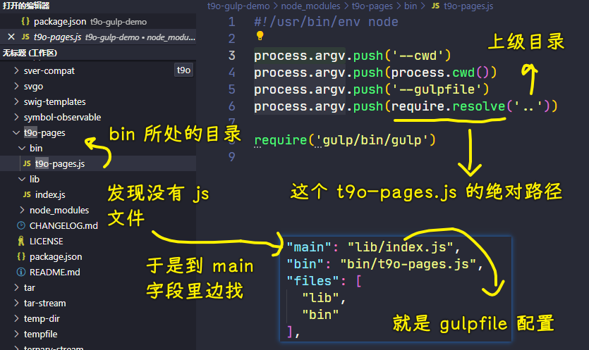
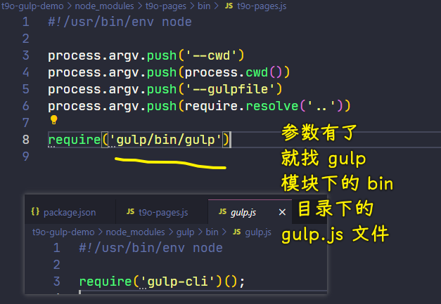
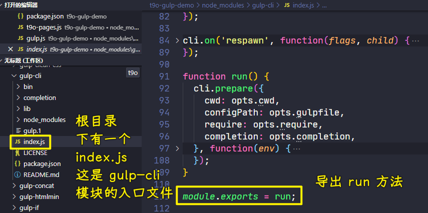

### ✍️ Tangxt ⏳ 2021-11-02 🏷️ 工程化

# 17-封装工作流 - 总结

最后我们再来梳理一下我们刚刚整个的这个封装的过程，我们顺着我们在新项目当中的结构做一个梳理。

首先我们在这个新项目当中如果想要去使用我们刚刚创建的这个模块提供的工作流的话，我们就直接通过刚刚创建的这个模块所提供的这个 CLI 去运行对应的命令就可以了。

刚刚创建的这个模块所提供的 CLI -> 它是`node_modules`当中 `.bin` 目录下的这个`zce-pages.cmd` 文件。

在这个 `cmd` 文件当中，根据 `cmd` 的一个执行规则，它是通过 node 去执行了我们`zce-pages`下的`bin`目录下的一个`zce-pages.js`文件。 

那这个时候我们找到这个 `zce-pages.js` 文件：

这个`js`文件是我们刚刚运行的那个 `cmd` 的一个入口。

在这个入口一开始的位置，我们通过`process.argv`去添加了几个参数 -> 这几个参数实际上就相当于是替代了我们手工去输入这几个参数的一个操作。

在这个代码里面，它做的事情实际上是告诉了 `gulp-cli` -> 我们这一次通过 gulp 这个工作流去工作的时候，它的工作目录就是我们当前命令行所在的目录，也就是我们 `zce-pages-demo` 这个目录，然后紧接着还指定了一下 `gulpfile` 所在的路径。

`gulpfile` 路径是通过 `require.resolve` 的方式去找到`..` -> 这个 `require.resolve` 我们刚刚也说过了，`require` 是载入这个模块，而 `require.resolve` 是找到这个模块对应的那个文件的绝对路径 -> 我们找当前这个目录的上一层目录，也就是`zce-pages`这个目录 -> 这个目录下面并没有 `js` 文件，所以它会自动去找这个目录下 `package.json` 当中的 `main` 字段

而 `main` 字段会自动定位到 `lib` 下的 `index`

此时这个 `index` 就会作为我们 `gulpfile` 出现了

然后紧接着再往下它调用了一下 `gulp` 模块里面的`bin`目录下的那个 `gulp` -> 这个 `gulp` 文件它会自动的去执行 `gulp-cli` -> 那前面的这些参数就相当于替代手工传入的方式传给了那个 `gulp-cli`

那`gulp-cli` 就可以把我们刚刚提供的这个 `gulpfile` 给它工作起来了。

工作起来过后，它会在工作的过程当中自动载入我们项目根目录下的这个`pages.config.js`文件，然后覆盖掉它默认的那个配置，最终就完成了整个工作流的过程。

这相对于我们之前在项目的根目录下去写`gulpfile` -> 完了过后，去安装 gulp 的依赖、安装的一些插件

我们这种方式其实应该是大家更需要去掌握的一种方式，因为它确实让我们在使用的时候更加简单了。

你想一下，在我们的项目的根目下只需要去安装一个`zce-pages`就行了。

这个 `zce-pages` 实际上就是把我们静态站点的一个开发的工作流完整的包装进去了，包括 `gulp` 也包装进去了。那我们在后续使用的时候就可以更加的方便，更加的便捷 -> 这个就是我们刚刚做的这个封装工作流最核心的几个过程。

针对于这个`zce-pages`，我个人其实还写了一个更为完善的。

当然，这跟我们现在所看到的`zce-pages`实际上是没有什么太大的区别的

它叫做`x-pages`，这个我也做了有一段时间了。

这个`x-pages`的仓库地址是：

[zce/x-pages: A simple static pages development workflow (static site generator maybe)](https://github.com/zce/x-pages)

我想告诉大家的是什么呢？

你们要是再想去看我`x-pages`这个里面的 `gulpfile`，可以参考我这个`x-pages`旗下的`lib`下的`index.js` -> 对照`zce-pages`来看

只不过我把那个配置文件的读取给它提取到了单独的模块当中 -> 你们可以再去详细看一下。

这里面所有的构建任务基本上都是一样的，没有什么太大的差异。

如果你要是想对制作这个`zce-pages`有一个更详细、更为完善的过程，当然，只是做一个了解的话，那你可以参考一下这个`x-pages`模块 -> 说白了，`x-pages`是`zce-pages`的`plus`版本

总之，`zce-pages`就是我们对于工作流的一个封装了

封装完了过后，你就可以在你不同的项目当中去**复用**它了。

当然，如果说**你要是开发其它类型的项目，那你也可以按照我们刚刚的这样一个过程再去做**。

首先第一个就是你先通过原始 gulp 的方式去写出来一个比较通用的工作流 -> 然后完了过后通过一个模块去包装一下，而后面的这些操作都是一样的 -> 这个是需要大家**重点掌握**的。关于这个工作流的封装我们就说到这了。
