### ✍️ Tangxt ⏳ 2021-11-03 🏷️ 工程化

# 18-FIS 的基本使用、FIS 编译与压缩

## ★FIS 的基本使用


FIS 是百度的前端团队推出的一款构建系统，最早只是在他们团队内部使用，后来开源过后，在国内确实流行了很长一段时间。

只不过现在用的人越来越少。

我们从 npm 的周活跃数量就能看到 FIS 的下载数量， 相对于 gulp 和 grunt 确实少了很多


国内的使用情况话，我们可以通过淘宝的镜像源的一个下载活跃度，就能发现 FIS 的下载数量也不是很多：


因为我们国内开发者一般使用淘宝镜像源去下载 npm 的模块，所以我们可以通过淘宝金像源的下载数量去参考。

而且官方也很久没有更新 FIS 的版本了 -> 这一系列的信息实际上都是一些负面的信息，但是这一些信息并不妨碍我们去了解它，因为 FIS 完全属于另外一种类型的构建系统。

相比于 gulp 和 grunt， FIS 的核心特点是**高度集成**：


因为它把前端日常开发过程当中常见的构建任务还有调试任务都集成在了内部。那这样的话，开发者就可以通过简单的配置的文件的方式去配置我们构建过程需要完成的一些工作。那也就是说我们在 FIS 当中不需要像 gulp 或者 grunt 当中一样去定义一些任务，FIS 当中有一些内置的任务 -> 这些内置的任务会根据开发者的配置自动完成整个构建过程。

除此之外，FIS 当中还内置了一款用于调试的 web server -> 这可以很方便的去调试我们的构建结果。像这一系列的东西，在 gulp 或者 grunt 当中都是需要我们自己去通过一些插件实现的。那接下来我们就一起简单了解一下 FIS 这款工具的基本使用。

我们要去使用 FIS 的话，首先我们可以在全局范围通过 yarn 或者 npm 去安装一个叫做`fis3`的模块：

``` bash
yarn global add fis3
```

当然，你也可以把这个模块安装在本地的开发依赖当中。至于这个 `fis3`，因为是相对于以前的版本，它做了很大的变化，所以说百度前端团队单独为这个包起了一个新的名字——`fis3`。

安装完成过后，我们在全局范围当中就多出来一个叫做 `fis3` 的命令。

通过 VS Code 去打开一个我提前准备好的一个网页应用的项目 -> 这个项目非常的简单。


在这个项目当中只有一些普通的 HTML 文件、 JS 文件，还有一些 Sass 的文件。这跟我们普通的项目所不同的是，我们在这个 HTML 当中，我们是直接引入了 Sass 文件，而且我们在这儿引入的 JS 文件，它也是使用了 ES6 的一些方式。

对于 Sass 和 ES6，我们在实际的生产环节肯定是需要经过转换的 -> 这些转换的过程，我们都可以借助于 FIS 提供的一些内置构建任务去完成。那我们打开命令行，我们通过 `fis3` 这个模块提供的命令去执行一个叫做 `release` 的任务 -> `release` 这个任务就是 `fis3` 当中的一个默认的构建任务 -> 这个构建任务会自动的将我们项目所有需要被构建的文件自动构建到一个临时的目录当中 -> 这个目录我们可以在用户这个文件夹当中去找到


如果说你需要去指定这个输出的目录为项目的根目下的话，那我们可以通过一个`-d`的参数去指定这个文件夹的名字。

例如我们这把它放在一个叫 `output` 的一个文件夹当中。

``` bash
fis3 release -d output
```


那这个时候，我们在项目的根目录下就会多出了一个 `output` 的文件夹。


这个文件夹里面的内容就是我们刚刚项目根目录下那些文件被构建过后的一个结果。


但是我们这儿发现 FIS 在这个过程当中并没有对这些需要编译的文件做任何的转换，而是将它们直接输出到了文件夹当中。

这整个过程默认只会将代码当中那些对资源文件引用的相对路径自动去转换成绝对路径，从而实现资源的定位。

资源定位是 FIS 当中的一个核心的特性，它的作用就是将我们开发阶段的路径彻底的与部署的路径之间的关系分离开。

如果说你之前从事过那种前后端统一部署的项目，那你肯定遇到过我们前端输出的这个目录结构，它并不是后端项目所需要。那项目上线之前，后端开发人员还需要手动的去修改这些路径。

所以 FIS 它首要解决的问题就是**资源的定位**。

那这样一来的话，我们前端开发者就不用再去关心我们开发出来的这些资源部署上线过后的那个目录结构，我们只需要在开发阶段使用相对路径去引入资源，通过 FIS 构建完了过后的结果会自动的将这些资源文件的引入路径变成绝对路径。

例如我们这个项目还是按照这样一个默认结构去引入资源文件：


但是我们将输出的这个目录去指定到 `assets` 这个目录下面 -> 我们可以为这个项目去添加一个 `fis-config` 文件。

具体做法就是在项目的根目录下去添加一个`fis-config.js`文件 -> 在这个文件当中，它有一个特有的全局对象——`fis`

我们可以通过 `fis` 的 `match` 方法来为我们在构建过程当中匹配到的一些文件添加一些指定的配置 -> 我们这儿匹配到的就是 JS 文件、 Sass 文件，还有 Png 文件，我们将它`release`过后的结果放在`assets`下的`$0` -> `$0`指的就是当前文件的一个原始的目录结构。


那这样一来的话，我们输出的这些资源文件都会出现在 `assets` 这个目录下面了。


我们**通过 FIS 资源定位的这种能力，我们就可以大大提高我们代码的可移植性**。因为这个时候你不管是部署在哪个后端的项目当中，它（FIS）只需要告诉你「你的这个生成的结构是什么」（比如`fis3`默认`release`的时候`output`会输出什么），然后你根据这个生成的结构去配置你的`fis-config`文件就可以了（比如你想把这个生成的资源文件放在`assets`目录下或者是其它目录下都行，`index.html`都能找到这些资源文件）。

## ★FIS 编译与压缩


除了资源定位以外，FIS 当然还能做更多的事情。

如果说你需要在构建的过程对我们的文件进行编译的处理，那同样需要通过配置文件的方式去配置「我们如何去处理这个文件」的编译。

我们先尝试着对我们代码当中的 Sass 文件去做一些编译。

这个编译的话，我们就可以在我们的配置文件当中再去添加一个配置。

整个配置文件的书写方式，其实 FIS 的官方当时的一个设计思路就是把它形成一种类似于 CSS 的一种声明式的方式去做配置。

这具体的感觉就是我们通过 `match` 方法的第一个参数去指定一个选择器，这个选择器它选择到我们在构建过程当中那些文件，因为我们整个构建过程当中会自动的将项目根目录下的这些文件都做一些转换 -> 你通过这个选择器去命中那个我们在（你可以认为是）转换管道当中的那些文件。

例如我们这个选择器：

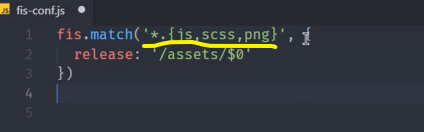

它实际上就把我们转换过程当中的 Sass 文件、 Png 文件，还有我们的 JS 文件都给它命中到了。然后后面的这些选项`{ release }`实际上就是对于这些文件的一些配置了。

同样一个道理，我如果说想要对 Sass 文件做一些单独的配置的话，我们也可以通过 `fis.match` 的姿势去命中 Sass 文件 -> `match`的一个字符串参数，我们在 `fis` 当中叫它为选择器，它的一个写法实际上就是一个 global 的一个通配符 -> 这里我们通过`*`，`*`就是任意目录下的`*.scss`

那这个时候这个选择器它会选择到我们的一个`style.scss` 的文件 -> 我们可以在`match`的选项配置对象里面去为它添加一个对应的处理选项`parser`

`parser` 它是一个额外的插件，就是 `node-sass`这个插件。所以说我们还需要再单独去安装一个模块。

因为我们的 `fis3` 是安装在全局的，所以说我们把这个插件也安装在全局。

``` bash
yarn global add fis-parser-node-sass
```

`parser`就是转换器的意思

那这样的话，这个插件就会在全局范围下被安装。

这跟我们的 `fis` 一样，它其实也可以安装在我们的项目的本地，而且我个人也推荐大家安装在项目的本地。由于我们这儿只是演示给大家去看，所以说我们安装在哪儿都无所谓 -> 你们在实际去开发的时候尽量还是安装在本地，原因还是我们对于这个项目开发过程当中依赖的一些东西，我们都应该放在项目的开发依赖当中 -> 这样的话，项目移植到别的机器上，或者说别人去开发的时候，它就可以更容易地去了解你依赖的那些工具。

有了这个模块过后，我们就可以在我们的这个 `match` 当中的一个选项去添加一个 `parser` -> 这个 `parser` 我们可以通过 `fis` 的 `plugin` 方法去自动载入这个插件 -> 这个插件的前缀是不需要的，我们直接通过`node-sass`去命中到我们刚刚安装的这个插件`fix-parser-node-sass`

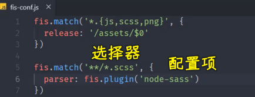

那这个时候我们再来通过 `fis3` 这个命令的 `release -d output` 去测试一下

默认它会将生成完的结果覆盖到这个 `output` 这个目录当中。

我们这时候可以看一下输出的这个`style.scss`文件里面就会自动的去转换 Sass 的语法 -> 也就是将我们的这个转换过后的结果写到这个文件当中。

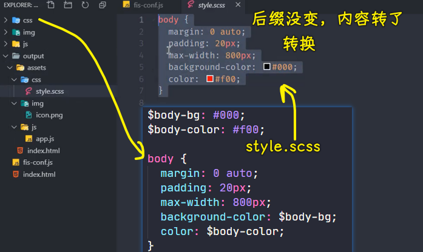

只不过它的扩展名并没有做任何的修改 -> 这个扩展名的修改，你可以在选项里边再去添加一个属性，这个属性叫做 `rExt` -> 你可以把它记忆成 `rename ext` -> 就是修改扩展名的意思 -> 我们这里给它设置的值就是`.css`

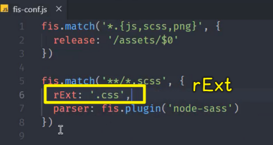

我们再重新`release`一下。

这时候你会发现输出的这个 `css` 目录当中就有一个`style.css`

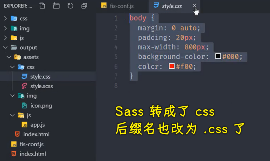

这个文件里面就是我们编译过后的一个结果，而且不光是帮你把这个文件编译了，最终在你使用这个文件的地方，它也会自动的去定位到你编译过后结果的资源

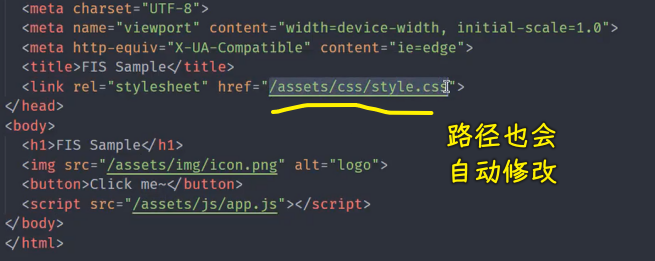

**这个就是资源定位的这个核心能力的一个体现**。

针对于这个 Sass 的转换，实际上就是添加这么一个配置就可以了：

``` js
fis.match('**/*.scss', {
  rExt: '.css',
  parser: fis.plugin('node-sass')
})
```

那以此类推，我们要想去转换我们的 ES6 代码的话，我们也可以借助于`fis.match`这种方式去配置 -> 这使用的方式也非常简单

我们就快速地实现一下它，复制一份处理 Sass 的配置，然后我们去匹配一下所有的 JS 文件 -> 这些 JS 文件不需要去 `rename` -> 去掉这个`rExt` -> 给 `parser` 加上一个对应的配置 `'babel-6.x'` -> 注意，这个`6.x` 是因为 `fis` 的官方它发布的这个插件还是基于`bable 6` 的版本 -> 大家应该也都知道，最新的 bable 版本应该是七点几了

这相对来讲的话，我们之前也说了，`fis` 很久没有维护了，所以使用它的话还是只能使用早前的这些版本 -> 对于这个，我们也就只能将就使用一下了

我们去安装一个`fis-parser-babel-6.x`：

``` bash
yarn global add fis-parser-babel-6.x
```

注意，其实还是那句话：

> 对于大家新开发的一些项目的话，我们个人还是建议大家使用像 gulp 的那种方式去构建，一来它的生态非常完善，二来它背后有专业的团队在维护，也就不会出现长时间不更新的问题。

其实，`fis` 目前还是会有些问题，有一些 bug -> 我们从刚刚那个数据里面应该也能看到，`fis` 截止到目前，它应该**有 400 多个 Issues 还没有被解决** -> 这些 Issues 里面很大一部分实际上都是它里面儿的一些问题，这些问题现在官方很多都不回复了，所以说这个项目实际上是可以说**慢慢地接近死亡**了。

但是还是那句话，我们学它的目的并不是说「**什么火，我们学什么**」-> 我们学东西的一个参考应该是这个东西它能**给你带来一些思考**，那这个可能是更重要的。

我们再重新去转换一下，也就是`release`一下

``` bash
fis3 release -d output
```

这个时候我们再看一下 `output` 当中的这个 JS 文件：

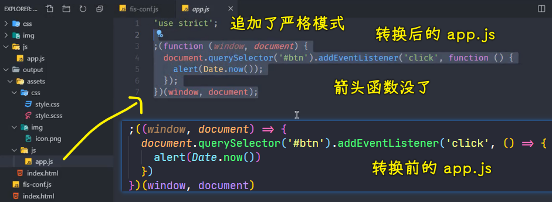

我们可以发现`fis3`会根据配置自动的将我们刚刚使用的那些 ES6 的箭头函数直接转成 ES5 的这些 `function`

除此之外，你还想去做一些压缩的操作的话，你也可以再去使用一些插件去做压缩 -> 这个压缩我们要使用的是另外一个选项`optimizer`

我们在这个`fis-config.js`里边再去为我们这个 Sass 和 JS 的转换 -> 再去添加一个新的属性`optimizer`

处理压缩的这个插件实际上是 `fis` 当中内置的，我们直接通过 `fis.plugin` 然后这个插件的名字叫做`clean-css`

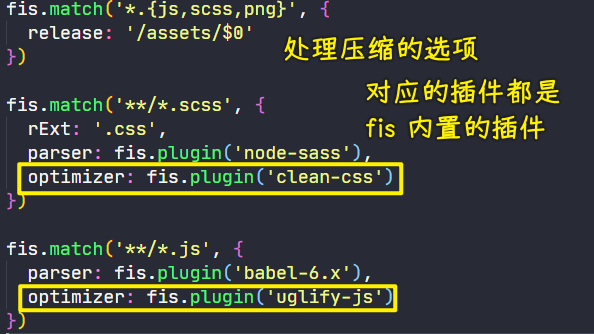

那同样一个道理，我们要想去压缩这个 JS 的话，我们就使用一下另外一个插件，它叫做 `uglyfy-js`

这个时候我们再去执行一次转换。

``` bash
fis3 release -d output
```

转换完的这个结果就是压缩过后的结果了。

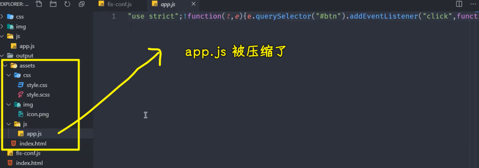

`app.js`压缩过后的结果，相对于原始的这个状态肯定是压缩了很多。

这里其实有一个额外的小知识点，可以跟大家介绍一下。

之前也有人问我「为什么会使用这种自调用函数的时候需要要去传 `window`、`document`？」

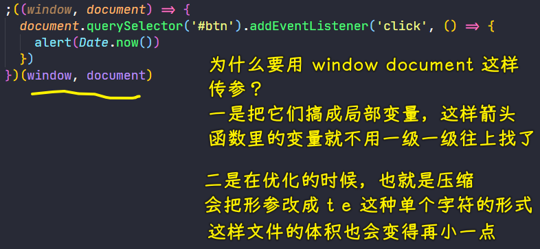

一来是性能问题。因为这样去使用的话，你内部代码当中它实际上使用的就是相当于局部变量的 `window` 和 `document` -> 它就不会沿着我们的那个原型链一层一层往上找，因为那样的话会有一些性能开销，这是一方面。

另外一方面就是我们在压缩过程当中，你使用这种方式，你使用的越多，那压缩的比例会越大。

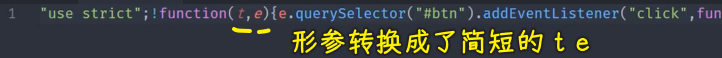

因为你这样压缩过后的结果，它会把 `window` 还有 `document` 直接会给大家替换成一些简单的字符，如`t、e` -> 这相对于你使用原始的这个 `document` 和 `window`，它的这个字符数肯定是减少了很多

这个是跟我们刚刚这个东西应该也算有一些小关联的一个扩展知识点。

---

以上就是我们针对于在 `fis` 当中要想去做一些编译，做一些转换的一个使用方式。

然后具体的操作一般通过这个`fis-config`配置文件里面的一些声明就可以了。

你可以通过 `fis` 的另外一个命令 `inspect` 

``` bash
fis3 inspect
```

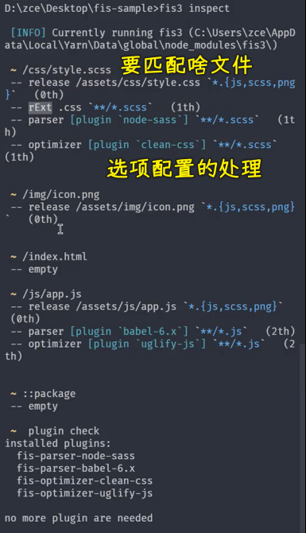

> 之前，我就好奇老师为啥用`release`，而不用`dist` -> 看到`fis`的`release`约定我就明白了！
> 
> `inspect` -> 匹配到谁？是否有对这个谁有一些配置上的处理？

你可以通过这个命令去看到我们在这个转换过程当中会转换哪些文件 -> 波浪线开头的这种就是匹配到的文件。那它转换过后的这个配置都在下面有一个呈现，就是 `release` 到这个目录。然后`rename ext`是`.css`，然后那个插件就是优化……

总之，所有的这个文件它会列出来 -> 它会把（`~`开头匹配到文件的）下面命中到的一些属性也都会给你列出来，那这样的话，这可能更便于你去调试你的这个配置文件。

这个是针对于 `fis` 额外的一些使用上面的介绍。因为针对于 `fis` 这个东西，其实更多的还是了解，我们不做过多的介绍了。

如果感兴趣的话，你可以根据它的官方的一个 `demo`，然后一步一步地去使用就好了。

其他的东西，我们就不在这做过多的介绍了。
