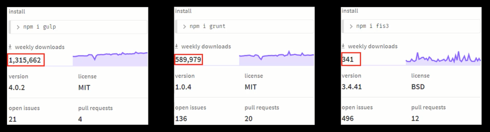
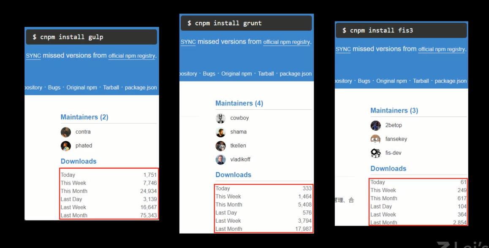
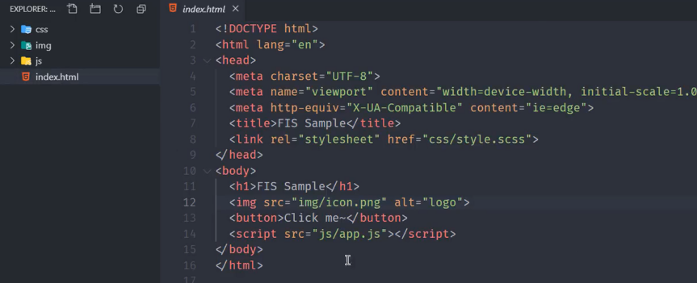
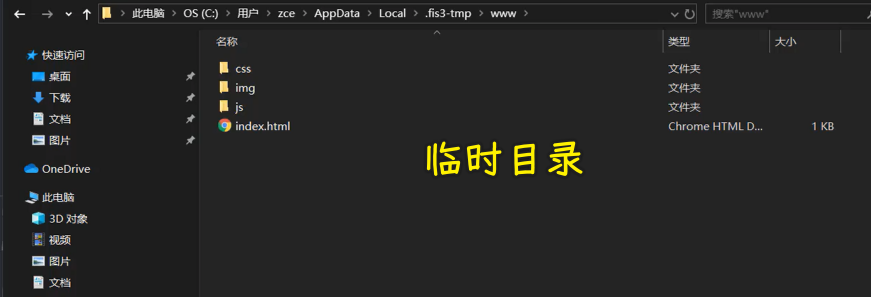
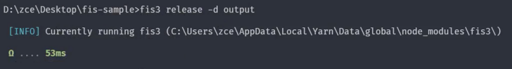
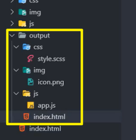
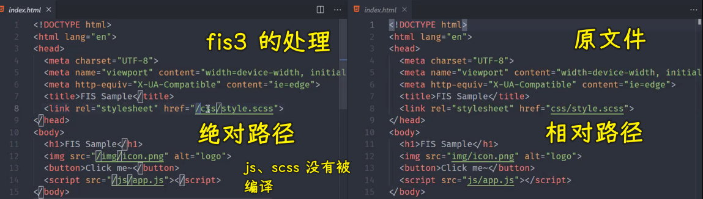
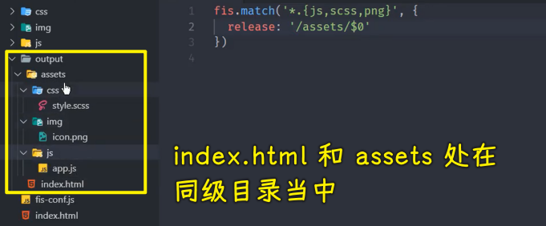
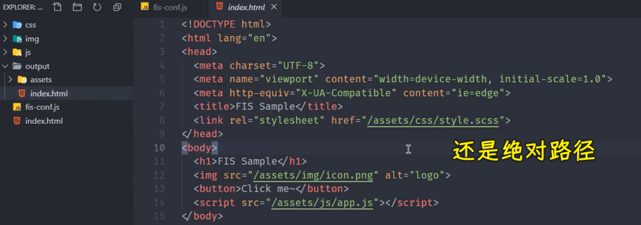

### ✍️ Tangxt ⏳ 2021-11-03 🏷️ 工程化

# 18-FIS 的基本使用、FIS 编译与压缩

## ★FIS 的基本使用


FIS 是百度的前端团队推出的一款构建系统，最早只是在他们团队内部使用，后来开源过后，在国内确实流行了很长一段时间。

只不过现在用的人越来越少。

我们从 npm 的周活跃数量就能看到 FIS 的下载数量， 相对于 gulp 和 grunt 确实少了很多



国内的使用情况话，我们可以通过淘宝的镜像源的一个下载活跃度，就能发现 FIS 的下载数量也不是很多：



因为我们国内开发者一般使用淘宝镜像源去下载 npm 的模块，所以我们可以通过淘宝金像源的下载数量去参考。

而且官方也很久没有更新 FIS 的版本了 -> 这一系列的信息实际上都是一些负面的信息，但是这一些信息并不妨碍我们去了解它，因为 FIS 完全属于另外一种类型的构建系统。

相比于 gulp 和 grunt， FIS 的核心特点是**高度集成**：


因为它把前端日常开发过程当中常见的构建任务还有调试任务都集成在了内部。那这样的话，开发者就可以通过简单的配置的文件的方式去配置我们构建过程需要完成的一些工作。那也就是说我们在 FIS 当中不需要像 gulp 或者 grunt 当中一样去定义一些任务，FIS 当中有一些内置的任务 -> 这些内置的任务会根据开发者的配置自动完成整个构建过程。

除此之外，FIS 当中还内置了一款用于调试的 web server -> 这可以很方便的去调试我们的构建结果。像这一系列的东西，在 gulp 或者 grunt 当中都是需要我们自己去通过一些插件实现的。那接下来我们就一起简单了解一下 FIS 这款工具的基本使用。

我们要去使用 FIS 的话，首先我们可以在全局范围通过 yarn 或者 npm 去安装一个叫做`fis3`的模块：

``` bash
yarn global add fis3
```

当然，你也可以把这个模块安装在本地的开发依赖当中。至于这个 `fis3`，因为是相对于以前的版本，它做了很大的变化，所以说百度前端团队单独为这个包起了一个新的名字——`fis3`。

安装完成过后，我们在全局范围当中就多出来一个叫做 `fis3` 的命令。

通过 VS Code 去打开一个我提前准备好的一个网页应用的项目 -> 这个项目非常的简单。



在这个项目当中只有一些普通的 HTML 文件、 JS 文件，还有一些 Sass 的文件。这跟我们普通的项目所不同的是，我们在这个 HTML 当中，我们是直接引入了 Sass 文件，而且我们在这儿引入的 JS 文件，它也是使用了 ES6 的一些方式。

对于 Sass 和 ES6，我们在实际的生产环节肯定是需要经过转换的 -> 这些转换的过程，我们都可以借助于 FIS 提供的一些内置构建任务去完成。那我们打开命令行，我们通过 `fis3` 这个模块提供的命令去执行一个叫做 `release` 的任务 -> `release` 这个任务就是 `fis3` 当中的一个默认的构建任务 -> 这个构建任务会自动的将我们项目所有需要被构建的文件自动构建到一个临时的目录当中 -> 这个目录我们可以在用户这个文件夹当中去找到



如果说你需要去指定这个输出的目录为项目的根目下的话，那我们可以通过一个`-d`的参数去指定这个文件夹的名字。

例如我们这把它放在一个叫 `output` 的一个文件夹当中。

``` bash
fis3 release -d output
```



那这个时候，我们在项目的根目录下就会多出了一个 `output` 的文件夹。



这个文件夹里面的内容就是我们刚刚项目根目录下那些文件被构建过后的一个结果。



但是我们这儿发现 FIS 在这个过程当中并没有对这些需要编译的文件做任何的转换，而是将它们直接输出到了文件夹当中。

这整个过程默认只会将代码当中那些对资源文件引用的相对路径自动去转换成绝对路径，从而实现资源的定位。

资源定位是 FIS 当中的一个核心的特性，它的作用就是将我们开发阶段的路径彻底的与部署的路径之间的关系分离开。

如果说你之前从事过那种前后端统一部署的项目，那你肯定遇到过我们前端输出的这个目录结构，它并不是后端项目所需要。那项目上线之前，后端开发人员还需要手动的去修改这些路径。

所以 FIS 它首要解决的问题就是**资源的定位**。

那这样一来的话，我们前端开发者就不用再去关心我们开发出来的这些资源部署上线过后的那个目录结构，我们只需要在开发阶段使用相对路径去引入资源，通过 FIS 构建完了过后的结果会自动的将这些资源文件的引入路径变成绝对路径。

例如我们这个项目还是按照这样一个默认结构去引入资源文件：


但是我们将输出的这个目录去指定到 `assets` 这个目录下面 -> 我们可以为这个项目去添加一个 `fis-config` 文件。

具体做法就是在项目的根目录下去添加一个`fis-config.js`文件 -> 在这个文件当中，它有一个特有的全局对象——`fis`

我们可以通过 `fis` 的 `match` 方法来为我们在构建过程当中匹配到的一些文件添加一些指定的配置 -> 我们这儿匹配到的就是 JS 文件、 Sass 文件，还有 Png 文件，我们将它`release`过后的结果放在`assets`下的`$0` -> `$0`指的就是当前文件的一个原始的目录结构。



那这样一来的话，我们输出的这些资源文件都会出现在 `assets` 这个目录下面了。



我们**通过 FIS 资源定位的这种能力，我们就可以大大提高我们代码的可移植性**。因为这个时候你不管是部署在哪个后端的项目当中，它（FIS）只需要告诉你「你的这个生成的结构是什么」（比如`fis3`默认`release`的时候`output`会输出什么），然后你根据这个生成的结构去配置你的`fis-config`文件就可以了（比如你想把这个生成的资源文件放在`assets`目录下或者是其它目录下都行，`index.html`都能找到这些资源文件）。

## ★FIS 编译与压缩

