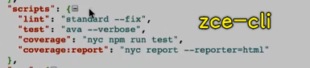

### ✍️ Tangxt ⏳ 2021-11-03 🏷️ 工程化

# 19-自动化工具、Node.js 补充

- metalsmith -> 早期 vue-cli 就有用到它，不过之后就不用它了！ -> Smith 这个人加工这块 Metal -> 加工成自己想要的样子
- Grunt -> 了解就好，能看懂老项目使用它时的配置即可
- 自打 Webpack 出来之后，Gulp 是否真得就已经凉了？ -> 并非如此
- 前端的核心是 Node 这块 -> 会 Node 之后，你会发现你之前认识的前端跟现在认识的前端是两回事！ -> 讲的是 Node 的基础内容 -> 不要把自己不明白当作是合理状态，你不明白，那你就想办法把它搞明白

1）Yeoman 之类的工具到底有啥用？

💡：为什么要自定义脚手架？

主流脚手架适合什么，其缺点又是什么：

1. vue-cli 或者 create-react-app 创建出来的都是适用于绝大部分项目的基础结构，所以生成的结构往往是极简的
   1. 只是针对特定框架类型的项目
   2. 对于实际业务项目开发来说，生成的项目结构过于简单
2. 而很多时候我们在同一个公司的不同项目中还有很多基础设施都是相同的，例如 axios 的包装、路由鉴权等，所以也应该放进脚手架模版中 -> 两个类似的教育后台管理系统
3. 这种情况下，很多公司或团队就会选择开发自己的脚手架工具，以符合自身需要

💡：使用 Yeoman 可以干嘛？

- 基于 Yeoman 写 Generator
  - yeoman 是一个脚手架平台 -> 自己弄个一个 my-vue-generator 出来 -> 一般都会让 vue-cli 生成一个基础的模板，然后自己在这个模板基础上去添加适合公司业务的模板
- 自己造轮子
  - Metalsmith -> 自己写脚手架非常常见的一个库 -> 除了帮我们做脚手架，还可以做静态页面站点生成器

💡：一个疑问，两个项目用了 xxx 脚手架，xxx 脚手架更新了，这两个项目能同步更新吗？ -> 不能同步更新，这是 Generator 的弊端

早期的 vue-cli 2.x 是不能的 -> vue-cli 3.x 会把那些东西提取到一个公共的模块当中 -> 让项目直接使用这个黑盒工具——`vue-cli-service` -> 这个黑盒里边实际上就把 Webpack 那些东西给包裹进去了 -> 后期项目的基础实施发生了变化，那就去更新一下现有的这个`vue-cli-service`模块就好了

总之，在搞脚手架的时候，不要把文件都放在项目的模板里边，而是它们写成一个个的模块，然后在不同的项目中去引用这些模块 -> 这涉及到公共代码维护的问题

> vue-cli 没有用到 Yeoman，就是纯手工制作
---

Yeoman 真得没有用吗？显然，这并不是 -> 你得根据自己的实际情况去了解 -> 你要创建一个通用型的 Vue 或 React 项目，那你就用官方提供给你的脚手架工具呗！ -> 如果你要在基于官方的模板之上去做一些修改，然后后续不断地去使用这个修改过后的模板的话，这个时候建议你使用 Yeoman，或者用自己造轮子的方式去定义架手架工具

掌握开发脚手架这种工具的能力 -> 其核心还是在于如何使用 Node 去解决你在实际开发过程中所遇到的这些问题 -> 重点不在于某个工具本身，而是在于通过开发某个工具的这样一个过程去体会到 Node 对于前端开发的重要性！

---

💡：我用 Node 原生姿势开发一个脚手架，这比用 Yeoman 去开发会更有优势吗？

显然，Yeoman 更有优势 -> Yeoman 相当于脚手架框架，用 Yeoman 去开发，显然要比自己用原生去开发更简便！

原生写得一大堆代码，用 Yeoman 写不用写那么多！

用 Vue 开发，和用原生 JS 去开发一个大型应用，显然用 Vue 要更方便！

💡：脚手架模板按理说，应该是仓库中去拉取，而我们学习的内容是把模板放到模块里边去了！

2）Gulp vs. Webpack

💡：一个困惑：感觉 Gulp 能干的事儿，Webpack 都能干？

这句话不严谨，因为：

Gulp 本身实际上就不具备任何具体功能 -> Gulp 啥事都干不了 -> 就提供了`watch`等这几个 API -> 这几个 API 的作用大都是创建是什么文件流、读取流、写入流之类的 -> 它只是一个**任务执行工具**，或者说是**任务调度**（tasks runner） -> 说白了你不提供任务给它，那它就毫无用处，就像大货车，你不给它货物，那这大货车相当于没有功能！

它作为一个任务调度工具来讲的话 -> 需要配合一系列插件或者自己用代码实现各种各样的功能（代码合并、压缩、编译、构建等） -> 它不具备任务功能，但换个角度而言，它就是完全自主的，也就是说，只要想法牛逼，你想实现啥功能都行

Gulp 就是完全自主的，你想要什么功能，那就用代码去实现什么功能 -> 自定义性比较强

而 Webpack -> 目前前端比较流行的开发范式，也就是模块化 -> Webpack 就是从模块打包的角度出发，从而实现对整个前端应用的构建 -> 它里边有个概念就是「把前端里边所有的资源都当作是模块来处理」 -> 以 JS 作为一个线索，或者说是一个入口来把所有资源都打包到一起 -> 在打包过程中，通过插进、loader 等这样一些特性然后去实现整个项目的构建 -> 在这个过程当中，插件会实现一部分 Web 项目当中的一些自动化任务

由于 Webpack 的生态特别繁荣，然后它里边就有了各种各样的插件 -> 这就会让你感到「以往用 Gulp 能做的事儿，现在用 Webpack 也能做」 -> 当然，更严谨、更合理的说法是「**以往我们使用 Gulp 去实现的自动化工作，现在都可以使用 Webpack 实现**」，也就是说像打包、合并、压缩这些事儿，用 Webpack 也能去实现，但是我们之前已经说了 Gulp 是完全自主的，Gulp 能干多大的事儿，完全取决于你的想象力、你的任务代码是怎样去写的，而 Webpack 实际上是没有这个自主性的 -> Webpack 它是一种规则性的，它通过配置的方式去实现 -> 一个配置型选手和一个野生型选手（**笼子里养的鸡 vs 野生果园鸡**），显然 Gulp 这个野生型的能力范围要更宽广一些 -> 所以最终说法是「**以往我们使用 Gulp 去实现的常有自动化工作，现在都可以使用 Webpack 实现**」 -> 常用的有 JS/CSS 编译、样式文件打包、JS 文件打包、图片压缩、资源替换等一系列的事情，在现阶段，Webpack 都有对应的插件，而且这些插件的使用人数也比较多，所以也会有很多人去持续维护这些插件

因为这样，所以让我们感觉到「**我们可以忘掉 Gulp 了**」，当然，这个感觉并不是绝对的

💡：很多开发者把 Gulp 和 Webpack 放在一块来对比的原因？

核心原因：

- Gulp 定位清晰
- Webpack 则不是，它的定位慢慢地就越来越不清晰了

Webpack 最早就是一个模块打包工具，但发展到现在，它基本上可以实现前端工程化里边绝大多数的工作了 -> 所以 Webpack 它一直在突破自己的边界，那这就会导致 -> 让人感觉 Webpack 有点踩过界了！ -> 就像起初的腾讯 QQ，之后又有了腾讯游戏之类的、小米做手机，之后做空调等电器之类的

当然，这个其实也不是坏事哈！ -> 对于开发者而言，如果真得有一个工具可以解决我们开发过程中所有的问题的话，那我们肯定是愿意使用这样的工具的 -> 而且这会让我们投入的学习成本、时间成本都会大大的降低 -> 但是，现在这个事实情况是，**Webpack 它本身还是围绕着模块打包这一点**！

💡：Gulp 实际上到底有没有应用场景呢？

我们举一些例子，看了这些例子，你就会明白用 Gulp 确实更合理一点

第一点，传统的静态页面开发

如我们之前的`zce-pages-demo`，里边有一些静态页的模板 -> 还是有很多传统的 Web 项目的，这些静态页的模板都会交给后端去套数据然后去工作 -> 我们去开发静态页的时候 -> 肯定会涉及到页面公共部分的抽离、样式和脚本这些文件的组织方式、以及合并、压缩等一系列东西 -> 总之，**注重页面结构与样式这种情况，建议采用 Gulp** -> 这属于多页应用这种情况 -> 我们使用 Webpack 的项目，似乎都是以 Vue、React、Angular 这种单页驱动框架在去用！而对于多页应用，很少会使用到 Webpack，因为 Webpack 并不是很擅长啊！毕竟它本身的概念，就是以一个 JS 作为入口，然后把一系列所有的东西都打包到一起 -> 你仔细想想，如果一个项目有 100 个，甚至 1000 个页面，此时如果按照一个页面对应一种入口这种方式的话，那这种 Webpack 构建实际上是不太合理的！ -> 当然，这不是绝对的，这是相对而言的，Gulp 搞多页应用更香，那就 Gulp 呗！Webpack 也能用，但用起来并不是那么香！

---

第二点，开发一个小程序项目

做原生小程序开发（不用 Taro、Uniapp 等框架，用简单的普通的小程序框架）时，要求我们每个页面都得有四个文件 -> 页面结构、样式、脚本、页面配置文件 -> 这些文件都是固定的结构 -> 对于开发而言，我们不需要把它们都打包到一起 -> 这个时候，如果你想用 Sass/Less 这种预编译样式脚本的话，此时，用 Gulp 显然更合适一点 -> 因为你用 Webpack 的话，它会把所有的 Sass 文件最终打包到一起，然而，对于小程序而言，它不需要 Webpack 这样做，所以用 Webpack 就不太合适了！

总之，建议用 Gulp -> 把项目分为`src`和`dist` -> `dist`里边就是我们最终编译过后，可以直接在小程序当中直接去工作的结果 -> `src`下就按照 Sass/Less 这种姿势去编写样式就好了

当然，除了样式以外 -> 你想用 ES7/8 等这样的新特性，实际上也可以借助 Gulp 的编译操作去做

其实，Gulp 跟 Webpack 根本就不具备可比性，因为一个是任务调度工具，一个则是模块打包工具，它们根本就不在一个频道上的，为啥有人会把它们作比较呢？就是因为 Webpack 过界了，一直在做一些额外的事情，Webpack 通过一些插件好像也能干我们用 Gulp 经常做的事儿

总之，从它们的初衷来看，根本就不用把它们放到同一个角度当中去对比 -> 小米的空调和格力的空调？格力的手机和小米的手机？

---

第三点，日常的综合事务

比如，计算机里边有一堆视频和照片 -> 我们想要批量重命名、批量改后缀、前缀之类的 -> 对于这些东西，跟我们开发工作，并没有太多关系，但是，如果你实际工作个两三年 -> 以前我们用 windows 下的批处理去做，Linux 则用 shell 脚本去做

但是，我们现在又有几个人能写批处理、能写 shell 脚本呢？

对于开发人员而言，总有人认为，我是搞 JS 开发的，我就只能会 JS，其它东西我都不能会，会一点都是罪

但这其实根本就不是这样的，对于自个来说，不要给自己设太多的边界 -> 很多时候，你掌握了 shell 脚本，批处理的这些东西，这对你的工作效率的提高是有很大帮助的

回过头来看 Gulp 这个工具，它本身就是一些任务的执行工具，那就可以通过定义函数的方式去定义一些任务 -> 这些任务不一定是你在开发过程中需要用到的，也有可能是你在日常工作当中用到的，比如 Excel 之类的，此时你也可以用 Gulp 这个东西去做一下

总之，很多时候，我们有很多的工具并不仅仅局限于项目本身

💡：关于 Webpack 和 Gulp 的最佳实践？

工具层面上，并没有绝对这个说法，比如在什么情况下必须用 Gulp 之类的，什么情况下必须要用 Webpack

因此，我们只能给出一些相对综合一点的建议

比如：

- SPA 类使用 Webpack
- MPA 类使用 Gulp

SPA 类应用最终把所有的代码打包到一起，这是合理的，也是需要的，至于对于什么代码拆包这些高级的用法，这就另说了，但是对于 SPA 的整体目标，它还是要把所有的东西都打包到一起，所以这种，我们建议大家使用 Webpack 这种以模块打包为核心的工具 -> 在这个过程当中，通过 loader 机制去实现不同种类资源的加载，通过一些插件去实现比如说自动生成 HTML、自动发包这样的一些功能

MPA 即多页应用 -> 它应该使用像 Gulp 这样的东西 -> 它就是把页面、样式、脚本这样各自没有联系的单独的去管理的这种方式去实现的构建 -> 使用 Gulp 会更合适一点

当然，工具层面没有唯一标准答案，也没有绝对的标准答案

以上是根据我们经验来讲的，这是一个比较合理的最佳实践

当然，如果针对个别需求的话，我们可以使用 `npm scripts`

我们知道`npm scripts`就是一个小型的 tasks runner -> 所谓的「tasks runner」就是任务执行器，它的特点就是它要具备我们执行一个命令，就可以让某一个任务去自动工作起来，而这期间可能会出现 A、B、C 这三个任务同时执行或先后执行，这样的一些协同的操作 -> 比如`start`和`prestart` -> 在任务前做什么，在任务后做什么 -> 再比如校验代码是否符合规则，我们就可以把 ESLint 放到`npm scripts`里边去管理

像老师做的一些 Node.js 项目，并不涉及到代码需要太多的构建过程，这可能只需要去校验一下代码是否符合规范 -> 这个时候，老师一般会直接使用`npm scripts`



``` json
{
  "scripts": {
    "clean": "rimraf lib",
    "lint": "eslint \"**/*.ts\"",
    "compile": "tsc --project .",
    "build": "run-s clean lint compile",
    "test:unit": "jest src",
    "test:integration": "jest test",
    "test": "run-s test:*",
    "coverage": "jest --coverage",
    "preship": "run-s build test",
    "ship": "npm publish --registry https://registry.npmjs.org"
  },
}
```

像`lint`这样的任务，就没有必要用 Gulp 或者 Webpack 了

总之，根据情况用就对了，也就是因地制宜 -> 对于我而言，最重要的还是充分掌握 Gulp 与 Webpack，也就是把这个工具给玩好呗！

像 rollup、parcel 这些打包工具 -> 不需要花时间去了解 -> 多花时间去掌握 Gulp 和 Webpack 就好了！ -> 毕竟它们还是现代这两类工具的代表！

> 有问题就要提出来，不要太在意这个问题是否是太基础还是其它什么的，又或者是很麻烦人家一样 -> 了解一个东西，从不知道到知道这个过程，没有好面子这个说法，本身就是闻道有先后，不知道是很正常的，比如总把 Gulp 和 Webpack 混到一起，认为它俩就是一样的 -> 这种认识是可以理解的，毕竟老师当年也是这样想的，但是我们慢慢遇到一些场景，必须使用 Gulp 的时候，我们就会发现一些感想之类的

💡：打包一个 SDK 是不是用 rollup 比较好？

确实如此，因为 rollup 打包出来的东西依然可读

rollup 打包出来的代码基本上跟我们手写出来的一样，而 Webpack 打包出来的代码，基本上就无法去阅读了（即便没有压缩）


所以，一般来讲的话，我建议你如果开发一个工具的话，可以使用 rollup

像早期的 Vue、React 源代码，它们本身都是在使用 rollup 这样的工具 -> rollup 更适合库的打包

而 sdk 也属于库的一种

rollup 打包出来的体积比 webpack 要更小，毕竟 webpack 打包出来的代码里边有很多引导性的代码（这个引导代码是很长的）

webpack 更适合做应用程序的打包，它有 web server、热替换这种体验！

💡：在多页应用下，使用 vue 组件化方式去开发，这会冲突吗？

这个其实不冲突 -> 这取决于你怎么用 -> 你做多页应用，得看你是把 vue 当作是框架去用，还是库去用，毕竟我们可以像用 jQuery 这样去使用 vue，比如 vue 的 mvvm 功能去渲染一些组件 

webpack 也可以用于多页打包，不过，一般在多页应用用 vue 就不会涉及到打包的问题了！
