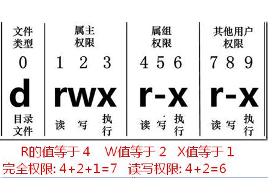
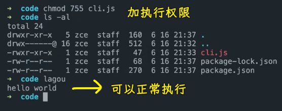
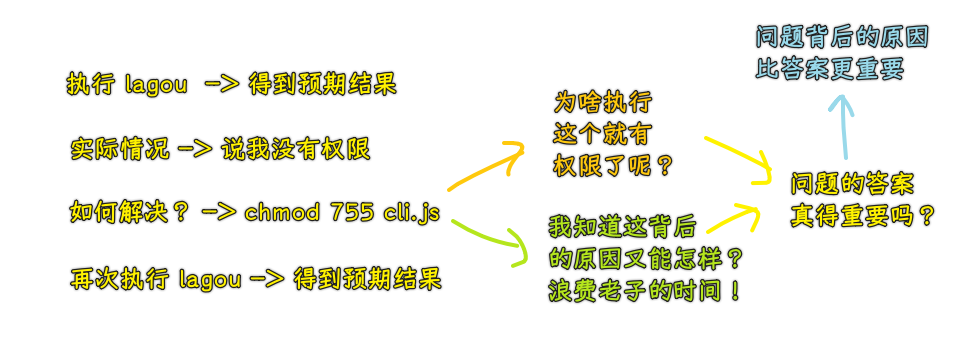

### ✍️ Tangxt ⏳ 2021-11-03 🏷️ 工程化

# 19-自动化工具、Node.js 补充

- [Metalsmith](https://www.jianshu.com/p/07a402ddee7c) -> 早期 vue-cli 就有用到它，不过之后就不用它了！ -> Smith 这个人加工这块 Metal -> 加工成自己想要的样子
- Grunt -> 了解就好，能看懂老项目使用它时的配置即可
- 自打 Webpack 出来之后，Gulp 是否真得就已经凉了？ -> 并非如此
- 前端的核心是 Node 这块 -> 会 Node 之后，你会发现你之前认识的前端跟现在认识的前端是两回事！ -> 讲的是 Node 的基础内容 -> 不要把自己不明白当作是合理状态，你不明白，那你就想办法把它搞明白

## ★日常问题

### <mark>1）希望能讲下脚手架的实际应用</mark>

* vue-cli 或者 create-react-app 创建出来的都是适用于大部分人的基础结构，所以生成的结构往往是极简的
* 而很多时候我们在同一个公司的不同项目中还有很多基础设施都是相同的，例如 `axios` 的包装、路由鉴权等，所以也应该放进脚手架模版中
* 这种情况下，很多公司或团队就会选择开发自己的脚手架工具，以符合自身需要

### <mark>2）`.npmignore`？</mark>

脚手架的 template 文件夹内的 `.gitignore` 文件 publish 出去就没了，github 上是有的，而 [npmjs.com](http://npmjs.com/) 那边就没有（原文本内容）

> npm 会自动忽略一部分文件，例如 tests、`.gitignore`。可以通过 `.npmignore` 配置

### <mark>3）脚手架开发模板如果目录层级多该如何生成？</mark>

### <mark>4）Node.js 自定义的小型脚手架中怎么实现模板项目对应的二级、三级目录文件的拷贝（生成的文件目录结构和模板一样）</mark>

* 只需要按照模版结构生成文件就行了，可以采用递归模版结构的方式实现
* 建议使用 `metalsmith` 实现，非常便捷
* 可以参考我的个人 CLI：<https://github.com/zce/zce-cli>
* <https://github.com/zce/zce-cli/blob/master/lib/generator/generate.js>

### <mark>5）Grunt 的定位？</mark>

grunt 的定位只是了解，考虑一部分比较早期的开源项目就是使用的 grunt，例如：

- bootstrap：<https://github.com/twbs/bootstrap/blob/v3-dev/Gruntfile.js>
- ghost：<https://github.com/TryGhost/Ghost/blob/master/Gruntfile.js>

所以我们对 grunt 的定位就是了解一下即可，能看懂别人的配置。

由于 grunt 现在已经可以说完全被 gulp 取代了，所以很多插件「年久失修」，自然会有这样或者那样的问题，不用纠结。

### <mark>6）Gulp</mark>

- 如何选用适合的 gulp 插件之类的
  * Google / GitHub / npmjs.com 的搜索
  * npmjs 按照流行程度排序
  * GitHub 按照 stars 数量，再看最近更新时间
- 请讲解下 gulp-gh-pages 的用法，为什么不使用默认分支， `deploy` 一直失败
  * 默认分支是 gh-pages，可以通过 `branch` 选项修改
  * 如果失败可以提供失败的信息
- 请讲解下`yarn gulp lint` 任务
  - 下一个模块的规范化中会介绍
- 对于在 JavaScript 中通过 ES module 导出，引入，从而使用的属性，在 gulp、grunt 处理 JavaScript 代码的任务中如何处理
  * 首先我猜测你想问的应该是 Gulp 这种工具如何处理模块化打包
  * 如果是的话，结合 Webpack 使用，或者直接换成 Webpack
  * 因为处理模块化代码，Webpack 更为专业（模块化的代码不仅需要转换，还需要打包）

### <mark>7）希望讲解一下 lazypipe 和单元测试</mark>

* lazypipe 就是用来定义处理管道以便于类似任务的重用
* <https://v3.gulpjs.com.cn/docs/recipes/sharing-streams-with-stream-factories/>
* 如果有不明白的私聊我就好
* 单元测试我们在第三阶段的第一个项目中再做介绍，单独看没有场景，会比较单薄。

### <mark>8）希望后期有 TypeScript 以及 环境搭建 VS Code 配置的一些相关课程，目前只知道语法，实际用时在配置上就卡住了。</mark>

如你所愿😄，Vue.js 的项目中就会涉及到此类问题。

### <mark>9）资源构建过程中是不是还需要对资源进行版本管理，不然被浏览器缓存了修改 JS 页面不能看到最新的内容。</mark>

* 很多年前，我写过一个 gulp 插件：<https://github.com/zce/gulp-reversion>
* 思路就是在构建完成过后，解析 html 中引用的资源，读取文件 `hash`，然后拼接到 `src` 属性后面

### <mark>10）希望多列举一些项目中常用的工程化任务，当前只知道：代码编译、压缩、合并、启动服务器、即时编译、热更新。</mark>

* 你所了解的就是常用的自动化任务。
* 实际开发过程中除了常用的内容，还有很多根据实际业务或者项目类型需要的任务。
* 给个参考：<https://github.com/zce/feedback>
* 这是一个 electron 项目，在这个里面就涉及到了怎么自动提取数据包，怎么自动打包可发行文件。
* 但是这些并不是所有类型项目通用的

### <mark>11）使用 grunt, gulp 搭建项目的自动化构建流程时，是否支持`*.vue` 文件，如果支持，该如何配置。</mark>

首先，这个需求是可以实现的，但是目前市面上并没有这种插件（成熟的）。而且也没人这么做。

因为目前 `.vue` 这种单文件组件大都以模块化的方式组织的，而 Gulp 这类工具实现构建任务时，并不会特殊处理模块化的组织。如果只是把 `.vue` 这种单文件组件构建为单个的 JS 文件，构建后的 JS 还是零散的。还是需要模块化打包。

所以对于这类问题更好的方案仍然是基于模块化的打包工具：Webpack / Rollup 之类。

> 此时的我还未理解模块化打包

### <mark>12）拆解一下 @vue/cli, create-react-app, @angular/cli 内部实现。</mark>

这类脚手架内部一般分为两大块：

* 一块用于生成项目基础结构所需要的文件
* 另一块用于封装一系列构建工具（Webpack 等）
  * 开箱即用
  * 应对变化（配置文件或者基础代码）

以 `@vue/cli` 和 `create-react-app` 为例：

* <http://github.com/vuejs/vue-cli>
* <https://github.com/facebook/create-react-app>

`monorepo` -> 把一系列相关的模块发放到同一个仓库中维护，这种类型的仓库就叫做 `monorepo`

### <mark>13）grunt 如何实现打开浏览器随后监听 watch 任务</mark>

<https://www.npmjs.com/package/grunt-browser-sync>

``` js
const sass = require('sass')
const path = require('path')
const loadGruntTasks = require('load-grunt-tasks')
const data = {
  menus: [{
    name: 'Home',
    icon: 'aperture',
    link: 'index.html'
  },
  {
    name: 'Features',
    link: 'features.html'
  },
  {
    name: 'About',
    link: 'about.html'
  },
  {
    name: 'Contact',
    link: '#',
    children: [{
      name: 'Twitter',
      link: 'https://twitter.com/w_zce'
    },
    {
      name: 'About',
      link: 'https://weibo.com/zceme'
    },
    {
      name: 'divider'
    },
    {
      name: 'About',
      link: 'https://github.com/zce'
    }
    ]
  }
  ],
  pkg: require('./package.json'),
  date: new Date()
}
console.log(__dirname)
module.exports = grunt => {
  loadGruntTasks(grunt)
  grunt.initConfig({
    // 编译 js
    babel: {
      // 定义配置文件
      options: {
        presets: ['@babel/preset-env'],
        // 开启 sourceMap 文件
        sourceMap: true
      },
      // 定义个目标
      main: {
        expand: true,
        cwd: 'src',
        src: ['assets/scripts/*.js'],
        dest: 'temp/'
      }
    },
    // 编译 sass
    sass: {
      options: {
        implementation: sass,
        sourceMap: true
      },
      // 定义个目标
      main: {
        expand: true,
        cwd: 'src',
        src: ['assets/styles/*.scss'],
        dest: 'temp/',
        ext: '.css'
      }
    },
    watch: {
      scripts: {
        files: ['src/assets/scripts/*.js'],
        tasks: ['eslint', 'babel'],
      },
      scss: {
        files: ['src/assets/styles/*.scss'],
        tasks: ['scsslint', 'sass'],
      },
      pages: {
        files: ['src/**/*.html'],
        tasks: ['swig'],
      },
    },
    clean: {
      dev: ['temp'],
      build: ['dist']
    },
    // 图片压缩
    imagemin: {
      options: {
        optimizationLevel: 7,
        pngquant: true
      },
      main: {
        files: [{
          expand: true,
          src: ['src/assets/images/*.{png,jpg,jpeg,gif,webp,svg}'],
          dest: 'dist/'
        }]
      },
      fonts: {
        files: [{
          expand: true,
          src: ['src/assets/fonts/*.{png,jpg,jpeg,gif,webp,svg}'],
          dest: 'dist/'
        },]
      },
    },
    concat: {
      js: {
        src: [
          'dist/assets/scripts/**/*.js',
          'node_modules/bootstrap/**/*.js'
        ],
        dest: 'dist/assets/scripts/vendor.js'
      },
      css: {
        src: [
          'dist/assets/styles/*.css',
          'node_modules/bootstrap/**/*.css'
        ],
        dest: 'dist/assets/styles/vendor.css'
      }
    },
    copy: {
      fonts: {
        files: [{
          expand: true,
          src: ['src/assets/fonts/*'],
          dest: 'dist/'
        }]
      },
      extra: {
        files: [{
          expand: true,
          cwd: "public",
          src: ['*'],
          dest: 'dist/'
        },]
      },
      build: {
        files: [{
          expand: true,
          cwd: "temp",
          src: ['**/*'],
          dest: 'dist'
        }],
      }
    },
    swig: {
      swig: {
        options: {
          data
        },
        expand: true,
        dest: 'temp/',
        cwd: 'src',
        src: ['*.html'],
        ext: '.html'
      },
    },
    browserSync: {
      bsFiles: {
        src: 'temp/**/*'
      },
      options: {
        watchTask: true,
        notify: false,
        // 端口
        port: 6001,
        // 不默认打开
        open: false,
        // 服务设置
        server: {
          // 运行文件夹
          baseDir: ['temp', 'src', 'public'],
          // 配置映射，routes 高于 baseDir
          routes: {
            // 将 /node_modules 映射到工程下的 node_modules
            '/node_modules': 'node_modules'
          },
          keepalive: false
        }
      }
    },
    eslint: {
      target: ['src/assets/scripts/*.js']
    },
    scsslint: {
      allFiles: [
        'src/assets/styles/*.scss',
      ],
      options: {
        bundleExec: true,
        colorizeOutput: true
      },
    },
    useref: {
      html: 'dist/**/*.html',
      temp: 'dist'
    }
  })
  grunt.registerTask('build', ['clean:build', 'copy:build', 'useref', 'babel', 'concat', 'uglify', 'cssmin'])
  grunt.registerTask('compile', ['babel', 'sass', 'swig'])
  grunt.registerTask('server', ['browserSync', 'watch'])
  grunt.registerTask('start', ['clean:dev', 'compile', 'server'])
  grunt.registerTask('lint', ['eslint', 'scsslint'])
  // 如果任务名称为 default 那么 yarn grunt 会默认执行
  // grunt.registerTask('start', ['babel', 'copy', 'imagemin','swig'])
  // grunt.registerTask('build', ['babel', 'copy', 'imagemin','swig'])
}
```

### <mark>14）自动化部署怎么实现？</mark>

自动化部署在后期的项目里面会单独介绍，包括不同种类的项目如何部署。

这里介绍一个 gh-pages 的插件，可以用来部署静态网页类的应用。

``` js
const deploy = () => {
  return gulp.src('**', { cwd: config.dest })
    .pipe($.ghPages({
      cacheDir: `${config.temp}/publish`,
      branch: 'gh-pages'
    }))
}
```

现阶段很多时候不会在构建任务中定义部署任务，而是结合到 CI 的工作流里面去。


``` groovy
pipeline {
  agent any
  stages {
    stage('检出') {
      steps {
        checkout([
          $class: 'GitSCM',
          branches: [[name: env.GIT_BUILD_REF]],
          userRemoteConfigs: [[
            url: env.GIT_REPO_URL,
            credentialsId: env.CREDENTIALS_ID
          ]]
        ])
      }
    }
    stage('安装') {
      steps {
        sh 'yarn install'
      }
    }
    stage('构建') {
      steps {
        sh 'yarn build --production'
      }
    }
    stage('部署') {
      steps {
        sh 'npx gh-pages -d dist'
      }
    }
  }
}
```

### <mark>15）构建监听文件变化是怎么实现的？事件回调还是轮询检查？</mark>

Node.js `fs.watch` or `fs.watchFile`

<https://www.npmjs.com/package/chokidar>

### <mark>16）我是 18 年开始做前端，一进来就是前后端分离，webpack。对 grunt，gulp 等这些工具使用场景不太熟，能不能按时间详细讲讲前端开发，打包发布演变历史</mark>

主要代表时代：

动态网页：ASP、PHP、JSP 时代；前端所有的资源来源于后端应用的执行结果，这种状态下，前端是后端的附属品，也是被驱动的，没有太大的发挥空间；而且业务上的要求也不会特别复杂。说白了，前端代码不会特别复杂。

一句话总结：业务上的问题越来越多，表象上越来越简单，黑盒子越来越大

### <mark>17）工程化视频里讲了在目标路径下生成自己的模板脚手架，如果我想在目标目录下运行自定义命令，比如运行一段自定义命令，在目标目录下直接下载依赖和启动项目，如何实现？</mark>

npm 模块：<https://www.npmjs.com/package/execa>

原生 API：<https://nodejs.org/dist/latest/docs/api/child_process.html#child_process_child_process_spawn_command_args_options>

### <mark>18）自己封装脚手架和 npm 命令行工具那里有点过于简单了，能不能再做一些拓展？</mark>

可以先参考：<https://github.com/zce/caz>

### <mark>19）本地 测试 生产环境接口地址配置，怎么通过写配置文件方式打包，像 Webpack 一样</mark>

- <https://www.npmjs.com/package/gulp-replace>
- <https://www.npmjs.com/package/gulp-env-vars>


## ★大方向的问题

### <mark>1）Yeoman 之类的工具到底有啥用？</mark>

💡：为什么要自定义脚手架？

主流脚手架适合什么，其缺点又是什么：

1. vue-cli 或者 create-react-app 创建出来的都是适用于绝大部分项目的基础结构，所以生成的结构往往是极简的
   1. 只是针对特定框架类型的项目
   2. 对于实际业务项目开发来说，生成的项目结构过于简单
2. 而很多时候我们在同一个公司的不同项目中还有很多基础设施都是相同的，例如 axios 的包装、路由鉴权等，所以也应该放进脚手架模版中 -> 两个类似的教育后台管理系统
3. 这种情况下，很多公司或团队就会选择开发自己的脚手架工具，以符合自身需要

💡：使用 Yeoman 可以干嘛？

- 基于 Yeoman 写 Generator
  - yeoman 是一个脚手架平台 -> 自己弄个一个 my-vue-generator 出来 -> 一般都会让 vue-cli 生成一个基础的模板，然后自己在这个模板基础上去添加适合公司业务的模板
- 自己造轮子
  - Metalsmith -> 自己写脚手架非常常见的一个库 -> 除了帮我们做脚手架，还可以做静态页面站点生成器

💡：一个疑问，两个项目用了 xxx 脚手架，xxx 脚手架更新了，这两个项目能同步更新吗？ -> 不能同步更新，这是 Generator 的弊端

早期的 vue-cli 2.x 是不能的 -> vue-cli 3.x 会把那些东西提取到一个公共的模块当中 -> 让项目直接使用这个黑盒工具——`vue-cli-service` -> 这个黑盒里边实际上就把 Webpack 那些东西给包裹进去了 -> 后期项目的基础实施发生了变化，那就去更新一下现有的这个`vue-cli-service`模块就好了

总之，在搞脚手架的时候，不要把文件都放在项目的模板里边，而是它们写成一个个的模块，然后在不同的项目中去引用这些模块 -> 这涉及到公共代码维护的问题

> vue-cli 没有用到 Yeoman，就是纯手工制作

---

Yeoman 真得没有用吗？显然，这并不是 -> 你得根据自己的实际情况去了解 -> 你要创建一个通用型的 Vue 或 React 项目，那你就用官方提供给你的脚手架工具呗！ -> 如果你要在基于官方的模板之上去做一些修改，然后后续不断地去使用这个修改过后的模板的话，这个时候建议你使用 Yeoman，或者用自己造轮子的方式去定义架手架工具

掌握开发脚手架这种工具的能力 -> 其核心还是在于如何使用 Node 去解决你在实际开发过程中所遇到的这些问题 -> 重点不在于某个工具本身，而是在于通过开发某个工具的这样一个过程去体会到 Node 对于前端开发的重要性！

---

💡：我用 Node 原生姿势开发一个脚手架，这比用 Yeoman 去开发会更有优势吗？

显然，Yeoman 更有优势 -> Yeoman 相当于脚手架框架，用 Yeoman 去开发，显然要比自己用原生去开发更简便！

原生写得一大堆代码，用 Yeoman 写不用写那么多！

用 Vue 开发，和用原生 JS 去开发一个大型应用，显然用 Vue 要更方便！

💡：脚手架模板按理说，应该是仓库中去拉取，而我们学习的内容是把模板放到模块里边去了！

### <mark>2）Gulp vs. Webpack</mark>

💡：一个困惑：感觉 Gulp 能干的事儿，Webpack 都能干？

这句话不严谨，因为：

Gulp 本身实际上就不具备任何具体功能 -> Gulp 啥事都干不了 -> 就提供了`watch`等这几个 API -> 这几个 API 的作用大都是创建是什么文件流、读取流、写入流之类的 -> 它只是一个**任务执行工具**，或者说是**任务调度**（tasks runner） -> 说白了你不提供任务给它，那它就毫无用处，就像大货车，你不给它货物，那这大货车相当于没有功能！

它作为一个任务调度工具来讲的话 -> 需要配合一系列插件或者自己用代码实现各种各样的功能（代码合并、压缩、编译、构建等） -> 它不具备任务功能，但换个角度而言，它就是完全自主的，也就是说，只要想法牛逼，你想实现啥功能都行

Gulp 就是完全自主的，你想要什么功能，那就用代码去实现什么功能 -> 自定义性比较强

而 Webpack -> 目前前端比较流行的开发范式，也就是模块化 -> Webpack 就是从模块打包的角度出发，从而实现对整个前端应用的构建 -> 它里边有个概念就是「把前端里边所有的资源都当作是模块来处理」 -> 以 JS 作为一个线索，或者说是一个入口来把所有资源都打包到一起 -> 在打包过程中，通过插进、loader 等这样一些特性然后去实现整个项目的构建 -> 在这个过程当中，插件会实现一部分 Web 项目当中的一些自动化任务

由于 Webpack 的生态特别繁荣，然后它里边就有了各种各样的插件 -> 这就会让你感到「以往用 Gulp 能做的事儿，现在用 Webpack 也能做」 -> 当然，更严谨、更合理的说法是「**以往我们使用 Gulp 去实现的自动化工作，现在都可以使用 Webpack 实现**」，也就是说像打包、合并、压缩这些事儿，用 Webpack 也能去实现，但是我们之前已经说了 Gulp 是完全自主的，Gulp 能干多大的事儿，完全取决于你的想象力、你的任务代码是怎样去写的，而 Webpack 实际上是没有这个自主性的 -> Webpack 它是一种规则性的，它通过配置的方式去实现 -> 一个配置型选手和一个野生型选手（**笼子里养的鸡 vs 野生果园鸡**），显然 Gulp 这个野生型的能力范围要更宽广一些 -> 所以最终说法是「**以往我们使用 Gulp 去实现的常有自动化工作，现在都可以使用 Webpack 实现**」 -> 常用的有 JS/CSS 编译、样式文件打包、JS 文件打包、图片压缩、资源替换等一系列的事情，在现阶段，Webpack 都有对应的插件，而且这些插件的使用人数也比较多，所以也会有很多人去持续维护这些插件

因为这样，所以让我们感觉到「**我们可以忘掉 Gulp 了**」，当然，这个感觉并不是绝对的

💡：很多开发者把 Gulp 和 Webpack 放在一块来对比的原因？

核心原因：

- Gulp 定位清晰
- Webpack 则不是，它的定位慢慢地就越来越不清晰了

Webpack 最早就是一个模块打包工具，但发展到现在，它基本上可以实现前端工程化里边绝大多数的工作了 -> 所以 Webpack 它一直在突破自己的边界，那这就会导致 -> 让人感觉 Webpack 有点踩过界了！ -> 就像起初的腾讯 QQ，之后又有了腾讯游戏之类的、小米做手机，之后做空调等电器之类的

当然，这个其实也不是坏事哈！ -> 对于开发者而言，如果真得有一个工具可以解决我们开发过程中所有的问题的话，那我们肯定是愿意使用这样的工具的 -> 而且这会让我们投入的学习成本、时间成本都会大大的降低 -> 但是，现在这个事实情况是，**Webpack 它本身还是围绕着模块打包这一点**！

💡：Gulp 实际上到底有没有应用场景呢？

我们举一些例子，看了这些例子，你就会明白用 Gulp 确实更合理一点

第一点，传统的静态页面开发

如我们之前的`zce-pages-demo`，里边有一些静态页的模板 -> 还是有很多传统的 Web 项目的，这些静态页的模板都会交给后端去套数据然后去工作 -> 我们去开发静态页的时候 -> 肯定会涉及到页面公共部分的抽离、样式和脚本这些文件的组织方式、以及合并、压缩等一系列东西 -> 总之，**注重页面结构与样式这种情况，建议采用 Gulp** -> 这属于多页应用这种情况 -> 我们使用 Webpack 的项目，似乎都是以 Vue、React、Angular 这种单页驱动框架在去用！而对于多页应用，很少会使用到 Webpack，因为 Webpack 并不是很擅长啊！毕竟它本身的概念，就是以一个 JS 作为入口，然后把一系列所有的东西都打包到一起 -> 你仔细想想，如果一个项目有 100 个，甚至 1000 个页面，此时如果按照一个页面对应一种入口这种方式的话，那这种 Webpack 构建实际上是不太合理的！ -> 当然，这不是绝对的，这是相对而言的，Gulp 搞多页应用更香，那就 Gulp 呗！Webpack 也能用，但用起来并不是那么香！

---

第二点，开发一个小程序项目

做原生小程序开发（不用 Taro、Uniapp 等框架，用简单的普通的小程序框架）时，要求我们每个页面都得有四个文件 -> 页面结构、样式、脚本、页面配置文件 -> 这些文件都是固定的结构 -> 对于开发而言，我们不需要把它们都打包到一起 -> 这个时候，如果你想用 Sass/Less 这种预编译样式脚本的话，此时，用 Gulp 显然更合适一点 -> 因为你用 Webpack 的话，它会把所有的 Sass 文件最终打包到一起，然而，对于小程序而言，它不需要 Webpack 这样做，所以用 Webpack 就不太合适了！

总之，建议用 Gulp -> 把项目分为`src`和`dist` -> `dist`里边就是我们最终编译过后，可以直接在小程序当中直接去工作的结果 -> `src`下就按照 Sass/Less 这种姿势去编写样式就好了

当然，除了样式以外 -> 你想用 ES7/8 等这样的新特性，实际上也可以借助 Gulp 的编译操作去做

其实，Gulp 跟 Webpack 根本就不具备可比性，因为一个是任务调度工具，一个则是模块打包工具，它们根本就不在一个频道上的，为啥有人会把它们作比较呢？就是因为 Webpack 过界了，一直在做一些额外的事情，Webpack 通过一些插件好像也能干我们用 Gulp 经常做的事儿

总之，从它们的初衷来看，根本就不用把它们放到同一个角度当中去对比 -> 小米的空调和格力的空调？格力的手机和小米的手机？

---

第三点，日常的综合事务

比如，计算机里边有一堆视频和照片 -> 我们想要批量重命名、批量改后缀、前缀之类的 -> 对于这些东西，跟我们开发工作，并没有太多关系，但是，如果你实际工作个两三年 -> 以前我们用 windows 下的批处理去做，Linux 则用 shell 脚本去做

但是，我们现在又有几个人能写批处理、能写 shell 脚本呢？

对于开发人员而言，总有人认为，我是搞 JS 开发的，我就只能会 JS，其它东西我都不能会，会一点都是罪

但这其实根本就不是这样的，对于自个来说，不要给自己设太多的边界 -> 很多时候，你掌握了 shell 脚本，批处理的这些东西，这对你的工作效率的提高是有很大帮助的

回过头来看 Gulp 这个工具，它本身就是一些任务的执行工具，那就可以通过定义函数的方式去定义一些任务 -> 这些任务不一定是你在开发过程中需要用到的，也有可能是你在日常工作当中用到的，比如 Excel 之类的，此时你也可以用 Gulp 这个东西去做一下

总之，很多时候，我们有很多的工具并不仅仅局限于项目本身

💡：关于 Webpack 和 Gulp 的最佳实践？

工具层面上，并没有绝对这个说法，比如在什么情况下必须用 Gulp 之类的，什么情况下必须要用 Webpack

因此，我们只能给出一些相对综合一点的建议

比如：

- SPA 类使用 Webpack
- MPA 类使用 Gulp

SPA 类应用最终把所有的代码打包到一起，这是合理的，也是需要的，至于对于什么代码拆包这些高级的用法，这就另说了，但是对于 SPA 的整体目标，它还是要把所有的东西都打包到一起，所以这种，我们建议大家使用 Webpack 这种以模块打包为核心的工具 -> 在这个过程当中，通过 loader 机制去实现不同种类资源的加载，通过一些插件去实现比如说自动生成 HTML、自动发包这样的一些功能

MPA 即多页应用 -> 它应该使用像 Gulp 这样的东西 -> 它就是把页面、样式、脚本这样各自没有联系的单独的去管理的这种方式去实现的构建 -> 使用 Gulp 会更合适一点

当然，工具层面没有唯一标准答案，也没有绝对的标准答案

以上是根据我们经验来讲的，这是一个比较合理的最佳实践

当然，如果针对个别需求的话，我们可以使用 `npm scripts`

我们知道`npm scripts`就是一个小型的 tasks runner -> 所谓的「tasks runner」就是任务执行器，它的特点就是它要具备我们执行一个命令，就可以让某一个任务去自动工作起来，而这期间可能会出现 A、B、C 这三个任务同时执行或先后执行，这样的一些协同的操作 -> 比如`start`和`prestart` -> 在任务前做什么，在任务后做什么 -> 再比如校验代码是否符合规则，我们就可以把 ESLint 放到`npm scripts`里边去管理

像老师做的一些 Node.js 项目，并不涉及到代码需要太多的构建过程，这可能只需要去校验一下代码是否符合规范 -> 这个时候，老师一般会直接使用`npm scripts`

`zce-cli`：

``` json
{
  "scripts": {
    "lint": "standard --fix",
    "test": "yarn test:unit && yarn test:e2e",
    "test:e2e": "ava test/e2e/** --verbose",
    "test:unit": "ava test/unit/** --verbose",
    "coverage": "nyc yarn test",
    "coverage:report": "nyc report --reporter=html"
  }
}
```

`caz`：

``` json
{
  "scripts": {
    "clean": "rimraf lib",
    "lint": "eslint \"**/*.ts\"",
    "compile": "tsc --project .",
    "build": "run-s clean lint compile",
    "test:unit": "jest src",
    "test:integration": "jest test",
    "test": "run-s test:*",
    "coverage": "jest --coverage",
    "preship": "run-s build test",
    "ship": "npm publish --registry https://registry.npmjs.org"
  },
}
```

像`lint`这样的任务，就没有必要用 Gulp 或者 Webpack 了

总之，根据情况用就对了，也就是因地制宜 -> 对于我而言，最重要的还是充分掌握 Gulp 与 Webpack，也就是把这个工具给玩好呗！

像 rollup、parcel 这些打包工具 -> 不需要花时间去了解 -> 多花时间去掌握 Gulp 和 Webpack 就好了！ -> 毕竟它们还是现代这两类工具的代表！

> 有问题就要提出来，不要太在意这个问题是否是太基础还是其它什么的，又或者是很麻烦人家一样 -> 了解一个东西，从不知道到知道这个过程，没有好面子这个说法，本身就是闻道有先后，不知道是很正常的，比如总把 Gulp 和 Webpack 混到一起，认为它俩就是一样的 -> 这种认识是可以理解的，毕竟老师当年也是这样想的，但是我们慢慢遇到一些场景，必须使用 Gulp 的时候，我们就会发现一些感想之类的

💡：打包一个 SDK 是不是用 rollup 比较好？

确实如此，因为 rollup 打包出来的东西依然可读

rollup 打包出来的代码基本上跟我们手写出来的一样，而 Webpack 打包出来的代码，基本上就无法去阅读了（即便没有压缩）


所以，一般来讲的话，我建议你如果开发一个工具的话，可以使用 rollup

像早期的 Vue、React 源代码，它们本身都是在使用 rollup 这样的工具 -> rollup 更适合库的打包

而 sdk 也属于库的一种

rollup 打包出来的体积比 webpack 要更小，毕竟 webpack 打包出来的代码里边有很多引导性的代码（这个引导代码是很长的）

webpack 更适合做应用程序的打包，它有 web server、热替换这种体验！

💡：在多页应用下，使用 vue 组件化方式去开发，这会冲突吗？

这个其实不冲突 -> 这取决于你怎么用 -> 你做多页应用，得看你是把 vue 当作是框架去用，还是库去用，毕竟我们可以像用 jQuery 这样去使用 vue，比如 vue 的 mvvm 功能去渲染一些组件 

webpack 也可以用于多页打包，不过，一般在多页应用用 vue 就不会涉及到打包的问题了！

## ★近期常见问题

> 老师发现的，不是同学们提出来的！

### <mark>1）为啥有的地方用`yarn`，有的地方用`npm`？</mark>

用啥都没有绝对的对和错，就目前这个前端社区，对于包管理工具（`yarn`和`npm`）而言 -> 我们第三方的库和框架，以及像 gulp、webpack 等这样的第三方工具，都是通过 npm 模块的方式去发布的 -> 那么我们这就需要用通过一个工具去安装这些 npm 模块了 -> npm 和 yarn 都是一个包管理工具，而且本身都做得还不错

最早 node 出来的时候，就只有一个 npm 工具，但这个 npm 工具存在一些问题，比如：


windows 系统指明文件路径长度为 [260](https://www.zhihu.com/question/328021009) 个字符 -> 而且路径过深会导致文件删不掉，没有办法创建之类的

针对这个问题，npm 后期就改掉了 -> 改成是平行依赖 -> 也就是说，只要这个模块是项目依赖下的，都尽量把它们安装到项目根目录下的`node_modules`


但这种情况下又会有一些问题，总之 npm 总会有一些毛病，而 yarn 就站出来解决这些问题了

npm 的问题 -> A 机器上我的项目安装的是 1.1 版的 jQuery，而当我把项目拿到 B 机器去跑时，此时安装的 jQuery 却是 2.0 版的 -> 这会导致什么？ -> 一个项目因为安装了不同版本的模块而跑不起来

yarn 解决了什么？

1. npm 的模块过深
2. npm 下载的那个模块没有锁的问题

所以你在用 yarn 安装模块时，都会有一个`yarn.lock`的文件 -> 这个文件里边记载了我们要具体下载的那个模块包的下载地址 -> 确保了同样一个项目，在不同机器上、不同环境当中，其下载的模块包版本肯定是一样的，因为这下载地址是一样的啊！

最早 Facebook 推出这个 yarn 工具，就是想解决 npm 的一些诟病

但是，npm 它也不傻啊！ -> yarn 发布之后，npm 很快就跟上了，它自己也搞了一个`package-lock.json`

小结：

npm 的毛病：模块包版本不对，项目不能运行了 -> yarn 提出了一个概念——在项目的根目录下去托管一个`yarn.lock` -> npm 跟进这个概念，于是有了`package-lock.json` -> 确保不同机器，不同环境下，同样一个项目，都能安装相同版本的依赖


现阶段，npm 和 yarn 几乎没有任何区别了

当然，会有一点使用上的区别 -> 你会觉得 yarn 安装模块更快一些，其实并没有，只是你的感觉罢了！毕竟大家都是去下载模块，而这一点是由网络去决定的

最早认为 yarn 比 npm 快是因为 npm 的目录树问题，npm 是层级依赖这种结构的，这样的目录树很恶心，影响开发体验

对了，yarn 有缓存，npm 其实也有缓存

老师他最近用回 npm 了，因为 yarn 的 2.x 有小毛病，而且 npm 有一个 npx -> `npx`可以让我们直接执行一个远端的模块

如果非得说一个快的话 -> cnpm 就挺快的 -> 但千万不要用，不能说一个工具不好，但这个工具改变了模块的依赖结构，经常会出现通过 cnpm 安装依赖的项目，在别人的机器上，别人用`npm`安装，结果跑不了，而且 cnpm 安装的依赖包基本无法删掉 -> `cnpm`安装的依赖模块包目录是以`_`开头的！

cnpm 只是配置了一个淘宝镜像源罢了，有时候我们自己用 npm 或 yarn 也配置里镜像源，但还是觉得很慢，比如安装`gulp-imagemin`模块时就很慢而且会报错 -> 为啥很慢且报错呢？ -> 因为这个模块里边依赖图片压缩模块，这个压缩模块不是 node 本身原生实现的，也就是不是用 JS 代码实现的，它是 c++ 模块，c++ 的模块都发布成了二进制文件，你安装该模块就会自动去下载它，而下载它都是从 github 这种国外服务器上去下载，所以就经常出现失联、下载不了的情况

> node-sass 可以换源，而 gulp-imagemin 就是强行转 socks5 代理下载下来的

而你使用 cnpm 的话，cnpm 在安装的时候就会自动的把这些国外的地址尽可能换成国内阿里上所对应的那个镜像源 -> 这个时候你就会感觉这安装得非常快了 -> 但是这安装下来的 `node_modules` 下的结构，跟用 npm 或 yarn 安装的是不一样的，这里边有一大堆的快捷方式

而且 cnpm 有时候下载会漏东西，这是因为它结构不一样

总之，根据情况去选择用 yarn 还是 npm，你看到项目有`yarn.lock`那就用 yarn，如果你用了 npm，它会忽略掉这个 `lock`，此时就会出现版本不一致的安装了

---

yarn 和 npm 的区别：

可以自动找到 `node_modules/.bin` 下的可执行文件，npx 也可以


npx 可以直接执行 远端（线上）模块，一次性使用 -> npx 安装的模块会放在一个临时的地方`C:\Users\zego\AppData\Roaming\npm-cache\_npx`里边，不会在全局和本地安装 -> 这样一来，我们每次用 npx 去使用模块，都是用最新的模块了 -> 对于我们本机开发人员来说，使用不常用的工具模块，那就可以通过这种方式去做 -> 一次性使用，确保每次使用都是最新版的！


> 删除一个全局的`serve`模块 -> `npm uninstall serve -g` -> 全局模块多了，自己的机器也会越来越慢……

总之，npm 和 yarn 可以绝对性的完全替换，毕竟 npm 自打有了 `npx` 后就牛逼很多了！

> 注意 `npm` 和 `yarn` 不能混着用

➹：[npx 是什么 - 知乎](https://zhuanlan.zhihu.com/p/27840803)

### <mark>2）npm 安装模块超时 / 连接错误</mark>

在 npm 的全局配置当中加这些配置：

``` bash
# mirror config
sharp_dist_base_url = https://npm.taobao.org/mirrors/sharp-libvips/v8.9.1/
profiler_binary_host_mirror = https://npm.taobao.org/mirrors/node-inspector/
fse_binary_host_mirror = https://npm.taobao.org/mirrors/fsevents
node_sqlite3_binary_host_mirror = https://npm.taobao.org/mirrors
sqlite3_binary_host_mirror = https://npm.taobao.org/mirrors
sqlite3_binary_site = https://npm.taobao.org/mirrors/sqlite3
sass_binary_site = https://npm.taobao.org/mirrors/node-sass
electron_mirror = https://npm.taobao.org/mirrors/electron/
puppeteer_download_host = https://npm.taobao.org/mirrors
chromedriver_cdnurl = https://npm.taobao.org/mirrors/chromedriver
operadriver_cdnurl = https://npm.taobao.org/mirrors/operadriver
phantomjs_cdnurl = https://npm.taobao.org/mirrors/phantomjs
python_mirror = https://npm.taobao.org/mirrors/python
registry = https://registry.npm.taobao.org/
disturl = https://npm.taobao.org/dist
```

把常见的一些模块的一些二进制文件的下载镜像指向淘宝 -> 安装这些模块时，速度就会快很多

有一些模块不支持配置镜像，这就没办法了，比如`imagemin` -> 只能通过挂代理或者 vpn 的方式去弄了

### <mark>3）全局安装 or 本地安装？</mark>

💡：什么时候全局安装？什么时候本地安装？

一开始接触到 Node 的时候，可能会有很多人告诉你，有一些工具应该全局安装，有一些些则是本地安装

确实有些工具是可以全局安装，但现阶段而言，跟项目有关系的依赖，我们一般都会作为本地依赖去安装，而不是作为全局去安装

全局安装模块：只有本地经常用到，而且**与某一个特定项目无关的工具或者模块**

脚手架类型的工具，建议使用 `npx / yarn init`，一次性使用 -> 如`yarn/npm init react-app react-demo` -> `creat`开头的工具，我们可以用`yarn/npm init`去安装 -> 这里的`react-app`就是`creat-react-app` -> `creat-nuxt-app`也可以这样安装

其他所有的模块都应该安装到项目本地。也就是在 `package.json` 声明这个依赖，**便于后期管理**

比如 gulp，你项目用了 gulp，但你全局安装了，你把这个项目给其他人，结果人家不知道你用了 gulp，但他 `yarn` 了所有的依赖之后，结果发现项目跑不起来了 -> 也就是说如果你的项目依赖了全局模块的话，那就意味着你这个项目也依赖了你的机器，其他人使用你这个项目那就行不通了！

全局安装只是针对自己机器的，为了让模块可以随着项目一起去走，我建议大家还是把这些模块作为本地模块去安装 -> 卖电视的总不能不给遥控器吧？

只要你把依赖安装到本地，那`package.json`当中都会有所体现 -> `package.json`的核心作用就是关于依赖的一个清单，项目依赖哪些模块，就给你列出来，通过这个清单，然后借助`npm install`或`yarn`就可以把清单罗列的依赖给下载下来了！

### <mark>4）有时候你通过`npm i serve -g`或者`yarn add global serve`去安装全局模块，结果发现这个`serve`运行不了？</mark>

终端提示找不到这个`serve`命令

获取`npm`配置的全局目录：

``` bash
$ npm config get prefix # 获取 npm 全局目录
$ yarn config get prefix # 这个是 yarn 的
```

第一种解决方式：


每次用这种完整路径很麻烦 -> 这个时候就涉及到配置环境变量了

第二种解决方式：

环境变量里的`PATH`变量的作用实际上就是在我们去执行一个命令的时候，如果当前目录找不到，那它就会自动到 `PATH` 变量里边去找

MAC 查看`PATH`变量


> windows 使用 Git Bash 也是一样的


windows 用 `where`，你用 Git Bash 也可以用 `which`

在 windows 查看 `path` 还可以打开 `cmd`，输入`set Path`回车，此时会看到`path`的值 -> `PowerShell -> $env:PATH`


这些命令可以正常执行才可以被`which`找到，不然，找不到

总之，你要知道的是：

- 可执行文件在哪儿？
- 可执行文件是否在`PATH`所罗列的目录里边？

关于`which`这些命令，忘记了可以查 -> 为啥老师能记住？ -> 老师的记忆力并不是很好，其实这用多了就能记住了 -> 一个行业扎根一万个小时，你也能成为专家，一周 5 天，每天 8 小时，当然，这前提至少包括两个方面，一是，持续专注的意志和态度，二是，正确的方法论 -> 你的周六是敲代码多还是玩 LOL 多？

> 建议用 Ubuntu -> 可以用 VS Code，也可以用 Chrome -> 不过，这不能测 IE，如果公司要求你测 IE，那你还是辞职吧！

➹：[「一万小时定律」真的适合所有的领域吗？ - 知乎](https://www.zhihu.com/question/21655527)

➹：[十万小时理论居然是错的？因为你没有刻意练习。 - 简书](https://www.jianshu.com/p/ea5169f475c1)

### <mark>5）`yarn <cli-name>` / `npx <cli-name>`？</mark>

Node CLI 类型的模块都会提供了一个或多个 CLI 程序，所以本地安装完这些过后，在项目的 `node_modules` 下的 `.bin` 目录里就会多出一个或者多个可执行文件。后续我们可以直接通过命令去使用这个 CLI 程序。

当然了，通过前面的介绍你应该了解过，对于 `node_modules` 下 `.bin` 目录里的可执行文件，我们可以通过 npx 或者 yarn 命令快速找到，不必使用完整的路径去访问。

那如果你使用的是 yarn，你就可以直接执行 yarn xxx，这样的话 yarn 会自动找到 `.bin` 目录下的 `eslint` 文件。

我这里使用的是 npm 工具，所以我需要使用 npx xxx。注意这里是 `npx` 命令，而不是 npm。

npx 是 npm 最新版本中集成的一个工具，也就是说你只要安装了最新版的 npm 工具，你就可以直接使用 npx 命令。

---

在本地安装的这个模块，如果它提供了可执行文件的话，那在`node_modules`的`.bin`目录下边就会有它的可执行文件了 -> windows 系统，该文件会带有一个`cmd`后缀，毕竟 windows 是不支持 shell 的


### <mark>6）yarn link / npm link</mark>

> CLI 程序在 Linux 下要求执行入口文件必须具备执行权。

创建一个 CLI 程序：


一般`bin`字段不是对象值，而是一个字符串值`bin.js`，这样的话，这个模块的命令名字就是`code`了

看看把这个`npm link`后在哪儿：


能找到这个`cli.js`，那就意味着我们这个`link`是成功的

所以我们可以在任何目录下去运行这个`code`命令，不过这个`code`和 VS Code 冲突了，VS Code 它也叫`code`命令


再次测试：


关于权限问题：


windows 没有这问题

Linux 下会一个严格的文件执行权限概念

查看文件的权限：


关于文件执行权限的解释：



> [Linux 读写执行权限（-r、-w、-x）的真正含义](http://c.biancheng.net/view/757.html)

以`-rw-r--r--`（`-` + 三个单位）为例：

- 第一个字符`-`：当前这个路径的种类 -> `d`就是文件夹，`-`就代表它是一个文件
- 接着的三个字符`rw-`：代表当前这个用户`zce`所具备的权限 -> 读写，`-`是没有这个权限，如果是`rwx`的话，那这个`x`就是代表执行权限，表示你拥有执行这个文件的权限，很明显`rw-`是没有执行这个文件的权限的
- 再接着的三个字符`r--`：`zce`属于的这个`staff`组，也就是工作人员组，是只允许读的，不允许写，也不允许执行
- 最后三个字符`r--`：如果你的电脑还有其它用户，那这其它用户也是只允许读，不允许写和执行

总之，这 10 个字符，每一个位置都有固定的含义

所以`cli.js`不可以执行就是因为它没有可执行的权限

如何修改这个文件的权限呢？

Mac 和 Linux 下都可以这样做：

``` bash
chmod 755 cli.js
```

`755`就是对应着可执行的权限


> `755`的意思 -> 读、写、执行各自代表的是`421`，`7`就是用户权限这块都有，即`4+2+1`，`5` 呢，就是`4+1`，同理，最后那个`5`也是`4+1`

此时你再去执行`lagou`，就可以正常执行了



话说，如何让它失去可执行的权限呢？

这也很简单，`-x`就好了


windows 下的权限管理都是可视化的 -> 这一点比较好理解 -> 而 Linux 的做法就比较延伸一些了

---

对比这个：


---

遇到问题不仅仅是把问题给解决掉，还得把一个问题背后的原因给它搞清楚，即便这个问题本身并没有解决

如`cli.js`就是不能执行，我也不用管它能不能执行，我无所谓哈！毕竟它也不是实际的业务代码，它能否执行对我不影响

但是，这个过程的核心在于你能否搞明白这里边背后的知识或者储备 -> 这一点尤其需要注意，千万不要认为我执行`chmod 755 cli.js`这个命令，它就 ok 了，然后后边就没有下文了 -> 你得知道为啥我这样做就 ok 了呢？



---

对了，你在发布这个 CLI 程序之前，你也得把它改为`755`的权限 -> 有些项目不叫`cli.js`，而是`index.js`

### <mark>7）控制台卡死问题</mark>

在 windows 下做开发的时候，尽量不要用 cmd，因为 cmd 终端会有一大堆的问题


只要左上角的标题栏变成选择 `xxx`，这个时候就像是截图一样，cmd 会停留在快照状态

说白了，方便了选中文本，于是阻塞了这个模块的安装执行，毕竟终端以为你要选中这个文本，不然之后，就选不到了！

PowerShell 也是如此 -> 用 VS Code 提供的终端就好了！

也许你会有疑问「VS Code 的终端也用 cmd 啊！这难道不会也卡死吗？」

这并不会卡死，虽然 VS Code 是调用本地的终端，但是 VS Code 的终端界面的绘制逻辑跟 cmd 是不一样的，VS Code 相当于是把输入的这些命令拿到系统当中去执行，然后再把执行结果渲染到这个 VS Code 的终端界面上 -> VS Code 的终端所显示的内容实际上就是一些 DOM 元素

早期的 VS Code ，这个终端是用 Canvas 去渲染的，现在的则是用 DOM 元素去渲染，所以它不会存在 cmd 那样的问题


### <mark>8）macOS 环境变量配置</mark>

`.bashrc .bash_profile .zshrc`

``` shell
## load nvm
export NVM_DIR=$HOME/.nvm
[ -s $(brew --prefix nvm)/nvm.sh ] && . $(brew --prefix nvm)/nvm.sh
[ -s $(brew --prefix nvm)/bash_completion ] && . $(brew --prefix nvm)/bash_completion

## yarn global path
export PATH=$(yarn global bin):$PATH

## define alias
alias subl="'/Applications/Sublime Text.app/Contents/SharedSupport/bin/subl'"
alias code="'/Applications/Visual Studio Code.app/Contents/Resources/app/bin/code'"
alias weapp="'/Applications/wechatwebdevtools.app/Contents/MacOS/cli'"
alias typora="open -a typora"
alias proxy="all_proxy=socks5://127.0.0.1:1086"
# alias proxy="http_proxy=socks5://127.0.0.1:1086"
# alias proxy="https_proxy=socks5://127.0.0.1:1086"
alias reload=". ~/.bash_profile"
alias reset-dock="defaults delete com.apple.dock; killall Dock"
alias reset-launchpad="defaults write com.apple.dock ResetLaunchPad -bool true; killall Dock"
alias show-hiddens="defaults write com.apple.finder AppleShowAllFiles -bool true; killall Finder"
alias hide-hiddens="defaults write com.apple.finder AppleShowAllFiles -bool false; killall Finder"
alias rm-ds="sudo rm -rf .DS_Store && rm -rf **/.DS_Store"

## export mirrors
export NODEJS_ORG_MIRROR=http://npm.taobao.org/mirrors/node
# export IOJS_ORG_MIRROR=http://npm.taobao.org/mirrors/iojs
export NVM_NODEJS_ORG_MIRROR=$NODEJS_ORG_MIRROR
# export NVM_IOJS_ORG_MIRROR=$IOJS_ORG_MIRROR
```

### <mark>9）介绍 zce-cli</mark>

- [zce/zce-cli: A CLI tool for my personal productivity, Scaffolding tools move to zce/caz 👉](https://github.com/zce/zce-cli)
- [zce/x-pages: A simple static pages development workflow (static site generator maybe)](https://github.com/zce/x-pages)

这是老师以前写的一个工具了 -> 之前老师写代码比较多的时候，会用它比较多

讲这个内容是为了给脚手架工具做一个扩展

如何讲？ -> 最简单的办法就是，以自己真正开发的这个 zce-cli 工具为例，而且比之前的案例更完善且更复杂 -> 把核心实现思路给大家分享一下

我们可以根据这个源代码去仔细琢磨一下每一步的实现

zce-cli 其实就是一个典型的 node 项目

有人会说「我一个学前端的，我不要学什么 node 项目」

其实，从开发到现在，你基本上就离不开 node 了（安装包之类的），毕竟整个前端生态都基于 node 这个平台

所以我们为何不去了解这个平台呢？

然后基于这个平台去做一些有用的东西或者有意思的东西，以此来提高自己的我们开发效率呢？

zce-cli 模仿了早期的 vue-cli，也借鉴了 yeoman

它的特点就是自动去下载模板

以前开发一个 npm 模块 -> 里边有一些基础的文件和文档是固定的

老师以前为啥会总爱造轮子？

1. 市面上的工具不满足自己的需求
2. 自己还比较年轻，比较喜欢彰显一下自己的技术

后来没时间没精力去维护了，就一切从简了！

使用：

``` bash
# 全局安装
npm i zce-cli -g
```

创建 npm 模块项目：

``` bash
zce init nm nm-demo
```


这个模板从哪儿下载？ -> 老师有专门的地址去下载这个模板

这个模板来自：<https://github.com/zce-templates/nm>


以前老师做各种类型的项目，都会为项目做不同的模板 -> 有些模板维护得比较勤，有些则不动了

`nm`这个模板里边有固定的结果，我们要生成的文件都在`template`目录下，而且这些文件都有用 EJS 模板语法


模板下载完后，会问你一些问题 -> 不同的模板，问你的问题不一样 -> 有些信息会自动去读你机器上的配置，比如 Github name、邮箱地址之类的 -> 选择功能特性 -> 比如测试覆盖率、添加文档之类的

起初这个 zce-cli 的测试覆盖率有 100% ，现在只有 91% 了

根据模板生成的项目：


里边有基础的代码和基础的配置 -> 做不同的模块，这些都是一样的，所以就把它们抽象出来了

有一个哥们在 npm 上发布了 900 多个模块（都是高频模块，也就是用的人很多），如果这个哥们不搞个脚手架去生成自动化的模板的话，而是一个个的去做，那也太痛苦了吧！

[sindresorhus](https://www.npmjs.com/~sindresorhus)：


他自己肯定是用了脚手架的方式去创建的

对于这种大佬才能被封为神 -> 他是全职开源的开发者，专门靠大家去捐献而生活的

老师在 16 年的时候给他的 `is-online` 模块提交了一个很小的代码 -> 大神看了这个代码给老师抠了很多的细节（代码格式，写法、代码顺序之类的）、大神要求说出你的初衷和目的之类的


> <https://github.com/sindresorhus/is-online/pull/28>

从中，老师意识到「一个开发人员对开发这个行业做到了极致或者做到一个特别完美的状态是什么样的」 -> 「自己平时所关注的东西是不是有价值的？」

> 10 万个小时只敲`console.log()`是没有意义的，你得多思考，多敲有质量的代码，多去接触大神 -> 也许刚开始很菜，但只要你觉得是对的，那就去做呗！被大神打回来，你也得努力接住它

接下来看一下这个`zce-cli`的具体实现：

我们拿到这个项目的第一件事就是先看它的`package.json`

它里边依赖的模块，我们不用一个个去看，我们再去看项目代码的时候，用到谁就去看谁

那我们要看谁呢？ -> 因为它是一个 CLI 程序，显然我们核心要看的就是`bin`字段 -> 而`bin`对应的是`bin/zce.js`

> [zce-cli/zce.js at v0.2.x · zce/zce-cli](https://github.com/zce/zce-cli/blob/v0.2.x/bin/zce.js)

`zce.js`有什么？


看了引入哪些模块后，紧接着就是看它的核心代码，注意不要一行一行去看，一些不重要的代码就不要看了

判断一下当前机器的 node 版本是否满足我们这个`zce-cli`对 node 版本的要求，比如`zce-cli`要求`node`版本 `>= 8`（因为`zce-cli`用了 8.0 版本以上的特性） -> 不满足就是给个提示，然后结束这个程序


我执行的`init`命令，最终执行的就是`generator.init`


`lib/index.js`下我做了一个延时加载 -> 你使用到哪个模块，我就去加载哪个模块


目前可以用`import`那种方式 -> 它是静态导入的，可以分析情况，做那种延时加载的机制


我们看一下这个`init.js`有什么 -> 它导入了 6 个模块，这些模块都有对应的功能，而写出这写功能的前提，还是在于你对 node 这块东西有一定的了解


> 离线模式是使用模板缓存


`comfirm`的实现：


`resolve`的实现：

从远端下载一个模块包后就解压，就这么简单的逻辑


老师写的这些代码用了一两天，你可以在夜深人静的时候去一行行地去看 -> 这些代码都在关键位置处标明了注释

找到模板过后，加载这个模板，加载完后就得到一个`options` -> `options`里边实际上就是模板里边对应的一些配置：


> [nm/index.js at master · zce-templates/nm](https://github.com/zce-templates/nm/blob/master/index.js)

这个配置给出了模板有哪些问题，如问题 1 项目名字、问题 2 项目版本等等

有了这些问题后，就通过终端交互的方式提出去，从而得到用户输入的答案，最后调用`generateFiles`生成文件

`generateFiles`的实现？也就是`generator.js`：

它用了`Metalsmith`这个库 -> 它实际上就是根据原目录，然后以中间件这种结构，然后一步步去加工 -> 有点类似于 Gulp


可以看到，对 node 如果不了解的话，关于这个 cli 你是写不出来的

对于 node：

1. 你要搞明白什么是 node？
2. node 能够解决什么样的问题？
3. 我想要做一个什么样的东西？然后在 node 上改怎么去实现它呢？

node 是一个编程平台，你得知道这个平台能干啥，这样，你才能知道我有这个需求，node 它是否能实现我这个需求

这个`zce-cli`轮子，参考了很多东西，比如 vue-cli 2.0，这个`zce-cli`基本跟 vue-cli 差不多，只不过有些部分小小的实现不一样罢了

而 vue-cli 3.0 就开始这针对与项目本身的脚手架，放弃了通用性模板

后期课程是讲如何用 node 去开发 web，而不是如何用 node

总之，你目前学习 node，就是搞明白它能干啥，然后你有一些特定需求的时候，就去查 node 如何去实现我这样的一些需求 -> **针对性地学习，不要直接看文档去学**，老师也看不进去文档


---

💡：x-pages 它有一个`data`目录？

> [zce/pages-boilerplate at x-pages](https://github.com/zce/pages-boilerplate/tree/x-pages)


这个`data`放的是我需要的全局数据 -> 考虑到有写人喜欢`json`数据，那可以在`data`目录下创建一个`json`文件

如果你喜欢用`js`去数据，那你可以通过一些逻辑去自动生成数据

当然，你也可以写`yml`文件 -> 跟 `json` 性质一样，只不过格式不一样 -> 一个数组里边嵌一个对象，然后对象里边有`name`等这样的`key`


`yml`比`json`有一个好处 -> `yml`的内容更好阅读、也更容易编写

很多时候，我们写一些数据文件或者配置文件，我们都会使用`yml`这种形式

这个功能最后实现的是，把这个`data`目录下的所有的文件根据文件名，也就是`menus.yml`的`menus`对应着一个`menus`属性，然后我们通过这个`menus.xxx`可以读取到数据

`data`之所以这样做是经过考虑的，不是空穴来风的 -> 有的时候我们写一些静态页面，需要一些的文字啥的给配置化 -> 我们在模板文件里边使用


这个`data`是什么时候去用的呢？

> [x-pages/data.js at master · zce/x-pages](https://github.com/zce/x-pages/blob/master/lib/data.js)

`x-pages`已经把 Gulp 包进来了


这个`swig`模板引调用了`data`


如果你能想到这样处理的一个点，其代码实现其实很简单，比写复杂的界面动效、vue 组件等都要简单很多 -> 其实写 node 比写前端简单

关于`data`的设计就是这样，其它的跟我们在课上讲的差不多

> 以前经常写一些静态页，所以就想用一个工具就把我这个静态页的开发过程做得更简单一些 -> 于是就有了`x-pages`

有人问，这个`lint` 任务如何实现？ -> 第二个模块会讲


---

课后任务：好好看一下这个`zce-cli` -> 用 TS 重写的版本`caz`

> [zce/caz: A simple yet powerful template-based Scaffolding tools.](https://github.com/zce/caz)


想找什么案例，可以仓靠老师的 Github，这里边有一大堆 -> 这得看你会不会找了

💡：`parser`是什么？

转换器

`json`文件和`js`文件可以通过`require`的方式直接载入，而`yml`文件则不能 -> 必须通过一个专门的库去处理它

总之，我们是根据读取来的文件扩展名是什么，再决定我们用什么转换器 -> 这跟 webpack 的 loader 概念是一样的 -> 会变通的哈！

💡：关于年龄和自己菜的借口？

这个人技术很强？

年龄大 -> 他花时间多，这很正常

年龄小 -> 他比我聪明，这很正常

💡：学习如何在 Issues 上跟人交流？

先尝试，被别人骂两句也没事儿 -> 把要把人家的 Issues 当做是 贴吧，然后在里边灌水，也不要去发中文的东西，你发中文的，人家可不会搭理你！

💡：不要担心老师讲的课留一手

有些内容适合这个阶段讲，有些则不是，得到下一个阶段讲

### <mark>10）Node.js 的定位</mark>

> 以下每句话老师都有好好斟酌

这下边的内容大概是：

- 一个平台能干啥？
- 平台跟语言的关系？
- 平台的这个结构？
- node 的实际应用场景 -> 做一个接口的 mock

会 node 之后，你就会发现开发如此容易

#### <mark>1、Node 是什么？</mark>

框架？库？语⾔？

~~框架，库，语言~~ 统统都不是

**Node.js 是一个 JavaScript 运行平台 / 运行时。**

#### <mark>2、什么是（运行）平台 / 运行时？</mark>

> 运行时通俗来说就是运行环境，我们所开发的应用程序大都运行在某个运行环境之上。


平台一般就是指一个运行环境，开发者可以使用某一门指定的编程语言，基于这个环境开发应用。

换个角度来说**平台就是为编程语言「赋能」，让编程语言具备实际「能力」**。

举例来说：

- Web 应用：代码 -> React -> Browser -> Windows
- Node 应用：代码 -> Express -> Node.js -> Linux


#### <mark>3、Node.js 可以做什么？</mark>

平台的作用就是提供舞台，所以理论上平台没有绝对只能干什么的说法。

但是不同的平台在提供 APIs 不同，所以我们能够做的事情也不同。

例如：浏览器作为一个运行环境，我们能够使用 JavaScript 操作界面上的 DOM 元素，但是没有办法通过 JavaScript 代码实现用户本地磁盘文件的读写。

而且每个平台都有各自的特点，这些特点决定了它更适合做什么事情。

- 从技术角度来说 Node.js 平台的特点是非阻塞 IO，所以适合处理高并发请求。
- 从人员角度来说 Node.js 平台采用的语言是 JavaScript，所以适合前端开发者使用。

综上所述：

- Node.js 适合开发服务器端的应用层（BFF）
  
  
  
- Node.js 适合⽤于开发前端⽅向的各种⼯具
  - 脚手架工具
  - 自动化工具
  - 构建 / 打包工具
  - 本地测试工具
  - ...

#### <mark>4、实际场景举例？</mark>


> Mock 服务
