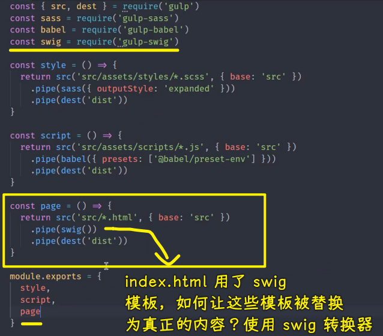
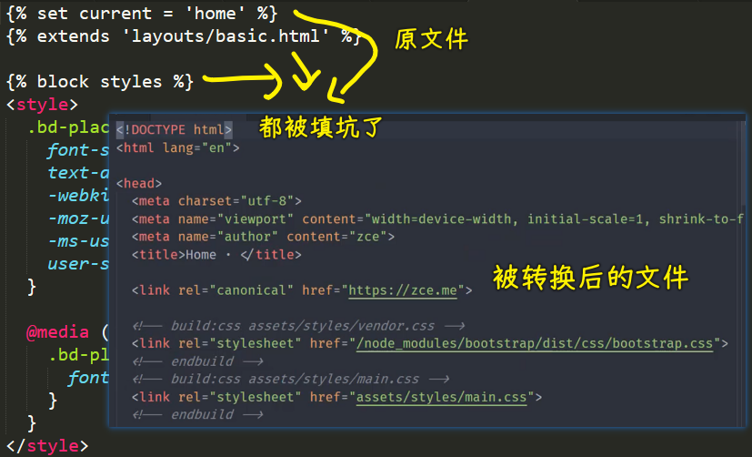
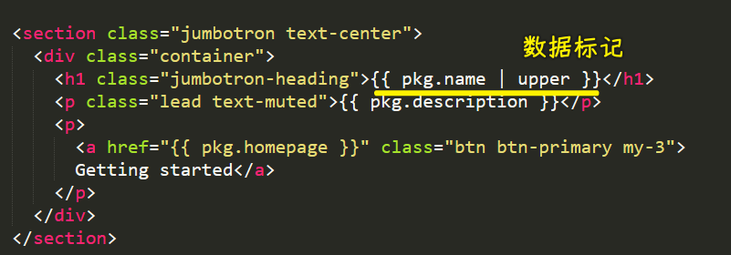
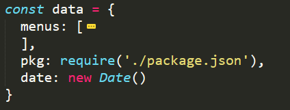
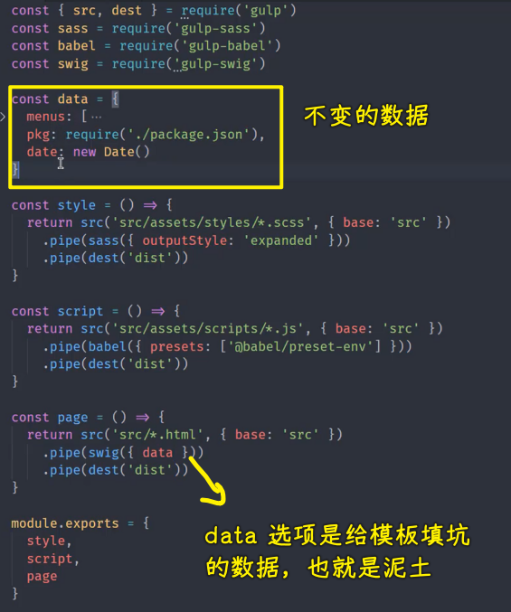
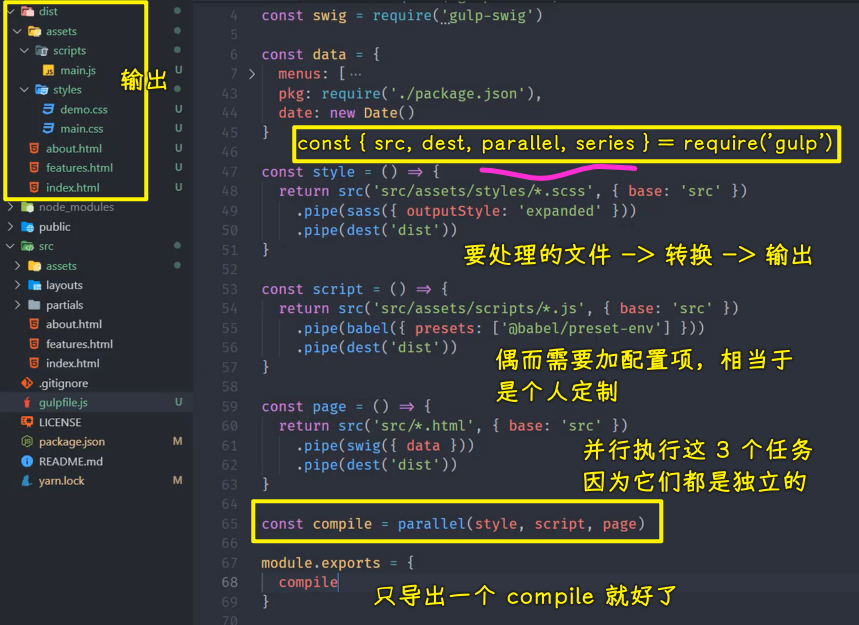

接下来我们再来看一下我们项目当中模板文件的编译。

模板文件也就是 HTML 文件。在这些 HTML 文件当中，我们为了可以让页面当中重用的一些地方被抽象出来 -> 我们使用了模板引擎

这里使用的模板引擎叫做「swig」 

我们可以单独去安装一下 `swig` 这个转换插件

``` bash
yarn add gulp-swig --dev
```

这个插件过后，我们就可以在我们的代码当中去载入这个插件。

``` js
const swig = require('gulp-swig')
```

完了过后，我们去创建一个页面，编译的任务叫做 `page`

这个`page`任务里面同样通过`return`的方式去 `return` `src`函数找到的这个文件的读取流`src/*.html`

这里需要注意一个小点，如果说你的 HTML 结构，不是只是在这个 `src` 目录下 -> 有可能有一些子文件夹里面也有 HTML 的话，那你可能需要使用`**`，也就是两个星号 -> `src/**/*.html` -> 这代表我们 `src` 下面任意子目录下的 `html` 文件 -> 这是一种子目录的通配方式

我们这里只是要求必须把所有的 html 全部放在 `src` 这个根目录下 -> 因为你在这个其他目录下的文件有可能是一些部分文件或者是布局页 -> 所以我们为了不干扰，我们就要求所有的 html 都放在根目录下面 -> 所以我们还是维持`src/*.html`这样

对了，同样，我们也可以去给它设置一下 `base`  -> 其实这里的 `base` 设置就没有意义了，因为我们这个通配符所在的位置就是我们的 `src` 目录 -> 但是，为了保证统一，我们就都设置一下`base` 

完了过后，我们点 `pipe`  -> 这个时候我们就直接 `pipe` 到 `swig` 这一个模板引擎的转换插件当中 -> 最后再去 `pipe` 到 `dest` 所创建的生成流当中。



保存一下。

我们此时同样把这个私有的任务给它导出一下，我们回到命令行当中去使用一下这个任务。

``` bash
yarn gulp page
```

此时这个任务转换完成过后，我们三个 HTML 文件就会分别被转换到我们的目标目录。而且这三个 HTML 文件里面 -> 我们之前的模板页和部分页它都已经正常工作了（把模板都替换成正常的内容了）。



但是有一个小点，那就是我们在这个`src/index.html`里面 -> 原来的这个模板它还用到了一些数据标记。



这些数据标记实际上就是把我们在网页开发过程当中那些有可能会发生变化的地方，比如说网站的名字或者是网站当中的一些数据信息 -> 我们把它提取成了一些数据 -> 这些数据我们需要在模板引擎工作的时候，通过选项去指定。

我提前准备好了一个数据：

``` js
const data = {
  menus: [
    {
      name: 'Home',
      icon: 'aperture',
      link: 'index.html'
    },
    {
      name: 'Features',
      link: 'features.html'
    },
    {
      name: 'About',
      link: 'about.html'
    },
    {
      name: 'Contact',
      link: '#',
      children: [
        {
          name: 'Twitter',
          link: 'https://twitter.com/w_zce'
        },
        {
          name: 'About',
          link: 'https://weibo.com/zceme'
        },
        {
          name: 'divider'
        },
        {
          name: 'About',
          link: 'https://github.com/zce'
        }
      ]
    }
  ],
  pkg: require('./package.json'),
  date: new Date()
}
```

我把它拷贝到`gulpfile.js`里边来，我们粘贴在一开始的位置。



这个里面的结构也非常简单，就三个属性，一个是 `menus`，一个是 `pkg`，一个是 `date` 

你可以放任意的数据在里面 -> 你放的数据都可以在我们的模板当中去使用 -> 这也就是根据你在开学开发这个 HTML  页面的时候的一个需要去决定

有了这个 `data` 过后，我们就可以通过 `swig` 的 `data` 参数去传递进去 -> 由于属性和变量名都叫`data`，所以我们可以简写成`swig({ data })`



我们再去运行一下这个`page`任务：

``` bash
yarn gulp page
```

此时我们再去看我们转化完的这个结果：


你会发现我们的页面的名字还有一些其他的信息就会自动的呈现到我们最终生成的这个 HTML 当中。

那这样的话，它就把我们在网页当中经常写死的一些数据提取出来，然后我们可以在代码当中去配置。

当然，你还可以去单独写一个`json`文件，通过代码把这个`json`文件载入进来 -> 通过这种方式去配置网页当中的一些数据 -> 这样做可能会更合理一些。

我们这里的`data`只是用一个对象去模拟了，当然，这效果是一样的

以上就是我们的页面的转换任务。

有了这三个任务过后，我们 `src` 目录下面主体需要去转换，或者说我们叫编译的这一些事情都已经完成了。

接下来我们就去创建一个组合任务，把他们三者全部组合在一块 -> 因为这三个任务，他们一旦要去运行的话，我们不可能单独去运行某一个，一般都是同时去运行 -> 所以说我们单独去创建一个叫 `compile` 的任务，即叫做编译的任务。

这个任务它是组合任务，我们可以借助于 gulp 提供的 `series` 和 `parallel` 这两个 API 去创建。

问题来了，我们这儿具体使用 `series` 还是 `parallel` 呢？

这很简单，因为你这三个任务他们相互之间没有任何的牵连。所以我们可以让这三个任务同时开始执行，这样的话可以提高我们构建的效率。

所以我们这里应该使用的是 `parallel` 。

有了这个 `parallel` 过后，我们就可以在这个创建 `compile` 的时候，去把我们的三个任务都给它传入进去。

``` js
const compile = parallel(style, script, page)
```



保存一下。

此时我们就不需要去导出这三个任务了，我们只需要去导出一个 `compile` 任务。

这个 `compile` 任务，我们去尝试执行一下。

只不过在执行之前，我们得先把`dist`目录给删除掉。

这个时候我们再去运行一下：

``` bash
yarn gulp compile
```


此时`dist`目录下面，我们的 HTML 文件，我们的样式文件，还有我们的脚本文件都有正常的一个工作。

那这样的话，我们这个编译的任务就算是有一个小结了，然后往后呢？肯定还有一些其他的特性需要拿进来，然后我们再接着去看。
