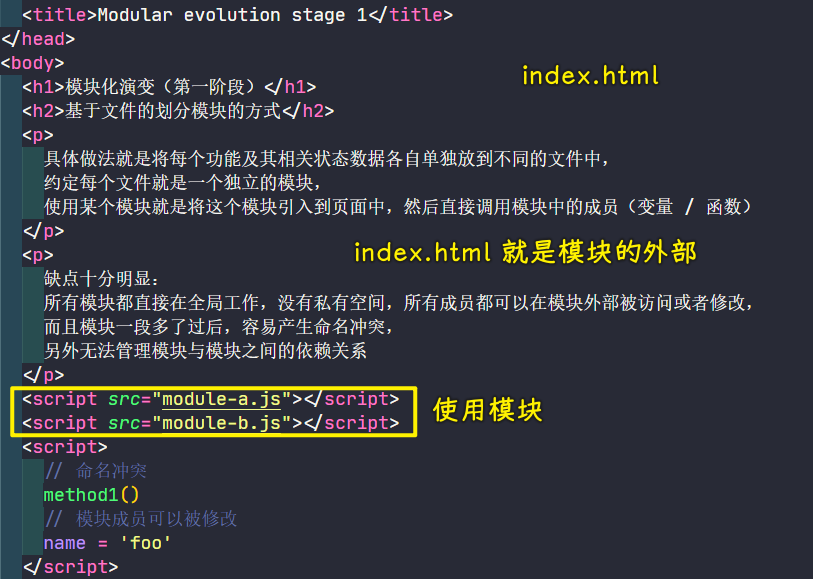
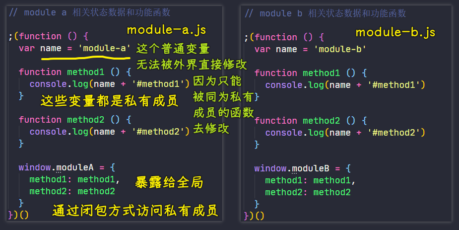

### ✍️ Tangxt ⏳ 2021-11-06 🏷️ 模块化

# 01-模块化概述、模块化演变过程、模块化规范的出现、模块化标准规范

## ★模块化概述


模块化可以说是当下最重要的前端开发范式之一。

### <mark>1）为什么需要模块化？</mark>

随着前端应用的日益复杂，我们的项目代码已经逐渐膨胀到了不得不花大量时间去管理的程度了。


而模块化就是**一种最主流的代码组织方式**，它通过把我们的复杂代码儿按照**功能的不同**划分为不同的模块儿然后**单独维护**的这种方式去**提高我们的开发效率，降低维护成本**。


单就「模块化」这个词而言，它仅仅是一个思想或者说是一个理论，并不包含具体的实现。


所以说接下来我们就一起去学习一下如何在前端项目当中去实践模块化这样一个思想，以及我们目前行业当中的一些主流的方式或者工具。

### <mark>2）内容概要</mark>

我将此次的内容大体分为了五大块。


首先就是对模块化的一个演变过程做一个介绍，让大家可以通过历史去理解这个模块化的存在的价值以及它解决的问题。

紧接着我们再去了解一下目前前端市面上关于模块化的一些标准和规范。

在这之后我们再去学习几个常用的模块化打包工具，然后我们结合一些实际的案例来去应用这些工具和规范。

最后我们再通过介绍一些打包工具在使用上的优化技巧，来去提高大家对打包工具的一个使用

我们希望大家可以通过以上这几个维度去深入了解模块化的具体实践和应用。

## ★模块化演变过程


早期的前端技术标准根本就没有预料到前端行业会有今天这样一个规模。

所以说**很多设计上的遗留问题就导致了我们现在去实现前端模块化的时候会遇到很多的问题**。

虽然说现如今这一些问题都被一些标准或者工具去解决了，但是它的一个解决的演进过程我个人认为是值得我们去思考的。所以说接下来我们就一起先来了解一下我们在前端方向去落实模块化的一个演变过程。

### <mark>1）Stage 1</mark>


在最早期，我们 JavaScript 当中的模块化实际上就是基于文件划分的方式去实现的，而这也就是我们 web 当中最原始的模块系统。

具体的做法就是：

将每一个功能以及它相关的一些状态数据，我们单独存放到不同的文件当中，我们去约定每一个文件就是一个独立的模块。


我们去使用这个模块的话，就是将这个模块引入到页面当中，然后一个 `script` 标签就对应一个模块，然后我们再到代码当中直接调用模块当中的全局成员 -> 这个成员有可能是一个变量，也有可能是一个函数。



当然这种方式的缺点也十分明显。


那就是我们所有的模块都直接在全局范围去工作，它并没有一个独立的私有空间。那这样就导致我们模块当中所有的成员都可以在模块外部被任意的去访问或者修改，而且模块一旦多了过后很容易产生命名上的冲突。除此之外，我们也没有办法很好的去管理模块与模块之间的一个依赖关系。

反正这总的来说的话，这种方式完全依靠约定，项目一旦上了体量过后就彻底不行了。


但是在这个过程当中暴露的一些问题，如果我们都能很好去解决的话，那我们就可以更好地去实现模块化了，所以说我们就有了第二阶段。

### <mark>2）Stage 2</mark>


在第二阶段当中，我们约定每一个模块只暴露一个全局的对象，我们所有的模块成员都挂载到这个对象下面。

具体的做法就是：

在第一个阶段的基础之上，我们通过将每个模块包裹成为一个全局对象的方式去实现。这有点儿类似于我们在模块内去为我们模块内的一些成员去添加了命名空间的这样一种感觉。所以说我把这种方式称之为「**命名空间的方式**」。


通过命名空间的方式，我们就可以减小命名冲突的可能。但是这种方式仍然没有私有空间。所以说我们的模块成员仍然可以在外部被访问或者被修改，另外，我们的这个模块之间的依赖关系也没有得到解决。


### <mark>3）Stage 3</mark>


我们再来看第三阶段。

在第三阶段当中，我们使用立即执行函数的这种方式去为我们的模块提供私有空间。

具体的做法就是：

将我们模块中每一个成员都放在一个函数提供的私有作用域当中。对于需要暴露给外部的成员，我们可以通过挂载到全局对象上的这种方式去实现。而这种方式，它实现了「**私有成员**」的概念，也就是我们的私有成员只能让模块内部的这些成员通过闭包的方式去访问，而在外部的话，我们是没有办法去使用的。那这样的话就**确保了我们私有变量的安全**。而且我们还可以利用这个自执行函数的参数去作为我们依赖声明去使用，这样一来，就使得我们每一个模块他们之间的一个依赖关系就变得更加明显了。




> IIFE 里边的函数如果没有暴露给外界，那就是私有函数，如果暴露了，那就是一个公开的函数，即外界是可以访问这个函数的！

例如我们在这个模块当中我们要去使用 jQuery，那我们就可以通过我们这个立即调用的函数去接受一个 jQuery（`$`） 的参数，我们在立即调用时我们去传递 jQuery 这个参数。


这样的话，我们在后期去维护这个模块的时候，我们就可以很清楚的知道这个模块它需要依赖 jQuery

### <mark>4）Stage 4</mark>

> 在一个模块里边使用其它模块

定义两个模块：


使用这两个模块：


### <mark>5）Stage 5</mark>

> 有了社区给出来的模块规范以及模块加载器

目录结构：


> `RequireJS 2.3.6`、`jQuery JavaScript Library v3.4.1`

`index.html`：

``` html
<!DOCTYPE html>
<html lang="en">
<head>
  <meta charset="UTF-8">
  <meta name="viewport" content="width=device-width, initial-scale=1.0">
  <meta http-equiv="X-UA-Compatible" content="ie=edge">
  <title>Modular evolution stage 5</title>
</head>
<body>
  <h1>模块化规范的出现</h1>
  <h2>Require.js 提供了 AMD 模块化规范，以及一个自动化模块加载器</h2>
  <script src="lib/require.js" data-main="main"></script>
</body>
</html>
```

`main.js`：

``` js
console.log('main.js start')
console.log(require)
require.config({
  // baseUrl: ".",
  paths: {
    // 因为 jQuery 中定义的是一个名为 jquery 的 AMD 模块
    // 所以使用时必须通过 'jquery' 这个名称获取这个模块
    // 但是 jQuery.js 并不一定在同级目录下，所以需要指定路径
    // 不要指定后缀
    jquery: 'lib/jquery'
  }
})

require(['./modules/module1'], function (module1) {
  console.log(module1)
  module1.start()
})

console.log('main.js end')
```

`module1.js`：

``` js
// 因为 jQuery 中定义的是一个名为 jquery 的 AMD 模块
// 所以使用时必须通过 'jquery' 这个名称获取这个模块
// 但是 jQuery.js 并不在同级目录下，所以需要指定路径
console.log('module1.js start')
// 不要定义模块名字，文件名即模块文字 -> 一个文件里边定义多个模块，显然违背规范了
define(['jquery', './module2'], function ($, module2) {
  console.log('1 callback')
  console.log($)
  console.log(module2)
  return {
    start: function () {
      console.log('执行 1 callback 导出的对象的 start 方法')
      $('body').animate({ margin: '200px' })
      module2()
    }
  }
})
// define([
//   'jquery',
//   './module2'
// ], function ($, module2) {
//   'use strict';
//   console.log($)
//   console.log(module2)
// });
console.log('module1.js end')
```

`module2.js`:

``` js
// 兼容 CMD 规范（类似 CommonJS 规范）
console.log('module2.js start -> CMD 规范的写法')
define(function (require, exports, module) {
  console.log('2 callback')
  // 通过 require 引入依赖
  var $ = require('jquery')
  // 通过 exports 或者 module.exports 对外暴露成员
  module.exports = function () {
    console.log('执行 module 2 导出的方法')
    $('body').append('<p>module2</p>')
  }
})

console.log('module2.js end')
```

效果：


`log`情况：


网络请求情况：


### <mark>6）小结</mark>

以上这几个阶段就是**我们早期开发者，在没有任何工具和规范的这种情况下，我们对模块化的一种落地的方式**。那这些方式确实解决了我们在前端领域去实现模块化的各种各样的问题，但是，它仍然存在一些没有解决的问题。那针对于这些问题，我们需要单独再来看。


## ★模块化规范的出现


### <mark>1）模块化规范 + 模块加载器</mark>

以上的这些方式都是以原始的模块系统为基础，通过约定的方式去实现模块化的代码组织。这些方式在不同的开发者去实施的时候会有一些细微的差别。

为了统一不同的开发者和不同的项目之间的差异，我们就需要一个标准去规范我们模块化的实现方式。

另外，我们在模块化当中针对于模块加载的问题，在这几种方式当中都是通过 `script` 标签手动的去引入我们的每一个用到的模块。那这也就意味着我们的模块加载并不受我们代码的控制。那一旦时间久了过后，我们维护起来就非常的麻烦。


试想一下，如果说你的代码当中依赖了一个模块，而我们在 HTML 当中却忘记引用这个模块的话，那这时候又会出现问题，又或是我们在代码当中移除了某个模块的引用，然后我们又忘记了在 HTML 当中去删除这个模块的引用，那这些都会产生很大的问题。

所以说我们需要一些基础的公共代码去实现自动通过代码去帮我们加载模块。那也就是说我们现在需要的是一个模块化的标准和一个可以用来自动加载模块的一个基础库。


### <mark>2）CommonJS 规范：Node.js</mark>

既然提到了模块化规范，我个人首先想到的就是 CommonJS 规范，它是 Node.js 当中所提出的一套标准。


我们在 Node.js 当中所有的模块代码必须要遵循 CommonJS 规范。


这个规范它约定了我们每一个文件就是一个模块，而且每个模块都有单独的作用域，我们需要通过 `module.exports` 的方式去导出成员，然后再通过 `require` 的方式去载入模块。

现如今的前端开发者都应该对这个规范有所了解。但是，如果我们想要在浏览器端也使用这个规范的话，那就会出现一些问题。


如果你对 node 的模块加载机制有所了解的话，那么你应该知道 CommonJS 约定的是以同步的方式去加载模块。**因为 node 的执行机制是在启动时去加载模块，那执行过程当中是不需要去加载的，它只会去使用到模块**。所以说这种方式在 node 当中不会有问题。

但是如果换到浏览器端，你在浏览器端去使用这个 CommonJS 规范的话，它必然导致我们效率低下。因为**我们每一次页面加载都会导致大量的同步模式请求出现**。

### <mark>3）AMD 规范：Require.js</mark>


所以说在早期的前端模块化当中，并没有选择 CommonJS 这个规范，而是专门为浏览器端结合浏览器的特点重新设计了一个规范 -> 这个规范叫做「**AMD**」，全称叫 Asynchronous Module Defination ，翻译过来的意思就是异步的模块定义规范。而且同期还推出了一个非常出名的库，叫做「**Require.js**」 -> 它实现了 AMD 这个规范，另外，它本身又是一个非常强大的模块加载器。


在 AMD 这个规范当中，它约定我们每一个模块都必须要通过 `define` 这个函数去定义。


我们这个函数默认可以接收两个参数，也可以传递三个参数。那如果传递三个参数的话：

- 我们第一个参数就是我们这个模块的名字 -> 可以在后期去加载这个模块的时候使用
- 第二个参数就是一个数组，它是用来去声明我们这个模块的一些依赖项
- 第三个参数是一个函数，函数的这个参数与前面的这个依赖项一一对应，每一项分别为依赖项这个模块导出的成员 -> 这个函数的作用，你可以把它理解为 -> 为当前这个模块去提供一个私有的空间。如果说你需要在这个模块当中向外部去导出一些成员的话，那我们可以通过 `return` 的方式去实现。

除此之外，Require 当中还提供了一个 `require` 函数 -> 用来帮我们自动加载这个模块。它的用法与 `define` 这个函数类似，而区别是在于 `require` 这个函数它只是用来去加载模块，而 `define` 这个函数它是用来定义模块的。


> `require`一个模块和`define`一个模块都是先执行后边的代码，再执行回调 -> 毕竟`require`一个模块需要发请求，而`define`一个模块的时候，需要引入其它模块

一旦当 Require.js 它需要去加载一个模块的话，它内部会自动的去创建一个 `script` 标签，去发送对应的这个脚本文件的请求，并且执行相应的模块代码。

目前绝大多数的第三方库都支持 AMD 这个规范。


也就是说 AMD 的生态实际上是比较好的，但是它使用起来相对比较复杂。因为我们在代码的编写过程当中，除了那些业务的代码，我们还需要去使用到很多的 `define`、`require` 这样一些操作模块的代码，而这一些会**导致我们的代码的复杂程度有一个提高**。


另外，如果说当你项目当中我们的模块划分得过于细致的话，那我们**在同一个页面当中对 JS 文件的请求次数就会特别多**，从而导致我们的页面效率就会比较低下。

所以说我个人认为这个 AMD 它只能算是前端模块化演进道路上的一步，它是一种妥协的实现方式，并不能算是最终的解决方案。只不过在当时的这样一个环境背景下面，它还是非常有意义的，因为它毕竟给了前端模块化提供了一个标准。

### <mark>4）CMD 规范：Sea.js</mark>

除此之外，同期出现的还有淘宝所推出的一个叫做 Sea.js 的一个库。


这个库它实现的是另外一个标准，也就是 Sea.js 官方所给出的一个标准——「**CMD**」，它全称是 Common Module Defination，也就是一个通用的模块定义规范。


这个模块的标准它有点儿类似于 CommonJS，在使用上跟 Require.js 也基本上差不多，可以算是**一个重复的轮子**。它当时的想法就是希望让我们的这个 CMD 写出来的代码，尽可能的跟 CommonJS 类似，从而**减轻开发者的学习成本**。但是**这种方式在后来被 Require.js 也兼容了**。

所以说如果对这个历史算是比较感兴趣的同学可以单独再去了解一下。


## ★模块化标准规范


在这儿之前我们已经了解了前端模块化的一个发展过程，以及在这个过程当中出现过的一些标准。

尽管这些方式和标准也都实现了模块化，但是他们都或多或少会存在一些让我们开发者难以接受的问题。

随着技术的发展，JavaScript 的标准也在逐渐完善。而我们在模块化这一块的实现方式相对于以往已经有了很大的一个变化了。

现如今的前端模块化已经算是非常成熟了，而且目前大家针对于前端模块化的最佳实现方式也都基本统一了。


那就是我们在 Node.js 环境当中，我们会去遵循 CommonJS 规范去组织模块。而在浏览器环境当中，我们会采用一个叫做 ES Modules 的规范，当然了，也会有极少部分例外情况出现。但是总的来说，前端模块化目前算是统一成了 CommonJS 和 ES Modules 这两个规范了。

对于我们开发者而言，我们只需要去着重掌握这两种规范就可以了。


我们在 Node.js 当中去使用 CommonJS 其实没有什么好说的，因为它是**内置的模块系统，没有任何的环境问题**，我们直接去遵循 CommonJS 规范去使用`require`载入模块，通过`module.exports`去导出模块就可以了。


但是对于 ES Modules -> 它的情况就相对会复杂一些


因为我们都知道 ES Modules 它是 ECMAScript 2015，也就是我们经常说的 ES6 当中定义的一个最新的模块系统，那也就是说它是最近这几年才被定义的一个标准，所以它**肯定会存在各种各样的环境兼容问题**。

最早在这个标准刚推出的时候，所有主流的这个浏览器基本上都是不支持这样一个特性的。但是随着 Webpack 等一系列打包工具的流行，这一规范才逐渐开始普及。


截止到目前，ES Modules 基本上已经可以说是最主流的前端模块化方案了。相比于 AMD 这种社区提出来的开发规范，ES Modules 它可以说是在语言层面实现了模块化，所以说它更为完善一点。


> <https://caniuse.com/es6-module>

另外，现如今绝大多数的浏览器已经开始支持 ES Modules 这个特性了。原生支持，也就意味着我们可以在以后直接去使用这样一个特性开发我们的网页应用了，所以说它的未来还会有一个很好的发展。而且我个人也认为短期之内不会再有针对于模块化这一块的一个新的标准或者是新的轮子出现了。

综上所述，针对于如何在不同的环境当中我们去更好地使用 ES Modules，自然就成为我们接下来要学习的重点。

## ★了解更多

➹：[Javascript 模块化编程（三）：require.js 的用法 - 阮一峰的网络日志](https://www.ruanyifeng.com/blog/2012/11/require_js.html)

➹：[requirejs 的 API 文档_.zz 的博客-CSDN 博客](https://blog.csdn.net/wangzhanzheng/article/details/79050033?utm_medium=distribute.pc_relevant.none-task-blog-2~default~baidujs_title~default-4.no_search_link&spm=1001.2101.3001.4242.3)