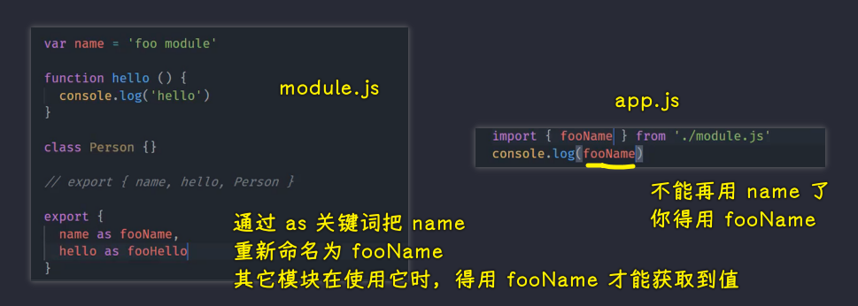

### ✍️ Tangxt ⏳ 2021-11-08 🏷️ ES Modules

# 02-ES Modules 特性、ES Modules 导出

## ★ES Modules 特性


对于 ES Modules 的学习，我个人觉得可以从两个维度去入手。

首先我们必须要去了解它作为一个规范或者说标准，它到底**约定了哪些特性和语法**。

其次就是我们如何通过一些工具或者方案去解决它在运行环境当中**兼容性**所带来的问题。

那么接下来我们就一起先来梳理一下 ES Modules 当中的一些语法特性。

### <mark>1）基本使用</mark>

我们回到 VS Code 当中去尝试使用一下这些特性。

正如之前所说的，目前市面上绝大多数的浏览器已经支持 ES Modules 了，所以，我们只需要通过给页面当中的 `script` 标签去添加一个 `type` 为 `module` 的一个属性，然后，这样一来，我们就可以直接去使用 ES Modules 的标准去执行这个当中的一些 JavaScript 代码了，那我们这里先来尝试一下。


我们添加一个 `script` 标签，我们把它的 `type` 设置为`module`。那这样的话，这个标签的内部就算是一个模块了，我们在这个模块当中先通过 `console.log()` 去输出一个简单的内容，然后我们打开命令行终端。

在这里我使用一个叫做 `serve` 的一个 npm 的工具去启动一个 HTTP Server -> 启动过后我们就可以通过这个地址去打开我们刚刚的这个页面。


打开页面过后，我们去启动一下 Chrome 的调试工具，我们打开一个`Console` 这个面板。那这个时候我们就能看到我们刚刚这个脚本的正常执行了。这也就意味着`script`标签通过 `type` 设置为`module`过后，它仍然可以正常作为 JS 去执行。

只不过这相对于普通的 `script` 标签来说，它会有一些新的特性。

我们分别来看一下。

### <mark>2）自带严格模式</mark>


> 没有`type="module"`的`script`标签也是 HTML 标签

首先第一个特性就是我们在 ES Modules 当中，它会自动去采用严格模式，忽略你去使用 `use strict;` 这种文件头的方式去声明严格模式。说白了，你不加 `use strict;`，它也是严格模式。

严格模式当中有一个代表 -> 那就是我们不能在全局范围直接去使用 `this`，因为在非严格模式下面， `this` 它实际上指向的是全局对象。我们把 `type="module"` 删除掉回到浏览器当中，这时候你可以看到 `this` 打印出来的实际上就是 `window` 对象，但是我们通过添加 `type="module"` 的话，你就会发现它是一个 `undefined` -> 这是它的第一个特性。

### <mark>3）单独的私有作用域</mark>


第二个特性就是每一个 ES Modules 它都是运行在单独的私有作用域当中。

这具体来看就是我们再单独去添加一个 `script` 标签，我们把`type`同样设置为`module`。

在这个 `script` 当中，我们去添加一个用 `var` 声明的 `foo` 变量，我们添加完了过后紧接着把它打印出来。

然后我们再去添加一个新的 `script` 标签。有了这个 `script` 标签过后，我们在这个里面同样再去打印一下 `foo`，然后我们回到浏览器当中。

这时候你会发现我们在第一个`script`标签当中可以正常打印出来这个 `100`。但是在第二个标签当中，它去打印这个 `foo` 就报错了，报错信息说的是 `foo is not defined` -> 这也就意味着我们每一个 ES Modules 它都是有一个独立的私有作用域，那我们也就不用再担心我们直接在全局范围去使用那些变量，会造成全局作用域污染的问题。

### <mark>4）CORS 的请求姿势</mark>


> 自带 Ajax、Fetch 特性

第三个特性就是在 ES Modules 当中，我们的外部 JS 文件是通过 CORS 的方式去请求的，那也就意味着我们的 JS 模块如果说不在同源地址下面的话，然后我们需求去请求这个服务端地址，那它在响应的响应头当中必须要提供有效的 CORS 标头 -> 这里我们通过百度 CDN 的地址做一个尝试 -> 这个地址是不支持 CORS 的。我们去请求的时候会发现它会报一个跨域的错误。而且在 Network 面板当中我们也会发现这样一个请求实际上是被浏览器终止掉了。

所以说如果你要去请求一个外部地址的话，那就需要注意服务端必须要支持 CORS -> 这里我们再换做一个支持 CORS 的一个服务端地址。那这个时候你会发现这一次对于 jQuery 这个文件的请求它是一个正常的请求。

另外，CORS 不支持文件的形式去访问，所以说我们必须要使用 HTTP Server 的形式去让这个页面工作起来 -> 这个问题实际上在我们实际开发的时候不会遇到，原因很简单，因为我们在实际开发的最终运行环境肯定都是 HTTP 的 Server

💡：关于跨域？


➹：[跨域资源共享 CORS 详解 - 阮一峰的网络日志](https://www.ruanyifeng.com/blog/2016/04/cors.html)

### <mark>5）自带 `defer`</mark>

我们再来看第四个小特性，第四个特性是 ES Modules 当中的 `script` 标签，它会自动的去延迟执行脚本。

这一点等同于我们`script`标签的 `defer` 属性。那也就是说我们通过添加`type="module"`就相当于去添加了一个 `defer` 属性 -> 我们应该也知道，网页的加载过程默认对`script`标签它是采用立即执行的这样一个机制，那页面的渲染会等待这个脚本的执行完成，才会继续去往下渲染。

在这里我们尝试添加一个脚本文件（`demo.js`）来去试验一下

``` js
// demo.js
alert('hello')
```

我们在这个文件当中通过 `alert` 去模拟一下这个脚本当中的一个阻塞的操作。然后我们回到页面（HTML）当中，在这个脚本的下面再去添加一些需要显示的内容，有了这些过后我们就可以回到浏览器。


此时在浏览器当中去刷新这个页面，你会发现弹出对话框的时间，而我们那个网页当中需要显示的内容并没有呈现出来，因为这个时候正在去执行我们的脚本。


脚本执行完成，也就是我们点击完成过后才会去显示我们想要显示的内容。

那这个时候如果说我们去添加了一个`type="module"`的话，那就相当于让这个脚本启用一个延迟执行的这样一个机制 -> 延迟执行它会等待网页的执行，也就是网页的渲染完成了过后再去执行我们的脚本，那这个时候就不会阻碍我们页面当中元素的显示 -> 这一点就跟我们使用 `defer` 属性是一样的。


> `<script defer src="demo.js"></script>`

所以这个小特点实际上也是 ES Modules 当中对 `script` 标签做的一个小小的改进。

💡：`defer` vs `async`？


不管是`async`还是`defer`，这俩兄弟都只适用于外部 JS 文件


> 在现实当中，延迟脚本并不一定会按照顺序执行，也不一定会在 `DOMContentLoaded` 事件触发前执行，因此最好只包含一个延迟脚本 -> JavaScript 高级程序设计（第 3 版），人民邮电出版社，Kindle 位置 （639-641) 

➹：[一图看懂 script 标签中 defer 和 async 的区别_小小前端-CSDN 博客](https://blog.csdn.net/weixin_43967603/article/details/106309099)

➹：[defer 和 async 的区别 - SegmentFault 思否](https://segmentfault.com/q/1010000000640869)

➹：[async vs defer attributes -  Growing with the Web](https://www.growingwiththeweb.com/2014/02/async-vs-defer-attributes.html)

➹：[脚本：async，defer](https://zh.javascript.info/script-async-defer)

💡：页面生命周期：`DOMContentLoaded`、`load`？

- `DOMContentLoaded` —— 浏览器已完全加载 HTML，并构建了 DOM 树，但像 `` 和样式表之类的外部资源可能尚未加载完成。
- `load` —— 浏览器不仅加载完成了 HTML，还加载完成了所有外部资源：图片，样式等

➹：[页面生命周期：DOMContentLoaded，load，beforeunload，unload](https://zh.javascript.info/onload-ondomcontentloaded)

### <mark>6）小结</mark>

总的回顾一下，我们在 ES Modules 当中有这么四个小特点，这四个特点分别是：

- 我们在 ES Modules 当中会自动去启用严格模式
- 另外，每一个 ES 模块它都会有一个独立的作用域 -> 这一点实际上是非常重要的
- 然后第三个就是 ES Modules 对于外部文件的请求，它是通过 CORS 这种跨域请求的方式去请求的 -> 这个时候你需要去注意你请求的那个地址必须要支持 CORS
- 然后最后一个就是 ES Modules 当中对于 `script` 标签默认启用了延迟执行脚本的这样一个机制 -> 这个也是一个需要注意的一个小点。因为这会导致有的时候我们去看 `console.log()`，你会发现不同的模块它的执行顺序并不跟你的引入顺序是一样的，那这个是需要注意的！


## ★ES Modules 导出


了解了 ES Modules 的一些特点过后，我们再来尝试一下 ES Modules 当中最为核心的功能，那就是我们对模块的导出和导入。

这两个功能主要是由 `export` 和 `import` 这两个关键词去构成的。


`export` 命令是用于在模块内去对外暴露接口，而 `import` 命令则是在模块内去导入其他模块所提供的接口。

我们先来看`export`的用法。


### <mark>1）一个`export`只导出一个成员</mark>

这里我们打开 VS Code 来去做一些具体的尝试。我这儿准备好了一个 HTML 文件和两个 JS 文件。


在这个 HTML 文件当中，我们以模块的形式载入了 `app.js` 文件 -> 而在`app.js`当中会载入`module.js`当中所暴露的一些模块成员


> `app.js`可以不用加`./`，引入其它模块得加`./`，不然就会被当作是引入第三方包了！

正如我们之前所介绍到的，ES Modules 当中每一个模块它都会运行在独立的私有作用域当中 -> 所以说我们模块内所有的成员都没有办法直接在外部被访问到。


如果说我们需要去对外提供某些成员，例如我们要把`module.js`的 `name` 给它暴露出去，那我们就必须要通过 `export` 这个关键词去修饰一下我们这个 `name` 的一个变量的声明。


具体的方式就是在 `var` 之前去添加一个 `export` 关键词 -> 添加完了过后，我们就可以回到 `app.js` 当中，我们通过 `import` 这个关键词去载入 `module.js` 当中的 `name` 这个成员。


这个时候模块系统在工作的时候，它会自动的去请求`module.js`这个文件，并且把内部所暴露的这个 `name` 给它提取出来，以此来作为我们的局部变量去使用。

> `app.js`导入的`name`此时就是作为一个局部变量来使用 -> 相当于之前你用 IIFE 时所传的实参一样啊！

这里为了方便我们的调试，我们通过 Browser Sync 这个模块去启动一个具有热更新能力的一个 web server，那这样的话我们在 JS 文件修改过后，就可以直接在浏览器当中看到最新的运行结果 -> 你也可以在你的本地去安装一个这样的模块。


我们通过`browser-sync`模块去运行当前这个目录，然后通过`--files`去监视我们所有的 JS 文件：

``` bash
browser-sync . --files **/*.js
```

启动过后，它会自动帮我们去唤起浏览器，我们在浏览器当中去输入当前这个页面的访问地址，然后我们打开开发人员工具。

这个时候我们再回到 VS Code 当中，我们将 VS Code 移到屏幕的左侧，那这样可以有一个更直观的一个体验。

这个时候我们回到 `app.js` 当中，我们通过 `console.log()` 的方式将刚刚导入的这个 `name` 给它打印出来 -> 通过及时更新，我们能看到控制台当中已经打印出来对应的 `name` 值了 -> 这也就意味着我们确实可以通过 `import` 这种方式去导入其他模块当中通过 `export` 去导出的一些变量了。

💡：`export` 函数和类？

除了可以通过`export`去修饰一些变量的声明，我们还可以通过`export`去修饰函数的声明。那这样的话，函数也可以作为我们模块的导出成员了，同理，类的声明也是一样的，都是可以通过`export`这种方式去导出的。


### <mark>2）一个`export`一次性导出多个成员</mark>

除了这种修饰成员声明的这种使用方式 -> 对于`export`，一般我们还可以用来单独去使用。


具体的操作方式就是我们把变量声明之前的这些`export`全部给它删掉，然后我们在这个模块的最底部去通过`export`，然后一对大括弧，然后去把 `name`、`hello` 和 `person` 这三个成员全部给它导出出去

**这种用法相对更为常见一些，因为一般我们通过在模块尾部去集中导出所有成员的这种方式** -> 这个可以更加直观的去描述我们这个模块向外提供了哪些成员 -> 这样对于外界来讲的话，去理解这个代码会更加容易一些。

### <mark>3）把成员重命名后再`export`</mark>

除此之外，我们还可以通过这种方式去为我们输出的这个成员进行重命名。



具体的用法就是通过 `as` 这个关键词来去实现，我们可以将 `name` 给它 `as` 为一个 `fooName`，那这样的话我们再去使用 `name` 这个成员的时候我们就不能再直接去导入 `name` 了，我们应该导入它重命名过后的一个 `fooName` -> 对于其他的成员也是一样的。

我们这里也可以将 `hello` `as` 为一个 `fooHello` -> 我们再去使用的时候也就必须要使用 `fooHello` 了。

### <mark>4）把成员重命名为`default`再`export`</mark>


**重命名使用过程当中会有一个特殊的情况**，那就是我们一旦将导出成员的名称设置为 `default` 的话，那**这个成员就会作为当前这个模块默认导出的成员**。那我们再去导入这个成员的时候，就必须要去给这个成员去重命名了。因为 `default` 它是一个**关键词**，我们在 `import` 的时候不能把它当做一个变量去使用。所以说我们这儿也可以通过 `as` 的方式在 `import` 的时候将 `default` 给它起一个新的名字。

### <mark>5）`export default`</mark>

不仅如此，我们在 ES Modules 当中还为 `default` 成员单独设计了一个特殊的用法。


这个用法就是直接通过 `export default` 然后后面跟上一个变量，那我们就可以将这个变量作为我们当前这个模块的默认导出 -> 对于默认的导出，我们在导入的时候也可以通过直接 `import` 一个变量名的方式去接收这个模块默认导出的成员，这样一来，这个变量名你就可以根据你的需要**随便去取**了。

### <mark>6）小结</mark>

以上这些就是我们在 ES Modules 当中去导出成员的一些基本用法。

- `export var name = 'xxx'` -> `import { name } from './module.js'` -> 一个个导出？
- `export { name, Person }` -> `import { name, Person } from './module.js'` -> 一次性导出多个？-> 导出列表
- `export { name as default, Person }` -> `import { default as fooName, Person } from './module.js'` or `import { Person, default as fooName } from './module.js'`
  - 成员重命名为`default`，表示这个成员是默认导出的，也就是说你可以直接通过`import xxx from './module.js'`拿到这个`name`的值，当然，你也可以通过 `import { default as fooName } from './module.js'` 这种方式拿到`name`的值
  - 注意，默认导出的成员只能有一个，也就是说一个模块里边不能出现两次`as default`，也不能是一次`as default`，一次`export default name`这样
- `export default name` -> `import xxx from './module.js'` or `import { default as xxx } from './module.js'`
  - 导出默认成员时，建议使用这种，而`export {}`这种就不要再出现`as default`这种使用了

关于导入所有成员`*`：


