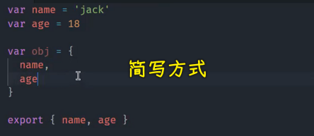
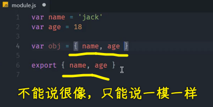
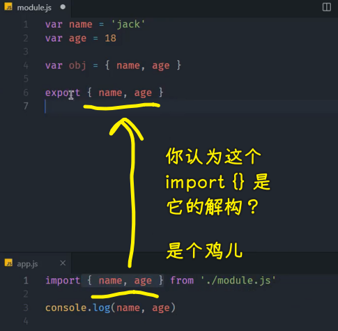
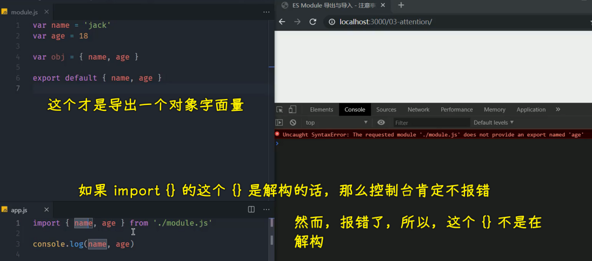
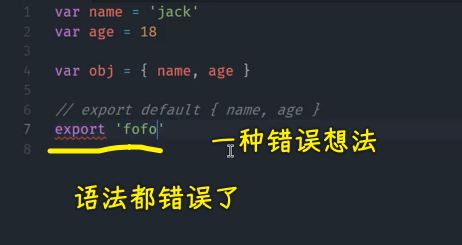
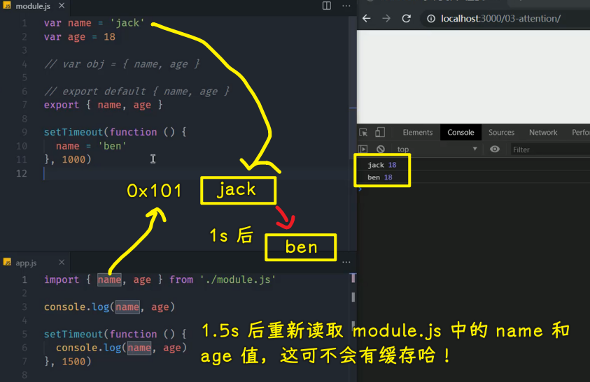
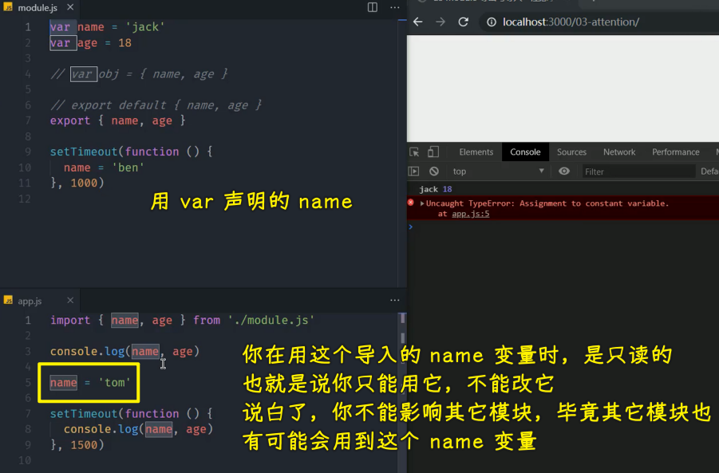
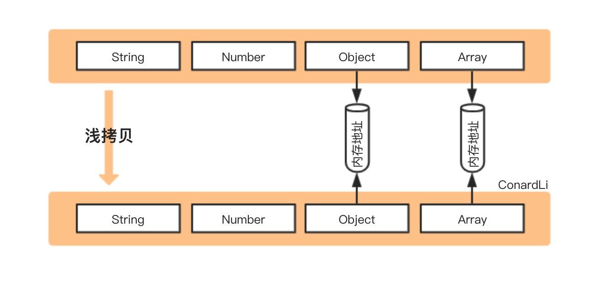
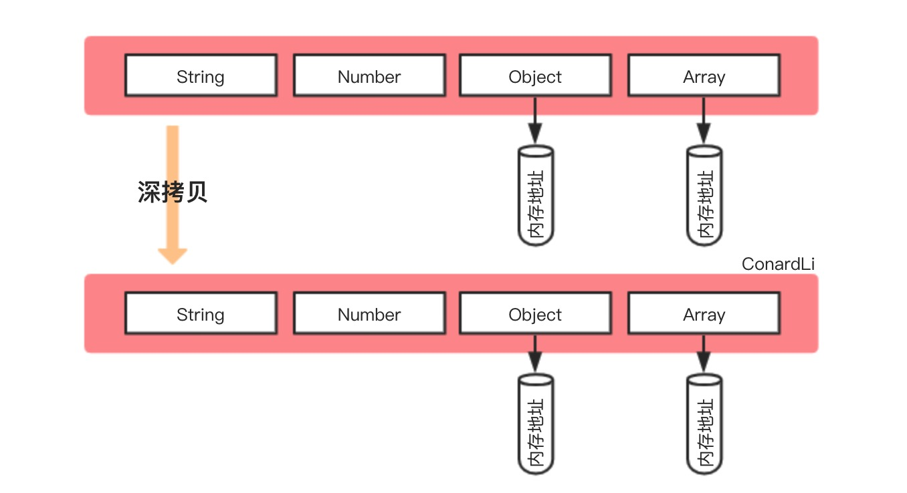
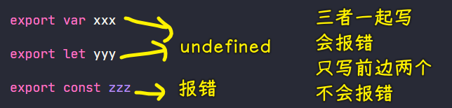

### ✍️ Tangxt ⏳ 2021-11-11 🏷️ 模块化

# 03-ES Modules 导入导出的注意事项


针对于 ES Modules 的导入和导出有一些需要注意的问题 -> 这些小问题如果说你没有在意的话，那就很容易会因为这些小问题而出现一些错误。

### <mark>1）带花括号的导出和导入并不是在解构</mark>

首先第一个问题就是我们在使用 `export` 去导出模块当中的一些成员的时候，我们使用到的是 `export` 然后花括号中间跟上一些我们需要导出的成员的变量

``` js
export { name, age }
```

这种方式很多人会误认为我们 `export` 后面跟上的是一个对象的字面量 -> 为什么这样说呢？

因为很多人都会联想到我们在 ES6 当中新出的一个对象字面量的一个简写的写法 -> 啥意思？

就是我们正常来讲的话，然后去写一个字面量的对象的话，我们是通过一个`{}`然后一个属性的名字，然后等于一个值 -> 如果说一个`name`属性的值等于`name`这个变量当中的值的话，同理，`age`属性也是如此

``` js
var obj = {
  name: name,
  age: age
}
```

对于这种方式在 ES6 当中有一个简写的写法，就是你这个对象字面量当中，如果属性的名字跟我们当前作用域变量的名字一样的话，那我们就可以直接通过这个变量的名字去代替。这样的话，这就是一种简写的方式：



我们把它折到同一行当中过后你就会发现，它实际上跟我们导出的这种语法很接近，不能说很接近，基本上就是一模一样的。



> [ES 的 import 和 import {} from 的区别是？- SegmentFault 思否](https://segmentfault.com/q/1010000006229052) -> 这个问题下的某个回答就是有这样的误区

所以说很多人会误认为`export`这个地方导出的是一个字面量对象，然后我们在导入的时候是对这个对象的一个解构，实际上这两个说法是完全错误的。



我们在这个地方 `export` 后面跟的这个花括号`{}`，它是一个固定的语法，就是说我们 `export` 单独去使用的时候，它必须要使用一对花括号去包裹我们需要导出的这些成员，这是一个固定的用法。

如果说你真的想要导出一个对象的话，那这个时候我们就不能使用 `export` 这种方式去导出一个对象里面全部的成员了。

那我们可以怎么办呢？

我们可以通过 `export default {}` -> 这时候我们`export default`后面跟上的这对花括号，它的含义就是一个对象的字面量的一个范围了



这跟我们刚刚的 `export {}` 完全不同 -> 为啥这样说呢？ -> 因为通过刚刚的介绍，我们应该知道 `export default` 它后面可以跟上一个变量，也可以跟上一个值。而我们这里的`export default`后面跟上的这一堆花括号`{ name, age }`会被我们 JS 理解成一个对象。而这个对象里面有个`name`属性， `name` 的值就是我们当前作用域`name`这个变量里面的值。

所以这种方式实际上导出的是一个对象，这个对象里面有两个属性

我们再去保存一下。那这个时候保存过后，你会发现浏览器当中会报这样一个错误，说的是我们 `module.js` 这个模块当中并没有提供一个叫做 `name` 的成员，也没有提供`age`成员 -> 那这个就意味着什么呢？ -> 意味着我们 `import` 它也并不是解构，不是将我们这个对象里面所有的成员全部拿出来过后，然后去做一个解构，它就是一个固定的用法跟 `export {}` 是一个道理，总之，它就是一个固定的用法，就是用来提取我们刚刚这个模块当中去导出的成员。

这个是大家很容易犯的错误。因为一旦你要是认为`export { name, age }`这种方式是导出了一个对象的话，那是不是很多人就会想：

> 既然后面是一个字面量对象，而我们知道 JS 当中字面量对象，它实际上表示了一个值，那我可以通过 `123` 去表示一个数字的值：`export 123` -> 那我也可以通过双引号去引起来一个字符串，也就是表示一个字符串的值：`export 'foo'` -> 所以这一种写法是不是也可以呢？



> `export` 后面跟声明语句

显然，我们是很容易产生这种错误的想法 -> 很明显这种方式是不可以的。所以从这一些点上都证明了`export {}`就是一个固定的用法，总之，需要大家注意这么一个小点。

### <mark>2）不管是复杂数据类型，还是简单数据类型，导入的成员都动态的，也就是引用值</mark>

除此之外，还有一个需要去注意的点 -> 我们在 ES Modules 当中它去导出成员的时候，它导出的是这个成员的一个引用。

什么意思？



就是说我们在这个模块内部它定义了一个叫做 `name` 的变量。那此时你就可以理解成内存当中有一个 `name` 的空间，然后里面放了 `'jack'` 这样一个字符串的值 -> 我们通过 `export` 把它导出出去

导出出去过后，这个成员实际上并不是复制了一份给我们的 `app.js`，而是将我们 `name` 所在内存的那个空间，也就是它的一个引用关系给到了`app.js` -> 在 `app.js` 当中，这个 `name` 始终访问到的是我们 `module.js` 当中所定义的那一块内存空间，所以说它们是完全相同的或者说这也是一个引用关系。

> 虽然是基本值，但这并不是值拷贝，而是引用拷贝

我们也可以通过一个小尝试、小实验来去测试一下。我们这里`export`过后，然后我们去启动一个定时器 -> 这个定时器它的作用非常简单，就是在一秒钟过后，我们再去 修改一下`name`的值。我们将 `name` 这一块空间的值改成什么呢？改成`'ben'`，注意，这是一秒钟过后。

同样一个道理，我们一秒钟过后，再在 `app.js` 当中再次去执行一下这个打印操作 -> 为了确保这个 `Timeout` 在`module.js`里边这个 `Timeout` 之后去执行，我们可以把它的时间稍微给长一点，我们 `1.5` 秒过后再去执行。

这个时候我们保存一下。

你会发现一开始打印出来的是 `jack 18`，然后第二次打印出来的是 `ben 18`。

对于我们`app.js` 来讲的话，我们并没有在这个运行过程当中去修改 `name`，只是在`module.js`这个模块内部通过定时器去修改了这个 `name`

所以通过这么一个小实验，我们就发现`expor { name }`实际上是将这个`name`值的引用关系给到了外部，并不是将这个值拷贝了一份给外部 -> 这些跟我们在 CommonJS 当中，也就是在 Node 当中的那些模块的特点是完全不同的。

> Node 的 CommonJS 规范导出是一个基本值时，就是一个值的拷贝，你修改这个值，是不会影响其它模块的，对于引用类型是浅拷贝

### <mark>3）导入的成员都是只读的，你只能用该成员，不能改该成员</mark>

还有一个小特点就是我们对外去暴露成员的时候，它暴露的是一个引用关系，而这个暴露出来的引用关系它是一个只读的。那也就是说，我们并不能在模块的外部去修改这个成员。



比如说我们在`app.js`里边给`name`赋值为一个`'tom'`，这个时候我们保存一下，那它就会报一个错，说的是我们并没有办法去修改一个常量。

这也就意味着什么呢？我们拿到的这个 `name` 它是一个常量，但是我们实际上声明的时候并不是以常量的方式去声明的，所以说这个就是模块的一个特点，它导入的这个成员是一个只读的成员。

以上这几点就是我们在去使用 ES Modules 导入导出的时候会可能产生的一些问题。

### <mark>4）小结</mark>

如果说你要是没有遇到的话，那么你可以去注意一下，总之，主要就是以下这么三点：

第一个就是我们导出的这个成员`export { name }`它并不是一个字面量的对象，这个语法跟字面量对象很像，但是并不是字面量对象。

然后我们在导入`import { name } from './module.js'`的时候，这也跟我们在 ES6 当中的一个解构的语法很像，但是这并不是解构

这两种都是固定的语法 -> 就好比来说函数后面必须要跟花括号这个道理是一样的，它是一个语法，就是这么规定的。

然后第二个特点就是我们在模块`module.js`的导出过程当中，它导出的成员并不是导出成员里面的值，说白了它并不是把值复制一份给你，而是把这个值所存放的地址给你 -> 这个时候你在外部拿到的这个成员，就会受我们当前这个`module.js`模块内部的一些修改的影响

然后第三个点就是我们在外部导入一个模块当中的成员过后，导入的这个成员它会是一个只读的成员，并不能去修改他们。

我们可以借助于第三个特点去定义一些常量模块，比如说我们项目当中的一些配置文件。那这个配置文件我们希望在外部去使用的时候，只是读取他们并不能去修改他们。因为一旦如果外部一不小心把这个配置修改了，那就会导致全局的这个配置都会受到影响，而这个是很不合理的。所以说我们可以借助于这种小特性去解决我们应用当中常量的这种问题。

以上这个就是我们在 ES Modules 当中导入和导出的一些注意事项，大家需要注意一下。

## ★代码

`index.html`：

``` html
<!DOCTYPE html>
<html lang="en">
<head>
  <meta charset="UTF-8">
  <meta name="viewport" content="width=device-width, initial-scale=1.0">
  <meta http-equiv="X-UA-Compatible" content="ie=edge">
  <title>ES Module 导出与导入 - 注意事项</title>
</head>
<body>
  <script type="module" src="app.js"></script>
</body>
</html>
```

`module.js`：

``` js
var name = 'jack'
var age = 18

// var obj = { name, age }

// export default { name, age }

// 这里的 `{ name, hello }` 不是一个对象字面量，
// 它只是语法上的规则而已
export { name, age }

// export name // 错误的用法

// export 'foo' // 同样错误的用法

setTimeout(function () {
  name = 'ben'
}, 1000)
```

`app.js`：

``` js
// CommonJS 中是先将模块整体导入为一个对象，然后从对象中结构出需要的成员
// const { name, age } = require('./module.js')

// ES Module 中 { } 是固定语法，就是直接提取模块导出成员
import { name, age } from './module.js'

console.log(name, age)

// 导入成员并不是复制一个副本，
// 而是直接导入模块成员的引用地址，
// 也就是说 import 得到的变量与 export 导入的变量在内存中是同一块空间。
// 一旦模块中成员修改了，这里也会同时修改，
setTimeout(function () {
  console.log(name, age)
}, 1500)

// 导入模块成员变量是只读的
// name = 'tom' // 报错

// 但是需要注意如果导入的是一个对象，对象的属性读写不受影响
// name.xxx = 'xxx' // 正常
```

## ★Q&A

### <mark>1）关于浅拷贝和深拷贝？</mark>

浅拷贝：



注意，拷贝出来的是一个新对象，这跟一个对象被赋值给另外一个对象是不一样的啊！

属性值为引用类型的话，这两个对象是相互影响的！

深拷贝：



也是创建一个新对象，属性值为引用类型的话，这两个对象互不影响的！

➹：[ConardLi.github.io/如何写出一个惊艳面试官的深拷贝。md at master · ConardLi/ConardLi.github.io](https://github.com/ConardLi/ConardLi.github.io/blob/master/docs/article/JS%E8%BF%9B%E9%98%B6/%E5%A6%82%E4%BD%95%E5%86%99%E5%87%BA%E4%B8%80%E4%B8%AA%E6%83%8A%E8%89%B3%E9%9D%A2%E8%AF%95%E5%AE%98%E7%9A%84%E6%B7%B1%E6%8B%B7%E8%B4%9D.md)

➹：[浅拷贝与深拷贝 - SegmentFault 思否](https://segmentfault.com/a/1190000017489663?utm_source=sf-similar-article)

### <mark>2）一个体现`var`、`let`、`const`三者异同的例子？</mark>



> 如果代码是 `let x`，就将 `x` 初始化为 `undefined`

➹：[我用了两个月的时间才理解 let - 知乎](https://zhuanlan.zhihu.com/p/28140450)