### ✍️ Tangxt ⏳ 2021-11-12 🏷️ 模块化

# 04-ES Modules 导入用法、ES Modules 导出导入成员

## ★ES Modules 导入用法


对于 `import`，我们在它的使用上也有一些需要注意的点，以及还有一些特殊的用法 -> 我们依次来看。

### <mark>1）导入模块时写的这个路径是个字符串</mark>

首先第一点就是我们 `import` 它在导入模块时，`from` 后面写的实际上是我们导入模块的一个路径，它是一个字符串。

#### <mark>1、必须加文件后缀</mark>

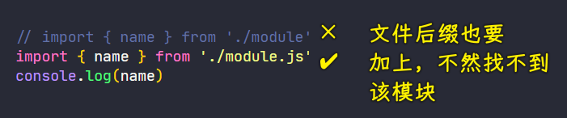

> 不加`.js`，报 `404` 错误

在这个字符符串当中，它必须要使用完整的文件名称，它不能去省略`.js`的扩展名 -> 这个跟我们在 CommonJS 当中是有一些区别的。

#### <mark>2、不能载入目录，因为不会默认找 index.js 这个文件</mark>

然后对于路径当中的这个`index.js` 这一部分，我们在 CommonJS 当中也是可以省略掉的，我们直接通过载入目录的方式就可以载入这个目录下的 `index`，但是我们通过实验发现我们在 ES Modules 原生的这个工作过程当中，它也是不能去载入 `index` 的，我们必须要手动的去填写完整的路径。

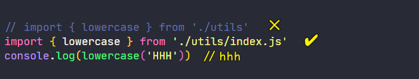

> 载入目录，报`Failed to load module script: Expected a JavaScript module script but the server responded with a MIME type of "text/html". Strict MIME type checking is enforced for module scripts per HTML spec.`错误

对于文件路径的名称，我们在后期去使用打包工具去打包我们的模块时，我们就可以省略扩展名，当然，也可以去完成省略 `index.js` 这样一个默认文件的一个操作了。

#### <mark>3、相对路径要加点斜线</mark>

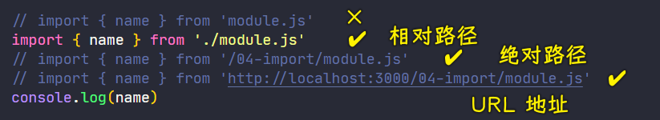

> 使用相对路径时，不加`./`报的是`Uncaught TypeError: Failed to resolve module specifier "module.js". Relative references must start with either "/", "./", or "../".`错误

其次，我们如果使用的是一个相对路径的话，那相对路径当中的「**点斜线**」，我们在网页开发当中引用资源实际上是可以省略掉的。但是在`import`的时候，这个点斜线它不能省略掉。因为如果说你省略掉的话，那就是以字母开头了，而这个 ES Modules 它会认为是在加载第三方的模块，所以说它必须要以点开头 -> **这一点与 CommonJS 实际上是相同的**。

#### <mark>4、可以使用斜线开头的绝对路径</mark>

除了我们可以使用点斜线的这种相对路径，我们还可以使用「**斜线**」开头的这种绝对路径，也就是从网站根目录下开始往后去数。

我们这里可以用`/04-import/moudle.js`，也就是我们这一个模块的完整路径去引用这个模块。

#### <mark>5、也可以使用完整的 URL</mark>

再有就是我们也可以去使用完整的 URL 去加载我们的模块 -> 这种方式我们只需要在 `from` 后面写上完整的 URL 就可以了 -> 这也就意味着**我们可以直接去引用 cdn 上的一些模块文件**

以上内容就是我们针对于引用文件的这个路径的这一块儿有一些需要注意的点。

- 首先就是我们必须要有完整的文件名称。
- 再一个就是相对路径当中的「**点斜线**」是不能省略的。
- 再一个就是我们可以使用绝对路径或者是完整的 URL。

### <mark>2）不提取成员，只想执行一下这个模块</mark>

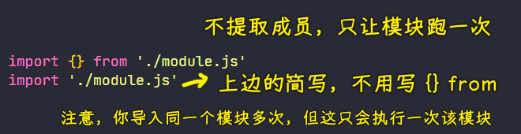

第二点就是如果说我们只是需要去执行某个模块，并不需要去提取这个模块当中的成员的话，那我们就可以保持我们 `import` 后面的这个花块弧为空。那这样的话它就只会去执行我们这个模块，它并不会去提取任何的成员。

这种方式还有一种简写的语法，我们就是直接在 `import` 后面跟上 `from` 后的那个字符串。那这样的话，这就是只加载这个模块并不提取它

这个特性在我们去导入一些不需要外界控制的一些子功能模块时会非常有用 -> 这是第二点。

### <mark>3）提取模块里边所有的成员</mark>

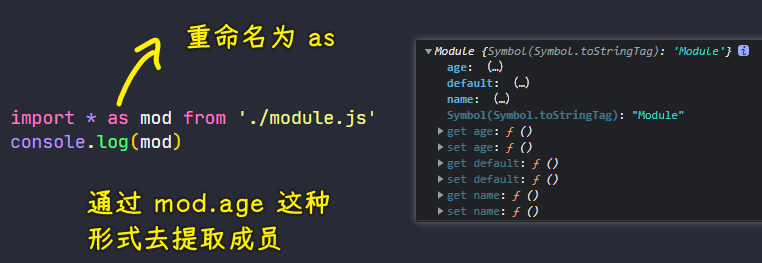

第三点就是如果说我们一个模块当中需要导出的成员特别多，而且我们在导入时都会去用到它们。那么这个时候我们就可以使用星号`*`的方式把这个模块当中所有导出的成员全部提取出来。

提取出来过后，我们需要通过 `as` 的方式去将提取到的所有成员全部放到一个对象当中。那么这个导出的成员，也就是导出的每一个成员都会作为这个对象的一个属性出现，那我们就可以通过`mod.`成员的名称去拿到具体的导出成员了。

### <mark>4）import 函数，动态导入模块</mark>

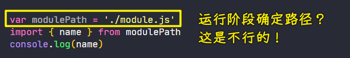

> 报错：`Uncaught SyntaxError: Unexpected identifier`，`modulePath`是`Unexpected identifier`

第四点就是我们在使用导入模块的时候，`import` 这个关键词我们可以把它理解成是一个导入模块的声明 -> 它需要在开发阶段就明确我们需要导入的这个模块文件的路径。但是有的时候，我们的这个模块路径实际上是在运行阶段我们才知道的，那这种情况下，我们是不能使用`import`这个关键词去 `from` 一个变量的。而且有的时候我们可能是需要在某些情况下，然后当某些条件满足过后，我们再去导入模块。

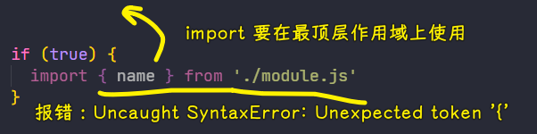

在这种方式下面，我们也没有办法去使用 `import`，因为 `import` 这个关键词它只能出现在最顶层，也就是我们最外侧的这个作用域，并不能去嵌套在一些 `if` 或者是函数当中。

如果说你遇到以上两种情况的话，那这个时候我们就需要动态去导入模块的这样一个机制了

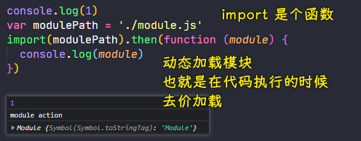

ES Modules 当中提供了一个全局的`import`函数 -> 它专门用来去动态导入模块。

具体的用法就是通过`import`这个函数去传入我们需要导入的这个模块的路径

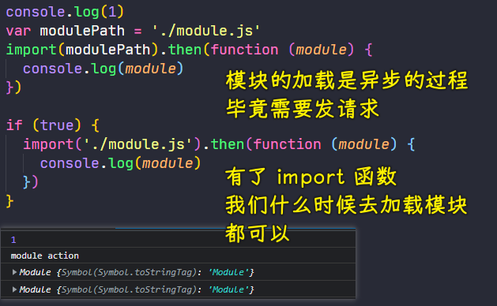

对于这个调用，因为`import`它是一个普通函数，所以你在任何一个地方都可以去调用。而且这个函数它返回的是一个 `Promise` -> 当我们这个模块加载完成过后，由于模块加载是一个异步的过程，所以它会自动去执行 `then`当中所指定的这样一个回调函数。然后模块的对象我们可以通过参数去拿到

以上这个就是我们第四点关于如何动态的去加载模块。

### <mark>5）同时导入命名成员和默认成员</mark>

第五点也是我们这里最后一个点，那就是如果我们在一个模块当中同时导出了一些命名成员，再导出了一个默认的成员。

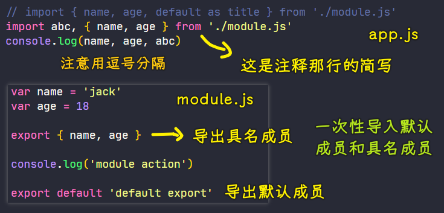

例如我们在`module.js`里边同时导出了 `name` 和 `age` 这两个命名成员，再导出了一个默认成员。

``` js
var name = 'jack'
var age = 18

export { name, age }

console.log('module action')

export default 'default export'
```

回到`app.js`当中再去导入这些成员的时候，我们仍然可以像之前一样去先把 `name` 和 `age` 正常的导入进来。那这个时候如果说你想要去同时导入 `default` 的话，那你也可以按照我们之前所说的语法，也就是直接在后面跟上 `default`，只不过 `default` 它需要重命名，我们将重命名的结果也打印出来。

``` js
import { name, age, default as title } from './module.js'
console.log(name, age, title) // jack 18 default export
```

这种方式就已经可以去把我们的命名成员和那个默认成员同时导出出来。

我们在这个地方还有一个简写的写法，那就是我们直接在左花括弧之前再去加上一个默认成员提取的那个方式，在这中间通过一个逗号去分割

``` js
import title, { name, age } from './module.js'
```

逗号左边的就是用来去提取我们这个模块里面默认的成员，而逗号右边的就是去提取那些具名的成员。

这个逗号左边的成员，也就是逗号左边的这个名字我们可以随便去起，这跟我们之前提取默认成员是一样的。

``` js
import abc, { name, age } from './module.js'
```

---

以上这五点就是我们在去导入模块的时候的一些用法，以及还有一些注意事项。

## ★ES Modules 导出导入成员


### <mark>1）把导入的成员直接导出出去</mark>

除了导入模块，`import` 还可以配合 `export` 去使用 -> 这效果就是将导入的结果直接作为当前模块的导出成员。

那具体的用法，我们就是把在 `import` 声明当中的 `import` 关键词给它修改为 `export`

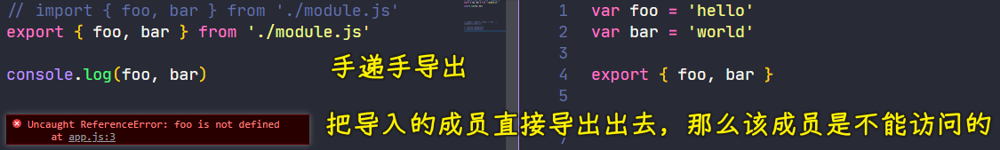

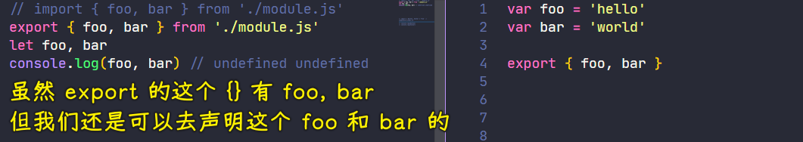

注意：

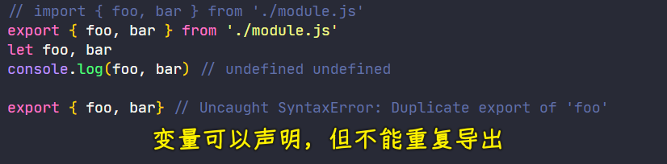

这样的话，我们所有导入的成员将会直接作为当前这个模块的导出成员，而且在我们当前这个作用域当中也就不再可以去访问这些成员了。

### <mark>2）为什么需要一个起到桥梁作用的 `index.js`？</mark>

对于这样一个特性，我一般在去写 `index` 文件的时候会用到 -> 我会通过 `index` 文件把某一个目录下散落的一些模块，然后通过这种方式都给它组织到一起，然后导出，这样方便我们外部去使用。

例如我这里去定义一个非常常见的目录叫做 `components` ，也就是存放我们项目当中的一些组件模块。

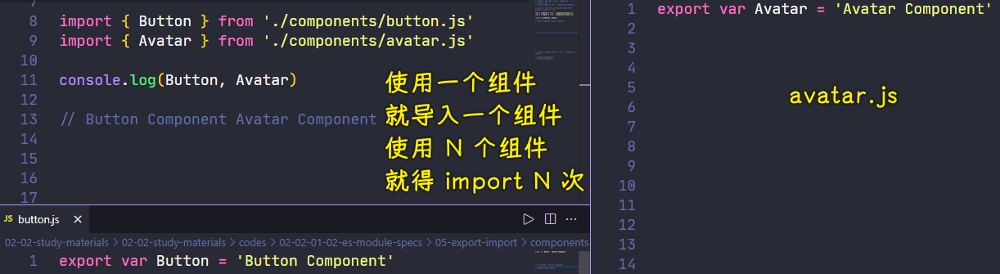

然后我再到这个目录下去新建一个关于 `Button` 的一个组件模块 -> 在这个模块当中，我们直接去导出一个字符串的变量去表示一下一个组件

这样完成过后，我们再去新建一个关于 `Avatar` 的一个组件 -> 同样一个道理，我们也是用一个字符串去表示一下一个组件。

这完成过后，我们再回到`app.js`当中去使用一下这两个组件。

如果说我们以这种方式去**使用这种散落的组件的话，那我们需要去单个导入，非常麻烦**。

我们这里先通过单个导入的方式把这两个组件全部给它导入进来，然后通过 `console.log()` 的方式去模拟一下这个组件的工作。

这个时候保存一下，可以看到正常工作，但是这种方式确实会相对麻烦一点。

试想一下，如果说你的组件非常多的话，那这需要导入的地方也就会非常多。

### <mark>3）使用起到桥梁作用的`index.js`</mark>

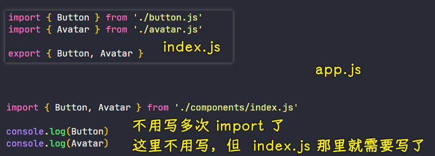

我一般的做法都是在 `components` 下去新建一个 `index` 文件。在这个文件当中，我把我们当前这个目录下所有的组件全部给它载入进来，然后在最底下我集中的去把它们都导出出去。

那这样的话，我们在外部再去想要导入某一个组件的时候，我就可以直接通过一个 `import` 然后具体去做不同的提取就可以了。而这样也是可以提取到 `Button` 和 `Avata` 的

保存过后，可以看到这也是正常工作的

### <mark>4）能省一行是一行</mark>

这个时候我们这个 `index` 文件当中，我们就可以通过刚刚那种 `import` 去配合 `export` 的这种语法去简化这个文件的一个编写。

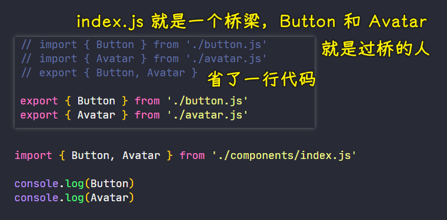

具体的做法就是把单个的 `export` 给它拿掉，然后把 `import` 直接换成`export`就可以了。因为这个 `index` 它只是相当于一个桥梁或者说一个盒子 -> 总之，`index`把所有的组件全部给它组合到一起了。

### <mark>5）有组件导出的是一个默认成员</mark>

但是如果说你在你的这个组件文件当中导出的是一个默认的成员的话，例如我们这里`export default Button`

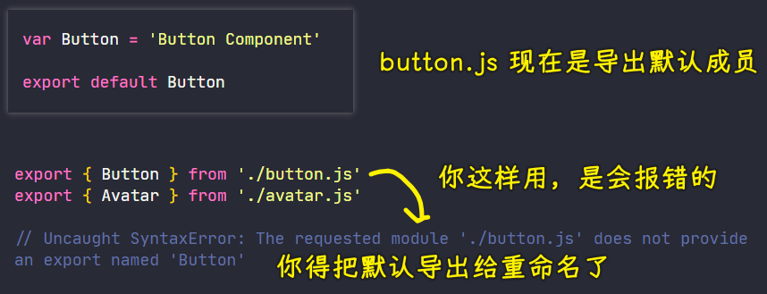

我们再回到这个 `index` 文件当中，那我们就不能再去通过`export { Button } from './button.js'`这样一种提取的方式去导出了，我们就必须要提取它的 `default` 然后为这个 `default` 去做一个重命名。因为如果说你不去重命名（直接写`{ default }`）的话，那它会作为当前这个 `index` 模块的一个默认导出。

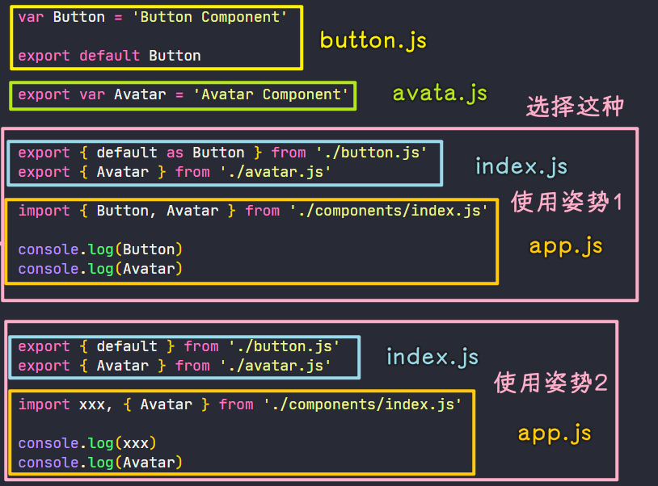

那这样的话，对于你在外界使用它的时候，那你就只能通过那个 `default` 的方式（直接`import xxx from './components/index.js'`）去使用了，所以我们这儿必须要去重命名。

以上这个就是我们针对于默认模块，然后我们做的这个直接导出的这种操作。
