### ✍️ Tangxt ⏳ 2021-11-12 🏷️ 模块化

# 05-ES Modules 浏览器环境 Polyfill


### <mark>1）关于浏览器对 ES Modules 的支持情况</mark>

了解了 ES Modules 当中的这些特性和语法过后，我们再回过头来去看一下如何去解决运行环境给我们带来的兼容性的问题。

正如前面所提到的，我们 ES Modules 它是 2014 年才被提出来的，那这也就意味着早期的浏览器它不可能支持这一个特性。

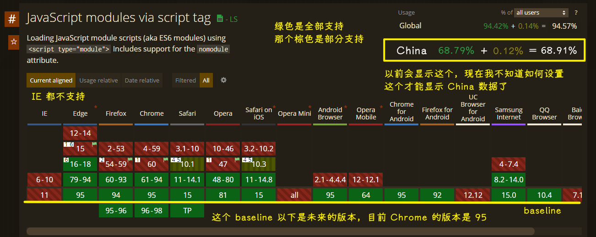

另外，在 IE 以及一些国产的浏览器上，截止到目前为止都还没有支持。

所以说我们在使用 ES Modules 的时候还是需要去考虑兼容性所带来的一个问题。

### <mark>2）IE 11 不支持 ES Modules</mark>

我们回到 VS Code 当中，我这里已经提前写好了一个非常简单的对 ES Modules 的使用的一个用例。

`index.html`：

``` html
<script type="module">
  import { foo } from './module.js'
  console.log(foo)
</script>
```

`module.js`：

``` js
export var foo = 'bar'
```

我们回到 Chrome 当中，此时 Chrome 当中可以正常的去运行这个代码 -> 控制台打印了`bar`

然后我们再去 IE 的浏览器当中，打开这个页面。

此时我们进入到控制台，我们发现并没有任何的输出。

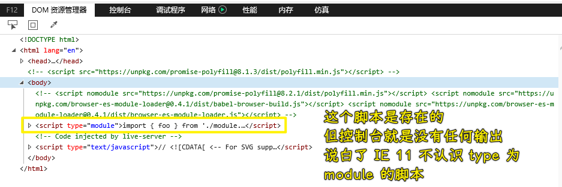

这个页面当中也是存在这样一个`type="module"`脚本的 -> 这也就意味着我们在 IE 浏览器当中，它并没有去执行我们 ES Modules 当中的代码 -> 这也就意味着 IE 它不兼容我们的这个 ES Modules 的这种方式的 `script` 标签。

### <mark>3）使用 Polyfill，让 IE 11 也可以支持 ES Modules</mark>

如果说你要是对一些常用的编译工具有了解的话，你可能会知道我们可以借助于一些编译工具，在我们开发阶段将我们的这些 ES6 的代码编译成 ES5 的方式，然后我们再到浏览器当中去执行，才能正常的去工作

#### <mark>1、ES Module Loader</mark>

不过我这儿先去介绍一个 polyfill -> 这个 polyfill 它可以让我们在浏览器当中直接去支持我们 ES Modules 当中绝大多数的特性 -> 这个 [模块](https://github.com/ModuleLoader/browser-es-module-loader) 的名字叫做「**ES Module Loader**」

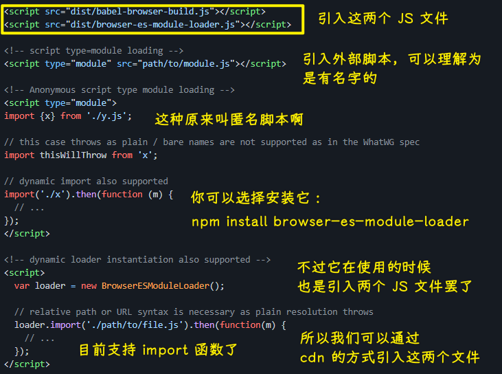

这个`browser-es-module-loader`模块它实际上就是一个 JS 文件，我们只需要将这个 JS 文件引入到网页当中，我们就可以让这个网页去运行 ES Module。

具体的用法就是将这两个脚本文件给它引入到我们的页面当中 -> 「`browser-es-module-loader`」是一个 npm 的模块 -> 那针对于 npm 的模块的话，我们可以通过 [unpkg.com](http://unpkg.com/) 这个网站所提供的 CDN 服务去拿到它下面所有的这个 JS 文件。

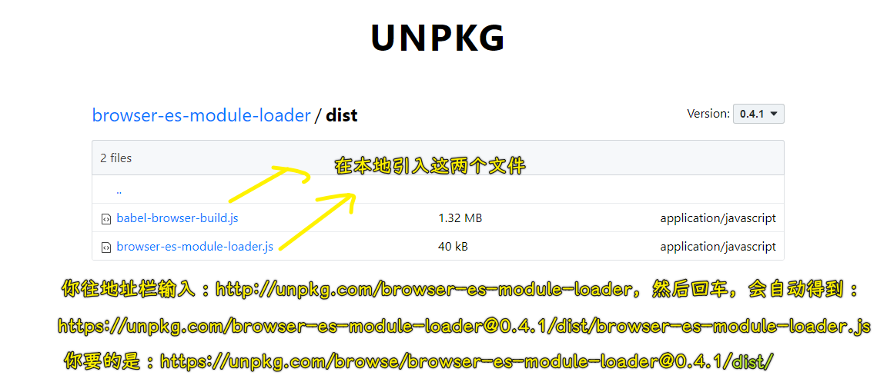

在这个地方我们要拿的是两个，我们可以通过 `dist/` 去查看这个目录下的所有文件，注意一定要带斜线，要不然的话它会走这个`dist`目录里面的默认文档。

> 其实`/dist/`的结果就是在拿默认文档，直接`/dist`的话，得到的是`Not found: browser-es-module-loader@0.4.1/dist`这个页面结果 -> 只是我们`http://unpkg.com/browser-es-module-loader`这样访问时，默认会走`https://unpkg.com/browser-es-module-loader@0.4.1/dist/browser-es-module-loader.js`这个路径罢了

在这个地方我们把两个 JS 文件的这个路径给大家拷贝一下，然后回到我们页面当中，我们去添加一个 `script` 标签去引入第一个，然后再回过来，我们再去引入第二个 `script`

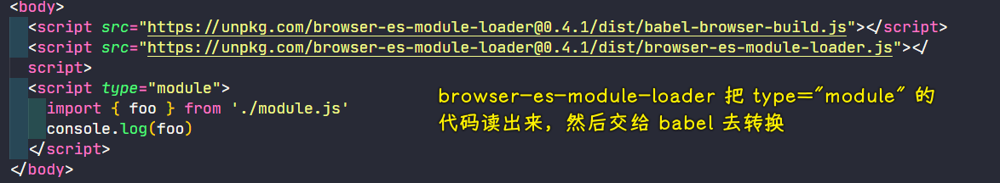

其实第一个引入的并不是这个 「ES Module Loader」 的核心代码。第一个引入的实际上就是 babel 的一个即时运行在浏览器环境的一个版本。然后第二个引入的实际上才是我们这个「ES Module Loader」 -> 实际上它在工作的时候就是通过这个「ES Module Loader」 把代码读出来，然后交给 babel 去转换，从而让我们的这个代码可以正常工作。

完成这些过后，我们就可以回到 IE 当中，我们尝试去刷新一下页面。

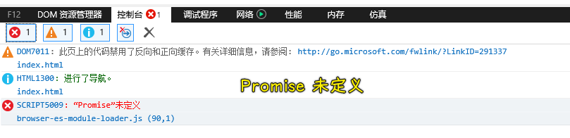

此时控制台会报出一个「Promise 未定义」的错误 -> 这个原因是因为在最新的 IE（IE 11） 当中，它还是不支持 promise 这样一个 ES6 的特性，所以说我们还需要为 IE 单独再去引入一个 promise 的 Polyfill -> 这个 Polyfill 如果说你的浏览器是支持 promise 的话，你可以不用去引入。

> <https://github.com/taylorhakes/promise-polyfill>

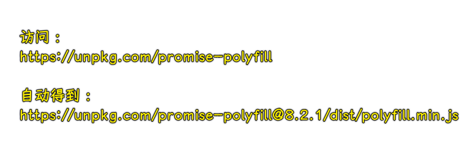

我们对于这个 promise 的 Polyfill ，我们也可以通过 unpkg 上面所提供的 CDN 服务拿到这个页文件的一个路径，我们再到页面当中去引入这样一个路径。

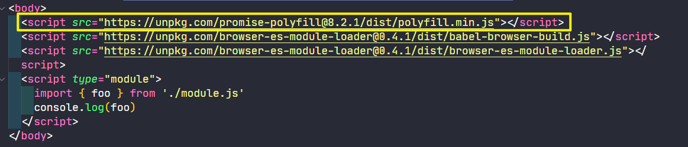

引入完成过后，我们再次回到 IE 浏览器当中，此时重新刷新页面：

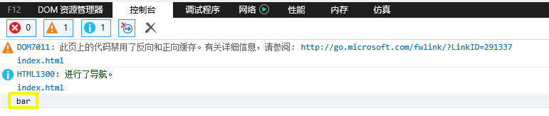

我们就可以看到 `bar` 已经正常被打印出来了 -> 这也就意味着我们这个 ES Module 它已经正常工作了。

#### <mark>2、ES Module Loader 的工作原理？</mark>

其实 「ES Module Loader」 的工作原理非常简单，我们刚刚也简单说了一下，它就是将我们这些浏览器当中不识别的 ES Module 去交给 babel 去转换。然后对于那些需要 `import` 进来的文件，再通过 AJAX 的方式去把请求回来的代码再去通过 babel 去转换，从而去支持我们的 ES Module。

#### <mark>3、支持 ES Modules 的浏览器会把模块代码执行两次？</mark>

在这个地方还有一个小问题，那就是如果说我们在支持 ES6 的浏览器例如 Chrome 当中，那我们的代码就会被执行两次。

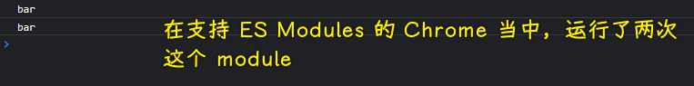

这个原因也很简单，因为浏览器本身会执行一次我们的 ES Module ，然后我们的这个 「ES Module Loader」 的这个 Polyfill ，它也会再去帮我们执行一次，所以这就导致了我们的脚本重复被执行。

#### <mark>4、nomodule</mark>

对于这个问题，我们可以借助于`script`标签的一个新属性来去解决 -> 这个属性叫做`nomodule` -> 它是一个布尔值的属性。

如果说我们在页面当中的 `script` 标签上添加了`nomodule`这样一个属性的话，那我们这个 `script` 标签它就只会在那些不支持 ES Modules 的浏览器当中去工作

``` html
<script nomodule>
  alert('不支持 ES Modules')
</script>
```

我们回到 Chrome 当中，我们去刷新一下。此时 Chrome 并没有去弹出一个对话框，那这也就意味着脚本没有工作。

我们再回到 IE 当中刷新一下这个页面：

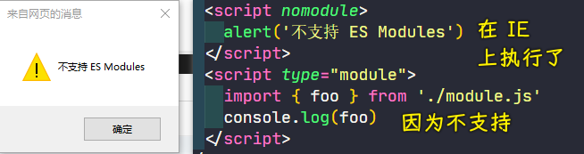

此时你会看到一个对话框的一个弹出，那也就意味着这个 `script` 标签它工作了。

所以我们就可以借助于这样一个机制，将这些 Polyfill 的脚本都添加上 `nomodule` 这样一个属性 -> 这就解决了我们在使用 Polyfill 的时候，我们那些支持的浏览器不去加载这些 Polyfill 脚本的特性了。

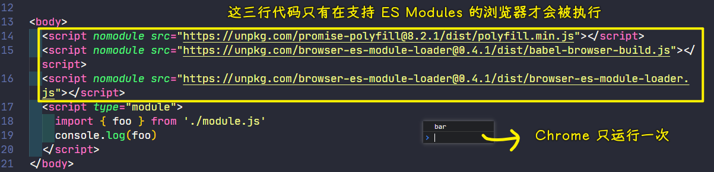

### <mark>4）小结</mark>

当然，**这种去兼容 ES Module 的方式，它只适合于我们本地去测试，也就是开发阶段去玩一玩，但是你在生产阶段千万不要去用它，因为它的原理都是在运行阶段动态的去解析脚本，那效率就会非常的差**。

真正我们在生产阶段的话，我们还是应该预先去把这些代码给它编译出来，让它可以**直接在浏览器当中去工作**。

至于如何去编译它们，让它们可以在浏览器当中工作的话 -> 这个点我们在后面会有专门的介绍。

## ★了解更多

➹：[重新认识 caniuse - SegmentFault 思否](https://segmentfault.com/a/1190000018495678)

➹：["javascript modules " - Can I use... Support tables for HTML5, CSS3, etc](https://caniuse.com/?search=javascript%20modules%20)