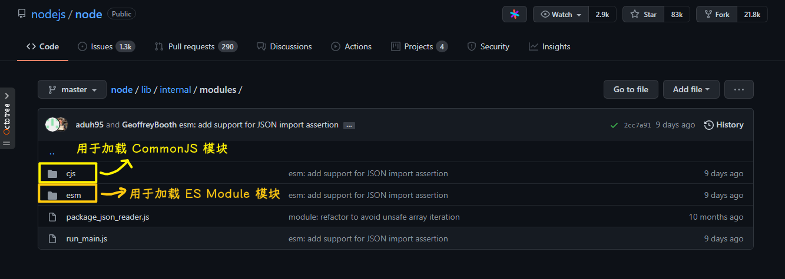
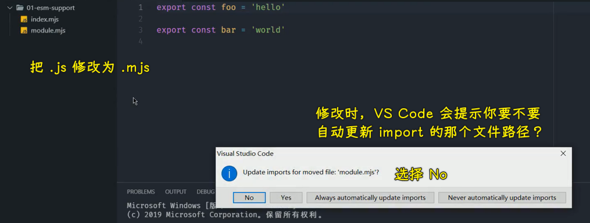
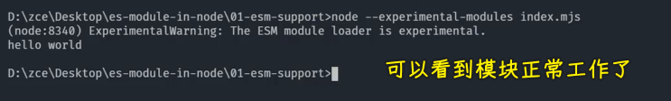

### ✍️ Tangxt ⏳ 2021-11-13 🏷️ 模块化

# 06-ES Modules in Node.js - 支持情况

## ★ES Modules in Node.js - 支持情况


ES Modules 作为 JavaScript 的语言层面的一个模块化标准，它会逐渐地去统一所有 JS 应用领域的模块化需求。

### <mark>1）Node.js 对 ESM 的支持情况？</mark>

Node.js 作为 JavaScript 的一个非常重要的一个应用领域，它目前已经开始逐步支持这样一个特性了。



> [node/lib/internal/modules · nodejs/node](https://github.com/nodejs/node/tree/f2170253b694c488f8ad2616dfc5c66b6a3c90a0/lib/internal/modules)

自从 node 的 `8.5` 版本过后，其内部就已经以实验特性的方式去支持 ES Modules 了。那也就是说我们在 node 当中可以直接原生的去使用 ES Modules 去编写我们的代码了。

不过考虑到原来的这个 CommonJS 规范与现在的 ES Modules 它们之间的这个差距还是比较大的，所以说目前这样一个特性一直还是处于一个过渡的状态。

### <mark>2）在 node 环境中使用 ESM 编写代码</mark>

接下来我们就一起来尝试一下，直接在 node 环境当中中去使用 ES Modules 编写代码。

#### <mark>1、查看 node 版本是否大于`8.5`</mark>

在这里我们先通过 `node --version` 去查看一下我们当前的 node 版本。


> 我的是`v14.15.0`

我这里的 node 版本是`10.16.3`，当然，你只需要去明确你的 node 版本是大于`8.5`的，然后你就可以尝试这样一个特性了。

#### <mark>2、准备两个用于测试的 JS 文件</mark>

在这里我已经准备好了一个文件夹，在这个文件夹当中有两个 JS 文件，这两个 JS 文件当中我们都是使用 ES Modules 的方式去组织的模块化


#### <mark>3、修改这两个测试文件，让文件可以在 node 当中使用 ESM</mark>

我们要回到 node 当中去具体使用它们的话，也就是我们直接在 node 当中去使用 ES Modules -> 我们需要做两件事情

💡：把`.js`扩展名改为`.mjs`

第一件就是将文件的扩展名从`.js`修改为`.mjs`



在 VS Code 当中去修改扩展名的时候，它会去提示你是否需要去更新代码当中那些`import`路径 -> 我们这选 `No`

回到 `index.mjs` 当中，我们把`module.js`修改为`module.mjs`


那这样的话我们的路径才是正常的。

完成过后我们回到命令行当中，我们尝试去启动它们。

此时我们就要去做第二件事情了。

💡：启动 node 的时候加 `experimental-modules` 参数

第二件事情就是我们在启动 node 的时候，需要去加上一个 `experimental-modules` 参数 -> 这个参数就代表我们去启用这样一个 ES Modules 的实验特性 -> 紧接着的后面我们再去跟上文件的文件名，也就是我们要启动的文件名 -> 回车过后，我们就可以看到这样一个模块，它正常的工作了



不过在工作的过程当中，它会打印一个警告：一个 `ExperimentalWarning` -> 这个原因是因为现在它还是一个实验特性，希望不要在生产环境当中去使用，所以说它就提出了这么样一个警告。

以上这两个操作就是我们在 node 环境当中想要直接去使用 ES Modules -> 我们就必须要做的两件事情。

#### <mark>4、测试是否可以用默认导入的方式导入系统内置模块</mark>

可以在 node 当中去使用 ES Modules 过后，我们接下来再通过 ES Modules 的方式去导入一下系统原生的一些模块。


在这里我们通过 `import` 导入一下 `fs` 这样一个内置的模块，我们可以通过 `fs.writeFileSync`去尝试使用一下这个模块。

在这里我往 `foo.txt` 这个文件当中去写入一个文件的内容，然后保存

这样完成过后我们回到命令行当中去重新启动一下这个 JS 文件。

此时我们当前这个目录下就会创建出来一个 `foo.txt` -> 这也就意味着我们确实可以通过 ES Modules 的方式去载入原生的模块。

#### <mark>5、测试是否可以用默认导入的方式导入第三方的 npm 模块</mark>

除了原生的模块，对于第三方的 npm 模块，我们也可以通过 ES Modules 这种 `import` 方式去导入。

在这里我们先安装一个比较常见的一个 npm 的模块——`lodash`

``` bash
yarn add lodash
```

然后回到代码当中，我们通过 `import` 方式把 `lodash` 给它载入进来。然后我们去尝试使用一下 `lodash` 当中一个非常常见的函数——`camelCase` -> 把一个字符串修改为驼峰命名法的一个工具函数。


这个这时候我们正常打印出来的结果，也就意味着第三方的模块载入是 OK 的。

#### <mark>6、测试是否可以用提取模块成员的方式导入第三方的 npm 模块里边的成员</mark>

接下来我们再来试用一下 ES Modules 当中去提取模块成员的这样一种用法。


我们通过 `import { camelCase } from 'lodash'` 直接去提取 `camelCase` 这样一个函数 -> 这个时候我们将这个结果同样再去打印出来，回到命令行当中重新去执行。

此时命令行当中会爆出一个错误 -> 说的是我们 `lodash` 这个模块并没有向外去暴露一个叫`camelCase` 的命名成员，也就是说我们不能使用这种方式去载入第三方的这个模块

这原因也很简单，因为我们之前说过了`import`后面这个花括弧，它不是在解构，而我们第三方模块它都是导出一个对象，而这个对项会作为我们模块的默认成员导出，所以这个时候我们必须要使用默认导入的这种方式去导入它们的成员。

#### <mark>7、测试系统内置模块是否可以被其它模块提取成员？</mark>

我们这里再回过头来去尝试提取一下系统内置模块当中的一些成员：


我们保存一下，回到命令行再次去重新运行一下这个命令。

此时你会发现 `bar.txt` 也出现了，这也就意味着我们可以通过提取的方式直接去提取系统内置模块当中的成员。

为什么系统内置模块可以提取，而第三方模块就不能这样提取呢？

这原因也很简单，因为系统内置的模块 -> 官方都做了兼容，也就意味着它会对系统内置模块里面的每一个成员单独导出一次，然后再把它们整体作为一个对象再做一个默认的导出 -> 为了兼容外界，通过默认导入或者是单个命名导入的这种方式去使用。

### <mark>3）完整代码</mark>

`module.mjs`：

``` js
export const foo = 'hello'

export const bar = 'world'
```

`index.mjs`：

``` js
// 第一，将文件的扩展名由 .js 改为 .mjs；
// 第二，启动时需要额外添加 `--experimental-modules` 参数；

import { foo, bar } from './module.mjs'

console.log(foo, bar)

// 此时我们也可以通过 esm 加载内置模块了
import fs from 'fs'
fs.writeFileSync('./foo.txt', 'es module working')

// 也可以直接提取模块内的成员，内置模块兼容了 ESM 的提取成员方式
import { writeFileSync } from 'fs'
writeFileSync('./bar.txt', 'es module working')

// 对于第三方的 NPM 模块也可以通过 esm 加载
import _ from 'lodash'
_.camelCase('ES Module')

// 不支持，因为第三方模块都是导出默认成员
// import { camelCase } from 'lodash'
// console.log(camelCase('ES Module'))
```

