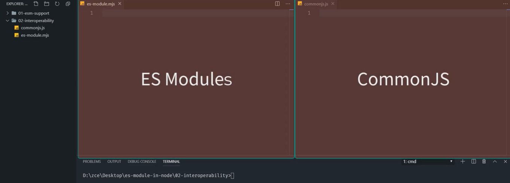
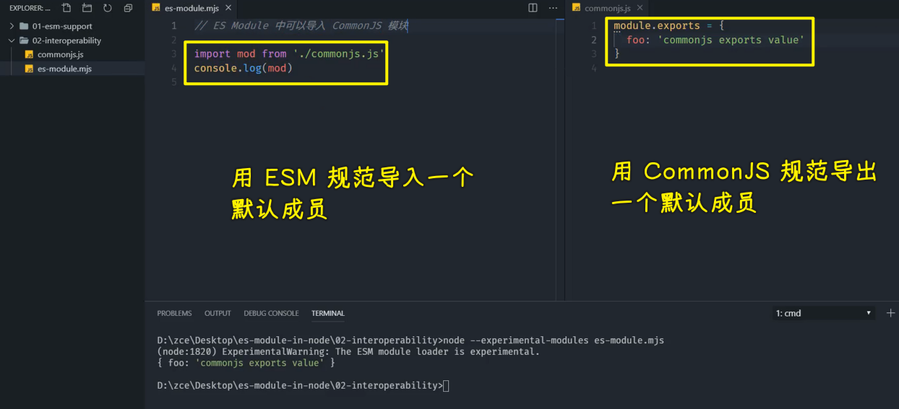
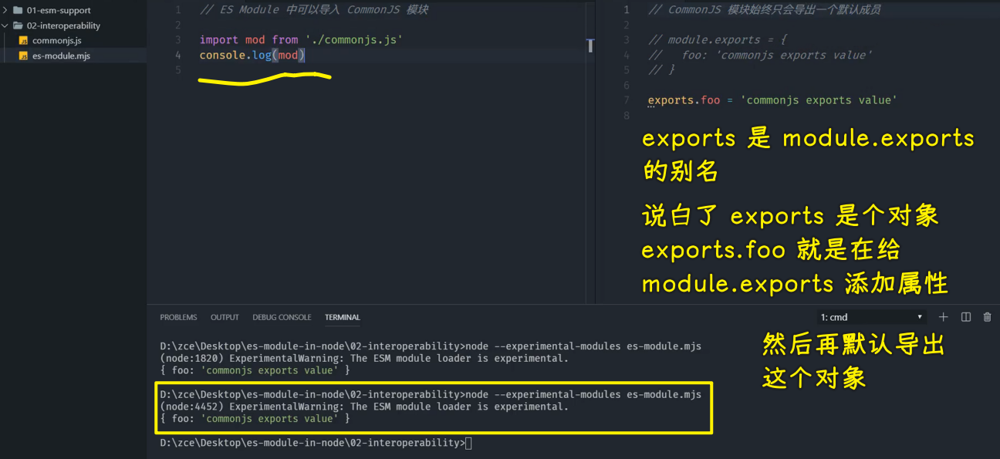
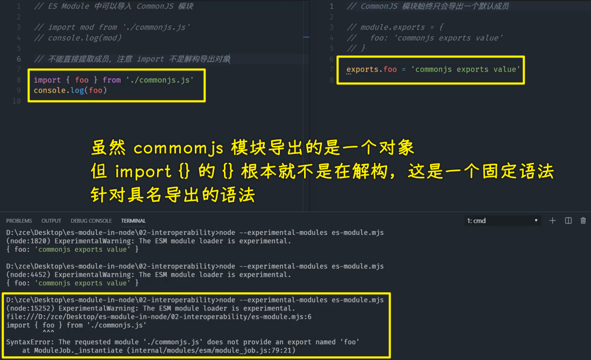
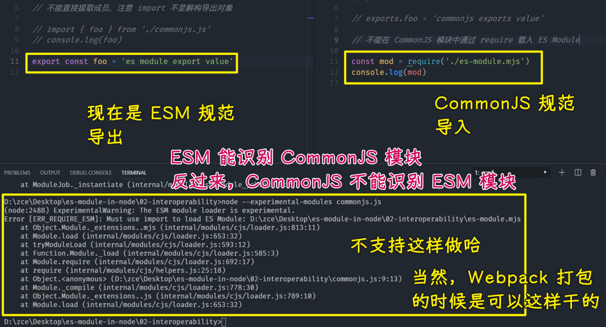
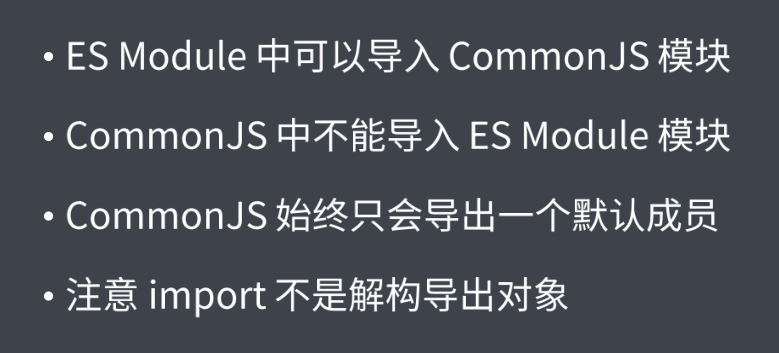

### ✍️ Tangxt ⏳ 2021-11-13 🏷️ 模块化

# 07-ES Modules in Node.js - 与 CommonJS 交互、ES Modules in Node.js - 与 CommonJS 的差异

## ★ES Modules in Node.js - 与 CommonJS 交互


> 做 理解 记忆 扩展

了解了如何在 node 环境当中去运行 ES Modules 这样一个特性过后，我们再来去看一下如何在 ES Modules 当中去载入 CommonJS 模块。

### <mark>1）准备两个 JS 文件</mark>

我们回到开发工具当中，在这里我准备了两个 JS 文件，分别用来去编写不同标准的模块。



### <mark>2）CommonJS 导出默认成员，ESM 导入默认成员</mark>

我先在屏幕右侧这个模块当中去定义一个普通的 CommonJS 模块 -> 这个模块直接导出一个对象，对象当中定义了一个叫做 `foo` 的属性 -> 这个属性的值是一个字符串。



我再回到屏幕左侧当中，我们通过 ES Module 的方式去载入这个 CommonJS 模块，我们把它打印出来。

此时我们使用的是载入默认成员的这种方式去载入的

这完成过后我们就可以回到命令行当中。

我们通过 `node --experimental-modules` 去运行我们当前这个 `es-module.mjs`，也就是`es-module`这个模块。

此时我们能看到正常的一个打印 -> 这也就意味着我们确实可以在 ES Modules 中去载入 CommonJS 当中所提供的成员。

### <mark>3）使用`exports`别名导出成员</mark>

#### <mark>1、`exports`姿势也是默认导出</mark>

除此之外，我们还可以在 CommonJS 当中使用 `exports`这个别名。



如果你对 CommonJS 之前有一定的了解的话，那你应该知道 `exports` 实际上就是 `module.exports` 的一个别名 -> 这也就是说它们俩实际上是等价的。

这个时候我们正常去运行还是可以正常去工作的。

在这儿需要注意的就是我们 CommonJS 如果说你在 ES Modules 当中去引用的话，它始终只会导出一个默认的成员 -> 这也就意味着我们只能通过 `import` 载入默认成员的方式去使用 CommonJS 模块。

#### <mark>2、不能用 ESM 提取成员的方式提取`exports`导出的成员</mark>

如果说我这儿尝试去直接提取我们 CommonJS 当中的这个 `foo`，那这个时候我们把这个 `foo` 打印出来，然后回到命令行当中，我们再次去执行一下这个命令。



此时你就会发现我们屏幕上给出来一个错误信息，说的是：CommonJS 这个模块并没有导出一个叫做 `foo` 的成员。

这也就意味着我们不能直接提取 CommonJS 模块当中的成员。

在这里，你一定要注意 `import` 它不是对我们导出对象的一个解构。

### <mark>4）ESM 导出成员，CommonJS 导入成员</mark>

除此之外，我们还可以尝试反过来通过 CommonJS 去载入 ES Modules。



在这个地方，我们在这个 ES Modules 当中，我们去定义一个导出的变量，这个变量叫做 `foo`

然后我们回到 CommonJS 这个模块当中，我们通过 `require` 的方式去载入这个 ES Modules 来尝试一下

我们把载入过后的结果，通过 `console.log()` 的方式给大家打印出来，完成过后我们回到命令行当中。

此时我们运行的这个入口就不再是 ES Modules 了，而是 CommonJS 这个文件。

在这个地方你会发现**在 node 环境当中它不允许我们直接通过 CommonJS 模块去载入 ES Modules**-> 这个地方是需要注意的

当然了，可能你在其他的一些环境，例如像 Webpack 打包的那种环境当中，你会发现它是可以的。但是在 node 这个原生的环境当中是不支持这种方式的。

### <mark>5）总结</mark>

以上这几点就是我们在 node 环境当中 ES Modules 去调用 CommonJS 的一些用法以及一些注意事项。

我们总结一下，主要就是三点：

- 第一点就是 ES Modules 当中可以去载入 CommonJS 模块。
- 第二点是 CommonJS 不能去载入 ES 模块。
- 第三点就是 CommonJS 它导出的时候始终只会导出一个默认成员。

最后一定要注意 `import` 它不是去解构导出的对象，它只是一个固定的用法，它去提取模块当中导出的那些命名成员。



### <mark>6）完整代码</mark>

`commonjs.js`：

``` js
// CommonJS 模块始终只会导出一个默认成员

// module.exports = {
//   foo: 'commonjs exports value'
// }

// exports.foo = 'commonjs exports value'

// 不能在 CommonJS 模块中通过 require 载入 ES Module

// const mod = require('./es-module.mjs')
// console.log(mod)
```

`es-module.mjs`：

``` js
// ES Module 中可以导入 CommonJS 模块

// import mod from './commonjs.js'
// console.log(mod)

// 不能直接提取成员，注意 import 不是解构导出对象

// import { foo } from './commonjs.js'
// console.log(foo)

// export const foo = 'es module export value'
```

## ★ES Modules in Node.js - 与 CommonJS 的差异

