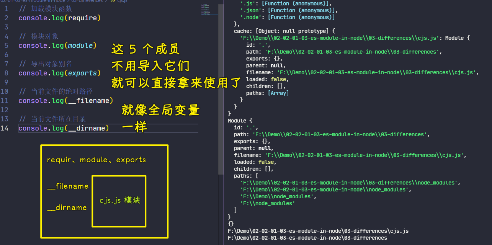

### ✍️ Tangxt ⏳ 2021-11-13 🏷️ 模块化

# 07-ES Modules in Node.js - 与 CommonJS 交互、ES Modules in Node.js - 与 CommonJS 的差异

## ★ES Modules in Node.js - 与 CommonJS 交互


> 做 理解 记忆 扩展

了解了如何在 node 环境当中去运行 ES Modules 这样一个特性过后，我们再来去看一下如何在 ES Modules 当中去载入 CommonJS 模块。

### <mark>1）准备两个 JS 文件</mark>

我们回到开发工具当中，在这里我准备了两个 JS 文件，分别用来去编写不同标准的模块。


### <mark>2）CommonJS 导出默认成员，ESM 导入默认成员</mark>

我先在屏幕右侧这个模块当中去定义一个普通的 CommonJS 模块 -> 这个模块直接导出一个对象，对象当中定义了一个叫做 `foo` 的属性 -> 这个属性的值是一个字符串。


我再回到屏幕左侧当中，我们通过 ES Module 的方式去载入这个 CommonJS 模块，我们把它打印出来。

此时我们使用的是载入默认成员的这种方式去载入的

这完成过后我们就可以回到命令行当中。

我们通过 `node --experimental-modules` 去运行我们当前这个 `es-module.mjs`，也就是`es-module`这个模块。

此时我们能看到正常的一个打印 -> 这也就意味着我们确实可以在 ES Modules 中去载入 CommonJS 当中所提供的成员。

### <mark>3）使用`exports`别名导出成员</mark>

#### <mark>1、`exports`姿势也是默认导出</mark>

除此之外，我们还可以在 CommonJS 当中使用 `exports`这个别名。


如果你对 CommonJS 之前有一定的了解的话，那你应该知道 `exports` 实际上就是 `module.exports` 的一个别名 -> 这也就是说它们俩实际上是等价的。

这个时候我们正常去运行还是可以正常去工作的。

在这儿需要注意的就是我们 CommonJS 如果说你在 ES Modules 当中去引用的话，它始终只会导出一个默认的成员 -> 这也就意味着我们只能通过 `import` 载入默认成员的方式去使用 CommonJS 模块。

#### <mark>2、不能用 ESM 提取成员的方式提取`exports`导出的成员</mark>

如果说我这儿尝试去直接提取我们 CommonJS 当中的这个 `foo`，那这个时候我们把这个 `foo` 打印出来，然后回到命令行当中，我们再次去执行一下这个命令。


此时你就会发现我们屏幕上给出来一个错误信息，说的是：CommonJS 这个模块并没有导出一个叫做 `foo` 的成员。

这也就意味着我们不能直接提取 CommonJS 模块当中的成员。

在这里，你一定要注意 `import` 它不是对我们导出对象的一个解构。

### <mark>4）ESM 导出成员，CommonJS 导入成员</mark>

除此之外，我们还可以尝试反过来通过 CommonJS 去载入 ES Modules。


在这个地方，我们在这个 ES Modules 当中，我们去定义一个导出的变量，这个变量叫做 `foo`

然后我们回到 CommonJS 这个模块当中，我们通过 `require` 的方式去载入这个 ES Modules 来尝试一下

我们把载入过后的结果，通过 `console.log()` 的方式给大家打印出来，完成过后我们回到命令行当中。

此时我们运行的这个入口就不再是 ES Modules 了，而是 CommonJS 这个文件。

在这个地方你会发现**在 node 环境当中它不允许我们直接通过 CommonJS 模块去载入 ES Modules**-> 这个地方是需要注意的

当然了，可能你在其他的一些环境，例如像 Webpack 打包的那种环境当中，你会发现它是可以的。但是在 node 这个原生的环境当中是不支持这种方式的。

### <mark>5）总结</mark>

以上这几点就是我们在 node 环境当中 ES Modules 去调用 CommonJS 的一些用法以及一些注意事项。

我们总结一下，主要就是三点：

- 第一点就是 ES Modules 当中可以去载入 CommonJS 模块。
- 第二点是 CommonJS 不能去载入 ES 模块。
- 第三点就是 CommonJS 它导出的时候始终只会导出一个默认成员。

最后一定要注意 `import` 它不是去解构导出的对象，它只是一个固定的用法，它去提取模块当中导出的那些命名成员。


### <mark>6）完整代码</mark>

`commonjs.js`：

``` js
// CommonJS 模块始终只会导出一个默认成员

// module.exports = {
//   foo: 'commonjs exports value'
// }

// exports.foo = 'commonjs exports value'

// 不能在 CommonJS 模块中通过 require 载入 ES Module

// const mod = require('./es-module.mjs')
// console.log(mod)
```

`es-module.mjs`：

``` js
// ES Module 中可以导入 CommonJS 模块

// import mod from './commonjs.js'
// console.log(mod)

// 不能直接提取成员，注意 import 不是解构导出对象

// import { foo } from './commonjs.js'
// console.log(foo)

// export const foo = 'es module export value'
```

## ★ES Modules in Node.js - 与 CommonJS 的差异


接下来我们再来看一下在 node 环境当中去使用 ES Modules 与 使用 CommonJS 之间的一些差异。

这里我同样准备了两个 JS 文件：

- `cjs.js`
- `esm.mjs`

### <mark>1）对遵守 CommonJS 规范的模块打印五个所谓的全局成员</mark>

在这个 `cjs` 文件当中，它是按照 CommonJS 的标准去打印了五个成员



`require`这个成员：

``` js
[Function: require] {
  resolve: [Function: resolve] { paths: [Function: paths] },
  main: Module {
    id: '.',
    path: 'F:\\Demo\\02-02-01-03-es-module-in-node\\03-differences',
    exports: {},
    parent: null,
    filename: 'F:\\Demo\\02-02-01-03-es-module-in-node\\03-differences\\cjs.js',  
    loaded: false,
    children: [],
    paths: [
      'F:\\Demo\\02-02-01-03-es-module-in-node\\03-differences\\node_modules',    
      'F:\\Demo\\02-02-01-03-es-module-in-node\\node_modules',
      'F:\\Demo\\node_modules',
      'F:\\node_modules'
    ]
  },
  extensions: [Object: null prototype] {
    '.js': [Function (anonymous)],
    '.json': [Function (anonymous)],
    '.node': [Function (anonymous)]
  },
  cache: [Object: null prototype] {
    'F:\\Demo\\02-02-01-03-es-module-in-node\\03-differences\\cjs.js': Module {   
      id: '.',
      path: 'F:\\Demo\\02-02-01-03-es-module-in-node\\03-differences',
      exports: {},
      parent: null,
      filename: 'F:\\Demo\\02-02-01-03-es-module-in-node\\03-differences\\cjs.js',
      loaded: false,
      children: [],
      paths: [Array]
    }
  }
}
```

这个五个成员实际上就是我们在 CommonJS 规范下的这个模块的全局成员，我们可以把它理解成全局变量，但是实际上了解一些原理的同学就应该知道它实际上是模块内置的。

这几个成员我们尝试着先把它们打印出来，可以正常打印的话，也就意味着 CommonJS 当中这几个成员是正常工作的。

### <mark>2）遵守 ESM 规范的模块没有这五个所谓的全局成员</mark>

这个时候我们也回到 ES Modules 当中尝试着去使用一下它。


> ESM 中没有 CommonJS 中的那些模块全局成员

不过这里我们通过 `nodemon` 去启动这个 ESM 的 `mjs` 文件 -> 我们希望当这个文件修改过后，它可以自动的去帮我们重新运行这个代码，这样省得我们自己再去手动运行了

它的启动参数同样需要去加上 `experimental-modules`，那这样的话我们就可以在这个 ESM 当中做一些尝试了，我们分别去把这些成员在这个`mjs`文件当中一个个去做打印操作。

结果你会发现这些成员在我们的 ES Modules 当中全部没有办法去访问 -> 这也就意味着这几个成员在我们使用 ES Modules 的时候就不能再去使用了。

这原因也很简单，我们之前也说到了 -> 这五个成员实际上都是 CommonJS 它把我们的模块包装成一个函数过后通过参数提供进来的成员。

我们现在使用的是 ES Modules，而它的加载方式发生了变化，所以说就不再提供这几个成员了。

### <mark>3）如何让遵守 ESM 规范的模块也可以用上这五个成员？</mark>

在这几个成员当中， `require`、`module`和 `exports` 这些我们可以通过 ES Modules 当中的 `import` 和 `export` 去代替。而对于`__filename` 和 `__dirname` 这两个变量的话，我们可以通过另外一个成员去代替。

#### <mark>1、`import.meta.url`</mark>


这个成员就是 `import` 它作为一个对象，然后它下面的这个 `meta` 属性里面有一个 `url` -> 这个 `url` 实际上拿到的就是我们当前所工作的这个文件的一个文件 `url` 地址。

#### <mark>2、通过`url.fileURLToPath`拿到`__filename`</mark>

我们可以借助于 `url` 这个模块里面有一个 `fileURLToPath` 这样一个方法，我们将这个方法可以把我们文件的 `url` 转换成路径。


这时候我们就可以通过这种方式去拿到我们当前正在运行的这个文件的文件路径，也就是我们之前的`__filename`

#### <mark>3、通过`path.dirname`拿到`__dirname`</mark>

对于`__dirname`的话，我们也可以通过这个`__filename`再去提取它里面文件夹的那一部分。


我们借助于 `path` 这个模块里面的 `dirname` 方法 -> 这个方法帮我们从一个完整的文件路径里边提取出它其中的文件夹部分。

那这样的话，我们就可以得到`__dirname`这样一个成员了。

### <mark>4）总结</mark>

以上这一些就是我们在使用 ES Modules 时跟 CommonJS 之间的一些区别了。

如果说你对这五个成员有一些疑问的话，你可以去翻看一下我们在 node 的源代码当中去加载 CommonJS 那一块的一段源代码。


> [node/loader.js at master · nodejs/node](https://github.com/nodejs/node/blob/master/lib/internal/modules/cjs/loader.js#L201-L209)

通过那个源代码你会发现这几个成员实际上就是我们把当前这个模块包装成一个函数过后的那些形参，所以说它实际上是伪全局对象，它并不是真正意义上的全局对象。

### <mark>5）完整代码</mark>

`cjs.js`：

``` js
// 加载模块函数
console.log(require)

// 模块对象
console.log(module)

// 导出对象别名
console.log(exports)

// 当前文件的绝对路径
console.log(__filename)

// 当前文件所在目录
console.log(__dirname)
```

`esm.mjs`：

``` js
// ESM 中没有模块全局成员了

// 加载模块函数
// console.log(require)
// ReferenceError: require is not defined

// 模块对象
// console.log(module)
// ReferenceError: module is not defined

// 导出对象别名
// console.log(exports)
// ReferenceError: exports is not defined

// 当前文件的绝对路径
// console.log(__filename)
// ReferenceError: __filename is not defined

// 当前文件所在目录
// console.log(__dirname)
// ReferenceError: __dirname is not defined

// -------------

// require, module, exports 自然是通过 import 和 export 代替

// __filename 和 __dirname 通过 import 对象的 meta 属性获取

// console.log(import.meta.url)


// const currentUrl = import.meta.url
// console.log(currentUrl)

// 通过 url 模块的 fileURLToPath 方法转换为路径
import { fileURLToPath } from 'url'
import { dirname } from 'path'

const __filename = fileURLToPath(import.meta.url)
console.log(__filename)

const __dirname = dirname(__filename)
console.log(__dirname)
```

