### ✍️ Tangxt ⏳ 2021-11-14 🏷️ 模块化

# 08-ES Modules in Node.js - 新版本进一步支持、ES Modules in Node.js - Babel 兼容方案

## ★ES Modules in Node.js - 新版本进一步支持


在 node 的最新版本当中，它进一步的支持了 ES Modules。

### <mark>1）把 node 切换到支持 ESM 的版本</mark>

我们可以来尝试一下，我们先通过 `nvm` 去切换到 `12.10.0` 的这样一个版本。

``` bash
nvm use 12.10.0
```

这个时候我们明确一下这个版本没有任何问题。

``` bash
node --version
# v12.10.0
```

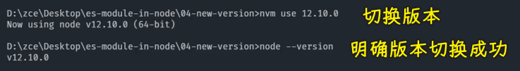

然后紧接着我们就可以通过 `node --experimental-modules` 去执行一下我们这个 JS 文件。

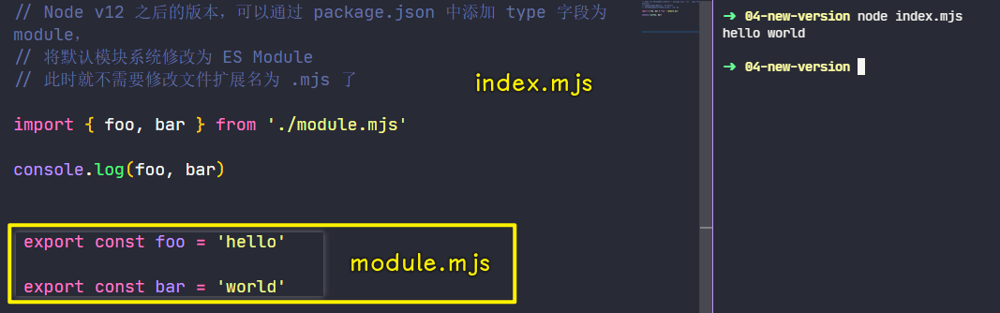

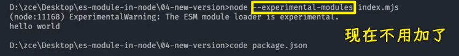

> 我的`v14.15.0`版本是不用加这个参数的，至于`v12.10.0`要不要加，我就不清楚了，视频里，老师是加了的，但这也有可能是为了方便拿到上次运行的命令（直接按方向键「上」）

此时执行的效果跟我们之前所看到的也是一样的。

### <mark>2）往`package.json`里边添加`type`字段并设置为`module`</mark>

不过在这个新版本当中，我们可以给项目的 `package.json` 当中去添加一个 `type` 字段 -> 我们将这个 `type` 字段设置为 `module`

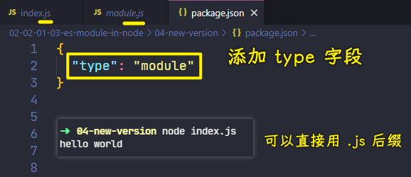

> 老师在演示的时候也加了`--experimental-modules`参数，其实不用加也行啊！

这个时候我们这个项目下所有的 JS 文件默认就会以 ES Modules 去工作了 -> 也就是说我们不用再将扩展名改成 `.mjs` 了，我们直接将它们改回为`.js`。

改回来过后，我们再回到文件当中，将文件当中的`.mjs`后缀结尾的路径也给它修改回来。

此时我们就可以回到命令行当中，再次重新运行一下 `index.js`

此时我们这个 JS 文件就会按照 ES Modules 的形式去工作了

---

如果你不添加这个`type`，直接用 node 执行`.js`后缀的 JS 文件，那么就会报错：

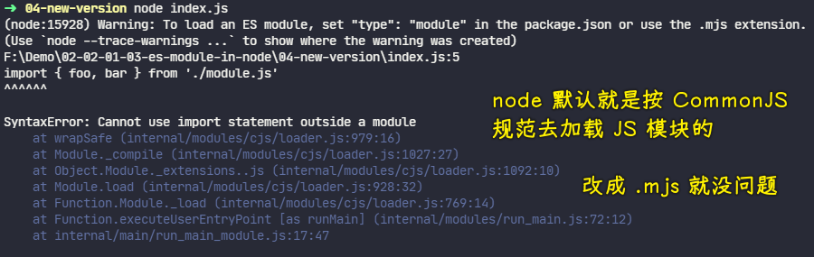

---

### <mark>3）有了`"type": "module"`，那遵守 CommonJS 规范的`.js`模块还能被正常加载吗？</mark>

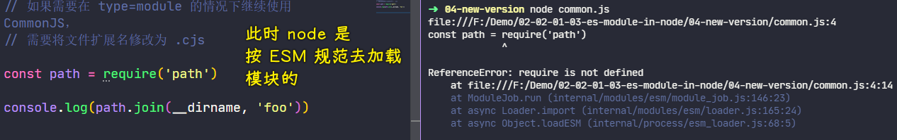

如果这个时候你还想去使用 CommonJS 的话，例如我们这儿再去新建一个 `common.js` 这样一个文件，我们在这个文件当中按照 CommonJS 的方式去载入 `path` 这个模块，然后尝试使用 `path` 模块里面的 `join` 成员去把 `dir` 和 `foo` 连接起来 -> 这只是一个测试。

这个时候我们回到我们的命令行当中，直接通过这种环境去启动我们的这个 CommonJS 的这样一个模块。

此时你会发现我们的命令行当中会报一个错误说：`require is not defined`

这也就意味着我们现在还是使用 ES Modules 的形式运行了这个 JS 文件。

### <mark>4）遵守 CommonJS 规范的模块得把`.js`后缀改为`.cjs`才会被正常加载</mark>

所以说这个时候我们需要单独对于 CommonJS 这种方式做一个额外的处理，那就是将这个`common.js`文件修改为`.cjs`这样一个扩展名。

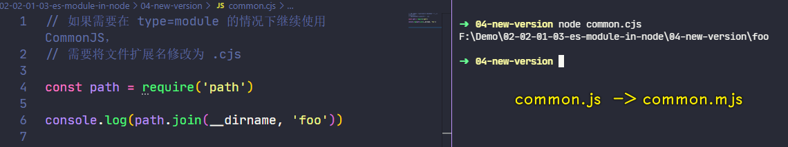

此时我们再次去执行的话，就可以正常的去使用 CommonJS 规范了。

### <mark>5）代码</mark>

`module.js`：

``` js
export const foo = 'hello'

export const bar = 'world'
```

`index.js`：

``` js
// Node v12 之后的版本，可以通过 package.json 中添加 type 字段为 module，
// 将默认模块系统修改为 ES Module
// 此时就不需要修改文件扩展名为 .mjs 了

import { foo, bar } from './module.js'

console.log(foo, bar)
```

`common.cjs`：

``` js
// 如果需要在 type=module 的情况下继续使用 CommonJS，
// 需要将文件扩展名修改为 .cjs

const path = require('path')

console.log(path.join(__dirname, 'foo'))
```

`package.json`：

``` js
{
  "type": "module"
}
```

## ★ES Modules in Node.js - Babel 兼容方案


如果说你使用的是早期的 Node.js 版本，那你可以使用 babel 去实现 ES Modules 的兼容。


babel 是目前最主流的一款 JavaScript 的编译器 -> 它可以用来帮我们将一些使用了新特性的代码编译成当前环境支持的代码

有了 babel 过后，我们就可以放心大胆的在绝大多数环境当中去使用各种各样的新特性了。

在这里我们就借助于 babel 去实现在低版本 node 环境当中去使用 ES Modules。

那接下来我们就一起来看一下如何在 node 环境当中使用 babel 去运行 ES Modules 的代码。

### <mark>1）如何使用 babel 去运行我们的 node 代码？</mark>

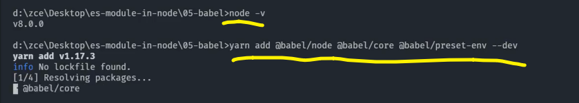

我这里 node 的版本是`8.0.0`，我们使用 babel 去运行我们 node 代码的话，我们可以去安装一个`@babel/node`模块。

不过这个模块它需要依赖 babel 的核心模块，还有一些 babel 的预设插件 -> 我们将这些模块全部作为开发依赖来安装进来。

完成过后，我们就可以在 `node_modules` 当中去找到一个`babel-node`的一个命令。

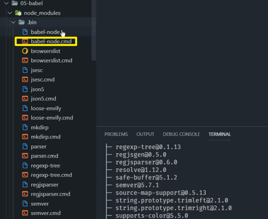

此时我们就可以在命令行当中通过 `yarn` 去运行这个命令，`yarn`会自动找到这个可执行文件。

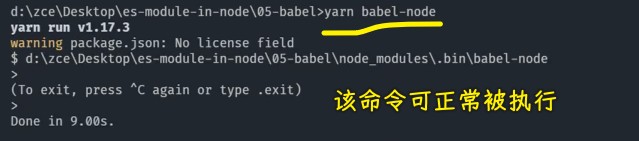

可以执行这个命令过后，接下来我们就看一下这样一个命令它具体如何去运行我们的 JS 文件。

### <mark>2）`node-babel`的用法</mark>

它的用法实际上跟 `node` 命令是一样的，我们直接在后面跟上我们的 JS 文件的名称就可以了。

#### <mark>1、node 8 不支持 ESM</mark>

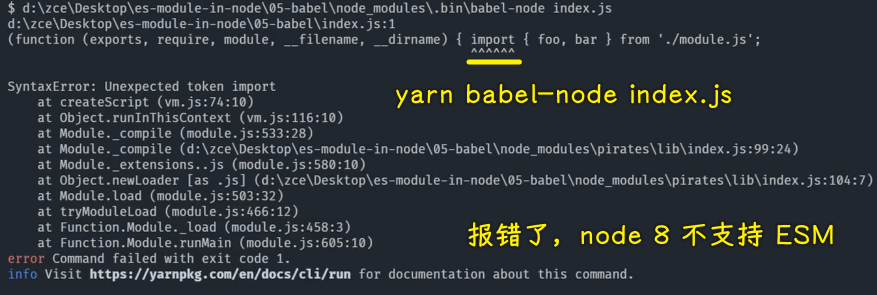

不过它直接运行还是报了一个错误 -> 说的是「`import` 不被支持」

#### <mark>2、需要给 babel 添加转换插件：`preset-env`</mark>

那这个原因也非常简单，因为 babel 它是基于插件机制去实现的

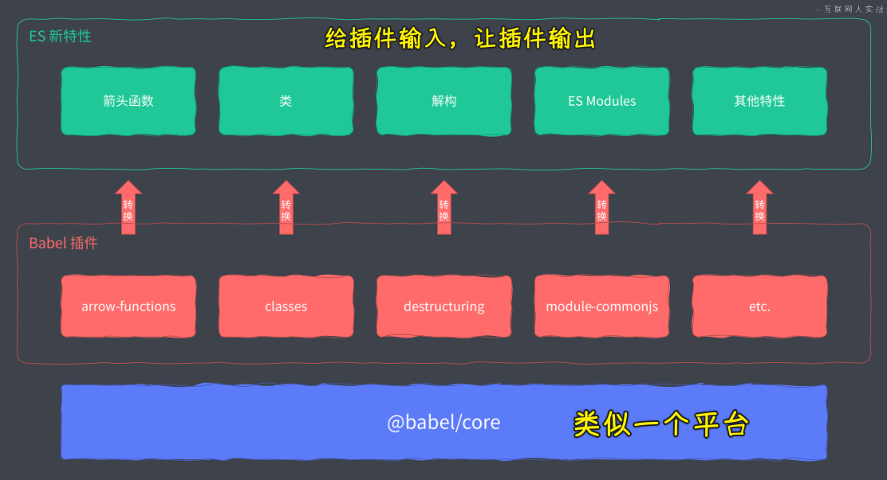

它的核心模块并不会去转换我们的代码，而具体要去转换我们代码当中的每一个特性，它是通过插件来去实现的，也就是说我们需要一个插件去转换我们代码当中的一个特性。

我们之前所安装的这个 `preset-env`，它实际上是一个插件的集合，在这个插件的集合当中去包含了最新的 JS 标准当中的所有的新特性。

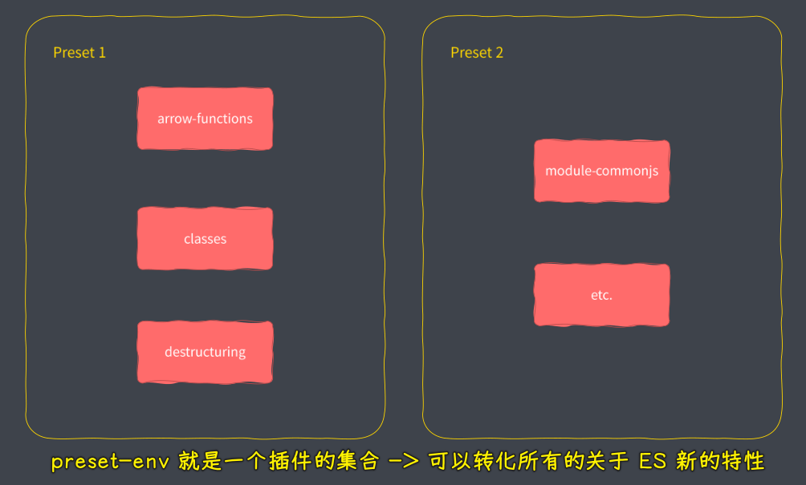

我们在这儿就可以借助于这个 `preset` 直接去把我们当前这个代码当中所使用到的 ES Modules 给它转换过来。

那正确的做法就是我们在这个命令后面跟上一个 `presets` 参数，我们让这个 `presets` 去使用我们刚刚的这个 `preset-env` -> 因为除了 `preset-env` 还有一些其它的 `preset` 

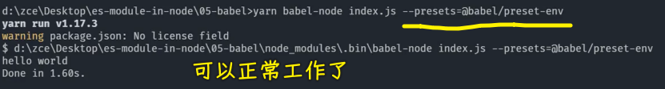

这个时候它就可以正常的去工作了。

### <mark>3）添加`.babelrc`配置</mark>

如果说你要是觉得每次手动的去传入这样一个参数会比较麻烦的话，那你也可以选择把它放到配置文件当中。

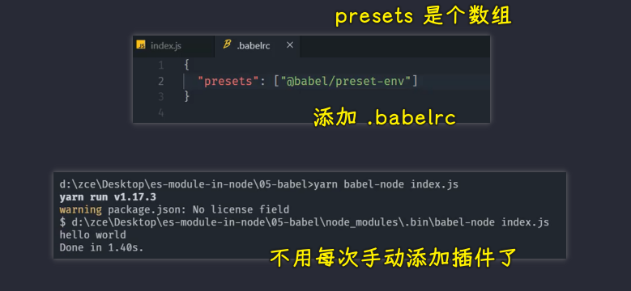

我们在当前这个项目的下面去添加一个`.babelrc`文件。

这个文件**是一个 JSON 格式的文件**，我们可以在这个文件当中去添加一个 `presets` 节点

这个节点里面是一个数组，我们将刚刚的这个 preset 放在里面，也就是`preset-env`。

此时我们就可以直接通过 babel 去运行 `index` -> 不用再去添加参数了。

这个就是我们之前所安装 preset 的一个用意。

当然了，我们刚刚也介绍到了，这实际上去帮我们转换 ES Modules 这样一个特性的是一个插件，并不是 `preset-env`， `preset-env` 只是一个集合

我们这儿把这个 preset 给它移除掉。

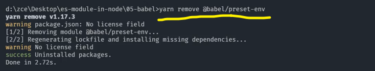

### <mark>4）使用单个插件去转换 ESM 特性</mark>

我们来看一下具体使用一个单独的插件来去转换这样一个特性。

这个插件的名字叫做 `transform-modules-commonjs`

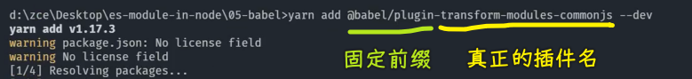

我们把这个插件安装进来过后，我们就可以把配置文件当中的这个 `presets` 给大家去掉，取而代之的是 `plugins` 节点。

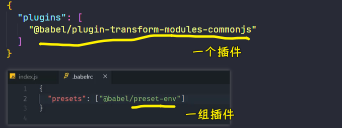

这个节点也是一个数组，我们将刚刚安装的这个插件放进去，你一定要记住「`preset` 它就是一组插件」。

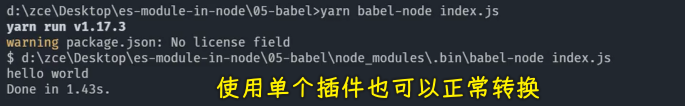

可以看到，我们需要用到哪个插件，我们自己去安装也是可以的

对于你来讲的话，你的环境如果说支持一些其它的特性，那对于不支持的那些特性，你单独用一些插件去安装可能效率会更好一些。

> 也可以为`preset-env`添加配置，比如指定这个 JS 文件是在什么版本下的浏览器环境或者什么版本下的 node 环境下去跑的，根据指定的版本来确定要不要转换代码，比如你指定代码运行环境是最新版的 node，那么你在用 babel 去执行 JS 文件的时候，大部分 ES 特性都不需要去转换了！

### <mark>5）小结</mark>

以上这个就是我们在 node 环境当中使用 babel 去处理兼容的一个办法。

当然，针对于 babel 的使用，我们还会有一些专门的介绍，因为我们这只是使用到了 babel 的 `node`（`bable-node`），而 babel 的编译器会在后面专门再去介绍。

➹：[babel-preset-env 使用指南](https://www.cnblogs.com/chyingp/p/understanding-babel-preset-env.html)

### <mark>6）代码</mark>

`package.json`：

``` json
{
  "devDependencies": {
    "@babel/core": "^7.6.0",
    "@babel/node": "^7.6.1",
    "@babel/plugin-transform-modules-commonjs": "^7.6.0"
  }
}
```

> 不用配置`type`字段为`module`了，直接让 babel 借助插件去帮我们处理就好了

`.babelrc`：

``` json
{
  "plugins": [
    "@babel/plugin-transform-modules-commonjs"
  ]
}
```

`module.js`：

``` js
export const foo = 'hello'

export const bar = 'world'
```

`index.js`：

``` js
// 对于早期的 Node.js 版本，可以使用 Babel 实现 ES Module 的兼容

import { foo, bar } from './module.js'

console.log(foo, bar)
```


