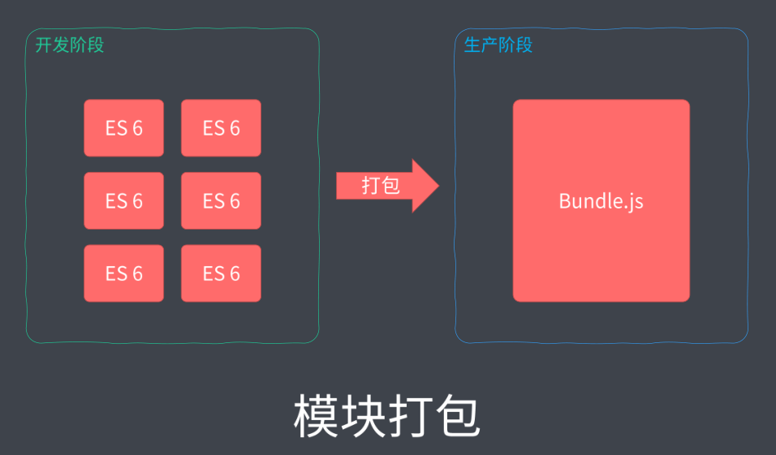

### ✍️ Tangxt ⏳ 2021-11-17 🏷️ Webpack

# 09-模块打包工具的由来、模块打包工具概要

## ★模块打包工具的由来

模块化确实很好的解决了我们在复杂应用开发过程当中的代码组织问题，但是随着我们引入模块化，我们的应用又会产生一些新的问题。

### <mark>1）引入模块化，所产生的新问题</mark>

#### <mark>1、对于 ESM 的环境兼容问题</mark>

首先第一个就是我们所使用的 ES Modules 这样一款模块系统 -> 它本身就存在环境兼容问题。

尽管现如今主流浏览器的最新版本都已经支持这样一个特性了，但是我们目前还没有办法做到去统一所有用户浏览器的使用情况，所以我们还需要去解决兼容问题。

#### <mark>2、模块文件过多，网络请求频繁</mark>

其次就是通过模块化的方式划分出来的模块文件会比较多，而我们前端应用又是运行在浏览器当中的 -> 每一个我们在应用当中所需要的文件都需要从服务器当中请求回来，那这些零散的模块文件就必将会导致浏览器频繁发出请求，从而影响我们应用的工作效率。

#### <mark>3、万物皆模块化</mark>

第三点其实也不能算是问题，它应该算是我们在实现 JS 模块化的基础之上的一个发散。

那就是我们在前端应用开发过程当中，不仅仅只有 JavaScript 代码需要模块化。因为随着我们应用的日益复杂，我们的 HTML、CSS 的这些资源文件同样也会面临相同的问题，而且从宏观角度来看的话，这些文件也都可以看作为前端应用当中的一个模块。只不过这些模块的种类和用途它跟我们的 JavaScript 是不同的。

对于整个开发过程而言，模块化肯定是有必要的。只不过我们需要在原有的基础之上去引入更好的方案或者工具，以此去解决上面讲到的这样几个问题或者是需求 -> 让我们开发者在应用的开发阶段可以继续享受模块化所带来的优势，又不必担心模块化对生产环境所产生的一些影响。

### <mark>2）我们希望这个工具能有什么？</mark>

这里我们就先对这个所谓的更好的方案或者工具去提出一些设想，我们希望它们能够满足我们的这些设想。

#### <mark>1、可以帮我们编译代码</mark>

首先第一点就是我们需要这样一个工具，能够帮我们编译我们的代码，也就是将我们开发阶段编写的那些包含新特性的代码直接去转换为能够兼容绝大多数环境的代码，那这样一来，我们所面临的环境兼容问题也就不存在了。

#### <mark>2、可以把散落的一个个模块组装到一起</mark>

其次就是能够将我们散落的这些模块文件再次打包到一起 -> 这就解决了我们浏览器当中频繁对模块文件发出请求的问题。

至于**模块化文件划分，那我们只是在开发阶段需要它，因为它能够更好地帮我们组织我们的代码，但是对于运行环境实际上是没有必要的**。

所以说我们可以选择在开发阶段通过模块化的方式去编写，但生产阶段我们还是把它们打包到同一个文件当中。

#### <mark>3、可以让样式、图片、字体等资源都被当作模块去使用</mark>

最后就是它需要去支持不同种类的前端资源类型。

那这样的话，我们就可以把前端开发过程当中所涉及到的样式、图片、字体等等所有资源文件都当作模块去使用 -> 这对于我们整个前端应用来讲的话，就有了一个统一的模块化方案了。

因为我们之前介绍的那些模块化方案实际上只是针对于 JavaScript 模块化方案，现在我们是想强调对于整个前端应用来讲、它的一个模块化的方案。

对于这些资源，我们有了这种方案过后就可以通过代码去控制，那它就可以与我们的业务代码统一去维护，这样对于整个应用来讲的话会更加合理一些。

### <mark>3）小结</mark>

针对于前面两个需求，我们其实完全可以借助于之前所了解过的一些构建系统去配合一些编译工具就可以实现。

但是对于最后一个需求，我们就很难通过这种方式去解决了。所以说就有了我们接下来所介绍的一个主题，也就是前端模块打包工具。

## ★模块打包工具概要
