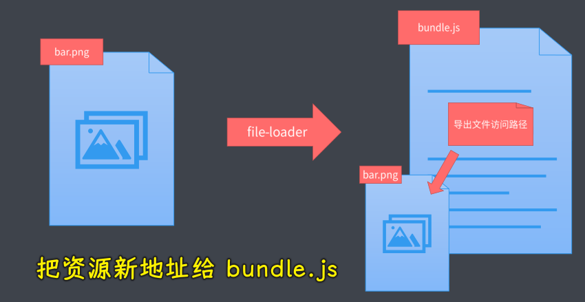

### ✍️ Tangxt ⏳ 2021-11-17 🏷️ Webpack

# 10-Webpack

> 关于工具类的知识，我看一遍就跳过了 -> 基于 [大前端学习--模块化开发 学习笔记_爱玲姐姐的博客-CSDN 博客](https://blog.csdn.net/jal517486222/article/details/107287751) 这篇文章的加工 -> 这篇文章没有写到打包结果的运行原理 -> 自己在浏览器调试一下那个打包结果`bundle.js`文件 -> webpack 打包出来的`bundle.js`，其里边的代码并不会特别复杂（简单来说，整个 `bundle.js` 就是一个 IIFE，传给这个 IIFE 的实参是一个个模块文件，会把一个个 ESM 模块的导入和导出整成是 `require`、`module.exports`这种类似 CommonJS 规范的 API，通过 `id` 标识每个模块，一个模块用其它模块时，就通过 id 去找就好了） -> 把所有模块的放到同一个文件当中，以及提供了一些基础代码，让这些代码保持原有的依赖关系 -> 可以看一下这篇：[webpack 打包原理 ? 看完这篇你就懂了 ! - SegmentFault 思否](https://segmentfault.com/a/1190000021494964)

模块化打包工具的由来：ES Modules 存在环境兼容问题、模块文件过多，网络请求频繁，而且所有的前端资源都需要模块化。

打包工具解决的是前端整体的模块化，并不单指 JavaScript 模块化

webpack -> 模块打包器、模块加载器、代码拆分、载入资源模块

### <mark>1) webpack 的基本使用</mark>

+ 先在项目的根目录下执行`yarn init -y`, 创建`package.json`
+ 安装 webpack 相关依赖：`yarn add webpack webpack-cli --dev`
+ 查看 webpack 版本：`yarn webpack --version` -> `4.43.0`
+ 执行`yarn webpack`进行打包，生成了`dist`目录，里面有`main.js`文件
+ 修改`index.html`中的`index.js`的路径为`dist/main.js`, 并且去掉`script`标签的`type=module`的属性
+ 去 `package.json` 的 `scripts` 中定义一个 `build` 任务：`"build": "webpack"`, 以后执行`yarn build`进行打包

### <mark>2) webpack 的配置文件</mark>

`webpack.config.js`文件是运行在 nodejs 文件下的 js 文件，我们需要按照 CommonJS 的方式编写代码。这个文件需要导出一个对象，我们完成对应的配置选项。

`webpack.config.js`文件内容：

```js
const path = require('path')

module.exports = {
  entry: './src/index.js', // 指定打包入口文件，如果是相对路径，前面的点不能少
  output: {
    filename: 'bundle.js', // 输出文件的名称
    path: path.join(__dirname, 'output'), // 输出路径，为绝对路径
  }
}
```

### <mark>3) webpack 工作模式</mark>

直接执行 webpack 打包的时候，控制台会有警告：

> WARNING in configuration
> 
> The 'mode' option has not been set, webpack will fallback to 'production' for this value. Set 'mode' option to 'development' or 'production' to enable defaults for each environment.
> 
> You can also set it to 'none' to disable any default behavior. Learn more: https://webpack.js.org/configuration/mode/

说没有指定工作模式，默认以生产模式打包，会进行代码的压缩。

我们可以通过 cli 命令指定工作模式，就是增加一个`--mode`的参数，属性有三种选择，production、development、none

+ production：生产模式会默认启动优化，优化我们的打包结果
+ development：开发模式，会自动优化打包的速度，添加一些调试过程中的辅助到代码中
+ none：原始状态的打包，不会做任何处理

可以通过`yarn webpack --mode development`来执行。

此外，还可以在 webpack 的配置文件中指定工作模式，也就是增加一个 mode 属性，例如：`mode: "development"`

### <mark>4) webpack 资源模块加载</mark>

将配置文件中的`entry`属性的值改为`./src/main.css`, 然后执行打包命令`yarn webpack`, 会报错：

``` js
ERROR in ./src/main.css 1:5
Module parse failed: Unexpected token (1:5)
You may need an appropriate loader to handle this file type, currently no loaders are configured to process this file. See https://webpack.js.org/concepts#loaders
  body {
  |   margin: 0 auto;
  |   padding: 0 20px;
  error Command failed with exit code 2.
```

因为 webpack 默认会把文件当做 js 解析：


所以打包 css 文件时，文件内容不符合 JS 语法则报错了，报错中提示我们可以寻找正确的 loader 去解析代码。webpack 内部的 loader 只能解析 js，所以我们要手动安装 css-loader 去处理 css 代码。


执行命令：`yarn add css-loader --dev`

然后在 webpack 的配置文件中增加属性：

```js
module: {
  rules: [
    {
      test: /.css$/,
      use: 'css-loader'
    }
  ]
}
```

我们增加外部的 loader 需要在配置文件中增加资源模块 `module` 属性，属性值是一个对象，对象中有一个 `rules` 数组，数组里每个元素都是一个对象，对象中的 `test` 属性是正则式，指明要处理的资源文件，`use` 属性是对该资源进行处理的 loader 名称。

再次执行打包命令，发现 css 没有作用，是因为我们使用 css-loader 只是对 css 文件进行了打包，但是并没有作用到页面上，接下来还要安装一个`style-loader`, 执行命令：`yarn add style-loader --dev`

`style-loader`是将`css-loader`处理后的结果，通过 style 的形式追加到页面上

然后将配置文件中的`rules`对应的处理 css 资源模块的 `use` 属性由`'css-loader'`改为`['style-loader', 'css-loader']`,`use`配置了多个`loader`，是一个数组，里面的`loader`是**从右往左**执行，所以要将`css-loader`写在后面，我们要先用`css-loader`将`css`代码转化成`js`模块，才可以正常打包。

### <mark>5) webpack 导入资源模块</mark>


虽然 webpack 的入口文件可以是别的类型文件，但由于**前端项目是由 JS 驱动**，所以我们**开发时一般将入口文件设置为 JS 文件，需要用到 CSS 时，就直接在 JS 文件中通过 import 导入即可**，如：`import './main.css'`

webpack 建议我们根据代码的需要在 JS 中动态导入资源文件，因为**需要资源的不是应用，而是代码**。因为是 JavaScript 驱动了整个前端应用，这样做的好处是：

+ 逻辑合理，JS 确实需要这些资源文件
+ 确保上线资源不缺失，都是必要的

### <mark>6) webpack 文件资源加载器</mark>


安装文件资源加载器：`yarn add file-loader --dev`, 相当于直接拷贝物理文件。不过此时资源文件路径会出现问题，webpack 默认认为它打包过后的文件会放在网站的根目录下面，此时需要在配置文件中的`output`属性中指定`publicPath`属性值为`dist/`, 即：`publicPath: 'dist/'`, 这样在打包时，文件的输出路径前面会拼接上`publicPath`的值。

### <mark>7) webpack URL 加载器</mark>

格式：协议 + 媒体类型和编码 + 文件内容

格式：`data:[<mediatype>][;base64],<data>`


例如：HTML

`data:text/html;charset=UTF-8,<h1>html content</h1>`


例如：图片


+ 先安装 url-loader:`yarn add url-loader --dev`

+ 修改 png 文件的 loader 为 url-loader

```js
{
  test: /.png$/,
    // use: 'file-loader',
  use: 'url-loader'
}
```

+ 执行`yarn webpack`, 此时的 png 文件的 URL 则为 data 协议的了。

最佳使用方式：

+ 小文件使用 Data URLs, 减少请求次数
+ 大文件独立提取存放，提高加载速度

配置方式：

```js
{
  test: /.png$/,
  // use: 'file-loader',
  use: {
    loader: 'url-loader',
    options: {
      limit: 10 * 1024, // 单位是字节 10KB
    }
  }
}
```

+ 超过 10KB 的文件单独提取存放
+ 小于 10KB 文件转换为 Data URLs 嵌入代码中

> 注意：这种方式还是要安装`file-loader`，因为对超出大小的文件还是会调用`file-loader`，如果没有 file-loader 会报错。

### <mark>8) webpack 常用加载器分类</mark>

1. 编译转换类，转换为 JS 代码，如`css-loader`
2. 文件操作类，将资源文件拷贝到输出目录，将文件访问路径向外导出，如：`file-loader`
3. 代码检查器，统一代码风格，提高代码质量，如：`es-loader`

编译转换类：


文件操作类：




代码检查器：


### <mark>9) webpack 处理 ES2015</mark>

因为模块打包需要，所以处理`import`和`export`，除此之外，并不能转换其他的 ES6 特性。如果想要处理 ES6，需要安装转化 ES6 的编译型 loader，最常用的就是`babel-loader`，`babel-loader`依赖于`babel`的核心模块，`@babel/core`和`@babel/preset-env`

+ 执行命令：`yarn add babel-loader @babel/core @babel/preset-env --dev`
+ 修改 js 的 loader

```js
{
  test: /.js$/,
  use: {
    loader: 'babel-loader',
    options: {
      presets: ['@babel/preset-env']
    }
  },
  exclude: /node_modules/, // 这里很重要，千万别忘了，否则会出错的。
}
```

> 注意：
>
> Webpack 只是打包工具，
>
> 加载器可以用来编译转化代码

### <mark>10) webpack 的模块加载方式</mark>

💡：遵循 ES Modules 标准的 import 声明


💡：遵循 CommonJS 标准的 require 函数。对于 ES 的默认导出，要通过`require('./XXX').default`的形式获取


💡：遵循 AMD 标准的 define 函数和 require 函数


💡：Loader 加载的非 JavaScript 也会触发资源加载

样式代码中的@import 指令和 url 函数

```css
@import url(reset.css);

body {
  margin: 0 auto;
  padding: 0 20px;
  max-width: 800px;
  background: url(1.png);
  background-size: cover;
}
```

​css-loader 在处理 css 代码时，遇到了 background 属性中的 url 函数，发现是引入的资源文件是 png 格式的文件，则将这个资源文件 交给 url-loader 处理

HTML 代码中的图片标签的 `src` 属性

```js
{
  test: /.html$/,
  use: {
    loader: 'html-loader',
    options: {
        // html-loader 默认只处理页面中的 img 标签的 src 属性的资源文件，所以指定其他标签的资源文件也要处理
      attributes: {
        list: [
          {
            tag: 'img',
            attribute: 'src',
            type: 'src'
          },
          {
            tag: 'a',
            attribute: 'href',
            type: 'src'
          }
        ]
      }
    }
  }
}
```

💡：小结


### <mark>11) webpack 的核心工作原理</mark>


找到打包入口：


找到所有文件之间的依赖关系树：


webpack 遍历，或者更准确地说是递归这颗依赖树，找到每个节点所对应的资源文件，最后再根据配置文件当中的`use`属性去找到这个模块所对应的加载器去加载这个模块


最后会将加载到的结果放入到`bundle.js`当中，也就是我们的打包结果当中，从而去实现我们整个项目的打包


在整个打包过程中，loader 其实起了一个很重要的作用 -> 没有 loader 就无法实现各种各样的资源文件的加载，没有 loader，webpack 只能算是一个用来去打包或者合并 JS 模块代码的一个工具了


### <mark>12)  webpack Loader 的工作原理</mark>

实现一个 markdown 的文件加载器。

`Loader`作为`webpack`的核心机制，内部的工作原理也非常简单，我们通过开发一个自己的`loader`，来深入了解`loader`的工作原理。


我们的需求是实现一个`markdown`文件的加载器，这个加载器可以在代码当中直接导入`markdown`文件。`markdown`文件一般是被转换为`html`过后再去呈现到页面上的，所以我们导入的`markdown`文件得到的结果就是转换过后的 html 字符串。

在项目的根目录下新建一个`markdown-loader.js`文件，每一个`webpack`的`loader`都需要去导出一个函数，这个函数就是我们这个`loader`的对我们所加载到的资源的一个处理过程，它的输入就是我们资源文件的内容，输出就是我们此次加工过后的一个结果。

那我们通过`source`参数去接收输入，然后通过我们的返回值去输出，我们先尝试打印一下这个`source`，然后直接去返回一个`hello`，我们去看一下结果，我们回到`webpack`配置文件中去添加一个加载新的规则配置，我们匹配到的扩展名就是`.md`，就是我们刚刚所编写的`markdown-loader`的模块，我们的`use`属性不仅仅只可以使用模块的名称，其实对于模块的文件路径也是可以的，这一点其实与`node`当中的`require`函数是一样的，所以直接使用相对路径去找到这个`markdown-loader`，配置好过后，运行打包命令，打包过程当中命令行确实打印出来了我们所导入的 markdown 的内容，那这也就意味着我们的`source`确实是所导入的文件内容，但是它同时也爆出一个解析错误，说的是`you many need additional load to handle the result of this loader`，就是我们还需要一个额外的加载器来去处理我们当前的加载结果，那这究竟是为什么呢？

```js
module.exports = source => {
  console.log(source)
  return 'hello'
}
```

其实`webpack`的加载资源的过程有点类似于一个工作管道，你可以在这个过程当中一次去使用多个`loader`：


但是，还要求我们最终这个管道工作过后的结果必须是一段`JavaScript`代码，因为我们这返回的内容是一个`hello`，它不是一个标准的`JavaScript`代码，所以我们这才会出现这样的错误提示，那知道这个错误的原因过后，解决的办法其实也就很明显了，那要么就是我们这个`loader`的直接去返回一段标准的`JavaScript`代码，要么就是我们再去找一个合适的加载器，接着去处理我们这里返回的结果。


我们先来尝试第一种办法。回到我们`markdown-loader.js`的当中，我们将返回的这个内容修改为`'console.log("hello")'`，那这就是一段标准的 JavaScript 代码，然后我们再一次运行打包，那此时打包过程当中就不再会报错了。

```js
module.exports = source => {
  console.log(source)
  return 'console.log("hello")'
}
```

接下来我们一起来看一下打包过后的结果究竟是什么样的，我们打开`bundle.js`当中，然后我们找到最后一个模块，可以看到，`webpack`打包的时候就是把我们刚刚`loader`加载过后的结果也就是返回的那个字符串直接拼接到我们这个模块当中了，那这也就解释了刚刚为什么说`loader`的管道最后必须要去返回`JavaScript`代码的原因，因为如果说你随便去返回一个内容的话，那放到这里语法就有可能不通过。

那知道了这些过后，我们再回到`markdown-loader.js`的当中，然后接着去完成我们刚刚的需求，我们先去安装一个`markdown`解析的模块叫做`marked`，安装命令为：`yarn add marked --dev`

安装完成过后，我们再回到代码当中去导入这个模块。然后在我们的加载器当中去使用这个模块，去解析来自参数当中的这个`source`，我们的返回值就是一段`html`字符串，也就是转换过后的结果，但是如果直接返回这个`html`的话，那就会面临刚刚同样的问题，正确的做法就是把这段`html`变成一段`JavaScript`代码，其实我们希望是把这一段`html`作为我们当前这个模块导出的字符串，也就是我们希望通过`export`导出这样一个字符串，但是如果说我们只是简单的拼接的话，那我们`html`当中存在的换行符还有它内部的一些引号，拼接到一起就有可能造成语法上的错误，所以说这里我使用一个小技巧，就是通过`JSON.stringify`先将这个字符串转换为一个标准的`JavaScript`格式字符串，那此时内部的引号以及换方符都会被转义过来，然后我们再参与拼接，那这样的话就不会有问题了，我们再次运行打包，看一下打包的结果，那此时我们所看到的结果就是我们所需要的了，当然了，除了`module.exports`这种方式有外，`webpack`的还允许我们在返回的代码当中直接去使用`ES Modules`的方式去导出。

```js
const marked = require('marked')

module.exports = source => {
  // console.log(source)
  // return 'console.log("hello")'
  const html = marked(source)
  console.log(html)
  // 两种导出方式：
  // return `module.exports=${JSON.stringify(html)}`
  // return `export default ${JSON.stringify(html)}`
  // 不用自己写上边两种的其中之一的方式，直接交给下一个 loader 处理
  // 返回 html 字符串交给下一个 loader 处理
  return html
}
```

通过第一种方式解决了我们刚刚所看到的那样一个错误，我们再来尝试一下刚刚所说的第二种方法，那就是在我们`markdown-loader`的当中去返回一个`html`的字符串，然后我们交给下一个`loader`处理这个`html`的字符串，我们直接去返回`marked`的解析过后的`html`，然后我们再去安装一个用于去处理`html`加载的`loader`, 叫做`html-loader`，完成过后，我们回到配置文件当中，我们把`use`属性修改为一个数组，那这样的话我们的`loader`工作过程当中就会依次去使用多个`loader`，那不过这里需要注意，就是它的执行顺序是从数组的后面往前面，那也就是说我们应该把先执行的`loader`放到后面，后执行的`loader`放到前面。


```js
const marked = require('marked')

module.exports = source => {
  // console.log(source)
  // return 'console.log("hello")'
  const html = marked(source)
  console.log(html)
  return html
}
```

```js
module: {
  rules: [
    {
      test: /.md$/,
      use: ['html-loader', './markdown-loader.js']
    }
  ]
}
```

回到命令行进行打包，此时我们打包的结果仍然是可以的，我们`marked`处理完的结果是一个`html`的字符串，然后这个`html`字符串交给了下一个`loader`，也就是`html-loader`，那这个`loader`又把它转换成了一个导出这个字符串的一个`JavaScript`代码，那这样的话我们 webpack 再去打包的时候就可以正常工作了。


`bundle.js`就是这个结果：


返回 ESM 模块导出的处理结果：


用 html-loader 处理的后，输出到`bundle`的结果：


整体上就是这样：


> markdown-loader 的结果是 html 字符串

那通过以上的这些尝试我们就发现了 loader 它内部的一个工作原理其实非常简单，就是一个**从输入到输出之间的一个转换**：


除此之外，我们还了解了 loader，它实际上是一种管道的概念，我们可以将我们此次的这个`loader`的结果交给下一个`loader`去处理，然后我们通过多个`loader`去完成一个功能


例如我们之前所使用的`css-loader`和`style-loader`之间的一个配合，包括我们后面还会使用到的，像`sass`或者`less`这种`loader`他们也需要去配合我们刚才所说到的这两种`loader`，这就是`loader`的工作管道这样一个特性。


### <mark>13) Webpack 插件机制</mark>

插件机制的是`webpack`一个核心特性，目的是为了增强`webpack`自动化方面的能力。

Loader 专注实现资源模块的加载，从而去实现整体项目的打包。

Plugin 解决除了资源加载以外的其他的一些自动化工作：

+ 自动在打包之前去清除 dist 目录

  + 安装：`yarn add clean-webpack-plugin --dev`

  + webpack.config.js:

    ```js
    const {CleanWebpackPlugin} = require('clean-webpack-plugin')
    plugins: [
      new CleanWebpackPlugin()
    ]
    ```

+ 自动生成 HTML 插件

  + 安装：`yarn add html-webpack-plugin --dev`

    ```js
    const HtmlWebpackPlugin = require('html-webpack-plugin')
    plugins: [
      new CleanWebpackPlugin(),
      new HtmlWebpackPlugin()
    ]
    ```

  + 自动生成`HTML`文件到`dist`目录中，根目录下的 index.html 则不再需要了

  + HTML 中自动注入了`bundle.js`的引用到`HTML`文件中

  + 增加配置参数生成 HTML 文件：

    ```js
    new HtmlWebpackPlugin({
      title: 'Webpack Plugin Sample',
      meta: {
        viewport: 'width=device-width'
      }
    })
    ```

  + 通过模板文件生成 HTML 文件，webpack.config.js 中指定 HtmlWebpackPlugin 的 template 参数

    ```html
    <!DOCTYPE html>
    <html lang="en">
    <head>
      <meta charset="UTF-8">
      <meta name="viewport" content="width=device-width, initial-scale=1.0">
      <title>webpack</title>
    </head>
    <body>
      <div class="container">
        <h1><%= htmlWebpackPlugin.options.title %></h1>
      </div>
    </body>
    </html>
    ```

    ```js
    plugins: [
      new CleanWebpackPlugin(),
      new HtmlWebpackPlugin({
        title: 'Webpack Plugin Sample',
        meta: {
          viewport: 'width=device-width'
        },
        template: './src/index.html'
      })
    ]
    ```

  + 生成多个 HTML 页面

    ```js
     plugins: [
        new CleanWebpackPlugin(),
        // 用于生成 index.html 
        new HtmlWebpackPlugin({
          title: 'Webpack Plugin Sample',
          meta: {
            viewport: 'width=device-width'
          },
          template: './src/index.html'
        }),
        // 用于生成 about.html 
        new HtmlWebpackPlugin({
          filename: 'about.html'
        })
      ]
    ```

+ 拷贝那些不需要参与打包的资源文件到输出目录

  + 安装：`yarn add copy-webpack-plugin --dev`

    ```js
    const CopyWebpackPlugin = require('copy-webpack-plugin')
    
    new CopyWebpackPlugin({
      patterns: ['public']
    })
    ```

+ 压缩我们打包结果输出的代码

### <mark>14) webpack 开发插件</mark>

相比于 Loader，Plugin 拥有更宽的能力范围，Plugin 通过钩子机制实现。


Webpack 要求插件必须是一个函数或者是一个包含 `apply` 方法的对象。通过在生命周期的钩子中挂载函数实现扩展。

```js
class MyPlugin {
  apply (compiler) {
    console.log('MyPlugin 启动')
    compiler.hooks.emit.tap('MyPlugin', compilation => {
      // compilation 可以理解为此次打包的上下文
      for (const name in compilation.assets) {
        // console.log(name) // 文件名
        console.log(compilation.assets[name].source())
        if(name.endsWith('.js')) {
          const contents = compilation.assets[name].source()
          const withoutComments = contents.replace(/\/\*\*+\//g, '')
          compilation.assets[name] = {
            source: () => withoutComments,
            size: () => withoutComments.length
          }
        }
      }
    })
  }
}
```

```js
plugins: [
  new MyPlugin()
]
```

### <mark>15) webpack 开发体验问题</mark>


+ 自动进行编译：执行`yarn webpack --watch`会监视文件的变化自动进行打包
+ 自动刷新浏览器：webpack-dev-server，安装：`yarn add webpack-dev-server`, 执行：`yarn webpack-dev-server --open`

### <mark>16) webpack dev server 静态资源访问</mark>

Dev Server 默认只会 serve 打包好的输出文件，只要是 webpack 打包输出的文件都会被访问到，其他静态资源也需要被 server

```js
devServer: {
    contentBase: './public'
  }
```

`contentBase` 额外为开发服务器指定查找资源目录

### <mark>17) webpack Dev server 代理 API</mark>

问题：


解决：


webpack-dev-server 支持配置代理

```js
  devServer: {
    contentBase: './public',
    proxy: {
      '/api': {
        // 以 /api 开头的地址都会被代理到接口当中，也就是把协议域名端口给替换了
        // http://localhost:8080/api/users -> https://api.github.com/api/users
        target: 'https://api.github.com',
        // http://localhost:8080/api/users -> https://api.github.com/users
        // 把路径以 /api 开头的替换成空字符串
        pathRewrite: {
          '^/api': ''
        },
        // 不能使用 localhost:8080 作为请求 GitHub 的主机名
        changeOrigin: true, // 以实际代理的主机名去请求
      }
    }
  } 
```

➹：[webpack 配置 changeOrigin 无效的说明](https://blog.csdn.net/qq_39291919/article/details/108807111)

### <mark>18) Source Map</mark>

运行代码与源代码之间完全不同，如果需要调试应用，错误信息无法定位，调试和报错都是基于运行代码，SourceMap 就是解决这种问题的最好办法。

Source Map 解决了源代码与运行代码不一致所产生的问题。

Webpack 支持 sourceMap 12 种不同的方式，每种方式的效率和效果各不相同。效果最好的速度最慢，速度最快的效果最差

eval 函数可以运行字符串当中的 js 代码：`eval("console.log(123)")`

当 DevTool 的值为 eval，打包后的报错信息只有源代码文件名称，没有行列信息

每个关键词的特点组合：

+ eval- 是否使用 eval 执行代码模块
+ cheap- Source map 是否包含行信息
+ module-是否能够得到 Loader 处理之前的源代码
+ inline- SourceMap  不是物理文件，而是以 URL 形式嵌入到代码中
+ hidden- 看不到 SourceMap 文件，但确实是生成了该文件
+ nosources- 没有源代码，但是有行列信息。为了在生产模式下保护源代码不被暴露

**开发模式推荐使用：`eval-cheap-module-source-map`**，因为：

+ 代码每行不会太长，没有列也没问题
+ 代码经过 Loader 转换后的差异较大
+ 首次打包速度慢无所谓，重新打包相对较快

**生产模式推荐使用：`none`**，原因

+ Source Map 会暴露源代码
+ 调试是开发阶段的事情
+ 对代码实在没有信心可以使用`nosources-source-map`


### <mark>19) webpack HMR</mark>

HMR(Hot Module Replacement) 模块热替换，应用运行过程中，实时替换某个模块，应用运行状态不受影响。

webpack-dev-server 自动刷新导致的页面状态丢失。我们希望在页面不刷新的前提下，模块也可以即使更新。热替换只将修改的模块实时替换至应用中。

HMR 是 webpack 中最强大的功能之一，极大程度的提高了开发者的工作效率。

HMR 已经集成在了 webpack-dev-server 中，运行`webpack-dev-server --hot`，也可以通过配置文件开启。

Webpack 中的 HMR 并不是对所有文件开箱即用，样式文件支持热更新，脚本文件需要手动处理模块热替换逻辑。而通过脚手架创建的项目内部都集成了 HMR 方案。

HMR 注意事项：

+ 处理 HMR 的代码报错会导致自动刷新
+ 没启动 HMR 的情况下，HMR API 报错
+ 代码中多了很多与业务无关的代码

### <mark>20) webpack 生产环境优化</mark>

我们在开发环境中，更注重开发效率。

模式 (mode)

webpack 建议我们为不同的环境创建不同的配置，两种方案：

配置文件根据环境不同导出不同配置：

```js
const path = require('path')
const webpack = require('webpack')
const {CleanWebpackPlugin} = require('clean-webpack-plugin')
const HtmlWebpackPlugin = require('html-webpack-plugin')
const CopyWebpackPlugin = require('copy-webpack-plugin')

module.exports = (env, argv) => {
  const config = {
    mode: 'none',
    entry: './src/main.js',
    output: {
      filename: 'bundle.js',
      path: path.join(__dirname, 'dist'),
      // publicPath: 'dist/'
    },
    module: {
      rules: [
        {
          test: /.md$/,
          use: ['html-loader', './markdown-loader.js']
        }
      ]
    },
    plugins: [
      new CleanWebpackPlugin(),
      // 用于生成 index.html 
      new HtmlWebpackPlugin({
        title: 'Webpack Plugin Sample',
        meta: {
          viewport: 'width=device-width'
        },
        template: './src/index.html'
      }),
      // 用于生成 about.html 
      new HtmlWebpackPlugin({
        filename: 'about.html'
      }),
      // 开发过程最好不要使用这个插件
      // new CopyWebpackPlugin({
      //   patterns: ['public']
      // }),
      // new MyPlugin(),
      new webpack.HotModuleReplacementPlugin()
    ],
    devServer: {
      contentBase: './public',
      proxy: {
        '/api': {// 以/api 开头的地址都会被代理到接口当中
          // http://localhost:8080/api/users -> https://api.github.com/api/users
          target: 'https://api.github.com',
          // http://localhost:8080/api/users -> https://api.github.com/users
          pathRewrite: {
            '^/api': ''
          },
          // 不能使用 localhost:8080 作为请求 GitHub 的主机名
          changeOrigin: true, // 以实际代理的主机名去请求
        }
      },
      // hot: true
      hotOnly: true, // 如果热替换代码报错了，则不刷新
    },
    devtool: 'eval-cheap-module-source-map'
  }
  
  if (env === 'production') {
    config.mode = 'production'
    config.devtool = false
    config.plugins = [
      ...config.plugins,
      new CleanWebpackPlugin(),
      new CopyWebpackPlugin({
        patterns: ['public']
      })
    ]
  }
  return config
}
```

一个环境对应一个配置文件：

Webpack.common.js

```js
const HtmlWebpackPlugin = require('html-webpack-plugin')

module.exports = {
  entry: './src/main.js',
  output: {
    filename: `bundle.js`
  },
  module: {
    rules: [
      {
        test: /\.js$/,
        use: {
          loader: 'babel-loader',
          options: {
            presets: ['@babel/preset-env']
          }
        }
      }
    ]
  },
  plugins: [
    new HtmlWebpackPlugin({
      filename: `index.html`
    })
  ]
}
```

Webpack.dev.js

```js
const common = require('./webpack.common')
const merge = require('webpack-merge')

module.export = merge(common, {
  mode: 'development',
})
```

Webpack.prod.js

```js
const common = require('./webpack.common')
const merge = require('webpack-merge')
const { CleanWebpackPlugin } = require('clean-webpack-plugin')
const CopyWebpackPlugin = require('copy-webpack-plugin')

module.exports = merge(common, {
  mode: 'production',
  plugins: [
    new CleanWebpackPlugin(),
    new CopyWebpackPlugin({
        patterns: ['public']
    })
  ]
})
```

package.json

```json
{
  "scripts": {
    "build": "webpack --config webpack.prod.js"
  }
}
```

执行打包命令：`yarn build`

### <mark>21) webpack 优化配置</mark>

DefinePlugin 为代码注入全局成员，这个内置插件默认就会启动，往每个代码中注入一个全局变量`process.env.NODE_ENV`

```js
const webpack = require('webpack')

plugins: [
    new HtmlWebpackPlugin({
      filename: `index.html`
    }),
    new webpack.DefinePlugin({
      // 不同的环境 API 接口是不一样的，注意 value 是一段 JS 代码，直接写字符串的话，那处理完过后就是一个变量了
      API_BASE_URL: JSON.stringify('http://api.example.com')
    })
  ]
```

Tree-Shaking 摇掉代码中未引用到的代码 (dead-code), 这个功能在生产模式下自动被开启。Tree-Shaking 并不是 webpack 中的某一个配置选项，而是一组功能搭配使用后的效果。

```js
optimization: {
    // 标记枯树枝  
    usedExports: true,
    // 把枯树枝摇掉
    minimize: true
  }
```

合并模块函数 `concatenateModules`, 又被成为 Scope Hoisting，作用域提升

```js
optimization: {
    usedExports: true,
    minimize: true,
    // 没有这个 key 的时候，打包时会给每个模块都给分配了一个 IIFE，而现在开启了它，那么所有的 ES 模块都被放到一个 IIFE 里边 -> 节省代码体积，提升运行效率
    concatenateModules: true
  }
```

+ 很多资料中说如果使用 Babel-Loader，会导致 Tree-Shaking 失效，因为 Tree-Shaking 前提是 ES Modules，由 Webpack 打包的代码必须使用 ESM，为了转化 ES 中的新特性，会使用 babel 处理新特性，就有可能将 ESM 转化 CommonJS，而我们使用的`@babel/preset-env`这个插件集合就会转化 ESM 为 CommonJS，所以 Tree-Shaking 会不生效。**但是在最新版 babel-loader 关闭了转换 ESM 的插件，所以使用 babel-loader 不会导致 Tree-Shaking 失效** -> **标记枯树枝失效了，这是因为你把 ESM 搞成是 CommonJS 了**

+ sideEffects 副作用，指的是模块执行时除了导出成员之外所做的事情，sideEffects 一般用于 npm 包标记是否有副作用。如果没有副作用，则没有用到的模块则不会被打包。

在 webpack.config.js 中开启这个功能：

```js
optimization: {
  usedExports: true,
  minimize: true,
  concatenateModules: true,
  sideEffects: true
}
```

在 package.json 里面增加一个属性 sideEffects, 值为 false，表示没有副作用，没有用到的代码则不进行打包。确保你的代码真的没有副作用，否则在 webpack 打包时就会误删掉有副作用的代码，比如说在原型上添加方法，则是副作用代码；还有 CSS 代码也属于副作用代码。

```json
{
  "sideEffects": false
}
```

  也可以忽略掉有副作用的代码：

```json
// 虽然这些模块没有导出，但它们的加载还是起到了作用，当你在 package.json 里边声明了没有副作用
// 那么对于那些产生了副作用的模块，你就应该忽略掉它们
{
  "sizeEffects": [
    "./src/extend.js",
    "*.css"
  ]
}
```

### <mark>22) Code Splitting 代码分包/代码分割</mark>

webpack 的一个弊端：所有的代码都会被打包到一起，如果应用复杂，bundle 会非常大。而并不是每个模块在启动时都是必要的，所以需要分包、按需加载。物极必反，资源太大了不行，太碎了也不行。太大了会影响加载速度；太碎了会导致请求次数过多，因为在目前主流的 HTTP1.1 有很多缺陷，如同域并行请求限制、每次请求都会有一定的延迟，请求的 Header 浪费带宽流量。所以模块打包时有必要的。

> 有些模块如一个小小的功能函数也会被划分成模块，很多小模块被请求，那每一个请求的请求头肯定是有重复的

目前的 webpack 分包方式有两种：

💡：多入口打包？

适用于多页应用程序，一个页面对应一个打包入口，公共部分单独抽取。

```js
entry: {
  index: './src/index.js',
    album: './src/album.js'
},
output: {
    filename: '[name].bundle.js'
},
// 每个打包入口形成一个独立的 chunk
// 也就是说把打包出来的 bundle.js 各自注入到它们的 HTML 中
// 如果不写 chunks 的话，那么这两个打包结默认都会注入到 index.html 中
plugins: [
    new HtmlWebpackPlugin({
      title: 'Multi Entry',
      template: './src/index.html',
      filename: 'index.html',
      chunks: ['index']
    }),
    new HtmlWebpackPlugin({
      title: 'Nulti Entry',
      template: './src/album.html',
      filename: 'album.html',
      chunks: ['album']
    })
  ],
// 不同的打包入口肯定会有公共模块，如比较大的 jQuery，我们需要提取公共模块：
  optimization: {
    splitChunks: {
      chunks: 'all'
    }
  }
```

💡：动态导入？

需要用到某个模块时，再加载这个模块，动态导入的模块会被自动分包。通过动态导入生成的文件只是一个序号，可以使用**魔法注释**指定分包产生 bundle 的名称。相同的 chunk 名会被打包到一起。 -> 动态导入，按需加载，一般针对组件 -> 分包是指 1 个模块 或多个模块被打包出来的 bundle，一个 bundle 就是一个包，这个包可能是由多个模块组成的，也有可能只是由一个模块所组成的！ -> 用到了 ESM 提供的 `import`函数

```js
import(/* webpackChunkName: 'posts' */'./post/posts').then({default: posts}) => {
  mainElement.appendChild(posts())
}
```

### <mark>23) MiniCssExtractPlugin 可以提取 CSS 到单个文件</mark>

当 css 代码超过 **150kb** 左右才建议使用。而低于 150kb，那还是用 `style` 标签吧，因为此时减少一次请求更划算！

```js
const MiniCssExtracPlugin = require('mini-css-extract-plugin')

module: {
  rules: [
    {
      test: /\.css$/,
      use: [
        // 'style-loader',
        MiniCssExtracPlugin.loader,
        'css-loader'
      ]
    }
  ]
},
```

### <mark>24) OptimizeCssAssetsWebpackPlugin 压缩输出的 CSS 文件</mark>

webpack 仅支持对 js 的压缩，其他文件的压缩需要使用插件。

可以使用 `optimize-css-assets-webpack-plugin` 压缩 CSS 代码。放到 minimizer 中，在生产模式下就会自动压缩 -> 生成模式下会自动开启压缩命令，而开发模式则不会，当然你也可以在开发模式下配置关于 CSS 的压缩插件

```js
optimization: {
  minimizer: [
    new TerseWebpackPlugin(), // 指定了 minimizer 说明要自定义压缩器，所以要把 JS 的压缩器指指明，否则无法压缩
    new OptimizeCssAssetWebpackPlugin()
  ]
}
```

### <mark>25) 输出文件名 hash</mark>

> substitutions

生产模式下，文件名使用 Hash

项目级别的 hash -> 一个模块文件变化，所有的 bundle 都会变

```js
output: {
  filename: '[name]-[hash].bundle.js'
},
```

chunk 级别的 hash -> 同一路的都会变，入口文件因为路径变化，而被动变化

```js
output: {
  filename: '[name]-[chunkhash].bundle.js'
},
```

文件级别的 hash，`:8`是指定 hash 长度 （**推荐**） -> 一个模块文件变了，那关于这个文件的 bundle 会变，当然入口文件也会因为路径而发生变化

```js
output: {
  filename: '[name]-[contenthash:8].bundle.js'
},
```
