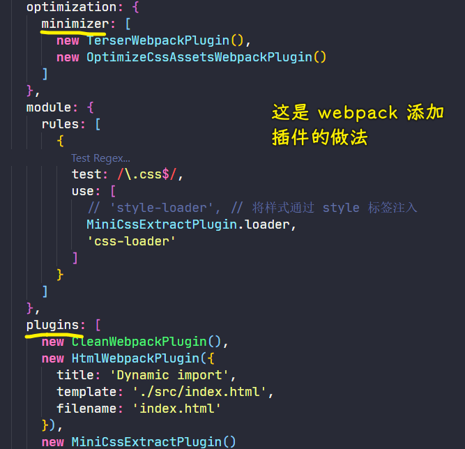
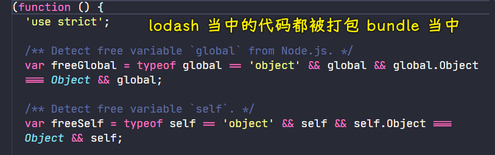
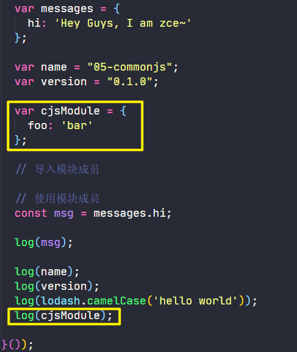
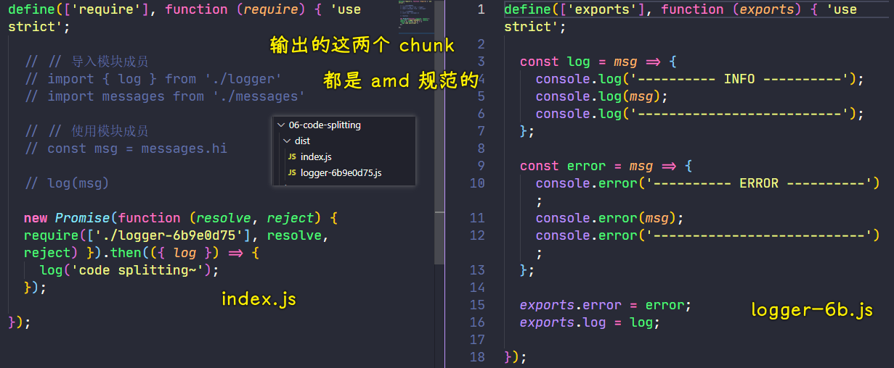
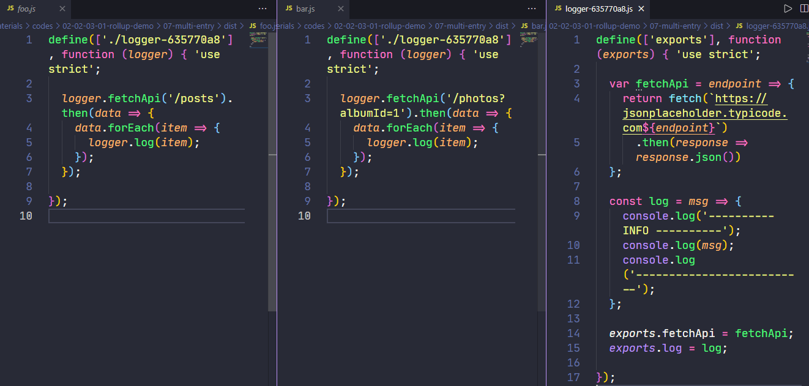
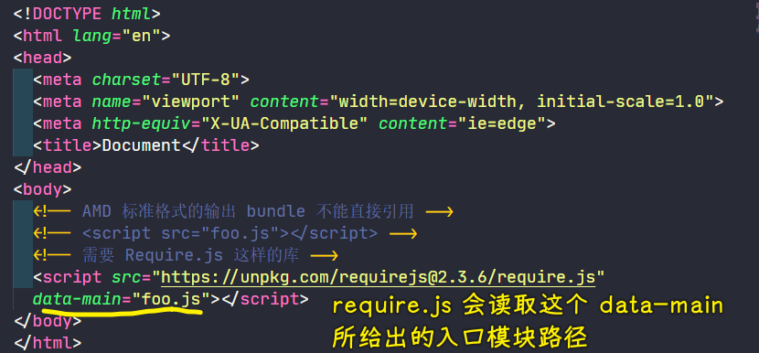
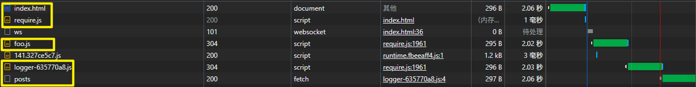

### ✍️ Tangxt ⏳ 2021-11-17 🏷️ Rollup

# 11-Rollup

1）概述

rollup 同样也是一款 ES Modules 打包器，它也可以将项目当中一些散落的细小模块打包成整块的代码，从而使得划分的模块可以更好的运行在浏览器环境或者是 Node.js 环境。

从作用上来看，rollup 与 webpack 作用非常类似，不过相比于 webpack， rollup 更为小巧。

因为 webpack 在去配合一些插件的使用下，几乎可以完成我们开发过程中前端工程化的绝大多数工作，而 rollup 它仅仅可以说是一款 ESM 打包器，并没有任何其他额外功能，例如 webpack 中有对我们开发者十分友好的 HMR（模块热替换）功能，而 rollup 中并不支持类似 HMR 这种高级特性。

rollup 诞生的目的并不是要与 webpack 之类的一些工具去全面竞争，它的初衷只是希望能够提供一个高效的 ESM 打包器，然后充分利用 ESM 各项特性，以此来构建出结构比较扁平，然后性能比较出众的类库，至于它其他的一些特点和优势，我们需要上手过后才能了解


2) rollup 使用

在以下这个示例里边，我们使用 ESM 的方式组织的代码模块化

`./src/message.js`

```js
export default {
  hi: 'Hey Guys, I am jal '
}
```

`./src/logger.js`

```js
export const log = msg => {
  console.log('---Info----')
  console.log(msg)
  console.log('-----------')
}

export const error = msg => {
  console.error('---Error-----')
  console.error(mes)
  console.error('-------------')
}
```

`./src/index.js`

```js
// 导入模块成员
import { log } from './logger'
import messages from './messages'

// 使用模块成员
const msg = messages.hi

log(msg)
```

如何对上述示例打包？

安装 rollup：`yarn add rollup --dev`

安装成功后 -> `node_modules/.bin`目录下就有了一个 rollup cli 程序 -> 通过这个 cli 去使用打包

运行：`yarn rollup ./src/index.js --format iife --file dist/bundle.js`

> 不传递任何参数，也就是`yarn rollup` -> 自动打印它的帮助信息 -> 从帮助信息的开头中就可以看出 rollup 的正确用法：`rollup [options] <entry file>`（`[]`是可选的，`<>`必填项）
> 
> `--format`是指定代码格式 -> 你希望把 ESM 的代码转化过后然后以什么样的格式去输出 -> 选择最适合浏览器端的`iife`格式
> 
> `--file` -> 指定输出文件的路径，把打包结果输出到文件当中，不然，打包结果就在终端显示了，类似`cat`一样

`./dist/bundle.js`

```js
(function () {
  'use strict';

  const log = msg => {
    console.log('---Info----');
    console.log(msg);
    console.log('-----------');
  };

  var messages = {
    hi: 'Hey Guys, I am jal '
  };

  const msg = messages.hi;

  log(msg);

}());
```

> 可以看到 rollup 的打包结果 -> 惊人的简洁 -> 基本跟我们以前手写的代码是一样的 -> 相比于 webpack 当中大量的引导代码以及一堆的模块函数 -> rollup 输出的这个 `bundle.js` 几乎没有任何的多余代码 -> rollup 它就是把我们打包过程当中各个模块按照模块的依赖顺序先后的拼接到一起 -> 你仔细观察这个打包结果，你会发现这个输出结果里边只会保留那些用到的部分，对于未引用的部分都没有输出

这是因为 rollup 默认会开启 TreeShaking 去优化我们的输出结果 -> TreeShaking 这个概念最早也就是在 rollup 这样一个当中提出的

3）配置文件

rollup 同样支持我们以配置文件的方式去配置我们打包过程中的各项参数

在项目根目录下新建一个配置文件：`rollup.config.js` -> 这个文件同样运行在 Node 环境当中，不过 rollup 它自身会额外处理这个配置文件，所以我们可以直接使用 ESM

在这里配置文件当中，需要导出一个配置对象

```js
export default {
  input: './src/index.js',
  output: {
    file: 'dist/bundle.js',
    format: 'iife'
  }
}
```

> 通过`input`属性指定打包的入口文件路径 -> 通过`output`属性指定输出的相关配置 -> `output`属性要求是一个对象，在该对象里边可以用`file`属性指定我们输出的文件名，而`format`属性可以指定输出格式

运行：`yarn rollup --config` , 指定配置文件：`yarn rollup --config rollup.config.js`

> 注意：需要指定`--config`参数，以此来表面我们要使用项目的配置文件 -> rollup 默认是不会去读取配置文件的，必须要使用`--config`这样一个参数 -> 当然，我们也可以通过这个参数去指定不同配置文件的名称，例如用于生产环境的`rollup.production.js`、用于开发环境的`rollup.development.js`

4) 使用插件

rollup 自身的功能就只是对 ESM 进行合并打包，如果我们项目需要更高级的功能，如加载其他类型的资源模块文件或者是我们要在代码当中导入 CommonJS 模块，又或者想要它去帮我们编译 ES 新特性

对于这些额外的需求，rollup 同样支持使用插件的方式去扩展实现，而且插件是 rollup 唯一的扩展方式 -> rollup 它不像 webpack 中划分了 loader、plugins 和 minimizer 这三种扩展方式



使用一个让我们可以在代码当中导入 json 文件的插件 -> 通过这样一个过程去了解如何在 rollup 当中使用插件

我们使用的插件名字叫做「`rollup-plugin-json`」

安装插件`rollup-plugin-json`, 运行：`yarn add rollup-plugin-json --dev`

`package.json`

``` json
{
  "name": "03-plugins",
  "version": "0.1.0",
  "main": "index.js",
  "author": "zce <w@zce.me> (https://zce.me)",
  "license": "MIT",
  "devDependencies": {
    "rollup": "^1.26.3",
    "rollup-plugin-json": "^4.0.0"
  }
}
```

`rollup.config.js`

```js
// 该 rollup 配置文件可以直接使用 ESM，所以我们可以直接用 import 语法去导入这个插件模块
// 该插件模块默认导出的是一个函数
import json from 'rollup-plugin-json'

export default {
  input: './src/index.js',
  output: {
    file: 'dist/bundle.js',
    format: 'iife'
  },
  plugins: [
    // 将函数的调用结果添加到 plugins 这个数组中
    json()
  ]
}
```

> 注意：这是把函数的调用结果放到`plugins`数组中，可不是将这个`json`函数放进去

`./src/index.js`

```js
// 导入模块成员
import { log } from './logger'
import messages from './messages'
// package.json 文件当中的每个属性就会作为单独的导出成员 -> 这是 json 插件帮我们做的
import { name, version } from '../package.json'

// 使用模块成员
const msg = messages.hi

log(msg)

log(name)
log(version)
```

`./dist/bundle.js`

```js
(function () {
  'use strict';

  const log = msg => {
    console.log('---------- INFO ----------');
    console.log(msg);
    console.log('--------------------------');
  };

  var messages = {
    hi: 'Hey Guys, I am zce~'
  };

  var name = "03-plugins";
  var version = "0.1.0";

  // 导入模块成员

  // 使用模块成员
  const msg = messages.hi;

  log(msg);

  log(name);
  log(version);

}());
```

可以看到 json 当中被用到的`name`和`version`属性被正常打包进来了，而 json 当中那些没有被用到的属性也会被 TreeShaking 移除掉。

以上就是我们在 rollup 当中如何去使用插件！

5) 加载 npm 模块

rollup 默认只能够按照文件路径的方式去加载本地的文件模块，对于`node_modules`当中的那些第三方模块，rollup 它并不能够像 webpack 一样直接通过模块名称导入对应的模块

为了抹平这样一个差异，rollup 官方提供了一个插件`rollup-plugin-node-resolve`

通过使用这个插件，我们就可以在代码中直接去使用模块名称导入对应的模块。

安装插件：`yarn add rollup-plugin-node-resolve --dev`

`rollup.config.js`

```js
import json from 'rollup-plugin-json'
// 导入插件，将这个插件函数的调用结果配置到 plugins 数组当中
import resolve from 'rollup-plugin-node-resolve'
export default {
  input: 'src/index.js',
  output: {
    file: 'dist/bundle.js',
    format: 'iife'
  },
  plugins: [
    json(),
    resolve()
  ]
}
```

`./src/index.js`

```js
// 导入模块成员
import _ from 'lodash-es'
import { log } from './logger'
import messages from './messages'
import { name, version } from '../package.json'

// 使用模块成员
const msg = messages.hi

log(msg)

log(name)
log(version)
log(_.camelCase('hello world'))
```

> 此时，在 `index.js`里边我们就可以直接导入`node_modules`当中的那些第三方 npm 模块 -> 在这里导入的是 lodash 的 `es` 版本 -> 为啥用这个版本？ -> rollup 默认只能够去处理 ESM 模块，如果你想要使用普通版本，那你需要做一些额外处理



> 说实在的，我只用了一个 lodash 所提供的API -> `bundle`里边太多代码了

6) 加载 CommonJS 模块

正如我们上边所看到的一样，rollup 它设计的就是只处理 ESM 模块的打包，如果我们在代码当中导入 CommonJS 模块，那这默认是不被支持的，然而，目前还是会有大量的 npm 模块使用 CommonJS 方式去导出成员，所以为了兼容这些模块，官方又给出了一个插件——`rollup-plugin-commonjs`

安装插件：`yarn add rollup-plugin-commonjs --dev`

`rollup.config.js`

```js
import json from 'rollup-plugin-json'
import resolve from 'rollup-plugin-node-resolve'
import commonjs from 'rollup-plugin-commonjs'
export default {
  input: './src/index.js',
  output: {
    file: 'dist/bundle.js',
    format: 'iife'
  },
  plugins: [
    json(),
    resolve(),
    commonjs()
  ]
}
```

`cjs-module.js`

``` js
module.exports = {
  foo: 'bar'
}
```

`./src/index.js`

```js
// 导入模块成员
import _ from 'lodash-es'
import { log } from './logger'
import messages from './messages'
import { name, version } from '../package.json'
// 该 CommonJS 模块默认导出一个对象
import cjs from './cjs-module'

// 使用模块成员
const msg = messages.hi

log(msg)

log(name)
log(version)
log(_.camelCase('hello world'))
log(cjs)
```

`./dist/bundle.js`



可以看到，我们在`index.js`里边导入的这个`cjs-module`的默认导出就以一个对象的形式出现在我们的打包结果当中

7) 代码拆分 : 动态导入

> Code Splitting

在 rollup 的最新版本中已经开始支持代码拆分了，我们同样可以使用符合 ESM 标准的动态导入的方式去实现模块的按需加载，rollup 内部也会自动去处理代码的拆分，也就是我们所说的「分包」

`rollup.config.js`

```js
import json from 'rollup-plugin-json'
import resolve from 'rollup-plugin-node-resolve'
import commonjs from 'rollup-plugin-commonjs'
export default {
  input: './src/index.js',
  output: {
    // file: 'dist/bundle.js',
    // format: 'iife',
    dir: 'dist', // 动态导入时会分包成多文件
    format: 'amd' // 动态导入不支持 iife
  },
  plugins: [
    json(),
    resolve(),
    commonjs()
  ]
}
```

> 使用代码拆分（code-splitting）这种方式去打包 -> 要求输出格式不能是 IIFE 这种形式 -> 为啥不能？ -> 这个原因很简单，因为自执行函数它会把所有的模块都放到同一个函数当中，它并没有像 webpack 一样有一些引导代码，所以说它没有办法实现代码拆分 -> 你要想使用代码拆分，那你就必须要使用 amd 或者是 CommonJS 这样的一些其他的标准 -> 在浏览器当中只能使用 amd 标准，所以我们把`format`设置为`amd`，也就是以 amd 格式去输出打包结果
> 
> 只修改`format`是不行的，你还得把`file`改为`dir` -> 为啥要改？ -> 因为代码拆分意味着会输出多个 chunk，既然输出多个文件，那我们就不能再使用`file`这种配置方式了，因为`file`是指定单个文件输出的文件的文件名 -> 如果需要输出多个文件，我们可以使用`dir`参数（配置文件里边的`file`、`dir`其实就是我们在命令中添加的参数）

`./src/index.js`

```js
// 注释掉以下使用静态导入的代码
// // 导入模块成员
// import { log } from './logger'
// import messages from './messages'

// // 使用模块成员
// const msg = messages.hi

// log(msg)

// 用动态导入的方式只导入 logger 这个模块
// 这个 import 方法同样返回的是一个 promise 对象
// 通过该 promise 对象的 then 方法，我们可以拿到一个模块导入过后的对象 -> 模块导出的成员都被放到这个对象当中 -> 可以使用解构的方式提取该对象里边的 log 方法
import('./logger').then(({ log }) => {
  // 使用 log 方法打印一个日志消息
  log('code splitting~')
})
```

打包结果：



可以看到`dist`目录下，有两个文件，rollup 是根据动态导入，以此来生成一个入口 bundle，以及动态导入所对应的那个 bundle -> 它们都是采用 amd 标准去输出的

以上就是在 rollup 当中如何去实现代码拆分 -> 使用动态导入去实现的

8) 多入口打包

rollup 同样支持多入口打包，而且对于不同入口当中的那些公共部分也会自动提取到单个文件当中作为独立的 bundle -> 具体来看一下如何配置

在这个示例里边，有两个入口，分别是：

- `index.js`
- `album.js`

它们俩公用的模块是：

- `fetch.js`
- `logger.js`

配置多入口打包的方式非常简单，只需要把`input`属性修改为一个数组就可以了，当然，你也可以使用与 webpack 当中那种对象配置形式去配置

不过，需要注意的是，多入口打包内部会自动提取公共模块，也就是说内部使用代码拆分，所以我们不能使用`iife`这种输出格式 -> 用`amd`格式

`rollup.config.js`

``` js
export default {
  // input: ['src/index.js', 'src/album.js'], // 多入口打包
  // 多入口打包的另一种写法
  input: {
    foo: 'src/index.js',
    bar: 'src/album.js'
  },
  output: {
    dir: 'dist',
    format: 'amd'
  }
}
```

运行`rollup`打包命令

此时`dist`目录多出三个 JS 文件，分别是不同打包入口的打包结果，以及我们公共提取出来的一个公共模块



注意，对于 amd 这种输出格式的 js 文件，我们不能直接引用到页面上 -> 必须通过实现 amd 标准的库去加载（之前在介绍 amd 标准的时候就应该有所了解了）

在`dist`目录下手动创建一个`html`文件 -> 在该文件里边使用打包生成的 bundle -> 采用 `require.js`这个库去加载以 amd 输出的 bundle -> 这个`require.js`我用的是 CDN 地址 -> 我们把它引入到页面当中，通过`data-main`这个参数可以指定`require.js`要加载的这个入口模块的模块路径



资源请求情况：



9）rollup、webpack 选用原则

通过以上的这些探索和尝试，我们发现 rollup 确实有它的优势，当然，它的缺点也挺凸显的

💡：rollup 优势

+ 输出的结果会更加扁平一些，那执行效率自然会更高
+ 自动移除未引用的代码 -> TreeShrinking
+ 打包结果依然完全可读 -> rollup 的打包结果基本上跟我们手写的代码是一致的，也就是说，这打包结果对于开发者而言还是可以正常的阅读的

💡：rollup 缺点

+ 加载非 ESM 的第三方模块比较复杂 -> 需要配置插件
+ 模块最终都会被打包到一个函数中，无法实现 HMR -> 无法像 webpack 那样去实现模块热替换（HMR）这种开发体验
+ 浏览器环境中，代码拆分功能依赖 AMD 库 -> 如 `require.js` -> 对于代码拆分必须要使用像 amd 这样的输出格式

---

综合以上的这些特点，我们发现：

如果我们正在开发应用程序，那我们肯定会面临要去大量引入第三方模块这样的需求，同时我们又需要像 HMR 这样的功能去提升我们的开发体验，而且我们的应用一旦大了过后，还涉及到必须要去分包 -> 对于这些需求，rollup 它在满足上都会有些欠缺

如果我们正在开发一个 JavaScript 框架或者是一个类库，rollup 的这些优点就特别有必要了，而这些缺点几乎也都可以忽略。

我们就拿加载第三方模块来说，在我们开发类库的时候，在我们的代码里边，很少会去依赖第三方模块，所以说很多像 React、Vue 之类的一些框架中，它们都是使用 rollup 作为模块打包器，而并非是 webpack


但是，到目前为止的开源社区中，**大多数人还是希望这两个工具可以共同存在，共同发展，并且能够相互支持和借鉴** -> 为啥会有这样的希望？

这个原因也很简单，就是希望能够**让更专业的工具去做更专业的事情**

总结一下就是：webpack 大而全，而 rollup 是小而美

在对二者的选择上，我们基本的原则就是：

- 如果我们正在开发应用程序，建议大家使用 webpack
- 如果你正在开发类库 / 框架的话，建议选择 rollup

当然，这并不是一个绝对的标准 -> 只是一个经验法则罢了，毕竟 rollup 它同样也可以去构建绝大多数的应用程序，而 webpack 同样也可以去构建类库或者是框架，只不过，它们相对来讲的话，就是「术业有专攻」的感觉

另外，随着 webpack 近几年的发展，rollup 中的很多优势几乎已经被抹平了，例如 rollup 当中的这种扁平化输出，我们在 webpack 当中就可以使用 `concatenateModules` 这样一个插件去完成 -> `concatenateModules`也可以实现类似的这样一个输出

10）了解更多

➹：[rollup 打包工具-致前端-隐冬](https://zhiqianduan.com/engineering/rollup%E6%89%93%E5%8C%85%E5%B7%A5%E5%85%B7.html)