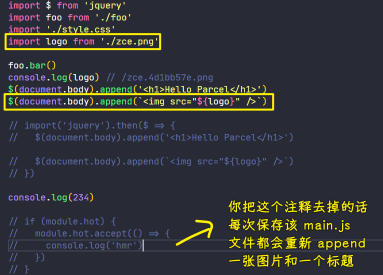

### ✍️ Tangxt ⏳ 2021-11-18 🏷️ Parcel

# 12-Parcel

Parcel 是一款完全零配置的前端应用打包器，它提供了近乎傻瓜式的使用体验，我们只需要了解它所提供的几个简单的命令就可以直接使用它去构建我们的前端应用程序了

👇：看看具体如何去使用 Parcel

### <mark>1）基本使用</mark>

1. 创建一个空项目
2. `yarn init -y`
3. `yarn add parcel-bundler --dev` -> parcel 的 npm 模块叫`parcel-bundler`
4. 查看`node_modules/.bin`目录，可以看到有一个叫`parcel`的 cli 程序 -> 后续我们可以使用这个 cli 去执行对我们整个应用的打包 -> 既然要打包我们的应用代码，那就得先有代码
5. 在项目根目录下创建一个`src`目录 -> 用来存放我们开发阶段所编写的源代码
6. 在`src`目录下创建一个`index.html` -> parcel 打包的入口文件 -> 虽然 parcel 和 webpack 一样都支持以任意类型的文件作为打包入口，不过 parcel 的官方建议我们使用 `html` 文件作为打包入口，官方所给出的理由是 -> 因为 `html` 它是应用运行在浏览器端时的入口，所以我们应该使用 `html` 文件作为打包入口
7. 往`index.html`里边写代码
   1. 在这个入口文件当中，我们可以正常像平时一样去编写，也可以在该文件里边引用一些资源文件 -> 在这里被引用的资源最终都会被 parcel 打包到一起，最终输出到输出目录
   2. 先引入`main.js`的脚本文件
8. 新建一个对应的`/src/main.js`文件、除此之外再新建一个`/src/foo.js`文件 -> `main.js`依赖`foo.js`

`index.html`

``` html
<!DOCTYPE html>
<html lang="en">
<head>
  <meta charset="UTF-8">
  <meta name="viewport" content="width=device-width, initial-scale=1.0">
  <meta http-equiv="X-UA-Compatible" content="ie=edge">
  <title>Parcel Tutorials</title>
</head>
<body>
  <script src="main.js"></script>
</body>
</html>
```

`foo.js`

``` js
// 用 ESM 方式默认导出一个对象
export default {
  bar: () => {
    console.log('hello parcel~')
  }
}
```

`main.js`

``` js
import foo from './foo'

foo.bar()
```

parcel 同样支持对 ES Modules 模块的打包 -> 打包命令，也就是`parcel`需要传入打包入口文件的路径。

``` bash
yarn parcel src/index.html
```


此时，我们执行这个打包目录，parcel 就会根据我们这里所传入的参数，先去找到 `index.html` 文件，然后根据 `index.html` 当中的 `script` 标签去找到它所引入的 `main.js` 文件，最后再顺着 `import` 语句找到所对应的 `foo` 模块，从而去完成整体项目的打包。

我们可以发现，parcel 这个命令它不仅仅帮我们打包应用，而且它同时还开启了一个开发服务器 -> 这个开发服务器就跟 webpack 当中的 `dev-server` 一样 -> 打开这个地址 -> 打开浏览器 -> 在浏览器当中打开开发人员工具（控制台 F12)，此时我们就可以使用自动刷新这样的功能了。

修改源代码`foo.js`中的内容 -> 保存 -> 浏览器会自动刷新，从而去执行最新的打包结果

### <mark>2）模块热替换</mark>

如果我们需要模块热替换的体验，那 parcel 当中同样也是支持的

在 `main.js` 中需要使用 `hmr` 所提供的 api。

先判断 `module.hot` 对象是否存在，如果存在这个对象就证明当前这个环境可以使用 `hmr` 的 api -> 使用 `module.hot.accept` 方法去处理模块热替换的逻辑

不过这里的 `accept` 跟 webpack 所提供的 api 有一点不太一样，webpack 中的 api 支持接收两个参数 -> 用来去处理我们指定模块更新过后的逻辑。而 parcel 所提供的 `accept` 只接收一个参数，也就是这个回调函数 -> 其作用就是当我们当前这个模块`main.js`更新或者是当前这个模块所依赖的模块`foo.js`更新过后它会自动执行。


可以看到，我们修改的源代码会自动被热替换到浏览器当中，然后自动执行

### <mark>3）自动安装依赖</mark>

除了热替换， parcel 还支持一个非常友好的功能，就是自动安装依赖。

那试想一下，你正在开发一个应用的过程中，突然间想要去使用某个第三方的模块 -> 此时你就需要去先停止正在运行的那个 `dev-server`，然后去安装这个模块 -> 安装完成过后再去重新启动 `dev-server`

有了自动安装依赖这样一个功能过后，就不用再这样麻烦了。

回到`main.js`当中，假设我们想使用 jQuery, 虽然我们之前并没有安装这个模块，但是因为有了自动安装依赖这样的功能的缘故。

我们这里只管正常导入就可以了 -> 导入完成过后，就使用一下 jQuery 所提供的 api -> 在文件保存过后，parcel 它会自动去安装我们刚刚所导入的这个模块 -> 这极大程度地避免了我们额外的一些手动操作。


### <mark>4）支持加载其他类型的资源模块</mark>

除此之外， parcel 它同样支持加载其他类型的资源模块，而且相比于其他的模块打包器，在 parcel 当中加载任意类型的资源模块同样还是零配置的。

例如添加一个`/src/style.css` 的样式文件。然后我们在这个文件当中去添加一些简单的样式


> 样式修改了，页面不会刷新，页面始终保留原有状态

导入样式后，然后保存，样式生效的这整个过程并没有安装额外的插件或者是 loader

我们还可以随意地去添加一个图片到我们的项目当中去

导入图片，通过 jQuery 把图片显示到页面当中



整个处理图片的过程中，我们开发者并没有做额外的事情，仅仅只是在使用罢了！

总之，parcel 它希望给开发者的体验就是：

> 你想要做什么你就只管去做，额外的事情就由工具去负责处理。

### <mark>5）支持使用动态导入</mark>

另外，parcel 它同样支持使用动态导入 -> 内部如果使用了动态导入，它也会自动拆分我们的代码。


> 把静态导入的 `jquery` 的注释掉 -> 使用动态导入的方式去导入 `jquery` 模块 -> 在这个`import`方法所返回的 Promise 对象的`then`方法当中，我们就可以拿到所导入的 `jquery` 对象 -> 把使用 jQuery 的代码移到这个`then`方法的成功 `callback` 里边 -> 保存 -> 刷新浏览器 -> 找到`network`面板 -> 在这面板当中可以看到刚刚所拆分出来的 jQuery 所对应的 `bundle` 的文件的请求

---

以上基本就是 Parcel 当中最常用的一些特性了。

在使用上，Parcel 几乎没有任何难度，从头到尾我们只是执行了一个 `parcel` 命令。所有的事情都是 Parcel 内部自动帮我们完成的。

### <mark>6）生产模式打包</mark>

我们再来看一下 parcel 如何以生产模式运行打包

我们需要去执行 `parcel` 这个 cli 所提供的一个 `build` 命令，然后跟上我们打包入口文件的路径就可以以生产模式运行打包了。


额外补充一点，对于相同体量的项目打包， Parcel 的构建速度会比 Webpack 快很多。因为在 Parcel 的内部它使用的是多进程同时去工作，充分发挥了多核 CPU 的性能，Webpack 中也可以使用一个叫做 `happypack` 插件来实现这一点。


> 打包输出的这些文件，也就是`dist`目录下的这些文件都会被压缩，而且样式代码也被单独提取到单个文件当中了

### <mark>7）总结</mark>

以上就是一个对 Parcel 的一个体验 -> 整体体验下来就是一个感觉——**舒服**

因为它在使用上真得是太简单了，试想一下我们之前用的 webpack，我们都需要做很多额外的配置以及安装很多的插件，在 Parcel 当中其实也有这些插件，只不过它是**自动帮我们去安装**的，我们整个项目开发过程中是不需要关心这些东西的，所以它在使用上就给了我们一种非常舒服的感觉

Parcel 它是 2017 年发布的，出现的原因是因为当时 Webpack 在使用上过于繁琐，而且官网的文档也不是很清晰明了

所以说 Parcel 它一经推出就迅速被推上了风口浪尖，其核心特点就是真正意义上做到了**完全零配置**，对我们的项目没有任何的侵入

而且整个过程会有自动安装依赖这样一个体验，让我们的开发过程可以**更加专注于编码**

除此之外，还有一个就是 Parcel 它一开始提供的这种**构建速度就非常快**，因为它内部使用了**多进程同时工作**，所以相比于 Webpack 的打包它的速度要更快一些，当然，这个我们刚刚已经说了，Webpack 也可以借助插件去解决这样的问题

Parcel 的优点固然很明显，但是目前你实际上观察到的使用情况，你会发现**绝大多数的项目打包还是会选择使用 Webpack**，我个人认为这个原因可能有两点：

1. Webpack 的生态会更好一些，扩展也就会更丰富，而且出现问题我们也可以很容易去解决
2. 随着这两年的发展，Webpack 也越来越好用了，开发者随着不断地去使用对它也越来越熟悉

所以作为我个人选择而言，也会去选择 Webpack

Parcel 这样的工具对于开发者而言，去了解它其实也就是**为了保持对新鲜技术和工具的敏感度** -> 从而更好地把握技术的趋势和走向，仅此而已。
