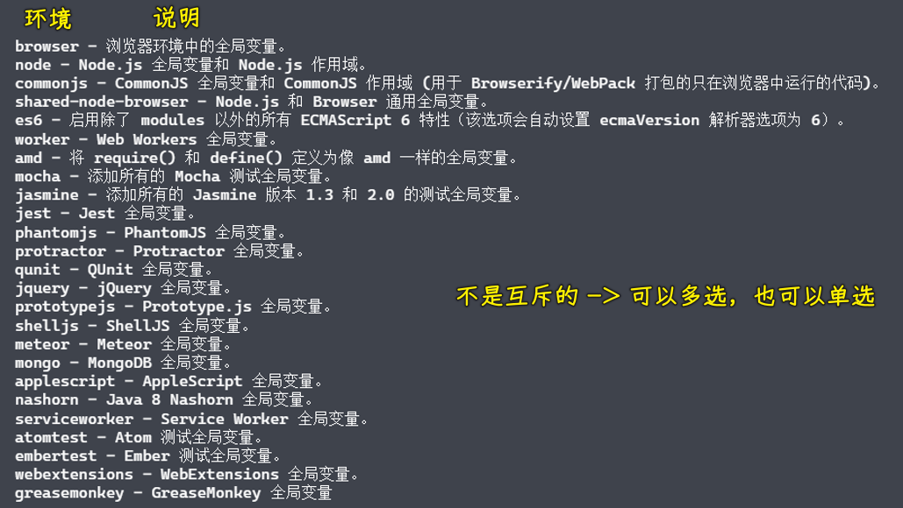

### ✍️ Tangxt ⏳ 2021-11-19 🏷️ 规范化

# 13-规范化介绍、ESLint、StyleLint、Prettier、Git Hooks

> 基于这篇文章「[lint 代码检查-致前端-隐冬](https://zhiqianduan.com/engineering/lint%E4%BB%A3%E7%A0%81%E6%A3%80%E6%9F%A5.html)」的修改

### <mark>1）规范化介绍</mark>


#### <mark>1、为什么要有规范化标准？</mark>

规范化是践行前端工程化过程中重要的组成部分，俗话说**没有规矩不成方圆**，做人做事都是一样，尤其是在开发行业中，更是需要有严谨的工作态度。大多数情况下软件开发都不是一个人的工作，需要多人协同的，而**不同的开发者有不同的编码习惯和喜好**。这些个人的喜好并没有什么不好的地方，只是说如果同一个项目中，每个人的喜好都不相同。那就会**导致项目的维护成本大大提高**。

所以就需要为每个项目或者说团队明确一个统一的标准，让这个项目或者团队成员按照统一的标准去完成工作，从而避免各种不统一带来的麻烦。

> 保证团队里边的成员所写出来的代码基本一样

简而言之：

* 软件开发需要多人协同
* 不同开发者具有不同的编码习惯和喜好
* 不同的喜好增加项目维护成本
* 每个项目或者团队需要明确统一的标准

#### <mark>2、哪里需要规范化标准？</mark>

因此在开发过程中所编写的代码，文档，甚至是提交的日志都需要去进行标准化的操作。总之凡是开发过程中人为编写而产生的一些内容，都应该去被规范化操作，其中代码的标准化规范最为重要。因为代码的规范很大程度上决定了项目的质量也决定了项目的可维护性。

为了便于后期维护和团队其他成员的阅读，一般都会对代码的编码风格做统一的要求，包括统一关键词和操作符左右的空格，统一代码的缩进方式，统一是否使用分号结尾，统一变量或者函数的命名规范等等。

简而言之：

* 代码、文档、甚至是提交日志
* 开发过程中人为编写的成果物
* 代码标准化规范最为重要

#### <mark>3、实施规范化的方法？</mark>

最初在落实规范化的操作时非常的简单，只需要提前约定好一个可以执行的标准，然后按照这个标准进行各自的开发工作。最终在`code review`的环节就会按照之前约定的标准检查相应的代码。但是**单靠人为约束的方式落实规范化会有很多的问题**。一来人为约束并不可靠，二来开发者也很难记住每个规则，所以就**需要有专门的工具加以保障**。

相比于人为检察，工具的检查更为严谨，更为可靠。同时还可以**配合自动化的工具**实现自动化检查，这样的规范化就更加容易得到质量上的保证。

一般把通过工具去找到项目中不合规范的过程称之为`Lint`，之所以称之为`Lint`是因为刚有`C`语言的时候，有一些常见的代码问题是不能被编译器捕获到的，所以有人就开发了一个叫做`Lint`的工具，用于**在编译之前检查出这些问题，避免编译之后带来一些不必要的问题**。

所以后续这种类似功能的工具都被称之为叫做`Lint`，或者说`linter`，例如现在前端最常见的`es-lint`，`style-lint`等等。

---

简而言之：

* 编码前人为的标准约定
* 通过工具实现 `Lint` 


### <mark>2）ESLint</mark>

#### <mark>1、介绍</mark>

`ESLint`是目前最为主流的`javascrit lint`工具，用于监测`JavaScript`代码质量。通过`ESLint`可以很容易的统一不同开发者的编码风格。例如缩进，换行，分号以及空格之类的使用。

`ESLint`还可以找出代码中一些不合理的地方，例如定义了一个从未使用的变量，或者说在一个变量使用之后才去进行声明，再或者在进行比较的时候往往总是选择`==`的符号等等。这些不合理的操作一般都是代码当中所存在的一些潜在问题，通过`ESLint`能够有效的避免这些问题，从而去提高代码的质量。

另一方面`ESLint`也可以帮助开发者提升编码能力，如果编写的代码每次在执行`lint`操作的时候都能够找出一堆的问题，而这些问题大都是以往编码时候的坏习惯。慢慢的就应该记住了这些问题，正常来说当下次遇到的时候自己就会主动避免，久而久之编码能力自然而然的就得到了一个提升。

#### <mark>2、安装</mark>

- 打开一个空项目，使用`npm init --yes`初始化项目的`package.json`文件用于管理项目的`npm`依赖
- 安装`eslint`模块：`npm install eslint --save-dev` -> 安装了该模块过后，`node_modules/.bin`目录下多了一个叫`eslint`的 `cli` 程序 -> 这是这个 `eslint` 模块所提供的 -> 后续可以通过这个`cli`程序检测代码当中的问题。
- `yarn`和`npx`可以直接执行`node_modules/.bin`目录中的命令 -> `npx eslint --version` or `yarn eslint --version`

#### <mark>3、快速上手</mark>

- 第一次运行时我们需要对`eslint`进行初始化：`npx eslint --init`
- 运行之后会打印一些交互性的问题
  - 第一个问题一般会给出三个选项：只检查语法错误、检查语法错误并且发现问题代码、检查错误语法，发现问题代码并且校验代码风格 -> 第三个最为全面
    - 语法错误很好理解，比如 `foo(` 这种函数调用？
    - 问题代码就是指代码中不合理的地方，例如定义了一个未被使用的变量，或者说调用了一个不存在的函数
    - 最初对 ESLint 的期望值就是希望它能去找出代码当中编码风格上存在的一些问题。例如代码中的缩进不统一等等
  - 第二个问题是项目代码中的模块化采用的是哪一种，这里同样也是三个选项：`ES Modules`、`CommonJS`、以及不用模块化 -> 决定你的代码当中是否允许出现指定的语法或者调用
  - 第三个问题是选择框架，`react`、`vue`、`node`等等。
  - 第四个问题是否使用了`typescript`，如果用到了就输入`y`，默认是`N`。
  - 第五个问题询问代码最终运行在哪个环境，默认给出的是浏览器，这里可以选择浏览器和`node`。会根据运行环境判断是否允许使用相应环境下的`API` -> 如 `window、document`这样的全局`API`在 `node` 环境中就没有
  - 第六个问题是询问如何定义代码风格，有三个选择，首先是使用市面上的主流风格，第二是通过一些问题形成一个风格，第三个是根据代码文件推断出风格。**一般情况下都是采用市面上的主流代码风格**。这样的话如果项目有新的成员加入也可以更好更快的适应风格。
  - 最后一个问题询问配置文件需要以什么样的格式存放 -> 一般选择独立存放到单个文件中
- 运行结束之后会提醒需要安装几个插件，这是因为刚刚选择的风格需要依赖一些插件。安装过后项目的根目录下面就会多出一个`eslint`的配置文件`.eslintrc.js`。
- 准备一个测试文件，如 `main.js`，用来检测 `eslint` 是否起作用了 -> 运行校验命令：`npx eslint ./main.js` -> 通过 `eslint` 这个工具来查找出这个文件所存在的一些问题


> 先把一个大线头给剪掉，之后再次剪掉小的

代码风格的修改很繁琐？

通过`--fix`参数，来自动修正绝大多数代码风格上的问题：`npx eslint ./main.js --fix`

顺便说一句，如果还没有养成良好的编码习惯建议在开始的使用时还是手动的去修改每一个不好的地方，因为这样就可以加深印象了。

作为一个优秀的开发人员写出来的代码，这代码本身就应该是格式良好的，而不是后来去依赖这些工具，然后进行格式化。**这些工具只是在最后用于确保代码的质量**。

``` js
const foo = 123;

function fn () {
    console.log("hello");

    console.log("eslint);
}

fn()

syy()
```

最后你在终端里边还会看到还有两个没有被自动`fix`的问题，所以我们需要回到代码当中自己手动的进行处理 -> 这里的`foo`变量是无意义的，还有`syy`函数是没有定义的，删除这两个内容。 -> 别等到代码运行时报错了！

再次运行`eslint`检查，代码本身的问题就全部解决了。

#### <mark>4、配置文件解析</mark>

通过`eslint --int`在项目根目录下创建了一个叫做`.eslintrc.js`的配置文件。在这个文件中写入的配置就会影响到当前这个目录以及所有子目录的文件，正常情况下是不会手动去修改这个配置，但是如果需要去开启或者说关闭某些校验规则的时候那这个配置文件就会非常重要。

``` js
module.exports = {
  env: {
    // 运行的环境，决定了有哪些默认全局变量
    browser: true,
    es2020: true
  },
  // eslint 继承的共享配置 -> 是个数组 -> 可以继承多个
  extends: [
    'standard'
  ],
  // 设置语法解析器，控制是否允许使用某个版本的语法 -> 这是检测语法，就说是你不要用这个语法了，它不能检测某个成员是否可用，检测成员能不能用还是看 env，毕竟 env 标明这个代码最终是往哪个环境下运行的
  parserOptions: {
    ecmaVersion: 11
  },
  // 控制某个校验规则的开启和关闭
  rules: {
    'no-alert': 'error' // 代码里边用了 alert 就会报 error 错误
  },
  // 添加自定义的全局变量
  globals: {
    "$": 'readonly', 
  }
}
```

补充对配置对象中的配置选项的解释：

- `env`：`JavaScript`在不同的运行环境中有不同的`API`可以被调用，这些`API`很多时候都是以全局的成员方式提供，例如在浏览器环境可以直接去使用`window`和`document`对象。`env`的选项作用就是标记代码最终的运行环境，`eslint`会根据环境信息来判断某一个全局成员是否是可用的，从而去避免代码当中去使用到那些不存在的成员。`browser`为`true`就表示代码会运行在浏览器环境中
- `extends`：生成`eslint`配置的时候如果选择的是`standard`风格，最终这里的配置也会继承`standard`配置 -> 在`standard`风格中做一些具体的配置，比如`document`和`window`在任何的环境中都可以使用 -> 如果需要在多个项目当中共享一个`eslint`配置，可以定义一个公共的配置文件然后在这里继承就可以了。这个属性值是一个数组，数组中的每一项都是一个配置。
- `parserOptions`的作用是设置语法解析器的，`ECMAScript`近几年发布了很多版本，这个配置的作用就是是否允许使用某一个`ES`版本的语法。这里设置的是`11`也就是`ECMAScript2020` -> 如果将`ecmaVersion`设置为`5`，这个时候就没办法使用`ES6`的新特性了，在`ecmaVersion`低于`6`的情况下继承的配置文件`eslintrc.json`里边，其`sourceType`不能是`module`，因为`ES Modules`是`ES6`的新特性，然后你代码里边 ES6 特性会报语法解析错误 -> 自定义配置就是覆盖继承过来的配置
- `rules`属性是配置`ESLint`中每个规则的开启或者是关闭，例如这里可以尝试开启`no-alert`规则。具体的开启方法就是在 rules 里面添加一个属性，属性名是内置的规则名称，属性值可以有三种，分别是`off`，`warning`和`error`。如果是`off`代表规则关闭，如果是`warning`就是发出警告，如果是`error`就表示当前报出错误 -> 在`eslint`的官网上就给出了所有内置的可用的校验规则列表，可以在使用的时候进行查看。`standard`风格中已经开启了很多规则。基本上也满足了所有的需求，如果有需要的情况下可以根据自己的需求来进行具体的配置。
- `globals`，额外声明，用来告诉 `eslint` 这个代码中可以使用到的全局成员。例如在使用了`JQuery`的项目当中，一般都会使用全局的`JQuery`对象，那么就可以直接去添加一个`JQuery`，将它的值设置为`readonly`，这样代码当中就能直接去使用`JQuery`，而且也不会报错。

`env`具体可以设置以下环境：



> 这些环境并不是互斥的，可以同时开启多个不同的环境。

#### <mark>5、配置注释</mark>

配置注释就可以理解为将配置直接通过注释的方式写在脚本文件中，然后再去执行代码的校验。比如在实际的开发过程中如果使用`ESLint`难免遇到一两处需要违反配置规则的地方，这种情况肯定不能因为这一两个点就去推翻校验规则的配置，在这个时候就可以去使用校验规则的配置注释去解决这个问题。

比如定义一个普通的字符串，在字符串中使用`${}`占位符，但是`standard`风格不允许这样使用。要解决这样的问题可以通过注释的方式，临时禁用一下规则，注释的语法有很多种，具体可以参考 ESLint 官方给出的 [文档](http://eslint.cn/docs/user-guide/configuring#configuring-rules)，这里直接使用`eslint-disable-line`，这样`eslint`在工作的时候就会选择忽略这一行代码。

``` js
const str = '${name} is a coder'; // eslint-disable-line
console.log(str);
```

这样使用虽然可以解决问题，但同样也会带来新的问题，一行当中如果有多个问题存在的时候，那这样操作的话，那其它的问题就都不会被检测到。

因此更好的做法应该是在`eslint-disable-line`后面跟上一个具体要禁用的规则名称。比如这里的是`no-template-curly-in-string`。这样就会只忽略指定的问题规则，其他的问题仍旧可以被发现。

``` js
const str = '${name} is a coder'; // eslint-disable-line no-template-curly-in-string
console.log(str);
```

当然注释的方式不仅可以禁用某个规则，还能声明全局变量，修改某个规则的配置，临时开启某个环境等等，这些功能可以通过这个 [链接](http://eslint.cn/docs/user-guide/configuring#configuring-rules) 找到对应的文档查询对应的使用

#### <mark>6、结合自动化工具</mark>

`ESLint`本身是一个独立的工具，但是如果现在是一个有自动化构建的工作流的项目当中，还是建议集成到自动化构建的工作流当中。

1. 准备一个测试项目：<https://github.com/zce/zce-gulp-demo.git>
2. 安装该项目的相关依赖
3. 作为开发依赖安装`eslint`和`gulp-eslint`模块
4. 创建配置文件：`eslint --init`
5. 在 `guipfile.js` 文件里边的处理 `js` 的任务中做修改

``` js
const script = () => {
  return src('src/main.js', {base: 'src'})
  .pipe(plugins.babel({presets: ['@babel/preset-env']}))
  .pipe(dest('temp'))
  .pipe(bs.reload({stream: true}))
}
```

`gulp`属于一种管道的工作机制，想把`eslint`集成到这个工作当中，应该在`babel`处理之前先进行`eslint`操作，否则经过`babel`之后代码就不是真正的源代码了。

使用`plugins.eslint`找到这个`eslint`插件 -> 具体做法就是在`src()`的后边跟上`.pipe(plugins.eslint())`，这样一来就会先执行`eslint`，然后再去执行`babel`编译。

默认情况下`eslint`只会去检查代码中存在的问题，并不会根据检查的结果做出任何的反馈，正确的做法是在`eslint`插件处理完之后，先去使用`eslint`的`format`方法，该方法会在控制台中打印出具体的错误信息，之后再去使用`eslint`中的`failAfterError`方法，该方法可以让`eslint`检查出错误后终止任务管道。

``` js
const script = () => {
  return src('src/main.js', {base: 'src'})
  .pipe(plugins.eslint())
  .pipe(plugins.eslint.format())
  .pipe(plugins.eslint.failAfterError())
  .pipe(plugins.babel({presets: ['@babel/preset-env']}))
  .pipe(dest('temp'))
  .pipe(bs.reload({stream: true}))
}
```

#### <mark>7、结合 Webpack</mark>

`webpack`集成`ESLint`并不是以插件的方式来完成的，而是通过`loader`机制，`webpack`在打包模块之前会将遇到的模块都交给对应的`loader`进行处理。所以`eslint`就可以通过一个`loader`的形式集成到`webpack`当中，这样就可以实现在打包`js`之前，先通过`eslint`来校验`js`代码。

1. 安装`eslint`和`eslint-loader`模块：`npm install eslint eslint-loader -D`
2. 初始化`.eslintrc.js`配置文件
3. 修改`webpack`的配置文件 -> 添加`eslint`loader

找到`webpack`的配置文件，把`js`使用的`loader`配置为一个数组，然后将`eslint-loader`放置在最后，`loader`执行的顺序是从后向前执行的，也就是后配置的先执行。也可以使用另一种配置方法，单独的为`js`文件再添加一个`loader`规则，然后在这个规则当中添加`enfore`属性，把它的值设置为`pre`，确保这个`loader`中配置的优先级是优于其他的`loader`，这样也可以实现通过`eslint`校验再去执行`babel`转换。

``` js
module.exports = {
  mode: 'production',
  entry: './src/main.js',
  module: {
    rules: [
      {
        test: /\.js$/,
        exclude: /node_modules/,
        use: 'eslint-loader',
        enfore: 'pre'
      },
      {
        test: /\.js$/,
        exclude: /node_modules/,
        use: 'babel-loader'
      },
      {
        test: /\.css$/,
        use: ['style-loader', 'css-loader']
      }
    ]
  }
}
```

配置之后使用`webpack`打包的就会报出`eslint`的`error`错误，这也就实现了将`eslint`集成到`webpack`当中。

#### <mark>8、校验 React</mark>

使用`webpack`打包的时候`eslint`会自动使用规则校验`JavaScript`代码，会检查出很多定义但没有使用到的问题，比如`React is define but never used`（`App`也是如此）, 但是`React`是`jsx`编译之后代码所必须要使用到的，所以像这种特殊的情况，`ESLint`就必须要靠一些额外的插件来进行实现。

社区当中已经为`React`准备了一个插件`eslint-plugin-react`，我们需要安装这样一个模块到我们本地的开发依赖当中。

``` bash
npm install eslint-plugin-react --save-dev
```

这个模块中定义了很多规则，这些规则都是专门针对于`react`项目的。如果你想要使用这些规则，那你就直接去`eslint`的配置文件当中通过`plugins`属性进行配置。

简单来说`plugins`它是一个数组，在它的内部可以直接指定使用哪些插件 -> 这里的插件模块叫做`eslint-plugin-react`，那我们在这个数组当中添加`react`就可以了 -> 去掉模块名的`eslint-plugin-`前缀。

这样完成之后，我们就可以进行使用了。

我们在`rules`中开启`react/jsx-uses-react`这个规则 -> 我们可以用`error`，也可以用数字的`2`代表`error` -> 这个规则的作用是避免`React`定义了但是却没有使用的报错。 -> `error`就是开启这个规则

``` js
module.exports = {
  env: {
    browser: true,
    es2020: true
  },
  extends: [
    'standard'
  ],
  parserOptions: {
    ecmaVersion: 11
  },
  rules: {
    'react/jsx-uses-react': 2, // 对 React
    'react/jsx-uses-vars': 2, // 对 App
  },
  plugins: [
    'react'
  ]
}
```

对于大多数`ESLint`插件来说，一般都会提供一个共享的配置来降低使用的成本，例如`eslint-plugin-react`里边就导出两个共享配置，分别是`recommend`和`all`，一般使用`recommend` -> 我们可以直接继承它里边所提供的共享配置。

在继承的时候要遵守语法规则，具体来说就是我们使用`plugin: 插件名称/配置名字`。

``` js
module.exports = {
  env: {
    browser: true,
    es2020: true
  },
  extends: [
    'standard',
    'plugin:react/recommend'
  ],
  parserOptions: {
    ecmaVersion: 11
  }
}
```

这样一来我们就不用手动去添加规则了

#### <mark>9、现代化项目集成 ESLint</mark>

随着 React、Vue 这种框架的逐渐普及 -> 这些框架的周边生态也都已经相当的完善了

就目前而言，如果我们开发一个基于 React 或 Vue 的项目，我们基本上都不用自己去配置 `webpack` 或者说 `esLint` 这些工程化工具 -> 毕竟在它们官方的脚手架 CLI 里边都已经集成进去了

举例来说：

💡：使用`vue-cli`创建一个 Vue 项目

``` bash
npm install @vue/cli -g
vue create xxx-vue-app
```

在这个过程中会提示需要选择很多选项，选择`babel`运行环境，代码风格选择`eslint` 和 `standard`，然后会询问在什么样的环节执行`lint`操作：

- `Lint on save`
- `Lint and fix on commit`

第一个是`save`环节，也就是`webpack`在构建时自动进行校验，并不是文件保存时，因为很多时候采用的是监视的模式，也就是文件刚刚被修改过后`webpack`就会自动执行编译，此时这里就称之为保存时的校验。

第二个是`commit`环节，这个环节指的就是利用`git`的钩子在进入`commit`之前自动的校验当前的代码，以此来确保提交到仓库中的代码是已经经过校验然后再提交的。

一般这以上两个环节都需要。

接着会询问想要怎样存放`babel`和`eslint`的配置文件，可以选择**独立文件的单独存放**，之所以有`In package.json`这个选项是因为大多数文件都支持`package.json`配置。

最后询问是否保存这些选择，下次可以直接使用 -> 最好不要选择。

在基本的项目结构中`eslint`被自动的集成进去了，通过这样的操作就不需要在工具的配置和使用上花费时间，也就是说开发者可以更加专注于业务功能的开发。

#### <mark>10、检查 TypeScript</mark>

以前`TypeScript`的`lint`操作使用`tslint`工具，后来由于`tslint`官网直接放弃维护，转而建议使用`eslint`配合`typescript`插件对`TypeScript`代码进行校验。

首先还是要初始化`eslint`（`npx eslint --init`），涉及到`TypeScript`选择的时候选择`y`，会自动安装两个默认插件（检测 TS 代码所必须的）。

安装过后就可以使用`eslint`检查`TypeScript`代码了。

测试代码：

``` ts
function foo (ms: string): void {
  console.log(ms);
}

foo('hello typescript~')
```

`.eslintrc.js`配置选项里的`parser`是指定一个语法解析器，`TypeScript`相比较于普通的`JavaScript`代码来说会有很多特殊的语法，所以需要指定一个语法解析器。之后就可以对`TypeScript`代码进行校验了。

``` js
module.exports = {
  env: {
    browser: true,
    es2020: true
  },
  extends: [
    'standard'
  ],
  parser: '@typescript-eslint/parser',
  parserOptions: {
    ecmaVersion: 11
  },
  plugins: [
    '@typescript-eslint'
  ],
  rules: {}
}
```

> [standard/standard: 🌟 JavaScript Style Guide, with linter & automatic code fixer](https://github.com/standard/standard)

### <mark>3）Stylelint 认识</mark>

前端项目中除了`JavaScript`代码需要被`lint`之外，`css`代码同样也需要被`lint`，对于`css`代码的`lint`操作一般会使用`stylelint`工具完成。`stylelint`的使用与`eslint`基本一致。


`stylelint`也提供了一系列代码检查的规则，供直接使用，和之前一样，也可以直接在配置文件中选择性的开启或关闭某些规则。`stylelint`同样也提供了一个`cli`工具，我们可以在终端中直接调用`stylelint`这命令检查`css`文件。

`stylelint`可以通过插件实现对于`sass`、`less`、`postcss`等`css`衍生语法的检查。`stylelint`同样可以与`gulp`自动化工具或`webpack`打包工具集成使用。

对于`stylelint`的使用可以完全参考`eslint`的操作方式，因为他们是极其类似的。

首先需要安装`stylelint`的模块，安装完成就可以使用`cli`命令了。

``` bash
npm install stylelint -D
```

安装之后需要配置文件`.stylelintrc.js`，这个配置文件当中的属性基本和`eslintrc`中是相同的。

安装`stylelint-config-standard`共享配置模块。

```bash
npm install stylelint-config-standard -D
```

安装之后进行继承使用，和`eslint`不太一样的是，这里的共享模块名称必须是一个完整模块的名称。

```js
module.exports = {
  extends: "stylelint-config-standard"
}
```

执行`stylelint`命令。

```bash
npx stylelint ./index.css
```

发现问题后可以直接定位修改，也可以通过`--fix`参数让`stylelint`完成大多数问题的自动修复。

如果要使用`stylelint`校验项目中的 sass 代码需要安装`stylelint-config-sass-guidelines`

```bash
npm install stylelint-config-sass-guidelines -D
```

安装之后配置`extends`属性就可以使用了。

```js
module.exports = {
  extends: ["stylelint-config-standard", "stylelint-config-sass-guidelines"]
}
```

至于`less`或`postcss`的操作都是类似的，把`stylelint`集成到`gulp`可以参考`eslint`。

### <mark>4）Prettier 的使用</mark>

`prettier`是近两年使用频率比较高的通用的前端代码格式化工具，几乎能完成所有前端代码文件的格式化工作，在日常的使用中可以通过它来完成代码的自动格式化工作，或者针对`markdown`文档进行格式化操作。通过使用`prettier`很容易的落实前端项目中的规范化标准，而且它的使用非常简的。


首先需要安装`prettier`。

```bash
npm install prettier -D
```

完成之后可以直接使用`prettier`命令格式化代码。

```bash
npx prettier style.css
```

默认情况下这个命令会将格式化之后的代码输出到控制台当中 -> 我们需要将格式化后的代码覆盖到源文件当中，那我们可以在命令中跟上`--wirte`参数。

```bash
npx prettier style.css --write
```

`prettier`支持通过命令通配符的方式格式化所有文件。

```bash
npx prettier . --write
```

### <mark>5）GitHooks 工作机制</mark>


使用`lint`是为了确保提交到仓库当中的代码是没有问题的，如果只是单纯的口头约束，要求团队成员在提交代码之前必须执行`lint` -> 这必然流于形式，更好的办法应该是通过某种方式强制要求代码在提交之前必须通过`lint`检查，这就是`githooks`的价值。


`githooks`称为`git`钩子，每个钩子都关联着一些具体的`git`操作，比如`commit`和`push`等，可以直接找到某个具体的钩子，通过编写具体的`shell`脚本，定义一些`git`钩子触发时要执行的任务。


找到`git`仓库的目录，找到本地的`.git`目录，默认这是个隐藏的目录。进入之后可以找到`hooks`子目录，子目录里面存放了很多`sample`文件，里面的每一个`sample`就是一个钩子，这里只关心`pre-commit.sample`钩子即可，它对应的是`commit`操作。

当执行`commit`的时候会触发它里面定义的一些任务，可以打开这个文件，它里面有很多`shell`脚本，我们可以修改这里面的`shell`，我们直接复制这个关于`pre-commit.sample`，然后把文件后缀去掉，往这个没有后缀的`pre-commit`文件里边添加一下`shell`脚本内容：

```sh
#!/bin/sh
echo "before commit"
```


> [Git - Git 钩子](https://git-scm.com/book/zh/v2/%E8%87%AA%E5%AE%9A%E4%B9%89-Git-Git-%E9%92%A9%E5%AD%90)

这个时候执行`commit`操作就会在终端中看到打印的`before commit`信息。这就是`githooks`的工作机制，就是通过钩子来对应具体的操作，然后在操作发生的时候自动的执行钩子里面定义的任务。所以我们将来可以在`commit`执行之前强制的执行`eslint`。

### <mark>6）ESLint 结合 GitHooks</mark>


所以就有人开发了一个 npm 的工具模块 -> 将 GitHooks 的操作进行一个简单化的实现


简单说就是有了这个模块就可以帮我们实现在不编写`shell`脚本的情况下也能使用`git`钩子功能。

首先需要安装`husky`模块：

> 在安装 `husky` 的时候，`husky` 会根据 `package.json` 里的配置，在 `.git/hooks` 目录生成所有的 hook 脚本（如果你已经自定义了一个 hook 脚本，`husky` 不会覆盖它） -> 这生成的每个`hook shell`脚本都是一样的 -> 这些 `shell` 脚本文件可以读取到`package.json`里边的`hooks`字段的`pre-commit`属性值 -> `pre-commit`钩子的执行就是执行你写的`npm scripts`

``` bash
npm install husky --save-dev
```

接着在`package.json`文件中添加`husky`配置，在这个配置中定义`hooks`对象，在`hooks`对象中可以定义不同的任务。

添加`pre-commit`，值为`npm run test`命令，在执行`commit`提交的时候会找到`scripts`里面对应的`test`命令。

``` js
{
  // ...
  "scripts": {
    "test": "eslint ./main.js"
  },
  "husky": {
    "hooks": {
      "pre-commit": "npm run test"
    }
  }
  // ...
}
```

但是想要在检查之后继续做后续的操作，例如想把经过检查的代码进行格式化或者直接将进行格式化的代码添加到暂存区。这个时候`husky`就显得有些不够用了。`lint-staged`模块可以配合`husky`增加一些其他的功能。

``` bash
npm install lint-staged -D
```

安装完成之后也要在`package.json`中添加`lint-staged`属性，同时在他的内部设置`*.js`属性，这个属性值可以是一个数组，在数组中添加一些后续需要执行的任务，比如这里先添加`eslint`，然后再设置`git add`，这样一来就相当于设置了两个命令。

还需要设置`scripts`，将`precommit`钩子执行的脚本设置为`lint-staged`, 不过这需要注意因为修改了钩子的名称叫`precommit`，所以还是要到`husky`把`npm`执行的命令修改为`precommit`。

``` js
{
  "scripts": {
    "test": "eslint ./main.js",
    "precommit": "lint-staged"
  },
  
  "husky": {
    "hooks": {
      "pre-commit": "npm run precommit"
    }
  },

  "lint-staged": {
    "*.js": [
      "eslint --fix",
      "git add ."
    ]
  }
}
```

配置完之后，我们再提交的时候就会先触发`npm run precommit`，然后`precommit`中会执行`eslint`操作和`git add`操作。这也就实现了在`commit`之前给代码强行`lint`，然后同时我们也可以完成后续的需求。

一般建议`husky`+`lint-staged`这样配合使用，这不仅可以在`commit`之前强制的验证代码，而且这同时还可以在验证之后或之前完成一些其他的操作。

> 你要`commit`？ -> 在`commit`之前先把代码的格式强制修复完，然后重新`add`这个代码，再`commit`！
