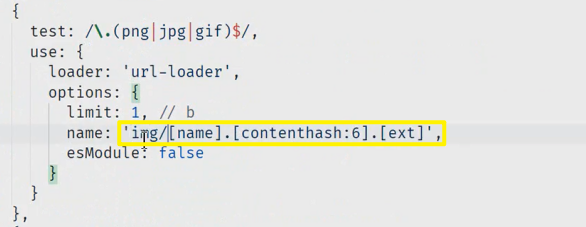
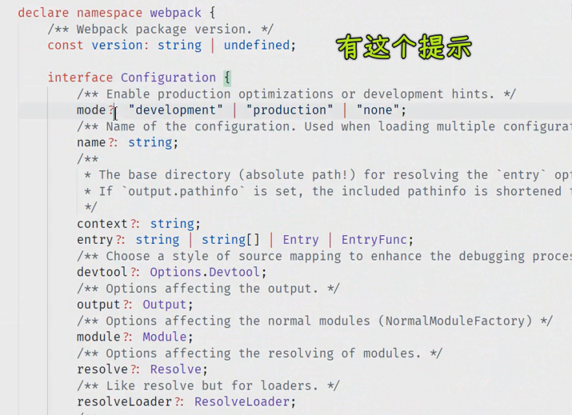

### ✍️ Tangxt ⏳ 2021-11-19 🏷️ 直播

# 14-Issue、脚手架、Webpack

> [fed-e-001-20200707](https://shimo.im/docs/dgqw9gvgkdyqwy9J/read)

## ★Issue

如何描述一个 Issue -> 请教别人，先把问题描述清楚，不要让别人去猜你这个问题到底是什么 -> 千万不要抛一个截图给人家就完事儿了


``` md
# Question: 简明的标题

## 正在学习的内容

<!-- 给出你正在学习的课程视频链接。非课程内问题，请单独说明。 -->

## 遇到的问题

<!-- 描述清楚你所遇到的问题和你想要达到的目标，尽量不要让我猜测你的意图，谢谢。 -->

## 重现步骤

<!-- 如何重现你所遇到的问题。 -->

## 你目前的状态

<!-- 如果可以，简单介绍一下你目前是在读书还是已经工作、工作方向和年头、储备知识掌握程度，我了解这些仅仅是为了更好的给你反馈。 -->

## 额外的描述

<!-- 其他任何有关的描述，尽量详细。 -->
```

> <https://github.com/lagoufed/fed-e-001/issues/new/choose>

## ★问题

1）关于脚手架生成文件的问题

覆盖 webpack 默认配置：

- `vue-cli`：[webpack 相关 - Vue CLI](https://cli.vuejs.org/zh/guide/webpack.html#%E7%AE%80%E5%8D%95%E7%9A%84%E9%85%8D%E7%BD%AE%E6%96%B9%E5%BC%8F) -> 推荐使用链式操作`chainWebpack` -> 配置合并用到` webpack-merge`
- `create-react-app` 可以在项目根目录执行 `eject script`，提取内置配置，详细参考：<https://create-react-app.dev/docs/available-scripts#npm-run-eject> -> 把配置和依赖弹到根目录

``` bash
npx create-react-app my-app
npm init react-app my-app
yarn create react-app my-app
```


> 在封装脚手架时，需要考虑 -> 把模板中用到的依赖给包装一层，让模板依赖所包装的模块（让模板依赖不变的东西） -> 说白了，就是把变化的给提取出来，让很多项目都依赖这个通用的东西，通用的东西变化了，本地的项目可以更新这个东西

➹：[关于创建 React App 的 8 个有趣事实 - 知乎](https://zhuanlan.zhihu.com/p/143112812)

2）关于单页和多页的问题

- MPA：早期的都是点开一个地址，就打开一个新页面，一个页面诞生，另一个页面就销毁 -> 网易云音乐的 PC 版在切换菜单时得是单页体验，毕竟得要让正在听的音乐不被销毁哈！、拉钩教育就是多页：<https://kaiwu.lagou.com/>，点开一个链接就是一个页面，不过有局部单页
- SPA：MPA 的进阶版 -> 做 H5（前端技术用在移动端）时常用 -> 商城一般都是整体多页，局部单页，毕竟单页对用户体验上更好、更丝滑

总之，一般情况都是混合用的！

活动页、专题页、落地页（手机产品的落地页，每隔一段时间，上线一个新产品，就会单独出一个专题页） -> 适合 MPA -> 因为这种页面需求很多，更新很快，每个月都会有 -> 很简单的 h5 活动页，每隔一段时间会增加一个，这就是多页面做法，不可能用单页面做法的，毕竟还得考虑 SEO 的问题

* <https://apple.com/iphone-4/>
* <https://apple.com/iphone-5/>
* <https://apple.com/iphone-6/>

从业务出发，决定用单页还是多页，而不是说从技术出发，比如用 Vue 这个技术，我要用单页还是多页，一般肯定选择是单页了，但如果我的业务是一些活动页呢？显然得是多页了

💡：之前搞 MPA 碰到一个问题 -> 10 多个页面在 `build`时，内存不足了，所以我该怎么办呢？

- 第一种办法：以时间换空间 -> 先打包 5 个页面，再打包 5 个页面
- 第二种办法：按需打包 -> 比如活动页，有些活动页已经失去效应的，也就是说我们不会再去动它们的代码了，所以我们不应该在打包新的活动页时也把旧的活动页也给打包了 -> 我们可以在 webpack 里边定义一个数组 -> 这个数组里边的元素就是我们此次要打包的页面目录 -> webpack 配置内容会根据数组元素动态生成配置

💡：SPA 路由动态导入模块和多页分包有什么区别啊？

它们俩没关系，不管是动态导入，还是分多页的这种打包方式，都可以形成代码的拆分 -> 不用从技术的角度去考虑我要使用动态导入还是多页，而是从业务的角度去考虑，如我现在要做多页应用，那我就用多页的方式去打包，如果我现在要做单页应用，要通过代码拆分去优化我的应用的性能的话，那就使用动态导入呗


💡：`chunk` 和 `bundle` 怎么用文字去描述？

用图文描述就是：


`module`，`chunk` 和 `bundle` 其实就是同一份逻辑代码在不同转换场景下的取了三个名字：

我们直接写出来的是 `module`，webpack 处理时是 `chunk`，最后生成浏览器可以直接运行的 `bundle`。

一般来说一个 `chunk` 对应一个 `bundle`，但也有例外，比如从一个 `chunk`里边分包成两个`bundle`


➹：[webpack 中，module，chunk 和 bundle 的区别是什么？](https://www.cnblogs.com/skychx/p/webpack-module-chunk-bundle.html)

💡：增量发布？

> 这种多页应用，只修改一个 h5 页面，但是在 jekins 持集成的时会打包所有的 h5 页面，然后部署，这会覆盖没有修改的 h5 页面

不是重新覆盖，而是增量部署

技术专题会讲 -> 该问题很有代表性

➹：[大家都是，怎么做前端项目的 增量部署 的？ - 知乎](https://www.zhihu.com/question/319667644)

➹：[Jenkins、hudson 如何实现增量发布？ - 知乎](https://www.zhihu.com/question/39381998)

➹：[★大公司里怎样开发和部署前端代码？ - 知乎](https://www.zhihu.com/question/20790576)

---

不要为了技术而技术，而是根据业务来决定我们该用何种技术，我们之所以学各种技术，是为了在实现业务的时候，自己能知道到底该选择哪种技术比较好 -> 技术是为业务而服务的！让业务来决定你该用什么去实现，而不是自己喜欢用 Vue 就用 Vue…… -> 选择好技术方案过后，就是不断地填坑……

3）关于不同环境下的环境变量？

> Vue 和 React 项目如果有多个环境，如开发、测试、预发、生产环境，环境变量要怎么设置

不同环境会不同的进口请求，如测试环境下的测试接口，生产环境下的真实接口

使用不同的 `.env` 文件控制，一般在项目根目录下会添加 `.env.development` / `.env.test` / `.env.production `这样的环境变量配置文件

> `.env.development`这个叫法是 vue-cli 约定的，不能按自己的喜好来命名，比如`.env.dev` -> 可查看 vue-cli 的官网

执行 Webpack 打包时通过 `NODE_ENV` 控制具体使用哪一个环境

然后在 Webpack 配置文件中使用 `dotenv` 读取对应环境的配置，通过 `DefinePlugin` 注入

目前 vue-cli 和 cra 都支持这种方式（开箱即用）


> 这个目标 html 文件就用到了环境变量，除此之外，如果你配置了路由，也会有`BASE_URL`这个环境变量

为啥会有`<%= BASE_URL %>`这种东西？ -> 为了让代码当中有可能发生变化的东西可以在构建环节当中通过配置的方式去修改它们

4）不同文件不同目录

> webpack 打包，文件如何按照类型输出到不同的文件夹，如：样式文件输出到 `css` 文件夹，脚本文件输出到 `js` 文件夹


首先我们需要明确一点，打包过程有可能会产生多种类型的文件，例如：js、css、png 等等。这些文件对于 Webpack 来说都是输出结果。

配置文件中的 `output.path` 就是配置所有由 Webpack 打包产生的文件输出的目录，它是不会区分文件的种类的。

但是，一般不同类型文件最终输出的文件名是可以单独设置的，例如 `output.filename` 是设置打包输出的 js 文件名，一般我们设置为 `bundle.js`，则最终这个文件就在输出目录的根目录下，如果想要在子目录下，可以设置为 `'js/bundle.js'`，这样就是在输出目录下的 js 目录下。

其他类型的文件也都是类似的，比如图片文件，一般图片文件都需要使用 `file-loader`。在 file-loader 的配置中可以设置输出的文件名：`img/[name]-[hash:6].[ext]`

css 提取插件 `MiniCssExtractPlugin` 也是一样




5）关于 Webpack 面试题

> 第一点，如果是 zce 老师，会常问，其它的是关于实践性的问题

1. Webpack 的价值体现 / 你对 Webpack 的看法
2. Webpack 与 Gulp、Grunt 之类工具的差异
3. Loader 与 Plugin 之间的差异
4. 用过的 Loader 和 Plugin（以此来判断你遇到过的问题）
5. Tree-shaking、sideEffects
6. Source Map 在生成模式下的最佳实践 -> 别人可以访问你的 js 文件，那关于它的 map 文件也是可以被访问到，这样源代码就可以反推出来了
   1. source-map 文件访问权限 -> 局域网内开发人员可以访问、外网用户不能访问 -> 不要有这个文件，不然运维在部署的时候，直接把它给部署上去了 -> 这个锅不在运维，当然，也不在你 -> 权限控制交给 Nginx，我们前端能做的是下边这两种
   2. nosources-source-map + 监控平台 sentry
   3. hidden-source-map
7.  Webpack 的核心工作过程
8.  文件名 hash（文件指纹）控制缓存

回答问题步骤：

1. 定义 -> 是什么 -> 在实践的基础之上，理解这个东西的定义，而不是靠背 -> 实践出真知
2. 实践 -> 在什么什么情况下我用什么什么东西可以解决一个什么什么样的问题或者说去实现一个什么样的功能
3. 问题 / 解决 -> 施加过程中遇到了什么问题，你是如何解决的
4. 升华 -> 除了用这个东西之外，我还可以用什么什么……（升华是把问题上升到更高的高度）

这个步骤给了你很多表现的空间，比如你的经验、你所知道的东西，不然，面试官问你啥，你就说啥，也就是在按照他的设想往下走，可这样你就没有发挥空间了呀！

> 面试官问一个，你就回答一个 -> 这是一种挤牙膏式的问法，即一点一点地去了解你知道多少东西 ，你的综合水平到底是怎样的 -> 这让双方都感到很累 -> zce 一般喜欢问宏观一点的问题，比如上述面试题的第一点 -> 老师一般不准备面试题，出的问题比较宏观，为了给面试者有临场发挥的空间，让面试者自己可以在这空间内充分地把自己的能力给体现出来！ -> 太聚焦的问题，很容易出现面试官说一个，面试者回答一个这样的情况 -> 总之，问宽一点的问题，给面试者足够的空间去发挥
> 
> 回到 source-map 的问题 -> 是什么，组合起来有几种，之前我选择 `source-map` 这种，结果有安全隐患，于是我归纳出对 Source Map 的最佳实践 -> 千万不要直接回答，什么情况下用什么

➹：[Sentry 的使用 - SegmentFault 思否](https://segmentfault.com/a/1190000018056453)

---

> 什么叫人的境界的升华？
> 
> 首先要明白何谓境界，何谓升华。所谓境界指的是人的思想觉悟和精神修养所处的水平。这二者的水平高低因人而异，但大家普遍都希望自己的思想觉悟和精神修养能高于旁人。而所谓的升华，是个物理词汇，指固态物质不经液态直接化为气态，这个过程是需要吸收足够的热量才能达到。那么经上所示问题就一目了然了，境界的升华就是指人的思想觉悟和精神修养得到了大大的提高，不是一丁半点的提高，而是一个飞跃性提高。但这个过程往往需要我们汲取、积累大量的“热量”，这个“热量”可能来自于书本给我们的知识，可能来自于生活给我们的阅历，可能来自于他人给予的指点。

➹：[什么叫人的境界的升华？ - 知乎](https://www.zhihu.com/question/290507411)

➹：[高考作文你会“升华”吗？ - 知乎](https://zhuanlan.zhihu.com/p/160815858)

6）问题补充

💡：webpack 内 `rules` 的常用属性和常用配置？

这个没有所谓的常用属性，具体取决于所使用的 loader，每个 `rule` 对象中正常只会用到 `test` 和 `use`。

- 如果这个 loader 需要设置一些配置选项，可以使用 `options`
- 如果需要让这个 loader 选择性的忽略一部分文件，可以使用 `include / exclude` -> `node_modules`下的东西没有必要去处理
- 如果需要对同一种文件使用多个 loader，例如先使用 eslint-loader 再使用 babel-loader，可以使用 `enforce` 属性控制当前这个规则的优先与否。
- 其他的就很少用到了

💡：webpack 想忽略 `webpack.config.js` 的配置只对单个文件打包应该用什么命令呢？

> 这到底是个什么场景？ -> 难道 webpack 配置有 bug？你找不到，于是你想这样干？

没办法，需求太特殊🤦‍♂️

只要项目根目录下有 `webpack.config.js` 文件，webpack 工作时就会自动加载

非要这么搞也可以：

1. 把 `webpack.config.js` 改名，只要不是默认文件名，例如 `webpack.conf.js`
2. 正常打包时使用 `npx webpack --config webpack.conf.js`
3. 忽略就不传递 `--config`
   1. 然后使用 `--entry` 之类的参数指定打包入口

> P.S. 正常没这么干的，尽管我不知道你的真正意图，但是你既然已经配置了 webpack 配置，自然会有一些类似 loader 或者 plugin 的设置，你忽略了配置文件，那你代码中的那些地方如何处理？

7）webpack 配置文件技巧

> webpack 一般都是项目初期、构建的时候配置的，大多数入职的程序员都是直接开发，只有新项目才有可能自己实现一下，看目前的项目只能了解部分配置属性，从 0 到 1 的搭建机会其实比较少的
> 
> 举一反三 -> 我这里可以这样玩，那里也可以这样玩


💡：如何在写 webpack 配置的时候，让 VS Code 有智能提示？



做法一：


做法二：


> 不建议使用 webstorm

8）webpack 配置 Vue 项目


