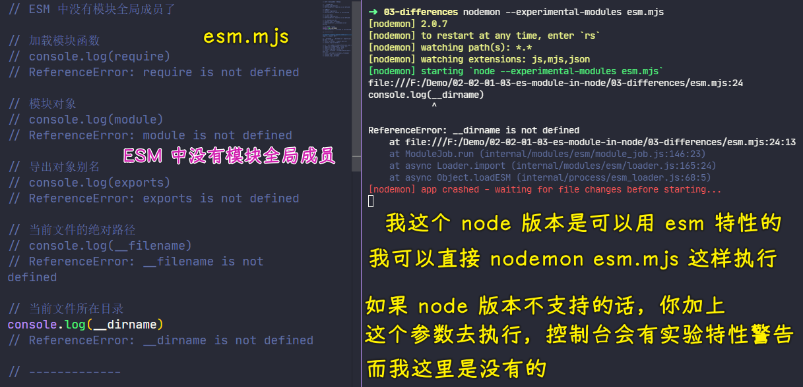
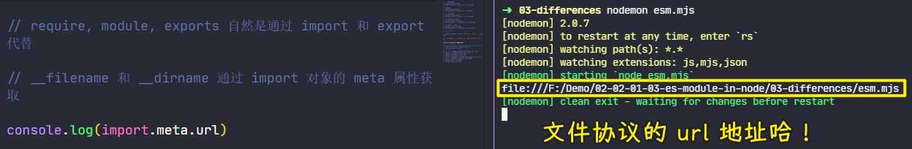
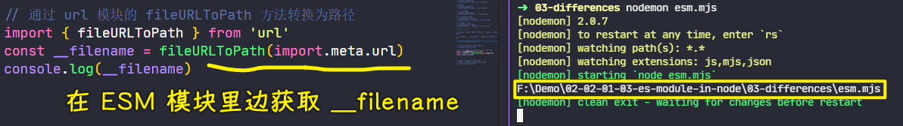
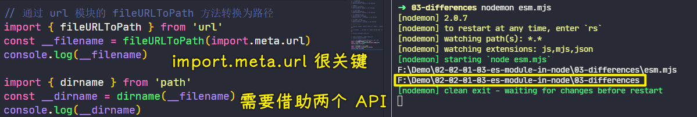

接下来我们再来看一下在 node 环境当中去使用 ES Modules 与 使用 CommonJS 之间的一些差异。

这里我同样准备了两个 JS 文件：

- `cjs.js`
- `esm.mjs`

### <mark>1）对遵守 CommonJS 规范的模块打印五个所谓的全局成员</mark>

在这个 `cjs` 文件当中，它是按照 CommonJS 的标准去打印了五个成员


`require`这个成员：

``` js
[Function: require] {
  resolve: [Function: resolve] { paths: [Function: paths] },
  main: Module {
    id: '.',
    path: 'F:\\Demo\\02-02-01-03-es-module-in-node\\03-differences',
    exports: {},
    parent: null,
    filename: 'F:\\Demo\\02-02-01-03-es-module-in-node\\03-differences\\cjs.js',  
    loaded: false,
    children: [],
    paths: [
      'F:\\Demo\\02-02-01-03-es-module-in-node\\03-differences\\node_modules',    
      'F:\\Demo\\02-02-01-03-es-module-in-node\\node_modules',
      'F:\\Demo\\node_modules',
      'F:\\node_modules'
    ]
  },
  extensions: [Object: null prototype] {
    '.js': [Function (anonymous)],
    '.json': [Function (anonymous)],
    '.node': [Function (anonymous)]
  },
  cache: [Object: null prototype] {
    'F:\\Demo\\02-02-01-03-es-module-in-node\\03-differences\\cjs.js': Module {   
      id: '.',
      path: 'F:\\Demo\\02-02-01-03-es-module-in-node\\03-differences',
      exports: {},
      parent: null,
      filename: 'F:\\Demo\\02-02-01-03-es-module-in-node\\03-differences\\cjs.js',
      loaded: false,
      children: [],
      paths: [Array]
    }
  }
}
```

这个五个成员实际上就是我们在 CommonJS 规范下的这个模块的全局成员，我们可以把它理解成全局变量，但是实际上了解一些原理的同学就应该知道它实际上是模块内置的。

这几个成员我们尝试着先把它们打印出来，可以正常打印的话，也就意味着 CommonJS 当中这几个成员是正常工作的。

### <mark>2）遵守 ESM 规范的模块没有这五个所谓的全局成员</mark>

这个时候我们也回到 ES Modules 当中尝试着去使用一下它。




> ESM 中没有 CommonJS 中的那些模块全局成员

不过这里我们通过 `nodemon` 去启动这个 ESM 的 `mjs` 文件 -> 我们希望当这个文件修改过后，它可以自动的去帮我们重新运行这个代码，这样省得我们自己再去手动运行了

它的启动参数同样需要去加上 `experimental-modules`，那这样的话我们就可以在这个 ESM 当中做一些尝试了，我们分别去把这些成员在这个`mjs`文件当中一个个去做打印操作。

结果你会发现这些成员在我们的 ES Modules 当中全部没有办法去访问 -> 这也就意味着这几个成员在我们使用 ES Modules 的时候就不能再去使用了。

这原因也很简单，我们之前也说到了 -> 这五个成员实际上都是 CommonJS 它把我们的模块包装成一个函数过后通过参数提供进来的成员。

我们现在使用的是 ES Modules，而它的加载方式发生了变化，所以说就不再提供这几个成员了。

### <mark>3）如何让遵守 ESM 规范的模块也可以用上这五个成员？</mark>

在这几个成员当中， `require`、`module`和 `exports` 这些我们可以通过 ES Modules 当中的 `import` 和 `export` 去代替。而对于`__filename` 和 `__dirname` 这两个变量的话，我们可以通过另外一个成员去代替。

#### <mark>1、`import.meta.url`</mark>



这个成员就是 `import` 它作为一个对象，然后它下面的这个 `meta` 属性里面有一个 `url` -> 这个 `url` 实际上拿到的就是我们当前所工作的这个文件的一个文件 `url` 地址。

#### <mark>2、通过`url.fileURLToPath`拿到`__filename`</mark>

我们可以借助于 `url` 这个模块里面有一个 `fileURLToPath` 这样一个方法，我们将这个方法可以把我们文件的 `url` 转换成路径。



这时候我们就可以通过这种方式去拿到我们当前正在运行的这个文件的文件路径，也就是我们之前的`__filename`

#### <mark>3、通过`path.dirname`拿到`__dirname`</mark>

对于`__dirname`的话，我们也可以通过这个`__filename`再去提取它里面文件夹的那一部分。



我们借助于 `path` 这个模块里面的 `dirname` 方法 -> 这个方法帮我们从一个完整的文件路径里边提取出它其中文件夹部分。

那这样的话就可以得到我们的`__dirname`这样一个成员了。

### <mark>4）总结</mark>

以上这一些就是我们在使用 ES Modules 时跟 CommonJS 之间的一些区别了。

如果说你对这五个成员有一些疑问的话，你可以去翻看一下我们在 node 的源代码当中去加载 CommonJS 那一块的一段源代码。


> [node/loader.js at master · nodejs/node](https://github.com/nodejs/node/blob/master/lib/internal/modules/cjs/loader.js#L201-L209)

通过那个源代码你会发现这几个成员实际上就是我们把当前这个模块包装成一个函数过后的那些形参，所以说它实际上是伪全局对象，它并不是真正意义上的全局对象。
