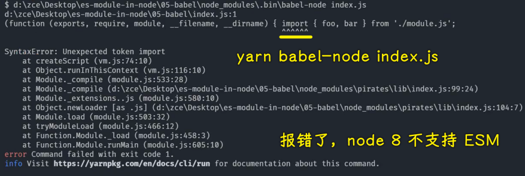
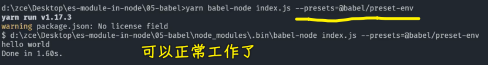
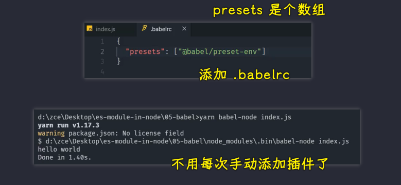
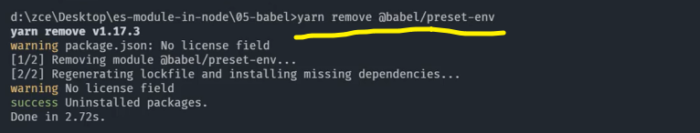
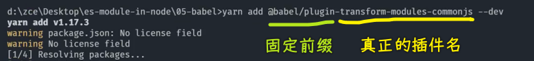
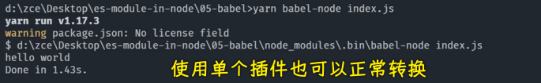

如果说你使用的是早期的 Node.js 版本，那你可以使用 babel 去实现 ES Modules 的兼容。

babel 是目前最主流的一款 JavaScript 的编译器 -> 它可以用来帮我们将一些使用了新特性的代码编译成当前环境支持的代码

有了 babel 过后，我们就可以放心大胆的在绝大多数环境当中去使用各种各样的新特性了。

在这里我们就借助于 babel 去实现在低版本 node 环境当中去使用 ES Modules。

那接下来我们就一起来看一下如何在 node 环境当中使用 babel 去运行 ES Modules 的代码。

1）如何使用 babel 去运行我们的 node 代码？

我这里 node 的版本是`8.0.0`，我们使用 babel 去运行我们 node 代码的话，我们可以去安装一个`@babel/node`模块。

不过这个模块它需要依赖 babel 的核心模块，还有一些 babel 的预设插件 -> 我们将这些模块全部作为开发依赖来安装进来。

完成过后，我们就可以在 `node_modules` 当中去找到一个`babel-node`的一个命令。

此时我们就可以在命令行当中通过 `yarn` 去运行这个命令，`yarn`会自动找到这个可执行文件。

可以执行这个命令过后，接下来我们就看一下这样一个命令它具体如何去运行我们的 JS 文件。

2）`node-babel`的用法

它的用法实际上跟 `node` 命令是一样的，我们直接在后面跟上我们的 JS 文件的名称就可以了。

1、node 8 不支持 ESM

不过它直接运行还是报了一个错误 -> 说的是「`import` 不被支持」

2、需要给 babel 添加转换插件：`preset-env`

那这个原因也非常简单，因为 babel 它是基于插件机制去实现的

它的核心模块并不会去转换我们的代码，而具体要去转换我们代码当中的每一个特性，它是通过插件来去实现的，也就是说我们需要一个插件去转换我们代码当中的一个特性。

我们之前所安装的这个 `preset-env`，它实际上是一个插件的集合，在这个插件的集合当中去包含了最新的 JS 标准当中的所有的新特性。

我们在这儿就可以借助于这个 `preset` 直接去把我们当前这个代码当中所使用到的 ES Modules 给它转换过来。

那正确的做法就是我们在这个命令后面跟上一个 `presets` 参数，我们让这个 `presets` 去使用我们刚刚的这个 `preset-env` -> 因为除了 `preset-env` 还有一些其它的 `preset` 

这个时候它就可以正常的去工作了。

3）添加`.babelrc`配置

如果说你要是觉得每次手动的去传入这样一个参数会比较麻烦的话，那你也可以选择把它放到配置文件当中。

我们在当前这个项目的下面去添加一个`.babelrc`文件。

这个文件**是一个 JSON 格式的文件**，我们可以在这个文件当中去添加一个 `presets` 节点

这个节点里面是一个数组，我们将刚刚的这个 preset 放在里面，也就是`preset-env`。

此时我们就可以直接通过 babel 去运行 `index` -> 不用再去添加参数了。

这个就是我们之前所安装 preset 的一个用意。

当然了，我们刚刚也介绍到了，这实际上去帮我们转换 ES Modules 这样一个特性的是一个插件，并不是 preset， `preset-env` 只是一个集合

我们这儿把这个 preset 给它移除掉。

4）使用单个插件去转换 ESM 特性

我们来看一下具体使用一个单独的插件来去转换这样一个特性。

这个插件的名字叫做 `transform-modules-commonjs`

我们把这个插件安装进来过后，我们就可以把配置文件当中的这个 `presets` 给大家去掉，取而代之的是 `plugins` 节点。

这个节点也是一个数组，我们将刚刚安装的这个插件放进去，你一定要记住 `preset` 它就是一组插件。

可以看到，我们需要用到哪个插件，我们自己去安装也是可以的

对于你来讲的话，你的环境如果说支持一些其它的特性，那对于不支持的那些特性，你单独用一些插件去安装可能效率会更好一些。

5）小结

以上这个就是我们在 node 环境当中使用 babel 去处理兼容的一个办法。

当然，针对于 babel 的使用，我们还会有一些专门的介绍，因为我们这只是使用到了 babel 的 `node`，而 babel 的编译器会在后面专门再去介绍。

6）了解更多

➹：[babel-preset-env 使用指南](https://www.cnblogs.com/chyingp/p/understanding-babel-preset-env.html)
