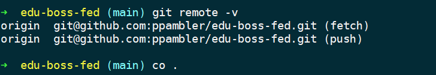
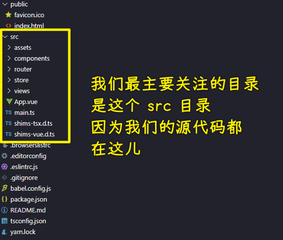
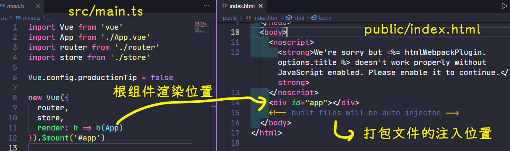
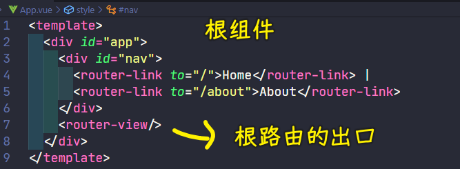
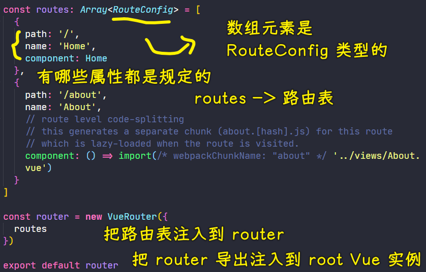

### ✍️ Tangxt ⏳ 2021-07-25 🏷️ Vue

# 06-1-使用 VueCLI 创建项目、加入 Git 版本管理、初始目录结构说明、调整初始目录结构

## ★使用 VueCLI 创建项目

1）创建项目

``` js
vue create edu-boss-fed
```

> 前端设计的教育后台管理系统 -> 用的 VueCLI 版本：`@vue/cli 4.5.13`

💡：快速搭建？还是自定义搭建？


通过一些选项来创建项目 -> 第一个是 Vue 2 结合 babel 和 eslint 这两个工具来创建这个项目，同理第二个也是如此，只不过是用了 Vue 3 -> 第三个则是手动选择功能特性来创建项目 -> 前两个功能比较少，而第三个有更多的自定义功能，因此选择第三个！

💡：选择项目所依赖的特性？


选择项目自带的功能特性：

1. 不勾选 Vue 版本，默认是选择 Vue2，勾选了会提示你选 Vue3 还是 Vue2
2. Babel -> 转化 ES 版本、JSX 等
3. 需要用到 TS 编写代码
4. PWA -> 暂时不需要
5. Router -> Vue-Router，勾选它，初始化它，管理项目的路由
6. Vuex -> 管理项目中共享的数据容器
7. CSS 预处理器 -> 可以让我们在项目中使用 SASS 等
8. Linter -> 把代码格式校验的相关工具集成到这个项目当中（具体选择了哪个工具会在下一步选择） -> 保证项目不仅把功能做好，又让代码编写的非常规范
9. 最后两个 -> 与测试相关，但现在暂时不做测试！


💡：是否使用 class 风格的组件语法？

为啥会有这选项？ -> 因为上一步勾选了`TS`

💡： 是否让 Babel 和 TS 结合起来来编译 JS？

选项由来 -> 因为勾选了 TS

这个选项的意思是说，TS 的编译器有把 ES6+ 代码转化成 ES3 的功能，但我们不需要 TS 的编译器去做，而是交给 Babel 去做，TS 编译器只需要把 TS 语法编译成 JS 语法就好了！

`Yes`这个选项的好处？ -> 你会得到这样一些功能，如现代模式，自动 polyfills，自动帮你转化 JSX 语法等

总之，选上它，会让项目的功能更好！ -> TS 只编译 TS 代码，ES6+ 代码交给 Babel 去转化！

💡：是否使用 history 模式作为你的路由模式？

这种模式虽然好看、简洁，但兼容不太好 -> 在这儿不选 -> 不选就是默认的 hash 模式

💡：选择 CSS 预处理器？

第一个用的编译器是`dart-sass`，而第二个则是`node-sass`

Sass 之前用的是`node-sass`编译器，之后官方做了一个纯 JS 的`dart-sass`编译器 -> `dart-sass`的功能和性能要更好一些

这几个 CSS 预处理器，没有这样的说法：谁是最好的，谁是最差的

总之，你喜欢用哪个就用哪个！

💡：选择 linter / formatter？

> lint：线头，裤子的线头需要剪掉

代码格式校验选择：

- 第一个：ESLint 本身的错误基本配置
- 第二个：ESLint + Airbnb 代码风格
- 第三个：ESLint + Standard 代码风格
- 第四个：ESLint + Prettier 代码风格
- 最后一个：已经告诉你 -> 不建议去使用

选一个你喜欢的，代码风格这玩意儿，没有绝对的正确与否 -> 这需要考虑到团队和个人

老师喜欢 Standard 风格的

💡：在什么情况下，才会触发代码格式校验？

- 当我们保存编写的文件的时候，就会触发代码格式校验 -> 这个校验是及时的，能马上知道这个代码是否符合你选的代码规范 -> 如果不符合，你就要去做修正了
- 当我们去执行`git commit`的时候，才会去帮我们做校验，以及自动修正

建议两个勾选（双保险） -> 原因：及时校验+防止有不符合代码规范的代码进入到代码的历史版本当中

💡：对于 Babel、ESLint 等这样的工具，它可能会生成一些配置信息，所以你想把这些配置信息放到哪去呢？

1. 让配置信息生成或者说存放到单独的配置文件当中
2. 可以放到`package.json`里边，和这个文件写在一起

无论选哪个，结果上都是一样的 -> 建议选第一个，把生成的配置信息保存到各自独立的配置文件当中去 -> 查看方便、维护它时方便修改

💡：是否把你刚刚配置的一系列选项保存一下，以便你下一次创建一个新项目时，可以用这个配置，来快速搭建一个项目？

- `Y` -> 起个名字即可保存
- `n` -> 则是跳过，不需要

---

勾选好后，按下回车，就开始创建项目了 -> VueCLI 会自动帮你安装第三方包，安装时间比较长（总共用了 250 s）


安装好后会有命令提示，根据这些提示，去启动这个项目 -> 会打开一个 http 服务，默认是 `8080` 端口

看到这个：


就证明你的项目启动成功了！

2）整个项目的配置情况？


## ★加入 Git 版本管理

> 在对项目正式编码之前，为啥要加入 Git 版本管理？ -> 帮我们更好地做多人协作+代码历史记录备份

1. 创建远程仓库
2. 将本地仓库推到或者说同步到线上

如果没有本地仓库：

``` bash
# 创建本地仓库
git init

# 将文件添加到暂存区
git add 1.js

# 提交历史记录
git commit '创建 1.js '

# 添加远端仓库地址
git remote add origin git@github.com:ppambler/xxx.git

# 推送提交
git push -u origin main
```

如果已有本地仓库：

> 我们用 VueCLI 创建出来的项目本身就已经是一个本地仓库了 -> 在 GitHub 创建好什么都没有的空仓库后（会给你执行的命令），直接在项目目录下执行这几行命令，就可以把代码提交上去了！

``` bash
git remote add origin git@github.com:ppambler/edu-boss-fed.git
git branch -M main
git push -u origin main
```

---

注意：

- 远程仓库的名字可以和本地仓库的名字不一样，之所以一样，是为了方便我们去辨识
- 可以用 Gitee 等，不是非得用 GitHub
- `origin`是`git@github.com:ppambler/edu-boss-fed.git`这个地址的别名，`-u origin main`让我们下次提交可以直接`git push`这样提交，而无须再写`origin main` -> `git remote -v`可以查看当前本地仓库其对应的远程仓库地址
- 如何修改远程仓库地址的别名？ -> `git remote rename orign origin` -> 很多时候你会写成这样：`git remote add orign ...`，当你`git push -u origin main`时，你会发现之前写的别名`orign`写错了！ -> `origin`这个别名不是必须叫这个的，你可以叫`xxx`……只要保证你在`git push`时用到是`xxx`就行了！



## ★初始目录结构说明

``` bash
.
├── node_modules # 第三⽅包存储⽬录
├── public # 静态资源⽬录，任何放置在 public ⽂件夹的静态资源都会被简单的复制，⽽不经过 webpack
│ ├── favicon.ico
│ └── index.html
├── src
│ ├── assets # 公共资源⽬录，放图⽚等资源
│ ├── components # 公共组件⽬录
│ ├── router # 路由相关模块
│ ├── store # 容器相关模块
│ ├── views # 路由⻚⾯组件存储⽬录
│ ├── App.vue # 根组件，最终被替换渲染到 index.html ⻚⾯中 #app ⼊⼝节点
│ ├── main.ts # 整个项⽬的启动⼊⼝模块
│ ├── shims-tsx.d.ts # ⽀持以 .tsc 结尾的⽂件，在 Vue 项⽬中编写 jsx 代码
│ └── shims-vue.d.ts # 让 TypeScript 识别 .vue 模块
├── .browserslistrc # 指定了项⽬的⽬标浏览器的范围。这个值会被 @babel/preset-env 和 Autoprefixer ⽤来确定需要转译的 JavaScript 特性和需要添加的 CSS 浏览器前缀
├── .editorconfig # EditorConfig 帮助开发⼈员定义和维护跨编辑器（或 IDE）的统⼀的代码⻛格
├── .eslintrc.js # ESLint 的配置⽂件
├── .gitignore # Git 的忽略配置⽂件，告诉 Git 项⽬中要忽略的⽂件或⽂件夹
├── README.md # 说明⽂档
├── babel.config.js # Babel 配置⽂件
├── package-lock.json # 记录安装时的包的版本号，以保证⾃⼰或其他⼈在 npm install 时⼤家的依赖能保证⼀致
├── package.json # 包说明⽂件，记录了项⽬中使⽤到的第三⽅包依赖信息等内容
└── tsconfig.json # TypeScript 配置⽂件
```

1）src 目录结构说明



- `main.ts` -> 内容没有变化
- `public/index.html` -> `main.ts`的`new Vue`挂载点，根组件的渲染位置 -> 打包的代码文件会自动注入到`index.html`里边的那个注释位置



- `App.vue` -> 项目的根组件



> 根据路由配置来匹配渲染

- `xxx.d.ts` -> 都是和 TS 相关的配置描述文件 -> 这两个文件的核心作用在使用 TS 写 Vue 组件会介绍到
- `views` -> 路由组件或者说路由页面都放到这儿 -> 组件用类的姿势来写
- `store` -> 容器模块，共享全局数据
- `router` -> 路由配置、路由表（`routes`），每个配置是`RouteConfig`类型的，这意味着这个配置对象有哪些属性都是规定的，你不能乱写 -> `router`实例接收路由表`routes` -> 把这个`router`配置到`main.ts`中的根实例当中去
- `components` -> 存储公共的 Vue 组件，如 `views` 目录下`About`和`Home`都用到了`HelloWorld`视图，那么我们就可以看这个视图抽象成一个组件，放到`components`里边去
- `assets` -> 放一些公共的静态资源，如`logo.png`



2）其它的

- `node_modules` -> 存储项目当中的第三方包，所有`yarn add`的内容都会存放到这儿
- `public` -> `index.html`是一个单页面应用 -> 主要放的是存静态资源，即不被 webpack 进行打包的资源 -> `public`旗下的任何资源都可以让直接`/index.html`这样去访问资源
- `.browserslistrc` -> 描述了浏览器的相关信息 -> 如果你在项目当中用到了`postcss`、`babel`等之类的工具，在做编译转换的时候，这些工具就会来看这个文件，毕竟它描述了这个项目应该要兼容到的环境信息，如`> 1%`，只要这个浏览器有超过`1%`的用户在使用，那么就要兼容这个浏览器、`last 2 versions`，每个浏览器最近的两个版本，项目在这两个版本的浏览器里边都能正常跑起来、`not dead`，这个 query 中 `not` 是逻辑非操作符，即对 dead 取反，而浏览器被认为是 dead 条件是：最新的两个版本中发现其市场份额已经低于 `0.5%` 并且 `24` 个月内没有任务官方支持和更新了，即不兼容这样的浏览器 -> 一般我们在开发时用默认配置就可以了，什么时候可以改它？项目后期开发完，打包上线，这个时候我们要测一下相关的兼容，如果有问题，那就修改这个配置呗 -> 总之，该文件是在描述我们要兼容的浏览器大概是怎样的
- `.editorconfig` -> 统一编辑器的代码风格，如你敲`tab`时用的是空格，而不是`tab`符，而且是两个空格，而不是四个空格之类的、去除空白字符、在最后一行插入新行的 -> 一般主流的编辑器都会自动去识别这个配置文件，然后应用到这个项目当中去，这样一来，就不用我们自己去修改编辑器自身相关的默认配置了 -> 总之，如果不同的项目里边如果这个文件是不同的，那么同一个编辑器各自打开这个项目，都会自动有统一的代码风格，说白了，**它的编辑风格优先级大于编辑器自身的** -> 用默认的就好了（根据脚手架生成的项目默认配置的），基本不需要动它！
- `eslintrc.js` -> `rc`是`run command`（运行命令）的简写，它是任何脚本类文件的后缀，这些脚本通常在程序的启动阶段被调用 -> 它是一个代码格式校验工具的配置文件，描述了环境等 -> 一般情况下我们不需要去动它，如果你需要自定义配置代码书写规则、自定义 ESLint，那你就改这个文件呗！
- `.gitignore` -> Git 的忽略配置文件，它里边描述的内容都不会被 Git 版本跟踪 -> 默认内容都是一些通用的不需要提交的文件 -> 一般不需要去它，当然，这依旧是根据你的需要来更改与否
- `babel.config.js` -> babel 的配置文件，同样，根据需要去更改默认的
- `package-lock.json` -> 保存了我们安装的第三方包的具体版本号，防止第三方包依赖的升级，确保多人开发时，张三能跑这个项目，李四也能跑这个项目 -> 不会出现因为第三包版本类型不一样而导致张三的环境下项目能跑，而李四的则不能跑 -> **这是一个非常好的配置文件**
- `package.json` -> 一个简单的项目说明文件，如项目叫啥，版本是啥，开发依赖是啥，生成依赖又是啥等……
- `README.md` -> 一个简单的说明文档，描述了项目如何启动，以及一些相关的环境配置等
- `tsconfig.json` -> 一个 TS 配置文件，在使用 TS 写 Vue 组件时，会详细地说明这个配置文件的核心作用

## ★调整初始目录结构


