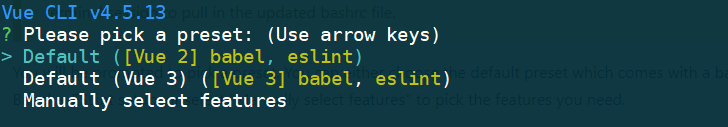
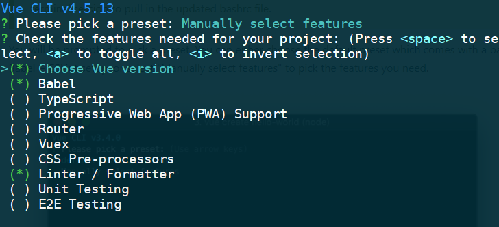
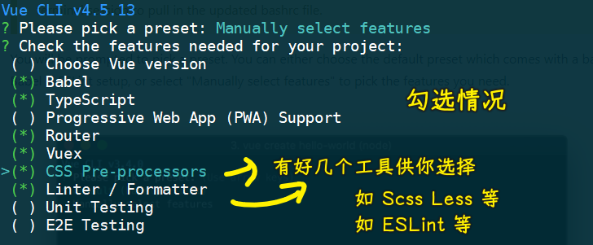
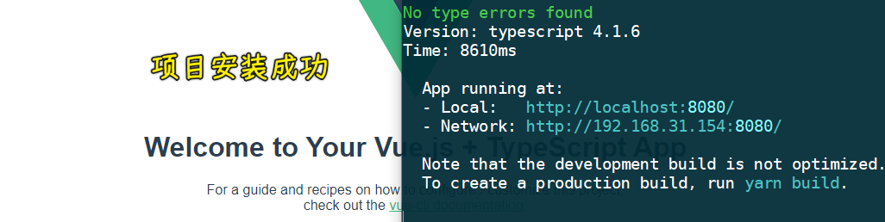
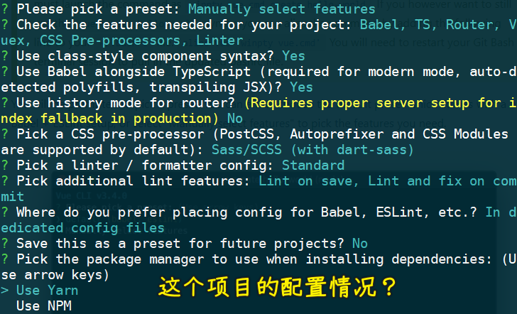

### ✍️ Tangxt ⏳ 2021-07-25 🏷️ Vue

# 06-1-使用 VueCLI 创建项目、加入 Git 版本管理、初始目录结构说明、调整初始目录结构

## ★使用 VueCLI 创建项目

1）创建项目

``` js
vue create edu-boss-fed
```

> 前端设计的教育后台管理系统 -> 用的 VueCLI 版本：`@vue/cli 4.5.13`

💡：快速搭建？还是自定义搭建？



通过一些选项来创建项目 -> 第一个是 Vue 2 结合 babel 和 eslint 这两个工具来创建这个项目，同理第二个也是如此，只不过是用了 Vue 3 -> 第三个则是手动选择功能特性来创建项目 -> 前两个功能比较少，而第三个有更多的自定义功能，因此选择第三个！

💡：选择项目所依赖的特性？



选择项目自带的功能特性：

1. 不勾选 Vue 版本，默认是选择 Vue2，勾选了会提示你选 Vue3 还是 Vue2
2. Babel -> 转化 ES 版本、JSX 等
3. 需要用到 TS 编写代码
4. PWA -> 暂时不需要
5. Router -> Vue-Router，勾选它，初始化它，管理项目的路由
6. Vuex -> 管理项目中共享的数据容器
7. CSS 预处理器 -> 可以让我们在项目中使用 SASS 等
8. Linter -> 把代码格式校验的相关工具集成到这个项目当中（具体选择了哪个工具会在下一步选择） -> 保证项目不仅把功能做好，又让代码编写的非常规范
9. 最后两个 -> 与测试相关，但现在暂时不做测试！



💡：是否使用 class 风格的组件语法？

为啥会有这选项？ -> 因为上一步勾选了`TS`

💡： 是否让 Babel 和 TS 结合起来来编译 JS？

选项由来 -> 因为勾选了 TS

这个选项的意思是说，TS 的编译器有把 ES6+ 代码转化成 ES3 的功能，但我们不需要 TS 的编译器去做，而是交给 Babel 去做，TS 编译器只需要把 TS 语法编译成 JS 语法就好了！

`Yes`这个选项的好处？ -> 你会得到这样一些功能，如现代模式，自动 polyfills，自动帮你转化 JSX 语法等

总之，选上它，会让项目的功能更好！ -> TS 只编译 TS 代码，ES6+ 代码交给 Babel 去转化！

💡：是否使用 history 模式作为你的路由模式？

这种模式虽然好看、简洁，但兼容不太好 -> 在这儿不选 -> 不选就是默认的 hash 模式

💡：选择 CSS 预处理器？

第一个用的编译器是`dart-sass`，而第二个则是`node-sass`

Sass 之前用的是`node-sass`编译器，之后官方做了一个纯 JS 的`dart-sass`编译器 -> `dart-sass`的功能和性能要更好一些

这几个 CSS 预处理器，没有这样的说法：谁是最好的，谁是最差的

总之，你喜欢用哪个就用哪个！

💡：选择 linter / formatter？

> lint：线头，裤子的线头需要剪掉

代码格式校验选择：

- 第一个：ESLint 本身的错误基本配置
- 第二个：ESLint + Airbnb 代码风格
- 第三个：ESLint + Standard 代码风格
- 第四个：ESLint + Prettier 代码风格
- 最后一个：已经告诉你 -> 不建议去使用

选一个你喜欢的，代码风格这玩意儿，没有绝对的正确与否 -> 这需要考虑到团队和个人

老师喜欢 Standard 风格的

💡：在什么情况下，才会触发代码格式校验？

- 当我们保存编写的文件的时候，就会触发代码格式校验 -> 这个校验是及时的，能马上知道这个代码是否符合你选的代码规范 -> 如果不符合，你就要去做修正了
- 当我们去执行`git commit`的时候，才会去帮我们做校验，以及自动修正

建议两个勾选（双保险） -> 原因：及时校验+防止有不符合代码规范的代码进入到代码的历史版本当中

💡：对于 Babel、ESLint 等这样的工具，它可能会生成一些配置信息，所以你想把这些配置信息放到哪去呢？

1. 让配置信息生成或者说存放到单独的配置文件当中
2. 可以放到`package.json`里边，和这个文件写在一起

无论选哪个，结果上都是一样的 -> 建议选第一个，把生成的配置信息保存到各自独立的配置文件当中去 -> 查看方便、维护它时方便修改

💡：是否把你刚刚配置的一系列选项保存一下，以便你下一次创建一个新项目时，可以用这个配置，来快速搭建一个项目？

- `Y` -> 起个名字即可保存
- `n` -> 则是跳过，不需要

---

勾选好后，按下回车，就开始创建项目了 -> VueCLI 会自动帮你安装第三方包，安装时间比较长（总共用了 250 s）


安装好后会有命令提示，根据这些提示，去启动这个项目 -> 会打开一个 http 服务，默认是 `8080` 端口

看到这个：



就证明你的项目启动成功了！

2）整个项目的配置情况？



## ★加入 Git 版本管理

``` bash
git remote add origin git@github.com:ppambler/edu-boss-fed.git
git branch -M main
git push -u origin main
```
