### ✍️ Tangxt ⏳ 2021-09-07 🏷️ Vue

# 06-10-菜单管理

## ★直接过一遍

> 要做的无非就是增删改查……

设计稿：<http://eduboss.lagou.com/#/Menu>

### <mark>1）布局</mark>

目前`menu`页面的 UI：

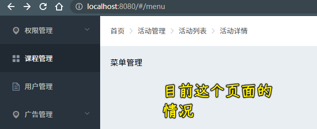

布局完成后：

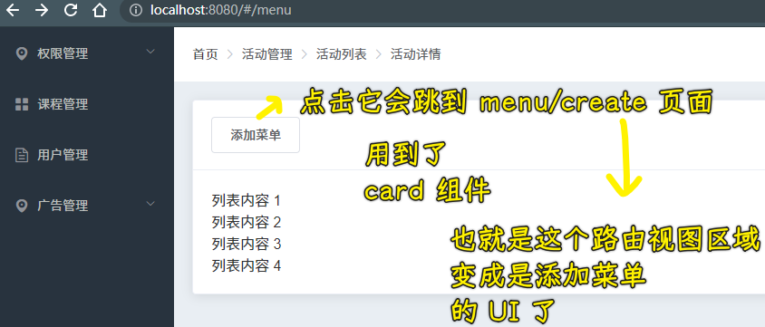

添加菜单的 UI：

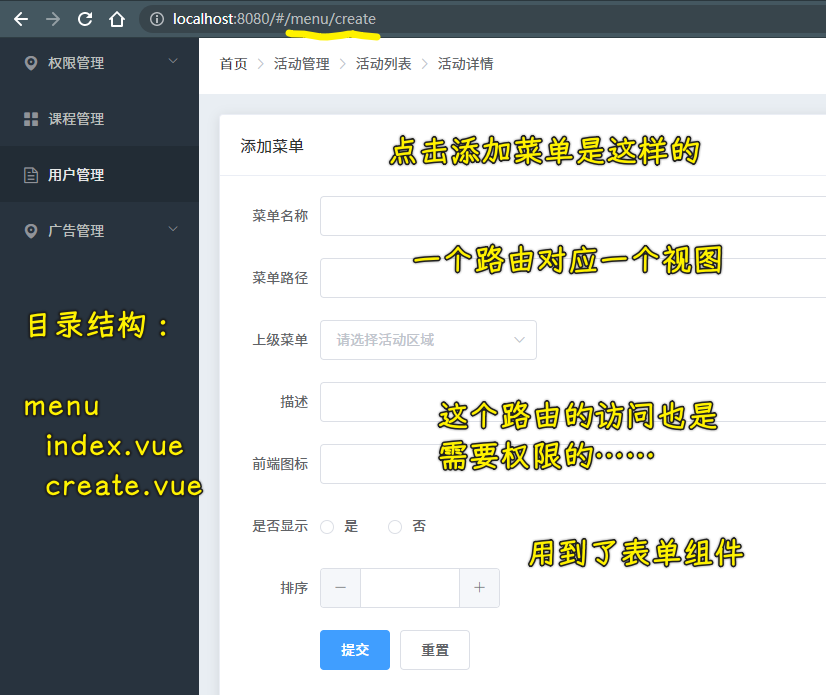

💡：一个骚用法？

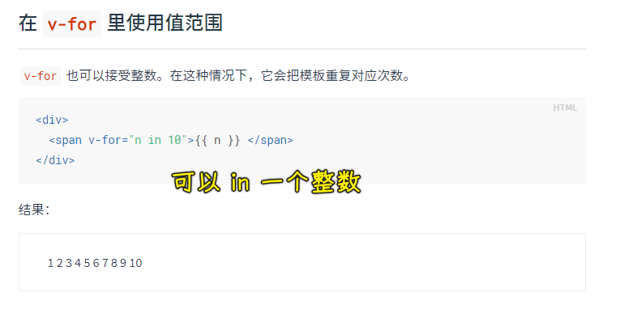

测试：

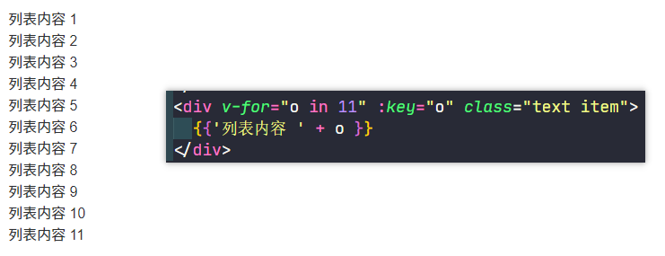

➹：[Card 卡片 - Element](https://element.eleme.cn/#/zh-CN/component/card#card-qia-pian)

➹：[Form 表单 - Element](https://element.eleme.cn/#/zh-CN/component/form#form-biao-dan)

### <mark>2）数据绑定</mark>

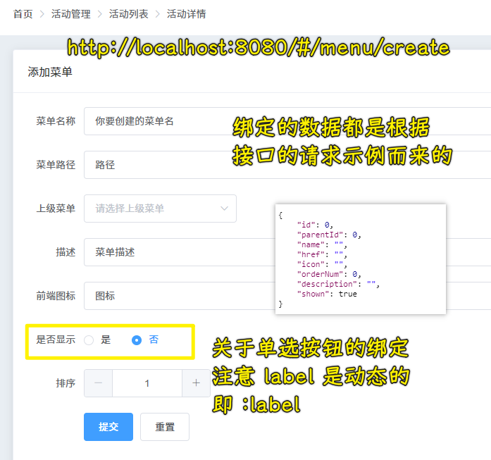

数据绑定是否成功？ -> 别忘了用 Vue 开发者工具测试一下

这些数据的描述？

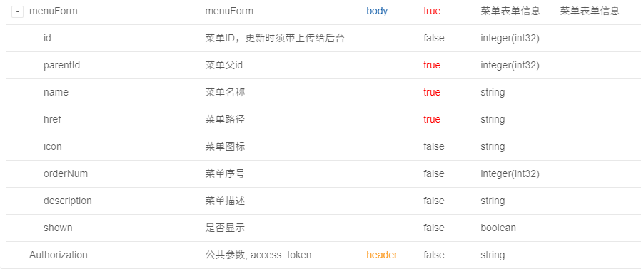

💡：单选按钮？

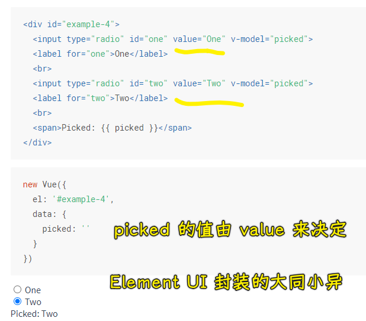

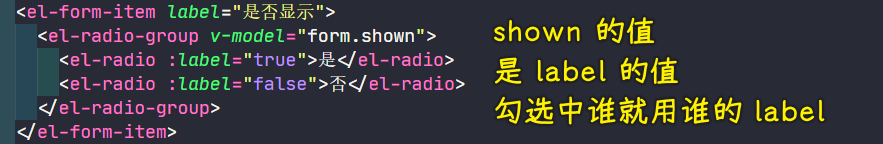

➹：[表单输入绑定 - 单选按钮 — Vue.js](https://cn.vuejs.org/v2/guide/forms.html#%E5%8D%95%E9%80%89%E6%8C%89%E9%92%AE)

### <mark>3）提交表单</mark>

接口文档：[保存或新增菜单 saveOrUpdate](http://eduboss.lagou.com/boss/doc.html#/edu-boss-boot/%E8%8F%9C%E5%8D%95%E7%AE%A1%E7%90%86/saveOrUpdateUsingPOST_1)

接口测试：

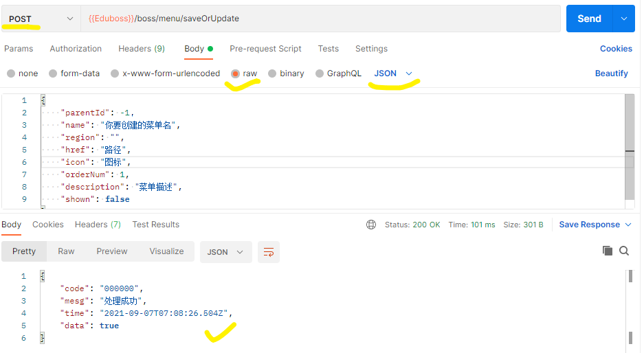

做法：

1. 添加和更新都用这一个接口`http://eduboss.lagou.com/boss/menu/saveOrUpdate`
2. 请求数据是`json`，所以不需要用`qs`了，在用 postman 测试接口时用`raw、json`
3. 根据`data.code`来确定是否把菜单添加成功

💡：表单提交校验

看看登录功能是怎么做的……

### <mark>4）处理上级菜单</mark>

接口文档：[获取编辑菜单页面信息 getEditMenuInfo](http://eduboss.lagou.com/boss/doc.html#/edu-boss-boot/%E8%8F%9C%E5%8D%95%E7%AE%A1%E7%90%86/getEditMenuInfoUsingGET)

接口测试：

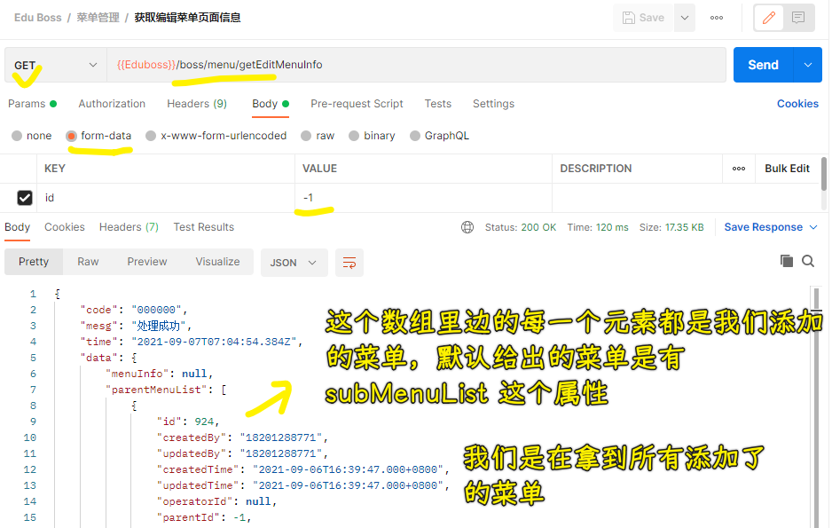

做法：

1. 定位到`src/services/menu.ts`，添加一个`getEditMenuInfo`函数，用来请求数据
2. 定位到`src/views/menu/create.vue`
   1. 在`TS`里边，定义一个`parentMenuList`数据
   2. 当`created`的时候，加载上级菜单信息，调用`getEditMenuInfo`发送请求，判断是否成功，成功那就把得到数据交给`parentMenuList`，失败，那就提示加载菜单数据失败呗！
   3. 在`template`里边遍历`parentMenuList`，把数据交给下拉选择框的每一项

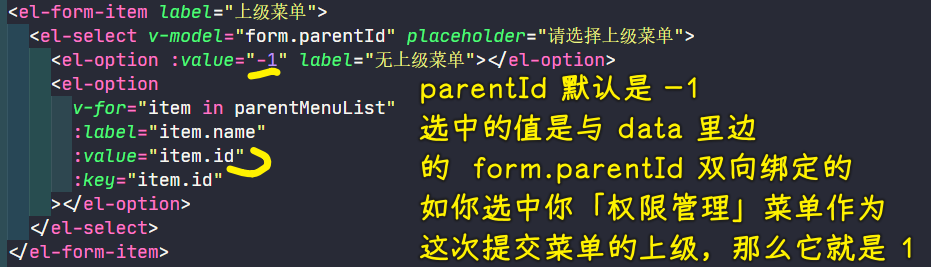

> 用户选中哪一项，那么`form.parentId`的值就是对应项的`value`值

每一个新添加的菜单后台都会自动生成一个`id`给它，前端不用自己给！

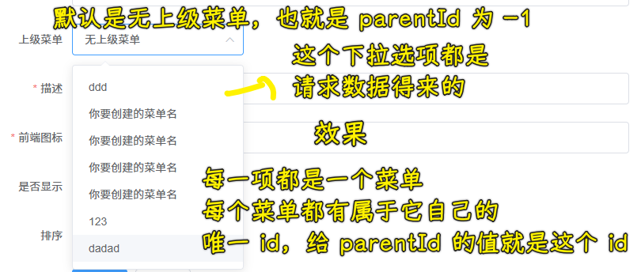

> 问题：可以添加重复的菜单名…… -> 可以在前端校验

### <mark>5）展示菜单列表</mark>

接口文档：[获取所有菜单 getAll](http://eduboss.lagou.com/boss/doc.html#/edu-boss-boot/%E8%8F%9C%E5%8D%95%E7%AE%A1%E7%90%86/getAllUsingGET)

接口测试：

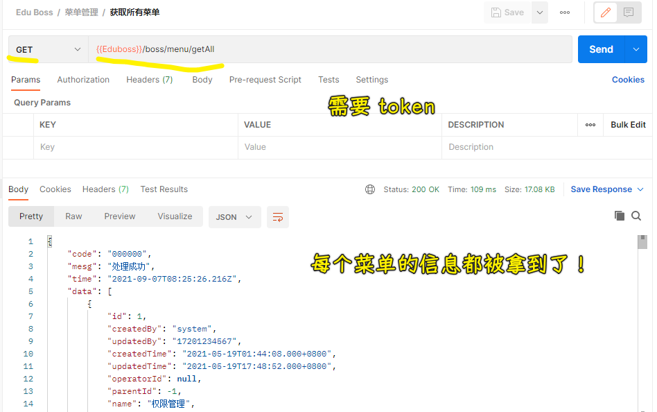

做法：

1. 定位到`src/services/menu.ts`，定义一个`getAllMenus`函数，用来发送`/boss/menu/getAll`请求
2. 定位到`src/views/menu/index.vue`，找到 Element UI 的`Table`代码，用 CRM 大法处理一波
3. 在`menu/index.vue`组件`created`的时候，请求所有菜单数据，把得到的数据交给`menus`数据，`menus`是表格的数据源，列的`prop`值是对于着菜单其中的一个属性
4. 格式化菜单的`level`属性

完成效果：

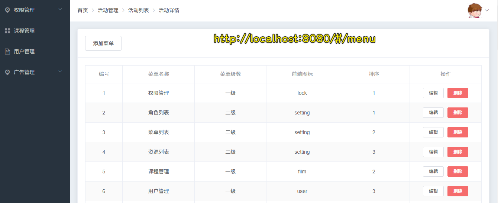

💡：格式化菜单的`level`为`0/1-> 一级/二级`这样？

用到了`table-column`的`formatter`参数，该参数的值类型是个函数

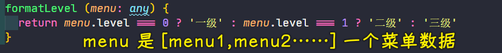

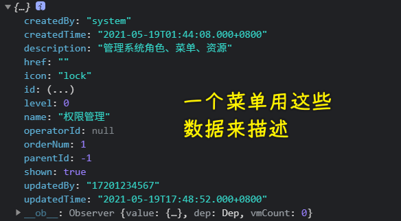

我本来是用`Vue.filter`但发现不好使，就没用了！

➹：[对 Element UI table 中数据进行二次处理 - 简书](https://www.jianshu.com/p/5cd155dd1d79)

➹：[element-ui 表格中如何对表头字段进行过滤器过滤 - 简书](https://www.jianshu.com/p/1d096d7f491e)

### <mark>6）删除菜单</mark>

接口文档：[删除菜单 delete 方法 Id](http://eduboss.lagou.com/boss/doc.html#/edu-boss-boot/%E8%8F%9C%E5%8D%95%E7%AE%A1%E7%90%86/deleteUsingDELETE)

接口测试：

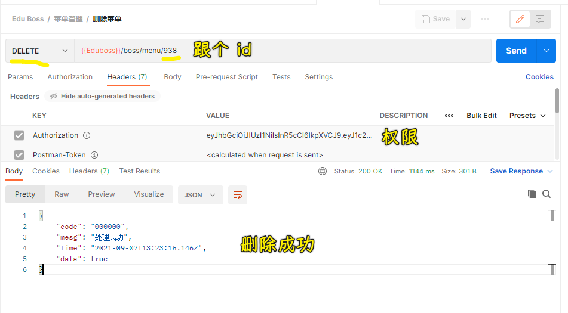

做法：

1. 定位到`src/services/menu.ts`，定义`deleteMenu` -> 发`/boss/menu/${id}`请求（请求动词是`DELETE`）
2. 定位到`src/views/menu/index.vue` -> 点击删除执行的函数`handleDelete(scope.row)`，`scope.row`是这个菜单的所有信息

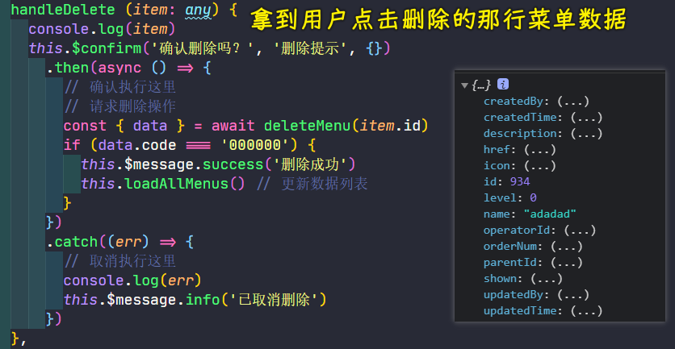

效果：

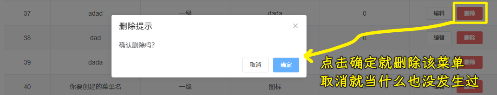

### <mark>6）编辑菜单-提取组件</mark>

编辑菜单和添加菜单用的是同一个接口

由于编辑菜单页和添加菜单页几乎一样，于是我从中提取出了一个组件`src/views/menu/components/CreateOrEdit.vue`

点击「编辑」，就是跳转到编辑页面呗，其`url`是这样的：`http://localhost:8080/#/menu/924/edit` -> 知道用户点的是哪个菜单的`id`

💡：在注册路由方面？

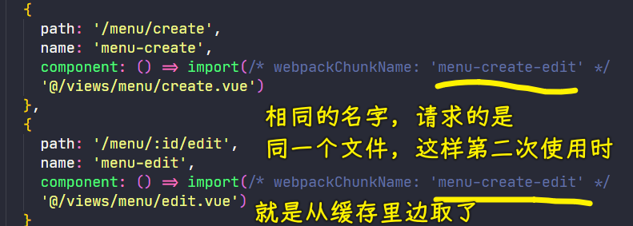

💡：在注册组件方面？

注册组件用大写，在`template`里边写组件是烤串命名，传给子组件的参数也是烤串命名

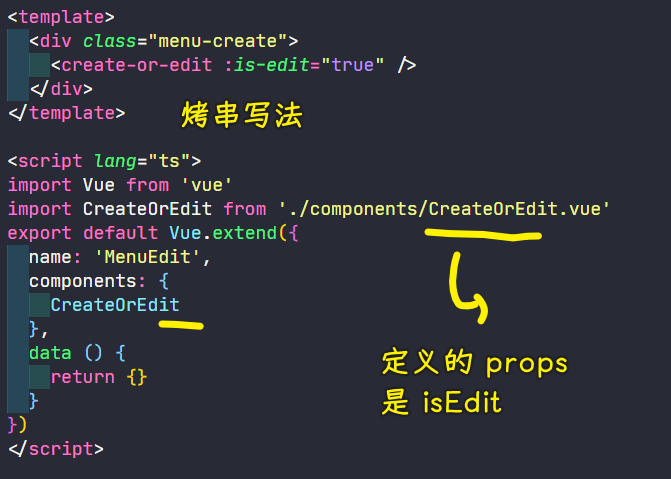

### <mark>7）编辑菜单</mark>

当用户点击「编辑」按钮，会跳到编辑页：

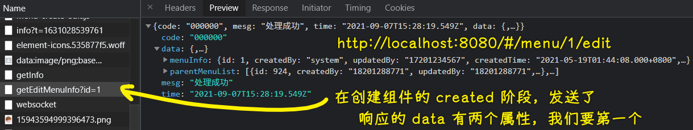

添加菜单的情况：

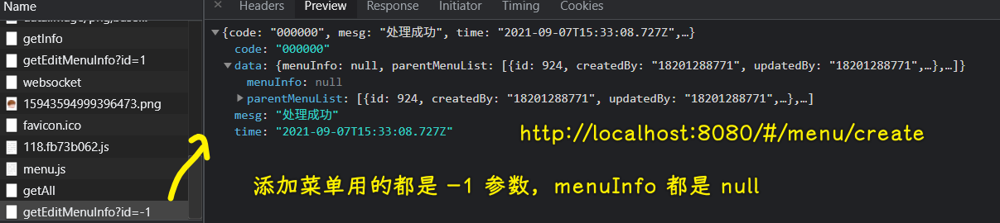

可以看到`getEditMenuInfo?`带的是`-1`或`x`（`[1,∞)`），所拿到的数据是不同的，当然，它们都能拿到所有菜单数据！

做法：

在加载下来菜单信息时，判断一下`menuInfo`是否`null`，如果不是`null`，那就意味着需要编辑这个菜单咯！

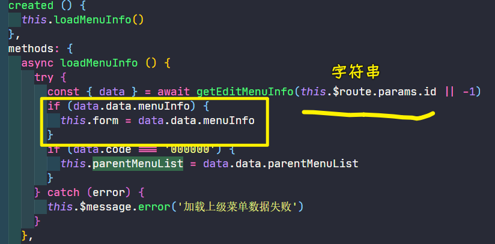

效果：

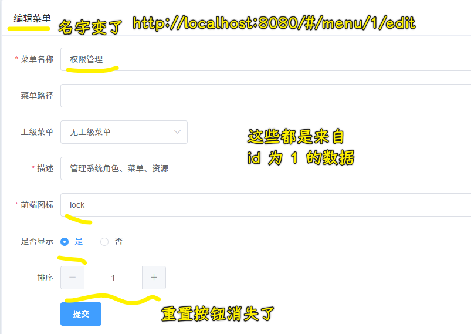