### ✍️ Tangxt ⏳ 2021-09-08 🏷️ Vue

# 06-11-资源管理

### <mark>1）布局</mark>


做法：

1. 创建`src/views/resource/components/List.vue` -> 你写的内容都在这儿，`index.vue`是它的容器
2. 用到的第三方组件：卡片、表单、按钮、Layout
3. 样式调整

💡：如何在父组件这个单文件里边修改子组件里边的样式？


`el-card`组件用到了`el-card__header`和`el-card__body`

➹：[Element UI 怎么样修改组件样式](https://blog.csdn.net/mini_1251861209/article/details/112350480)

### <mark>2）展示资源列表</mark>

接口文档：[按条件分页查询资源 - getResourcePages](http://eduboss.lagou.com/boss/doc.html#/edu-boss-boot/%E8%B5%84%E6%BA%90%E7%AE%A1%E7%90%86/getResourcePagesUsingPOST)

接口测试：


做法：

1. 定位到`src/services/resource.ts`，创建一个`getResourcePages`请求
2. 定位到`src/views/resource/components/List.vue`，在`created`阶段发送`getResourcePages`请求，拿到表格所需要的数据`resources`
3. 用`formatter`格式化`添加时间`这个字段的数据

效果：


💡：格式化日期？


安装：

``` bash
yarn add dayjs
```

使用：

``` js
import dayjs from 'dayjs'
console.log(dayjs('2021-06-25T10:40:03.000+0800').format('YYYY-MM-DD HH:mm:ss')) // 2021-06-25 10:40:03
```

➹：[Typescript · Day.js](https://dayjs.gitee.io/docs/zh-CN/installation/typescript)

➹：[Vue 如何使用 Day.js 计算常用日期详解 - 简书](https://www.jianshu.com/p/ed20fb23e658)

➹：[Day.js ：一个非常好用的轻量的处理时间和日期库_Helloweba](https://www.helloweba.net/javascript/641.html)

### <mark>3）资源列表分页处理</mark>

效果：


接口测试：


发请求带的参数，都是`current`和`size`，不管你点击了分页组件里边的哪个按钮……

分页组件代码：


整个处理流程：

1. 用户点击分页组件里边的按钮，从中可以得到用户点击的`current`或`size`
2. 点击意味着触发回调函数 -> 回调函数更改`data`的`form.size/form.current`，然后调用`loadResources`，发送`getResourcePages`请求
3. 把拿到的数据交给`resources`和`totalCount`


用户点击按钮就是在给查询条件发送请求，然后表格 UI 和分页 UI 就会局部刷新……

这是什么查询条件都没带的情况：默认就是要第一页的数据，而且最多`10`条


💡：`:current-page.sync="form.current"`这个`.sync`？

你点击了子组件映射的按钮，子组件触发事件把当前点击的按钮值，传给了`form.current`，而子组件的`current-page`也同步更新了值

说白了，这是子组件和父组件关于`props`的双向绑定

💡：`size-change`和`current-change`这两个事件的触发？


`prev-click`和`next-click`这两个事件不用写，我们点击`<`和`>`触发的都是`current`啊！

💡：用户在页面的前往第几页输入的值超过边界了？

如`-1`，那就`1`，`100`，那就`11`


➹：[Pagination 分页](https://element.eleme.cn/#/zh-CN/component/pagination)

### <mark>4）列表数据筛选</mark>

接口文档：[查询资源分类列表](http://eduboss.lagou.com/boss/doc.html#/edu-boss-boot/%E8%B5%84%E6%BA%90%E7%AE%A1%E7%90%86/getCategoriesUsingGET)

接口测试：


做法：

1. 定位到`src/services/resource-category.ts`，定义一个`getResourceCategories`函数，用来发送`GET`请求：`/boss/resource/category/getAll`
2. 定位到`src/views/resource/components/List.vue`，确定一下`data`最终会有什么数据
   1. `form`里边的数据都是查询条件
   2. `totalCount`和`resourceCategories`，一个是分页组件里边显示的总记录数，一个则是那个「资源分类」下拉菜单的
3. 在`created`里边加载资源列表和资源目录数据 -> 把得到数据交给`data`
4. 点击「查询搜索」按钮，触发`click`事件执行`onSubmit`方法 -> 把查询从第一页开始，加载资源列表

> 一个请求就是一个资源

效果：


💡：关于在`async`函数里边写`try...catch`？

我突然想起我们之前在响应拦截器里边是写了的……

### <mark>5）重置数据筛选</mark>

效果：


做法：

1. 用到了表单组件的`resetField`方法，它需要配合`Form-Item`的`prop`属性（必填项），`prop`的值，是传给`Form`组件的`model`中的字段

### <mark>6）加载中 loading 和按钮禁用</mark>

> 加载 loading 是为了给用户一个反馈啊！

效果：


做法：

- 用到了`Loading`组件的`v-loading`指令

➹：[Loading 加载](https://element.eleme.cn/#/zh-CN/component/loading)

### <mark>7）添加资源</mark>

💡：布局

用到了`Dialog`组件

关于`Dialog`组件的二次封装，参考了：[Element-UI el-dialog 二次封装复用](https://blog.csdn.net/Sandy_zhi/article/details/107854896)

但他封装的比较冗余，简洁一点的是这个：[基于 Element-UI 库的 el-dialog 二次封装弹窗组件 - 掘金](https://juejin.cn/post/6992125644104531981)

具体思路是用到了`sync`

使用：

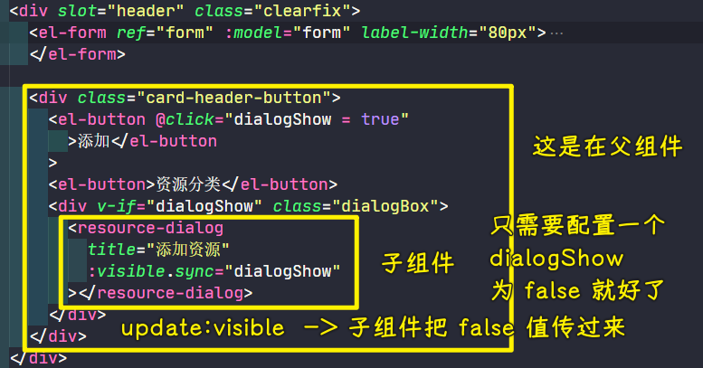

效果：

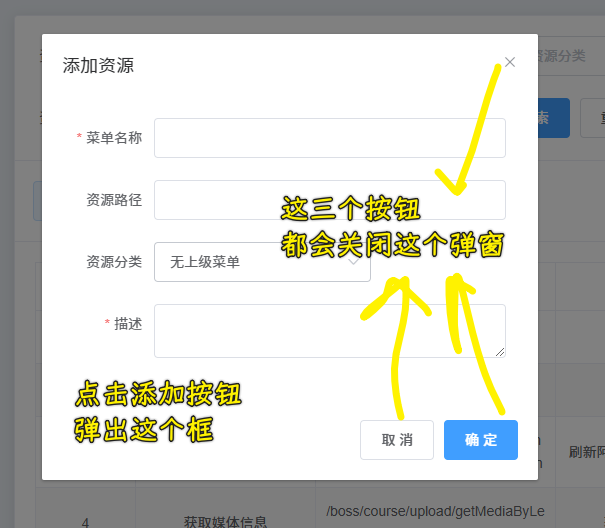

➹：[element ui 对话框 el-dialog 关闭事件](https://www.cnblogs.com/home-/p/11737306.html)

💡：添加资源

看一下原设计稿的请求是怎样的：

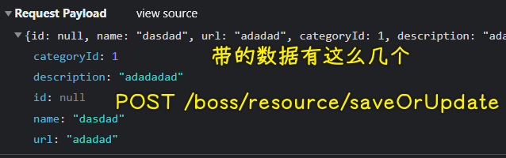

接口文档：[保存或更新资源分类](http://eduboss.lagou.com/boss/doc.html#/edu-boss-boot/%E8%B5%84%E6%BA%90%E7%AE%A1%E7%90%86/saveOrUpdateCategoryUsingPOST)

接口测试：

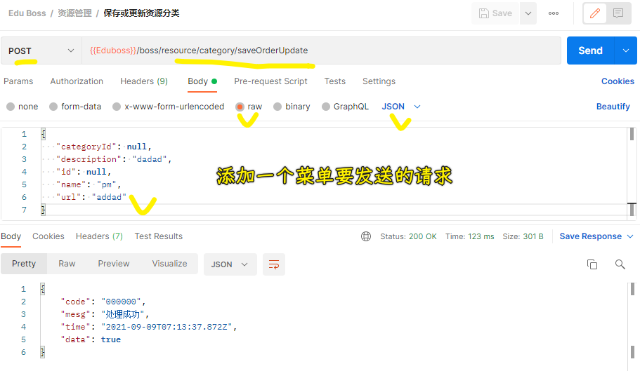

这个接口测试不对，真正的添加资源接口是这个：

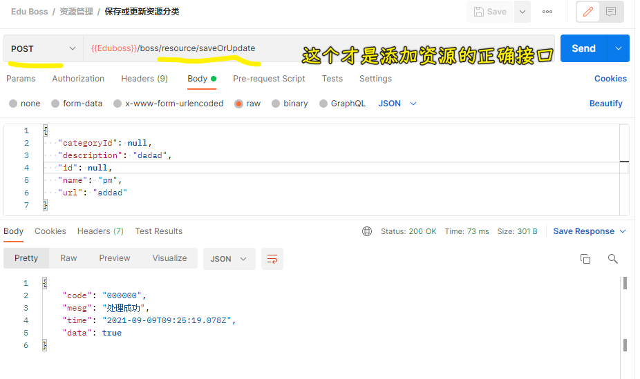

上边那个是添加资源分类的接口啊！

真的接口文档：[保存或者更新资源](http://eduboss.lagou.com/boss/doc.html#/edu-boss-boot/%E8%B5%84%E6%BA%90%E7%AE%A1%E7%90%86/saveOrUpdateUsingPOST_2)

完成效果：


怎么做？

主要是用到了父子通信，其余的跟之前添加菜单一样……

➹：[elementUI select 组件默认选中效果实现 - SegmentFault 思否](https://segmentfault.com/a/1190000018632273)

➹：[vue 组件间通信六种方式（完整版） - SegmentFault 思否](https://segmentfault.com/a/1190000019208626)

### <mark>8）编辑资源与删除资源</mark>

1、编辑资源

主要思路，给`Dialog`组件添加多一个属性，用来接收 Dialog 里边的表单已有的数据

一个问题：

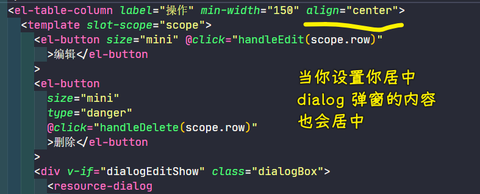

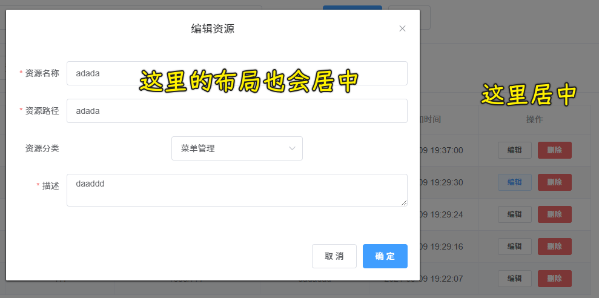

为了解决这个问题，为`Dialog`添加了这个`append-to-body`属性，这样就没有问题

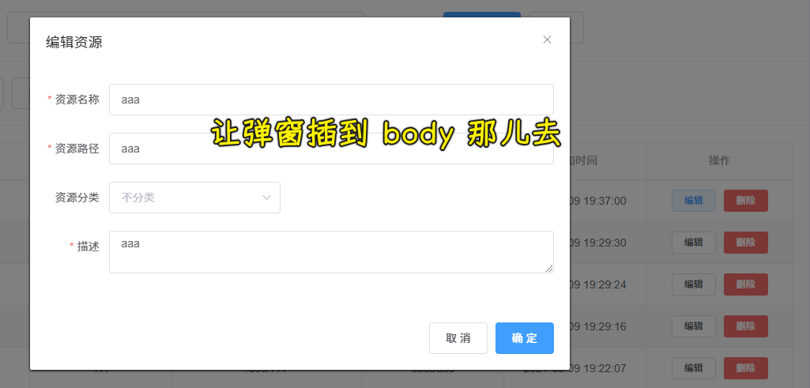

2、删除资源

接口测试：

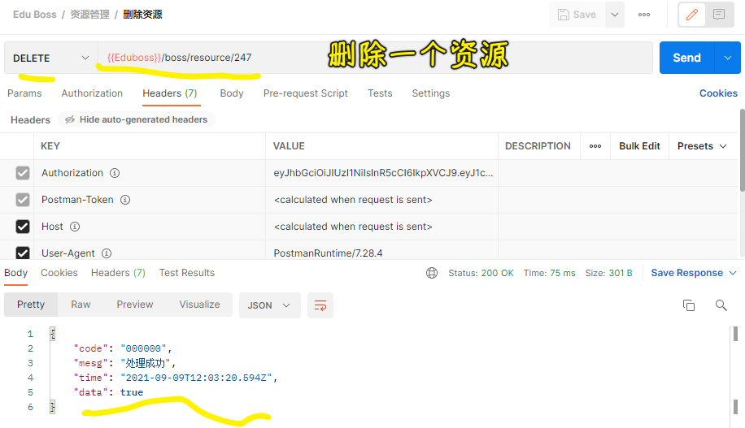

思路，跟之前删除一个菜单一样

### <mark>9）资源分类</mark>

拿到所有资源分类的接口是：`/boss/resource/category/getAll`（`GET`）

这个接口会响应什么数据？

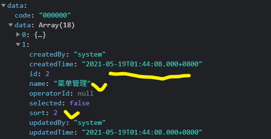

做法？ -> 跟之前的获取所有菜单一样，你把`menu`改为`category`就好了

完成效果：

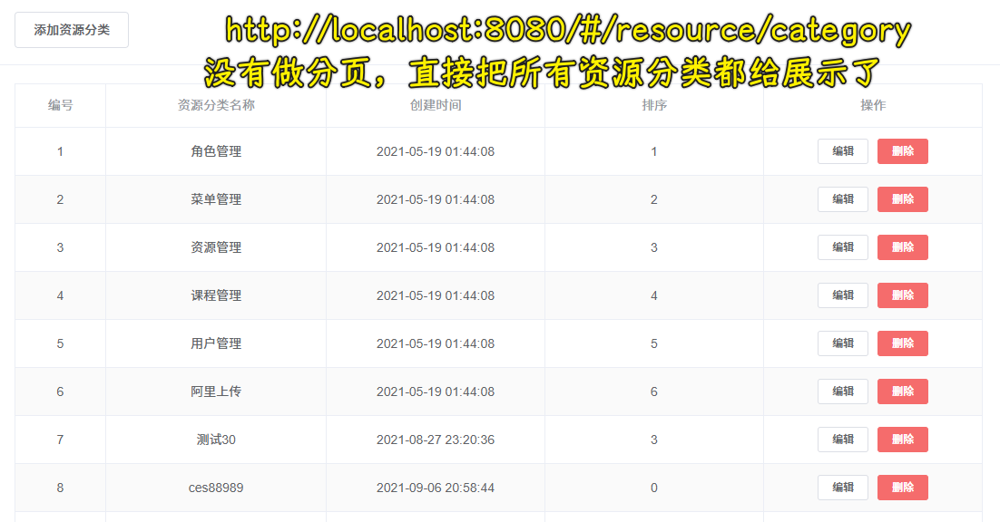

---

创建或更新资源分类的接口测试：

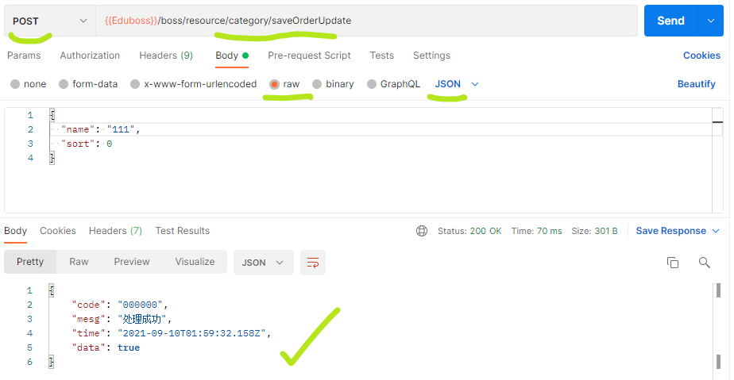

我们只需要绑定两个数据就好了 -> `name`和`sort`

伪代码：

点击添加分类 -> 弹出一个框 -> 往表单输入两个数据就提交数据 -> 在此过程中需要校验`name`，还有添加按钮`loading`

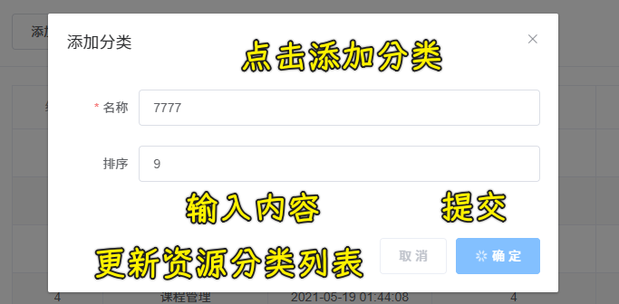

💡：编辑资源分类？

编辑的弹窗居然出现了黑边：

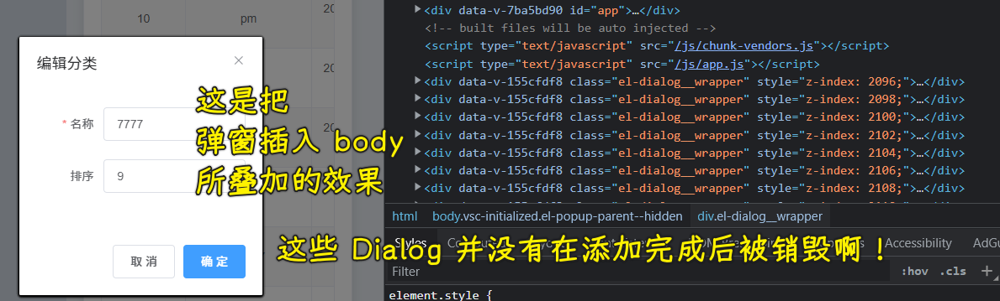

为啥会有这样的问题？ -> 因为我们把`Dialog`写到表格里边去了，这样每一个行都隐藏着一个`Dialog`了！


💡：删除资源分类？

接口测试：

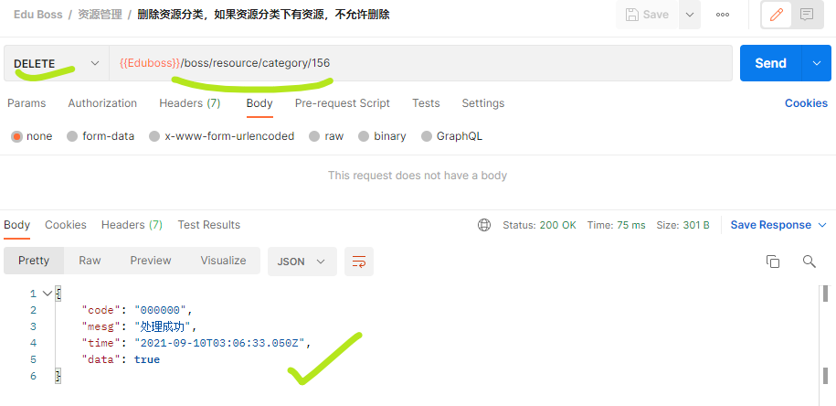

### <mark>10）小结</mark>

- 视频看第一遍，记录这样做的缘由，以及一些你不是很懂的知识点
- 开始看提交代码，把功能给实现了，记录整个怎么做的过程，并且记录遇到的问题
- 视频是否看第二遍？ -> 带着在做的过程中所遇到的问题去看老师是怎么解决的……