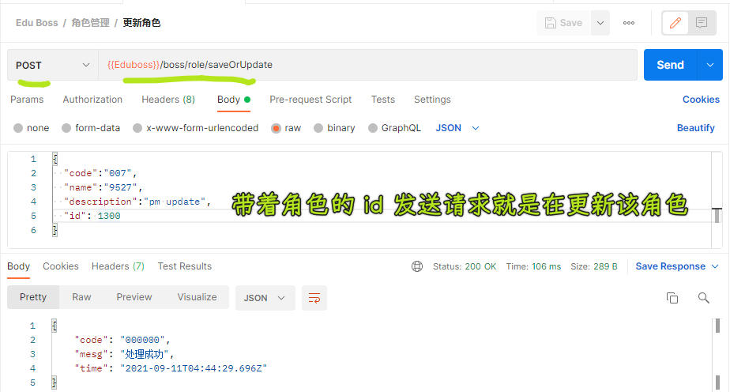
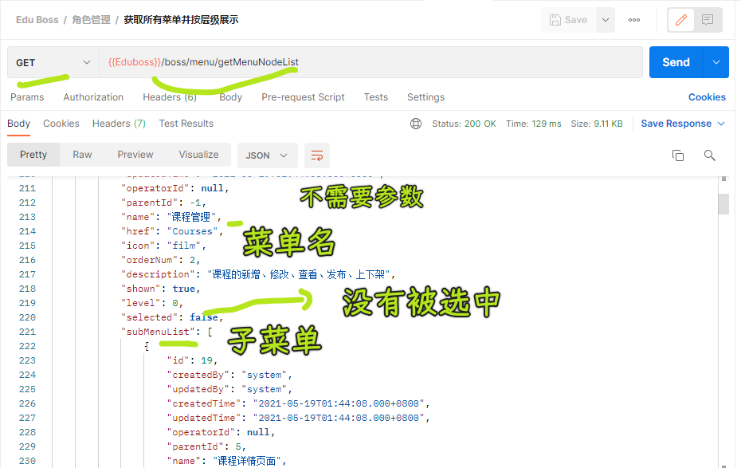

### ✍️ Tangxt ⏳ 2021-09-10 🏷️ Vue

# 06-12-角色管理

## ★角色管理

### <mark>1）添加角色、编辑角色</mark>

💡：关于`Dialog`组件？

其内容可以嵌套一个组件，如果你对该组件不加`v-if`的话，那么当你关掉`Dialog`后，再打开一个`Dialog`，你会发现该嵌套的组件并没有销毁！这意味着`created`永远只会执行一次，所以我们要加上`v-if`，以此来确保每次打开`Dialog`都会重新创建这嵌套的子组件！

💡：保存和更新角色的操作？

- 提交的时候，只提供`code、name、description`就是保存操作 -> 没有`id`，后台就会把这次请求视为添加操作！
- 提交的时候，还有`id`，那就是更新操作

💡：关于`Dialog`的使用？

之前的做法是自己想的，再加上一点网上的参考，现在对比老师讲的，老师的做法显然更简洁一点 -> 唯有比较，才能看出自己的问题！

比如：`Dialog`标题的处理，我的做法是用`props`传`title`名，老师直接用了一个`isEidt`，去控制`title`的值，这样就不用多写一个`props`了 -> 这个`isEdit`原先的目的是控制这个`Dialog`到底是一个添加操作还是编辑操作！

### <mark>2）分配菜单</mark>

💡：遇到动态路由路径参数，让对应的路由组件解耦？

也就是说路由组件可以作为普通组件来使用，需要在路由配置里边添加一个`props:true`，而路由组件则添加一个`props`为`roleId`，这个属性与动态的`:roleId`是保持一致的！

为啥要这样做？ -> 让该路由组件的使用方式变得更灵活，不然，我们只能透过`this.$route.params.roleId`来获取了！

> `alloc-menu`组件是路由组件`role/:roleId/alloc-menu`，它依赖动态的路由参数`roleId`，如果我们想把该路由组件当作普通组件来使用的话，就得把该路由组件与这个`roleId`数据解耦了！

💡：树形菜单的节点关系？

数组 -> 一个元素是一个节点对象，节点对象有个`children`属性，它是个数组，它的元素是子节点，同理，子节点又有子子节点


请求得到的也是树形结构的数据，只是节点名叫`name`，子节点数组叫`subMenuList`

拿到用户勾选的节点的`id`？ -> `getCheckedKeys`要配合`node-key`（节点`id`）来使用

这个角色要保存分配的权限，那么这所对应的那个接口，就得拿到这些被勾选到的节点的`id` -> 注意：节点的勾选，只有同级互斥，你勾上级那么下级不用勾，都会被自动勾选掉！


`:default-checked-keys="[5]"`这个属性是与`node-key`配合使用，`[5]`的这个`5`表示`id`为`5`的节点被默认选中了！如果它是一级节点，那么其旗下所有的子节点都会被选中！


💡：写页面的思路？

1. 确定路由跳转到该组件
2. 准备好`template`，以及测试用的数据
3. 根据接口请求的数据对`template`、`data`进行改造

💡：关于请求接口，用的是查询字符串？

用`axios`发送请求可以在路径后边拼问号`?`，也可以用`params`属性，`axios`它会把`params`这对象转化为`key=value&key=value`这种数据格式，然后把这数据放到`url`的后边（以`?`分割）


💡：`getRoleMenus(this.roleId)`这个接口？

拿到是所有菜单列表，但是这些菜单都有一个`selected`属性，该属性为`true`意味着该角色已经有这个菜单的权限了！

用到了递归遍历，因为我们要遍历选中那些`selected`属性为`true`的菜单，然后获取这些菜单的`id`，让它们在树形菜单里边默认被选中！

Vue 的`push`元素问题，由于地址不变，视图并不会发生更新，于是对`checkedKeys`用了重新赋值的姿势！

### <mark>3）分配资源</mark>

思路同上

## ★用户管理

用户管理这个模块的功能是，给用户分配角色，不同的角色意味着该用户登录进来这个管理系统会看到不同的界面

> 这个项目无法注册用户啊！ -> 接口文档的「用户登录」接口说到「用户登录，未注册用户会自动注册并登录」，然我测试了一下，这是不行的！

视频里讲的是给用户分配角色功能，至于那个用户展示列表以及搜索功能，只好自行完成了！

用到了下拉框的多选

做什么？ -> 展示角色列表 -> 分配角色，提交分配 -> 展示已勾选的角色

💡：封禁用户？

这个接口失效了


## ★写代码

1）展示角色列表、带分页组件、带搜索功能、可以增删改这个角色

💡：在 Vue 中全量引入时，可以使用 `Vue.use(Element, {size: 'small'})` 设置全局组件的默认`size`


💡：在使用 Postman 的时候，能不能自动更新`Authorization`？


``` js
pm.sendRequest({
    url: "http://edufront.lagou.com/front/user/login",
    method: 'POST',
    header: {
        'Accept': '*/*',
        'Content-Type': 'application/x-www-form-urlencoded',
    },
    body: {
        mode: 'urlencoded',
        urlencoded: [{
            key: 'phone',
            value: '18201288771'
        }, {
            key: 'password',
            value: '111111'
        }]
    }
}, function(err, res) {
    // 提取 Response Body 中的 token 值，并添加到 Headers 中
    // console.log(res.json().content)
    // console.log(typeof res.json().content)

    const data = res.json().content
    const obj = JSON.parse(data)
    const value = obj.access_token
    // console.log(obj)
    // console.log(value)
    // pm.request.headers.add({ key: 'Token', value: res.json().access_token })
    // pm.collectionVariables.set("Authorization", value);
    // pm.environment.set("Authorization",value);
    pm.request.headers.add({
        key: 'Authorization',
        value
    })
    // console.log(response.json());
});
```


至此，再也不用手动去更新全局的`Authorization`值了！

这个发送`JSON`数据的模板：

``` js
pm.sendRequest({
    url: "https://{your url to get token}",
    method: 'POST',
    header: {
        'Accept': 'application/json',
        'Content-Type': 'application/json',
    },
    body: {
        mode: 'raw',
        raw: JSON.stringify({ username: "username", password: "password" })
    }
}, function (err, res) {
    // 提取 Response Body 中的 token 值，并添加到 Headers 中
    pm.request.headers.add({ key: 'Token', value: res.json().access_token })
});
```

关于变量的作用域：


我之前没留意这些变量的关系：

集合变量设置：


全局变量设置：


我们的代码设置的是`Local variables`也就是临时变量，只适用于`A`请求

➹：[Postman 实现 Token 参数化 - 三分之七橙](https://umm.js.org/p/c23ff637/)

➹：[Using variables - Postman Learning Center](https://learning.postman.com/docs/sending-requests/variables/)

1、角色列表

接口测试：


2、删除角色

接口测试：


3、添加角色、获取角色、更新角色

添加角色接口测试：


获取角色接口测试：


> 这个接口用不用也可以实现功能

更新角色接口测试：



---

完成效果：


4、分配菜单

「获取所有菜单并按层级展示」接口测试：



「给角色分配菜单」接口测试：


当我们给角色分配完菜单后，再次点击该角色的「分配菜单」，理应看到已经被勾选的菜单项：


该实现逻辑很简单：


有`bug`：


bug 原因：


修复这个 bug ，自己想了一个很沙雕的姿势（应该有冗余代码），具体思路是这样的：

1. 在原先`getCheckedKeys`的基础上，拿到有子菜单的菜单，把这些菜单放到`hasSubMenuList`里边去
2. 遍历`hasSubMenuList`，找出有子菜单为`selected===false`的节点（父菜单），把找到的`push`到`filterId`
3. `checkedKeys`是存放默认勾选中的节点`Id`，让`checkedKeys`和`filterId`做个差集，如`[1,2]`和`[1]`的差集就是`[2]`，把差集作为`checkedKeys`的值

➹：[JS - 计算两个数组的交集、差集、并集、补集（多种实现方式）](https://www.hangge.com/blog/cache/detail_1862.html)

💡：给`created`加`async`？


`mouted`执行完，才会去接着执行它！