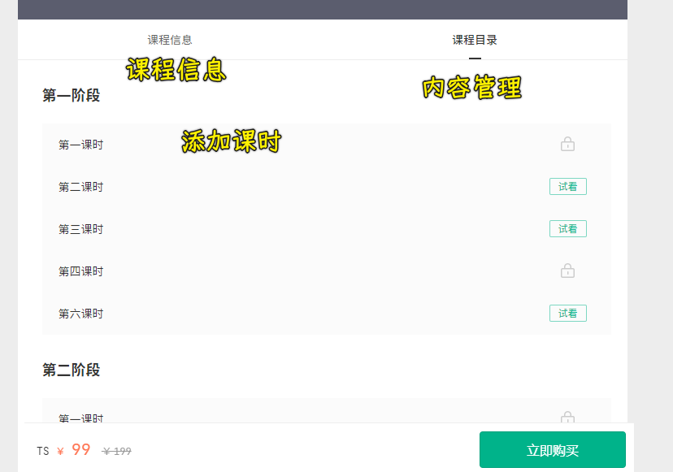
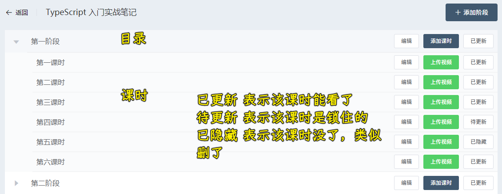
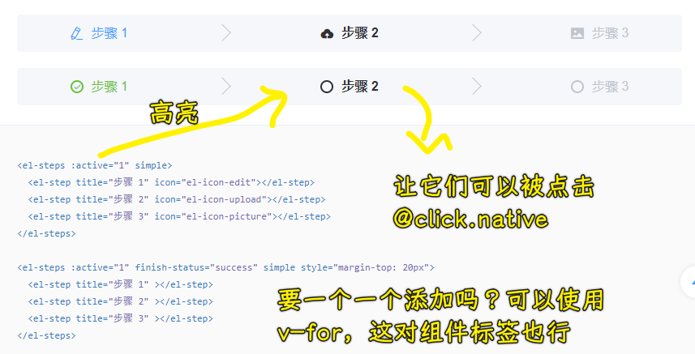

### ✍️ Tangxt ⏳ 2021-09-15 🏷️ Vue

# 06-13-课程管理

## ★模块介绍

这个课程管理模块对应的前端展示页：<http://edufront.lagou.com/#/>

有哪些功能？

1. 课程筛选
2. 课程列表
   1. 课程状态：红色为未发布状态
   2. 操作：点击「上架」会让课程状态为绿色，表示已发布状态 -> 这会在前端页面里展示这个课程信息
3. 新建课程
   1. 课程新建完，会在列表页看到它
4. 编辑课程 -> 修改课程内容
5. 内容管理
   1. 前端展示里边可以看到有了课程的基本信息以外，还得有课程内容
      1. 有目录
      2. 有试看，查看课程内容，如文字或视频

## ★展示上架状态

`status`为`0`是下架，`statues`为`1`是上架

由于这不是布尔值所有这得指定`active-value`和`inactive-value` -> 这一点可以查看`switch`组件的「扩展的 value 类型」 -> 默认不写这两个属性，是识别布尔值的！

## ★处理课程上下架

点击按钮 -> 发请求，改该课程的「上架状态」 -> 优化：在发请求期间禁用按钮、提示上下架成功

请求回来的课程数据，为每个课程添加一个`isStatusLoading`，默认是`false`，一旦用户点击了某个课程的按钮，在请求发送期间，会禁止用户再次点击该按钮！

## ★添加课程-使用步骤条

一个页面展示 4 个表单太大了，我们可以分步骤来处理，如第一步处理第一个表单，第二步处理第一个表单……
最后再提交

注意这是把交互划分了步骤，而不是把数据划分了多步来处理 -> 这数据是一次性提交的，可不是分批次提交

用到「Steps 步骤条」这个组件 -> 选择简洁风格的

💡：如何点击步骤就能高亮该步骤？

`el-steps`有一个属性`active`属性，它的值有`0、1……`这样，想要让第一步展示内容，就得把该值设为`0`，同理，第二步就是`1`这样……

💡：如何让步骤和内容对应？

用`v-show` -> 因为切换比较频繁

💡：填写完一步的信息，就可以点击下一步？

💡：如何回到上一步？

组件没有提供点击步骤回到上一步的功能 -> 也就是没有提供`click`事件啊！ -> 但我们可以使用`.native`来触发原生的点击事件，用了该修饰符，可以把`click`事件注册到`el-step`组件的根节点上，也就是注册了一个原生的事件

💡：鼠标移到步骤条上的某个步骤有小手？

---

👇：填充表单内容

## ★添加课程-搭建表单结构

用到的组件：

- `Form`
- `InputNumber`
- `Upload` -> 用户头像上传
- `Input` -> 复合型输入框，带后缀的 

💡：给`Upload`组件官方样式，不起效果？

> 想要把样式作用到子组件的非根元素上！ 

在`scoped`下，样式只会作用到子组件的根节点，如果你想要样式作用到组件更深的地方（子组件的非根节点），那就需要使用到深度作用操作符了

使用`>>>`，该语法是单文件组件提供的特殊语法，预处理器可没有这样的语法！

有些像 Sass 之类的预处理器无法正确解析 `>>>`。这种情况下你可以使用 `/deep/` 或 `::v-deep` 操作符取而代之——两者都是 `>>>` 的别名，同样可以正常工作（也就是说名字不一样，但效果一样呗）。

测试发现，`::v-deep`更通用一些，总之，哪个不报错就用哪个

文档：[Scoped CSS - Vue Loader](https://vue-loader.vuejs.org/zh/guide/scoped-css.html)

💡：秒杀活动？

通过一个开关控制下边内容的显示与 隐藏！

💡：课程详情

等基本功能完成后，再做

因为需要用到富文本编辑器，这有点麻烦

我们先搞个`textarea`，用来随便填点什么 -> 跑通整个基本流程，再来处理富文本编辑器的问题 

富文本编辑器 -> 在普通文本格式基础上，加了其它格式仅此而已！

## ★添加课程-基本信息数据绑定

找到添加课程的接口，根据这个接口的要求，把输入的数据分别绑定到对应的表单项上 -> 以确保可以拿到数据，然后把数据提交上去！

组件的`data` -> `course` -> 是接口的示例数据，但这些数据有些是不需要用到的，我们可以先不去掉，先绑定完，之后再把没用到的数据给去除掉！

用 Vue 开发者工具测试一下在页面输入的数据是否已经绑定成功了
