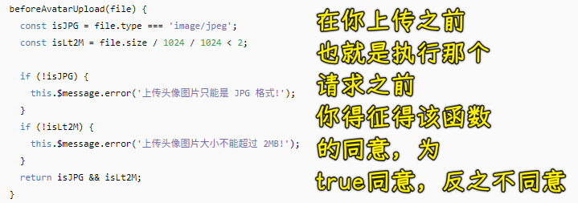
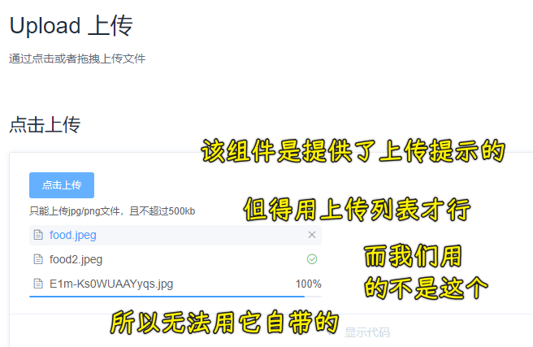
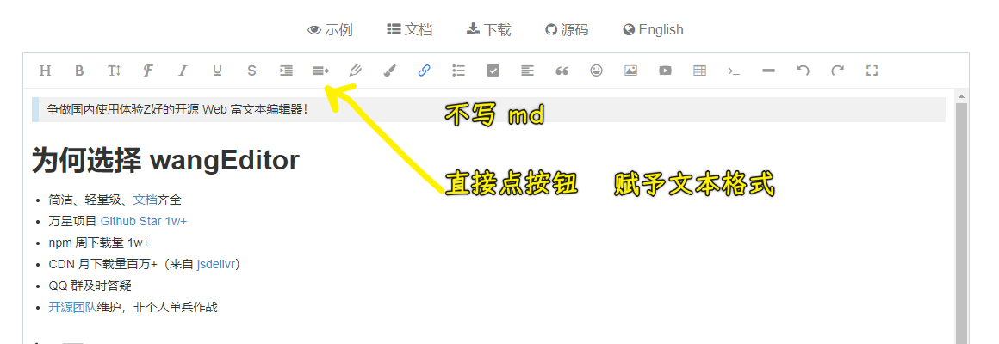
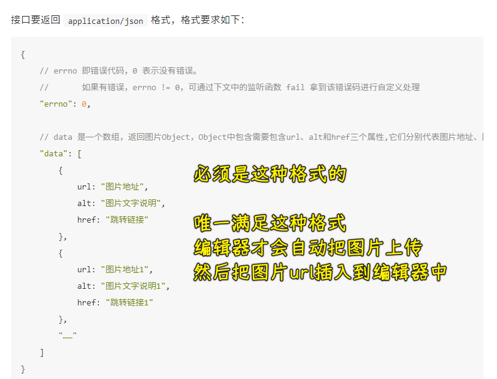
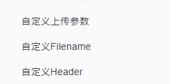
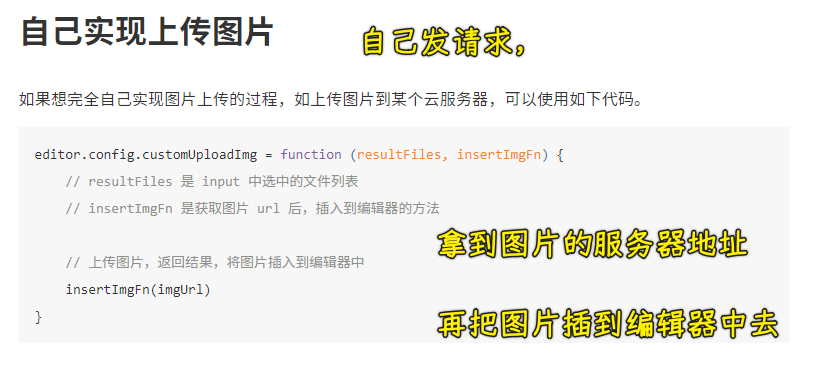

### ✍️ Tangxt ⏳ 2021-09-15 🏷️ Vue

# 06-14-添加课程

## ★上传课程封面-分析实现逻辑

在写这个功能前，先明确知道后端接口需要什么：

- `courseListImg` -> 课程列表展示的图片
- `courseImgUrl` -> 介绍封面（接口文档的描述写错了），课程详情页有一个介绍封面

它们俩都是字符串，是一个地址，而该地址是从服务器端来的！

有一个「上传图片」接口，在调用「保存或者更新课程信息」之前，我们就已经调用了该接口，把图片上传成功了，而服务端就会返回该图片在服务器端的地址，有了图片的地址，我们就可以把它们填写到上边的`courseListImg`和`courseImgUrl`当中去，当你保存课程后，后端就会把这地址和这课程对应起来！

「上传图片」接口要的数据的数据类型是`file` -> `formData`（文件类型的数据） -> 返回的数据里边有该上传图片在服务器那边的访问路径

我们要做的很简单，就是把图片上传给服务器，服务器响应回了图片访问路径，我们就把这个路径添加到绑定的数上！

## ★上传课程封面-上传组件使用

💡：如何把图片上传到服务端？

使用`upload`组件上传文件（图片等） -> 支持自动上传（只需要把上传所需的参数配置一下就好了）

💡：上传组件内部的请求用的不是`axios`？

这意味着不走请求拦截器，所以这就不能自动添加`token`了呀！

上传组件提供了一个`headers`属性，以供我们设置上传的请求头部

也提供了一个`name`属性，不过后端接口给的参数名是`file`

可以通过`upload`组件提供的配置完成上传行为，但是老师个人不太喜欢，因为它提供的配置参数实在是太多了，毕竟这个组件的内部最终就是帮我们搞一个请求罢了！

这还不如我们自己去写代码，然后提交文件上传嘞！

💡：如何自己写代码实现自定义上传？

`upload`组件提供了一个`http-request`属性 -> 覆盖默认的上传行为，可以自定义上传的实现 -> 在这个函数里边自己发请求提交上传的文件

你用了该属性，`upload`组件就不会自动帮你上传了，你得自己来

`http-request`的值是一个函数，该函数会拿到该组件的上传配置，该配置里边有一个`file`属性，该属性就是我们要上传的文件对象

「上传图片」要的请求数据类型是`multipart/form-data`

我们得`new`一个`FormData`对象`fd`，把文件对象放进去

``` js
// file 是接口文档指明的 file 参数，可不是乱写的
fd.append('file', options.file)
// 你还可以继续添加
```

`fd`是一个表单文件对象，它里边承载的都是文件

这个`fd`就是给服务器的请求`data`

上传提交成功后，该组件提供了一个功能，可以自动执行`on-success`回调，不过它是把上传时的图片文件`base64`化了

而我们要的是响应回来的图片的路径

所以我们不需要用到该组件的上传成功回调

💡：`beforeAvatarUpload`？



总之，它是在上传文件之前做验证的，如验证文件的格式、大小等…… -> 控制用户上传的文件

上传文件的本地验证，可以自己添加其它的，如其它格式等

👇：介绍封面的上传跟课程封面的上传几乎一样，可以单独封装一个组件出来 -> 这样会更方便一些

## ★上传课程封面-封装上传组件

为啥要封装上传组件？ -> 封装好的组价使用起来，维护起来会方便得多

💡：如何对`upload`组件进行二次封装？

很简单，用`v-model`就好了！ -> 了解`v-model`这个语法糖的本质

在封装好的这个组件上添加`v-model` -> 本质是父子通信

完成后的效果 -> 同一个组件`v-model`的数据不一样，UI 呈现的数据也不一样

一定要用调试工具确认绑定的数据是没有问题的！

> 通过参数，也就是`props`让这个二次封装的`upload`组件变得更加灵活，如添加`limit`参数等

根据自己的需要去灵活定制，这就是组件的灵活性

## ★上传进度提示-使用进度条组件

`upload`组件提供的进度提示：



💡：自定义添加进度提示

使用`Progress`组件的「环形进度条」

做法：

1. 拷贝基本的代码
2. 粘贴到文件里边 -> 注意不要放到`upload`组件里边
3. 保证进度条的大小跟上传区域一致

👇：如何让请求走进度条百分比？

## ★上传进度提示-完成

用到了`axios`提供的`onUploadProgress`属性，它是个函数，参数是一个事件对象`e`，`e`有两个关键属性`loaded`和`total`，前者表示你传了多少数据量，后者表示这个总数据量，二者相除乘于`100%`就是此刻的上传进度

这个是 HTML5 中新增的上传响应事件

在测试的时候，为啥要调整成慢速？ -> 因为慢速意味着每次传的数据量少，那触发`onUploadProgress`的次数就多，如果快速网络的话，那触发`onUploadProgress`的次数就不多了

💡：如何确定`Progress`组件的`props`的默认值？

打开调试工具查看该组件的`props`就好了

我们可以给`el-progress`组件`status`为`undefined`（看调试看到的，而不是给空字符串`''`，给空字符串的话，控制台会有这个组件的校验警告），即便文档提示它有三个确切的字符串值

💡：上传成功后再上传？进度条会倒回去开始？

上传成功后，就得重置`percentage`的值

---

上传进度提示是跟你发送请求时一点点上传数据是息息相关的，这意味着你这个请求完成的时间是多少！

## ★发布成功

添加课程是不需要`id`的，所有把`data`里边的`id`项都给删了

那什么时候需要用到`id`呢？ -> 修改课程的时候

💡：课程排序的作用？

输入的数字越大，那这个课程的展示就会越靠前！

💡：关于秒杀时间，服务端不接受具体的时分秒？

把`el-date-picker`的`type`设为`date`，而不是`datetime` -> 值的格式是`yyyy-MM-dd`

---

感觉后台管理系统就是在为数据库添加记录，而前台就是展示添加这些记录！

## ★富文本编辑器介绍


适用于开发者写`md`，而普通用户对于`md`是有学习成本的，普通用户会更喜欢类似于 Word 这样的编辑方式

所以我们选择这个：[wangEditor - 轻量级 web 富文本编辑器](https://www.wangeditor.com/)



这种相当于所见即所得，即类似 Typora 这样

总之，这更适用于普通用户，不过不管用哪一种，从开发角度来讲，用哪一种都无所谓！

💡：推荐一些比较经典、质量比较稳定的富文本编辑器？

富文本编辑器有很多，但常用的没几个：

- ckeditor5：功能、稳定性好，内置了一些插件、扩展性非常好
- quill：近几年出来的，扩展性、功能性也非常好
- medium-editor：非常老牌，更新程度不频繁，维护性一般，但这并代表它不能用，它的功能目前还是非常强大的！
- wangEditor：起初是国人个人开发的，之后有一些开发者加入一起来协同开发 -> 功能和应用性也非常好，使用起来方便
- ueditor：百度推出的，功能非常强大，尤其是和百度自身的业务集成起来非常的便利，如百度地图扥功能组件，缺点：不维护了，但这并代表这不能用 -> 之前维护的时间挺长的，总之质量还是挺稳定的！
- tinymce：也非常好用，无论是功能还是扩展性都已经做得非常不错了

既然给出了那么个选择方案，那我们该用哪一个呢？

还是那句话 -> 它们各有优缺点，没有谁一定好，谁一定不好！

总之，你要选择它们中其中一个，你可以这样来：

1. 尽量满足自己的功能需求
2. 看仓库是否还在维护，不维护就不用了 

这几个都是质量和维护性相较于其它来说，要更好一些

所以，你挑一个自己喜欢的就好了

老师挑的是「wangEditor」 -> 用来作为使用例子

不管用哪个富文本编辑器，从使用角度来讲都差不多 -> 都是照着文档把这个东西配置到你的项目里边去，然后再根据自己的需要做一些灵活的扩展

## ★封装使用富文本编辑器组件

文档：[Introduction · wangEditor 用户文档](https://www.wangeditor.com/doc/)

做法：

1. 安装
2. 引入，创建实例，引入`dom`
3. 把富文本编辑器组件封装成更通用的组件 -> 放到`components`目录下

💡：官网是要操作`dom`的？

尽量不要在单文件组件里边操作 DOM，而是用`ref`、`created`之类的

它不需要配置就能直接使用了

💡：如何把输入给富文本编辑器的数据绑定给`data`？

输入的数据 -> 转化得到的是 HTML 文本

你可以为富文本编辑器设置初始值，这是双向同步的！

在`created`的时候，事件监听在把富文本扔到页面之前，而初始值设置是在之后

💡：扩展工具栏怎么做？

- 自定义扩展菜单 -> 看文档

## ★富文本编辑器-图片上传

💡：编辑器是如何处理图片格式的？

1. 给图片地址
2. 可以拖小和拖大图片 -> 这是在设置宽高
3. 默认图片最大宽度是`100%`

图片 -> ``

💡：如何上传本地图片？

第一种姿势：

需要约束服务器端接口返回格式



第二种姿势：



这种方式是很麻烦，然这些都是发个请求上传图片罢了

所以我们可以自实现上传图片

第三种姿势：



💡：封装的请求接口，第二个参数是可选的？
