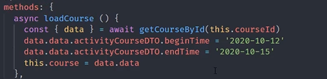

### ✍️ Tangxt ⏳ 2021-09-17 🏷️ Vue

# 06-15-编辑课程

有一个「编辑」按钮，点击它的效果是：

1. 展示已保存的数据
2. 重新保存

把整个创建课程流程封装成一个组件！

💡：写代码的时候，可以先写死，调试成功后，再自行格式化数据？

`beginTime`默认是时间戳格式，但日期组件不是要这种格式的，所以我们可以先写死，看看日期组件是否正常拿到数据，之后，我们在自行格式化这个数据！

老师用了处理时间的类库 -> `moment`

不要时分秒，因为服务端接口在转化的时候不接受啊！

💡：接口做的好？

有`id`就是保存，没有`id`就是新增！

