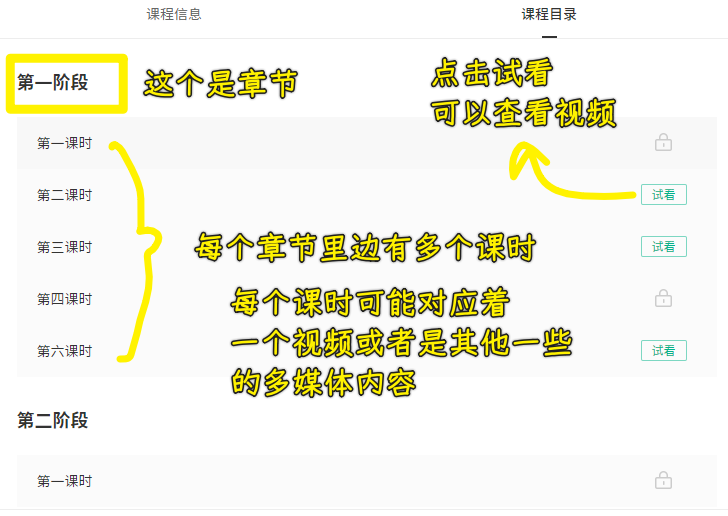
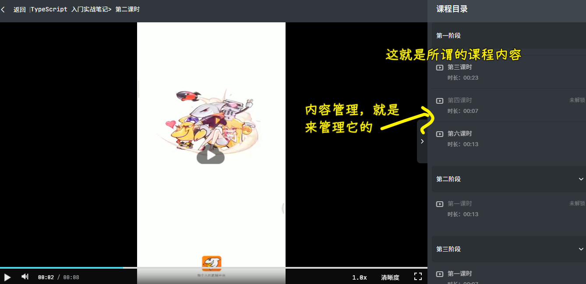
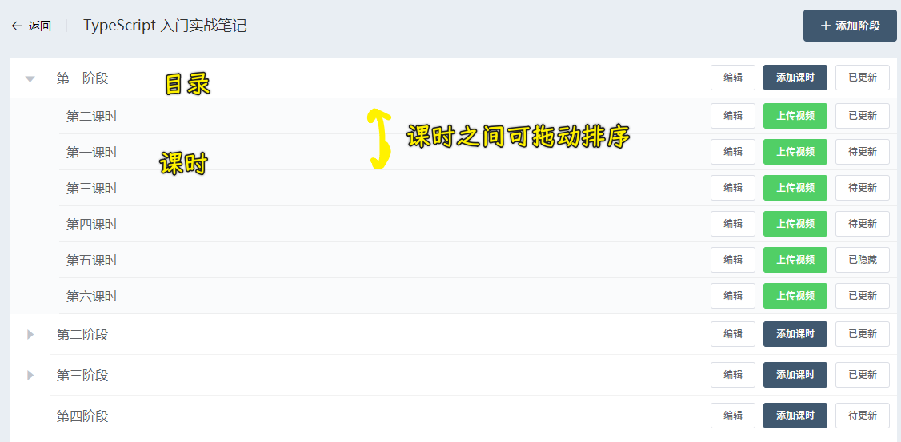
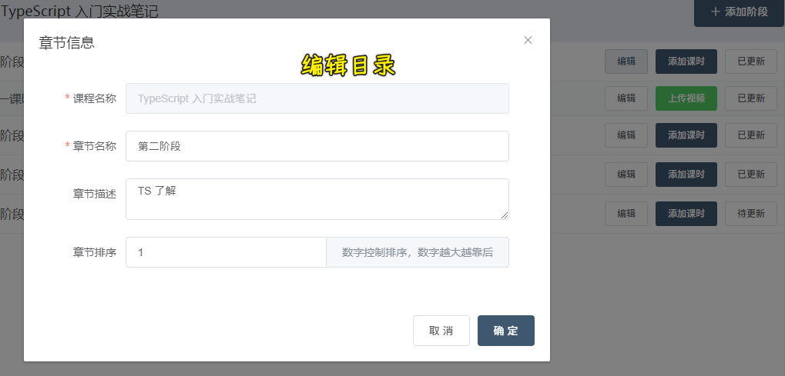
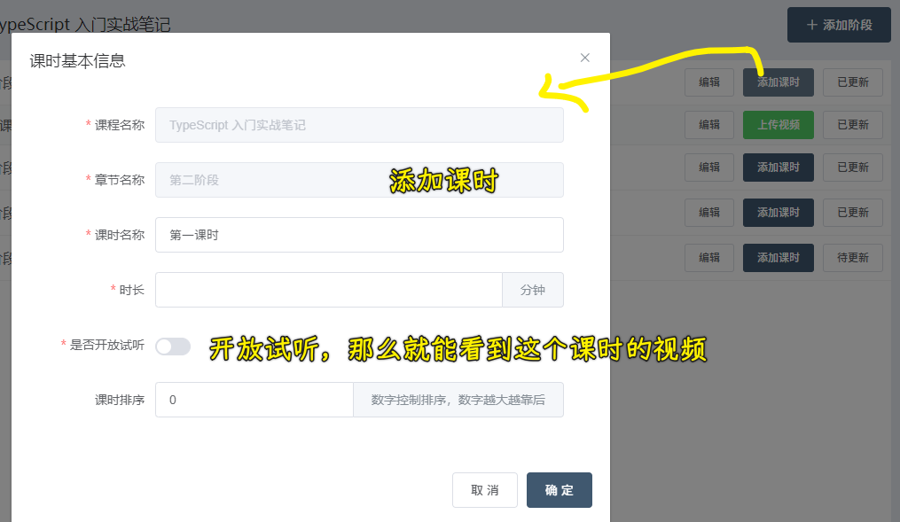
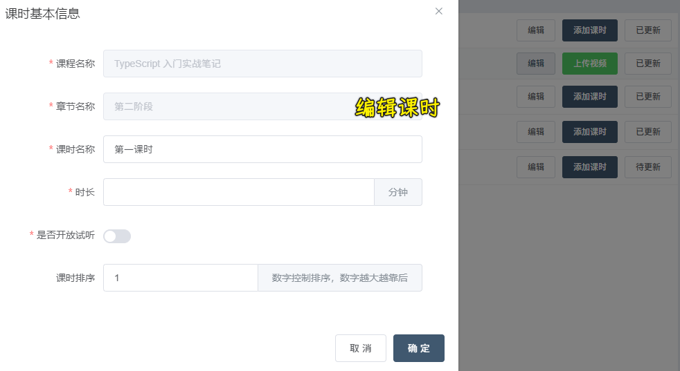
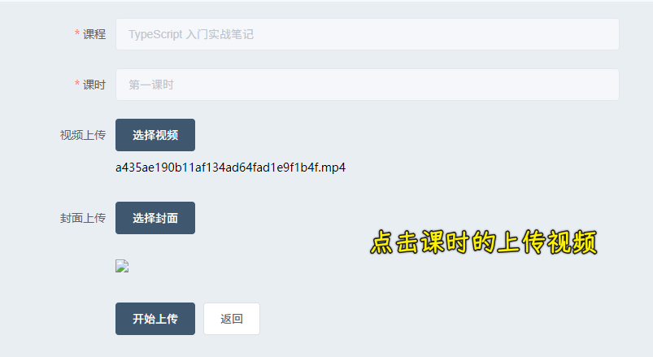

### ✍️ Tangxt ⏳ 2021-09-18 🏷️ Vue

# 06-16-课程内容

## ★功能介绍

所谓的「内容管理」是管理什么的？

就是管理课程目录的内容

💡：后台是如何操作内容管理的？

章节列表：

> 目录也是可以拖动的，这些拖动只能同级

编辑目录：

为目录添加课时：

编辑课时：

上传视频：

待更新和已更新都是未解锁 -> 已隐藏是不在前端页面展示

## ★准备

1. 添加路由
2. 展示组件

## ★展示章节列表

1. 卡片
2. 树形组件 -> 可拖拽节点
3. 调整树形组件的样式，让它们看起来像表格一样

💡：获取章节列表接口？

- 目录名是`sectionName`
- 课时名是`theme`

可以看到节点名是不一致的，但树形组件这个`label`可以是个函数啊！

这个函数 -> 有这个属性就用这样，没有这个属性就用那个

💡：拖拽？

视图的外观变化罢了，你得把这个拖拽结果上传到服务端！

## ★阶段列表-自定义树组件节点内容

💡：阶段和课时的操作是不一样的？

- `node`：节点对象
- `data`：绑定节点的数据对象

了解插槽很关键啊！ 

> 自行调整图标大小（下拉图标）和颜色

## ★处理节点拖动的逻辑

> 添加阶段、添加课时等操作已经处理好了

💡：Tree 组件是可以任意级别拖动的

我们要的是：

- 阶段与阶段之间可以拖动
- 阶段里边的课时可以拖动排序，但不能把课时作为另一个课时的子节点，也不能把这个课时拖动到另一个阶段里边

总之，就是要拖动的目标位置有限制

💡：怎么做？

需要利用树形节点这两个属性： 

- allow-drag：判断节点能否被拖拽
- allow-drop：拖拽时判定目标节点能否被放置 -> 需要过滤

同一个阶段里边，课时节点的`sectionId`都是一样的！

## ★列表拖动排序数据更新

排序之后的列表，会有一个排序`id`，你把这个`id`发送给后台进行更新就完事儿了！

后台没有这样的排序接口 -> 有接口，才是最正确的方式

于是我们用了一种很 low 的方式，那就是遍历列表

💡：`node-drop`？

拖拽成功完成时触发的事件 

有阶段列表和课时列表

在资源很多的情况下，很耗请求性能 

正确的做法是，后台提供一个接口，我们前台只需要提供课程列表排序后的数据列表，里边有它的`id`和对应的序号，而后台就依次更新这些排序
