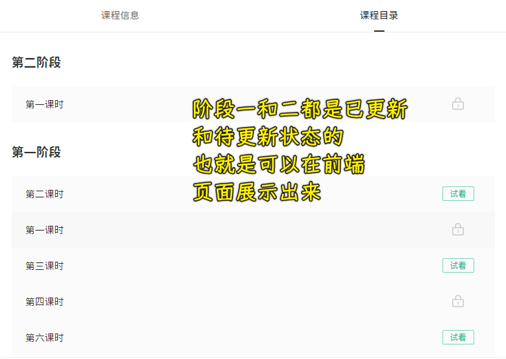
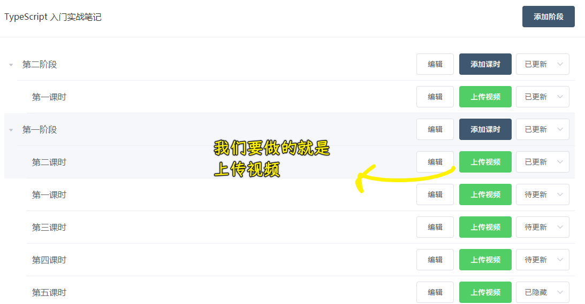
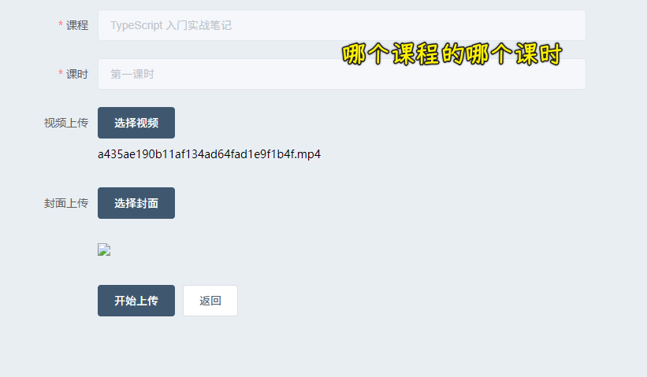

### ✍️ Tangxt ⏳ 2021-09-18 🏷️ Vue

# 06-17-上传课时视频

## ★功能介绍

💡：上传视频的业务流程？

分析这个流程之前，先来看看前台的效果：

业务：

---

在测试的时候用小视频，这样会快很多

💡：封面是啥？

你点中你要看的视频，但还没有点击播放，此时视频所展示的图片就是封面了！

💡：点击开始上传？

视频上传成功了，但是还需要转码，比如格式不对，文件过大 -> 所以需要对数据格式、内容大小进行一个转换

转换的结果是前台能接受（前端页面）的内容

提示「阿里云转码状态」成功，那就意味着整个上传和转码都成功了！

