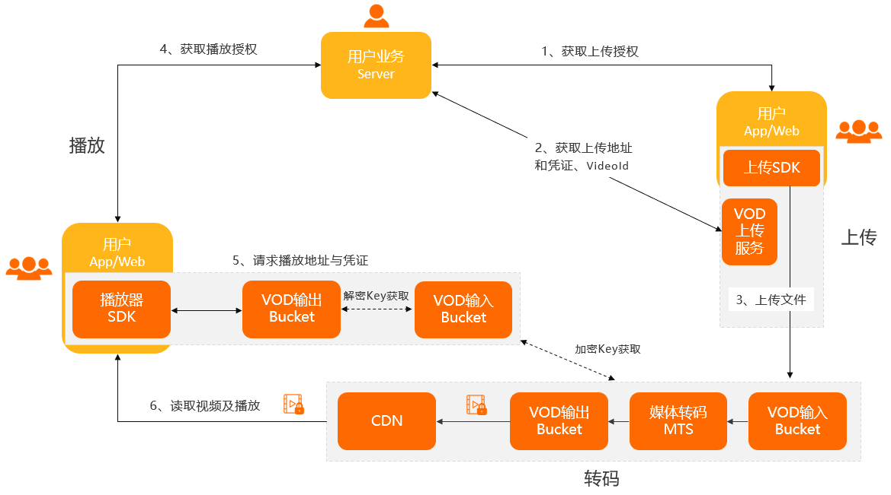

### ✍️ Tangxt ⏳ 2021-09-18 🏷️ Vue

# 06-17-上传课时视频

## ★功能介绍

💡：上传视频的业务流程？

分析这个流程之前，先来看看前台的效果：

业务：

---

在测试的时候用小视频，这样会快很多

💡：封面是啥？

你点中你要看的视频，但还没有点击播放，此时视频所展示的图片就是封面了！

💡：点击开始上传？

视频上传成功了，但是还需要转码，比如格式不对，文件过大 -> 所以需要对数据格式、内容大小进行一个转换

转换的结果是前台能接受（前端页面）的内容

提示「阿里云转码状态」成功，那就意味着整个上传和转码都成功了！

## ★准备

如何实现这个「上传视频」业务功能？

1. 配置路由页面
2. 点击跳转

💡：在`template`里边路由跳转不需要加`this`

## ★阿里云视频点播服务介绍

不是上传的自己的后台服务，而是第三方视频服务！

使用的是阿里云「视频点播」这样的第三方服务

很多做教育服务的，都会使用第三方的点播服务

毕竟像这样的东西，你从 0 到 1 去开发的话，其成本还是非常之大的！ -> 人力财力很大

而第三方的除了成本低，还有更成熟

前端不在乎第三方是谁，只需要根据这个视频点播文档和后端配合一下就好了

文档：[客户端上传](https://help.aliyun.com/document_detail/99457.html)

整个点播流程：

简单的流程：

后端提供了一些和阿里云配合的接口：

我们主要做前端部分：

💡：怎么上传？

> 不用外链，而是自己下载 SDK

看示例代码：

> 上传 SDK -> 使用 JavaScript 上传 SDK -> SDK 下载（内容处有链接） -> Web 端 SDK 下载

下载了示例代码，打开 Vue 示例，定位到`lib`目录，把`aliyun-upload-sdk`粘贴到项目`edu-boss-fed`的`public`目录

复制过来的文件没有兼容 ES6 模块化，所以我们全局引入 -> 用`script`标签

`public`目录是可以直接通过网站根路径`/`来直接访问的 -> 在 Webpack 打包的时候，会直接把该目录打包到`dist`目录中，而且是根目录

全局引入的文件是有顺序的：

而且也不受打包影响，webpack 是不会打包这个位置的文件的！因为这些都是存粹的静态资源

👇：如何在组件里边使用？ -> 看视频点播提供的 Vue 代码

## ★阿里云视频上传-体验官方 demo

官方推荐`UploadAuth`上传，当然，如果公司业务用的是`STS`，那你就用`STSToken`上传呗！

💡：禁用`ESLint`校验？

`UploadAuth`这里边的代码在校验的时候，有很多处要修改，所以就把当前这个文件校验给禁用掉了！

👇：根据代码示例和官方文档，把这个功能集成到自己的项目当中

## ★初始化阿里云上传

文档：[使用 JavaScript 上传 SDK](https://help.aliyun.com/document_detail/52204.html#title-rel-ofc-fuk)

💡：在模块里边使用全局变量？

得加上`window`前缀

💡：扩展`Window`类型

💡：阿里云账号？

该项目提供了测试`id`

💡：语句以`(`开头？

请在前边加`;`，不然检查报错！

💡：上传不是并行的

谁先添加，谁先上传！

💡：如何让文件真正上传？

需要上传地址和凭证方式

## ★封装上传相关接口

后端提供了两个接口：获取视频凭证和获取图片凭证

还有请求视频转码，获取视频转码进度

## ★上传文件成功

💡：上传视频和上传图片是不一样的

💡：为啥要先上传图片？

因为需要先得到`imageUrl`，上传视频接口需要用到这个参数

总之，这是后台接口的问题！

💡：上传过程中回调的执行？

单个文件上传：`onUploadstarted` -> `onUploadProgress`（多次触发，看上传数据量） -> `onUploadSucceed`

整个上传列表都成功了：`onUploadEnd`

💡：都上传成功了，还得转码，唯有这样这个视频才会变成一个真正的课时视频

让上传视频和课时真正对应起来！

## ★处理完成

- 接口：阿里云转码请求
  - 需要用到的参数
    - `lessonId` -> 哪个课时？注意，不是课程阶段
    - `coverImageUrl` -> 视频封面的图片地址？
    - `fileId` -> 视频`Id`
    - `fileName` -> 原本视频的名称

💡：什么时候转码？

既有图片和视频，就可以转码了！ -> 也就是所有文件都上传成功了！

💡：获取阶段`id`和课时`id`

用查询字符串

💡：轮询查询转码进度

用定时器

💡：后续细节？

- 上传视频预览
- 上传图片预览
- ……