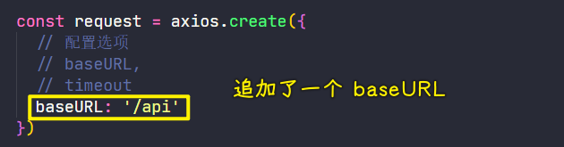
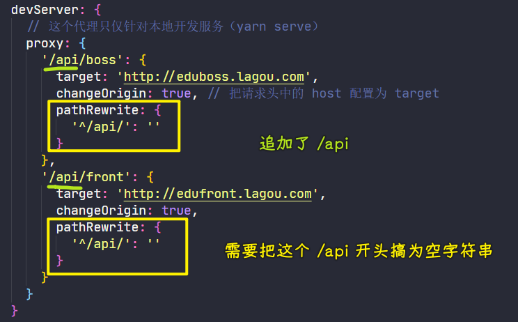
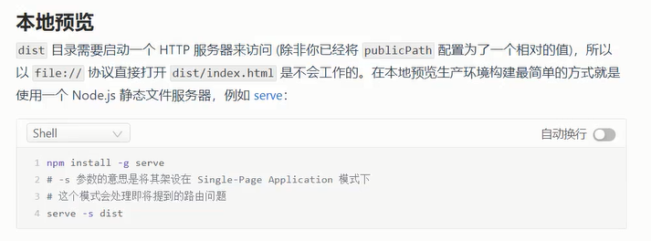
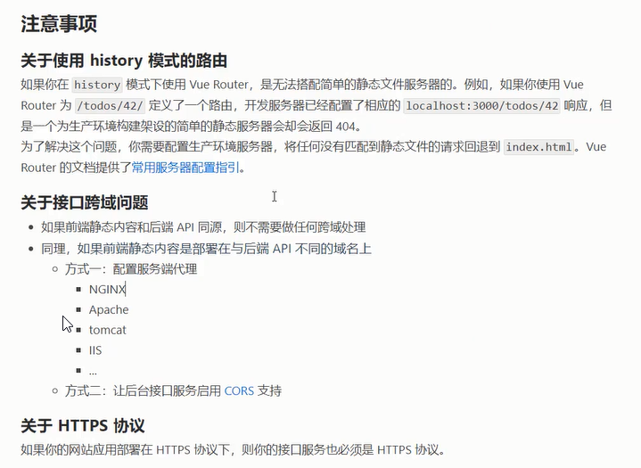

### ✍️ Tangxt ⏳ 2021-11-28 🏷️ Vue

# 06-19-发布部署

## ★在本地启动一个类似 `devServer` 的服务

`test-server/app.js`

> 需要安装`express`和`http-proxy-middleware`这两个依赖

``` js
const express = require('express')
const app = express()
const path = require('path')
const { createProxyMiddleware } = require('http-proxy-middleware')

// 托管了 dist 目录，当访问 / 的时候，默认会返回托管目录中的 index.html 文件
app.use(express.static(path.join(__dirname, '../dist')))

app.use('/boss', createProxyMiddleware({
  target: 'http://eduboss.lagou.com',
  changeOrigin: true
}))

app.use('/front', createProxyMiddleware({
  target: 'http://edufront.lagou.com',
  changeOrigin: true
}))

app.listen(3000, () => {
  console.log('running...')
})
```

添加一个`npm script`：`"preview": "node test-serve/app.js"`

## ★部署到 Vercel

> [ Vercel 配置服务端代理 - 懂代码 ](https://dongdaima.com/article/81553)

`api/proxy.js`

``` js
/* eslint-disable @typescript-eslint/no-var-requires */
const { createProxyMiddleware } = require('http-proxy-middleware')

module.exports = (req, res) => {
  let target = ''
  if (req.url.includes('/api/front')) {
    target = 'http://edufront.lagou.com/'
  } else if (req.url.startsWith('/api/boss')) {
    target = 'http://eduboss.lagou.com/'
  }
  createProxyMiddleware({
    target,
    changeOrigin: true,
    pathRewrite: {
      '^/api/': ''
    }
  })(req, res)
}
```

`vercel.json`

``` json
{
  "routes": [
    {
      "src": "/api/boss/(.*)",
      "dest": "/api/proxy"
    },
    {
      "src": "/api/front/(.*)",
      "dest": "/api/proxy"
    }
  ]
} 
```

注意，在部署之前，修改`axios`配置，以及本地的`DevServer`：





---

我们本地不需要打包，交给 vercel 去打包就好了！

## ★优化打包结果

- 不打包第三方包
- 打包结果没有`source map`
- 打包结果没有`console.log`

➹：[javascript - How enable console log in VUE-CLI during development - Stack Overflow](https://stackoverflow.com/questions/59366773/how-enable-console-log-in-vue-cli-during-development)

➹：[第八节：项目优化上线之打包、报告分析、删除 console、webpack 配置、CDN、首页定制、路由懒加载、Express 部署和管理](https://www.cnblogs.com/yaopengfei/p/14549481.html)

➹：[Vue 配置 vue.config.js 打包时删除 console.log 日志_咻咻 ing 的专栏-CSDN 博客](https://blog.csdn.net/meifannao789456/article/details/109306282)

➹：[vercel 自动化部署项目和跨域问题_铁柱 ef 的博客-CSDN 博客](https://blog.csdn.net/qq_40890601/article/details/120755007?spm=1001.2014.3001.5502

## ★发布部署文档

### <mark>1）项目打包</mark>

在部署前需要把项目给打包了

``` bash
yarn build
```

### <mark>2）本地预览服务</mark>



### <mark>3）注意事项</mark>




➹：[HTML5 History 模式 - Vue Router](https://router.vuejs.org/zh/guide/essentials/history-mode.html)

### <mark>4）部署</mark>

建议参考：[部署 - Vue CLI](https://cli.vuejs.org/zh/guide/deployment.html#%E6%9C%AC%E5%9C%B0%E9%A2%84%E8%A7%88)

推荐：云开发 CloudBase

部署结果：<https://edu-boss-fed-t9o.vercel.app/>
